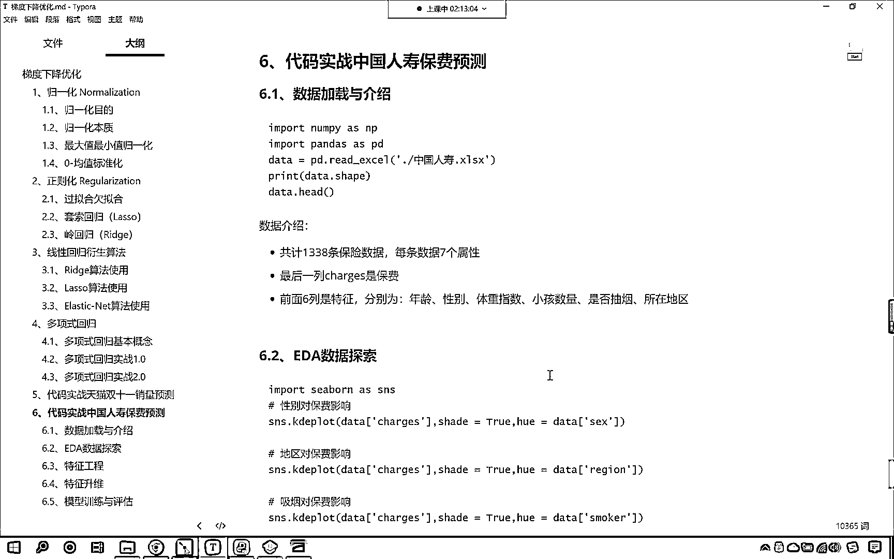

# 7天爆肝整理！AI量化交易-机器学习全套教程，从入门到项目实战保姆级教程！（数据挖掘分析／大数据／可视化／投资／金融／股票／算法） - P101：8-中国人寿保费预测（EDA数据探索） - Python校长 - BV1KL411z7WA

大家需要注意的一点是，咱们在这个地方，我们为什么要使用标准化，咱们为什么要使用规划操作，为什么我们线性回归里边可以不使用，你想咱们普通的线性回归，它可以不使用是不是，看他可以不使用咱们的规一化，对不对。

你看他不使用规一化，是不是也能够求解出来，而咱们的随机梯度下降，是不是必须得使用，咱们的规一化，不规一化，你求解出来的结果，是不是就完全不对，必须得规一化，我们说了，为什么要进行规一化。

因为咱们的量纲是不是不一样，看到了吗，你看量纲是不一样的，你比如说第一列，第二列，第三列，第四列，当你看到第四列的时候，你就发现，咱们第四列的数据，是不是，它的数量级，是不是以千为单位进行计算。

这个是不是两位数，这个是不是三位数，我们第四列是不是四位数，对不对，所以说它的波动，情况是不一样的，所以我们必须要进行标准化，当我们在使用随机梯度下降的时候，咱们都要使用相应的规一化操作，来进行处理。

好，那么咱们最后，我们再看一个，大家看这个，就是代码实战，实战咱们中国人寿的保费预测，那么这个里边，咱们就讲解其中的一部分，那么我们就将，Eda数据探索，咱把这一步，讲解一下，因为我们之前。

咱们讲cbone的时候，已经过去很长时间了，咱们使用cbone，咱们将这个数据可视化，我们做一个操作，把这个讲完之后，咱们今天，课后作业，代码实战，咱们中国人寿的保费的预测，来那么，数据。

我已经上传到咱们的百度网盘当中了，在咱们的课件当中，15你看，中国人寿的数据是不是已经有了，现在咱们把这个数据，现在咱们把这个数据，放到咱们当前代码下，剪切一下，放到15，咱们在这来一个粘贴，OK。

在当前目录下有数据了，那么我们就可以在代码当中，把这个数据给它加载进来，现在咱们再来一个三级标题，这个就是中国人寿，它的保费预测，你想不同的人买保险，不同的地区买保险，它的保费是不一样的，是不是。

不同的汽车上保险，它的保费一样吗，是不是你奥迪和奥拓，是吧，上保险那是不一样的，对不对，你越贵的车，你所要买保险的时候，你的保险费用是不是就越高，对不对，好，那么咱们现在把这个数据，我们给它加载进来。

咱们import pandas，as pd，执行一下代码，然后咱们import cbone，as sns执行一下，好，现在的话，咱们导包已经完成了，那么我们就加载数据，那就是pd。read excel。

在当前路径下有中国人寿，得到的数据，咱们起名叫data，查看一下咱们data的前几条数据，来各位小伙伴，你就看到咱们这个数据了，是不是，看到这个数据了，这个数据，咱们简单介绍一下，最后一列。

最后一列是什么，是不是就是咱们买保险的时候，你该交多少钱，这个就是保费，叫差这次，你看，我们前面，前面的这些数据，是不是都影响着，最后你的买保险的时候，你该交多少钱，是不是，你想刚出生的婴儿。

那么他如果要买保险，他的保险费用就低一些，80岁的老人买保险，是吧，你的费用保险费用是吧，肯定就高，因为到了80岁，是不是更容易生病，刚出生的小孩，各方面的照顾，各方面的营养都比较到，是不是。

不容易生病，好，所以说你看年龄是不是影响保费，性别是不是也影响，肥胖，这个就是体重指数，这个求准就是你家里边有几个孩子，有小孩也影响你的保费，是吧，如果你的小孩太多或太少，是吧，都会。

是否吸烟是不是也影响，你要不吸烟的话，是不是更加健康，还有一个region，region就是地区，有的时候地区对他，是不是也有一定的影响，也有一定的影响，对不对，你看你是东南，还是西南。

还是咱们东部沿海，对于保费都有一定的影响，是不是，好，那么这些指标，是不是都影响着咱们的保费，咱们现在就问一下，说性别对于保费有影响吗，你认为性别对于保费有没有影响，你认为地区对保费有没有影响。

有没有影响，咱们得需要分析一下，我们不能根据咱们的直觉，做出决定，对不对，咱们就画图画一下，咱们就使用咱们的SNS，咱们调用它的kde plot，kde plot画出来的图，就是它的概率分布。

就是它的概率分布，你看这个图画出来的是什么，在这，咱们进行一个说明，这个就是概率分布曲线，我们要看性别，对于咱们的保费有没有影响，咱们是不是把性别男女的数据画出来，看对照一下，咱们就知道，是否有影响了。

对不对，咱们就绘制一下，要绘制的数据，就是咱们data当中的chadis，这个就是咱们的保费，我们就看一下，它不同的因素，对于保费是否有影响，shade就是给它一个阴影，shade给它一个阴影。

来一个处，咱们的heal就是根据什么来进行划分，那就是data，中国号，咱们将性别放到这，这个时候你看我一执行，大家现在来看，咱们现在所画出来的，是不是就是性别，看到了吗，性别你看。

female是不是女性，没有是不是男性，现在我们就发现，咱们的概率分布曲线，这两条线，男的和女的，这两条线，它的吻合程度，是不是95%，你看它的吻合程度，是不是可以达到95%。

他们的走势是不是都是一样的，所以说就在保险这一块是吧，收费多少，跟你是男的是女的，有影响吗，没有影响，对不对，也就是说画出来这个图之后，我们就发现，你是男的还是是女的，跟你，保费是吧，它的区分程度不大。

看到了吧，区分没啥区分，没啥区别，是不是我们这个叫，没啥区别，你想，一个特征，如果对于它的保费影响特别大，应该是什么样的情况，咱们假设说你看，男的买保险，特别便宜，你看它的曲线走势。

你要注意咱们说90%，你看它的曲线走势，是不是95%的吻合，看到了吧，95%的吻合，看到了吧，你看走势，是不是95%吻合，因为你看面积就知道了，你看面积，是不是95%的一个吻合，所以说性别是可以忽略的。

因为你性别是男和女，对于你交保费的多少，没什么区别性，没有特别大的差异，我们就知道，我们交保险，是不是为了防止意外，对不对，你想出事故的时候，难道男的和女的，它有特别大的一个区分吗，对不对，你统计一下。

是吧，我们的保险，可能是为了保意外，或者说保卫，或者说保生病，咱们发生交通事故，难道男的就比女的死亡率要高很多吗，或者说生病的时候，这男的就比女的高很多，或者说女的比男的高很多，那不一定，是不是。

因为男的女的只是性别，在上帝眼里，你都是人，你都要得病，你出交通事故的概率是一样的，所以说咱们就看到这个图，咱们就知道，这男的和女的是吧，都一样，现在看我们就知道有女司机，是不是，好。

那么咱们看了性别的概率密度了，来咱们复制一下，control v，什么样的特征，在这我告诉你，什么样的特征是好特征，叫什么样的，特征，它是好特征，看什么样的特征是好特征，它的区别度怎么样，大，区别度大。

区别度特别明显，这就是好特征，比如说咱们现在我们看一下抽烟，你看咱们看一下smoker，你看我这个时候一执行，来各位小伙伴，你看，抽烟和不抽烟，影响是不是特别大，看到了吗，黄色的看到了吗。

你黄色的就是不抽烟的，如果要不抽烟的话，怎么样，你买保险的时候，这个费用是不是就会低一些，你如果要是抽烟的话，你就能够发烟，你买保险的时候，收费是不是可能会很高，看到了吧，就是下面蓝色的，这个图。

这个特征它就是好特征，看到了吗，这个特征，它就是好特征，我们可以根据抽烟不抽烟，咱们就简单的，在买保险的时候，是吧，定价的时候，我们就会有一个非常大的一个趋势，什么，就是如果你抽烟的话，OK。

我想都不用想，你的保险，收费就要高一些，因为你抽烟的话，你患疾病的概率，是不是就更高，你要不抽烟的话，是吧，不抽烟，不喝酒，是吧，怎么样，你的健康，收保险的时候，费用我要降的低一些，这样的话。

我是不是可以让更多不抽烟，的人，是不是买保险，保险公司，它会有一定的策略，知道吗，所以说你看，是否抽烟，对于咱们最后保费的，对于咱们最后保险费用，是吧，它有一定的影响，是吧，你看你第1个抽烟，怎么样。

你的保险费用，是不是就是16884，你不抽烟，第2个不抽烟，是不是就是1724，对不对，好，那么我们再看一个特征，看control c，咱们来一个control v，我们看一下咱们的region，re。

gion，region就是咱们所说的区域，看region就是咱们所说的地区，是吧，这个有西南，是吧，东南，然后西北东北，咱们现在就能够发现，我们统计区域的时候，咱们又没有按照省来进行划分。

我们按照非常粗糙的东南西南，东北西北，咱们发现，这4条线，和咱们刚才的性别，是不是很像，他们是不是也比较吻合，看到了吗，他们是不是也比较吻合，所以这个特征，它对于我们，看这个特征，也就是说区域。

它对于咱们的保费，是吧，它的影响，怎么样，不明显，它影响不明显，也就是说它没有一个很好的，区分度，看它没有一个很好的区分度，所以说它保险就，这个特征对于我们来说就不重要，不重要，不重要，那就是可有可无。

根据奥卡姆剃刀原则，如果它不重要，咱们就怎么样，就可以把这个特征删除掉，然后我们再看一下，咱们再看一下，就是说你家里边有没有小孩，对它有影响吗，咱们看一下children，是不是我们知道。

children，是不是就代表咱们的小孩，看到了，你看，小孩就表示，没有小孩，一个小孩，两个小孩，三个小孩，四个小孩，五个小孩，有的是不是特别能生，对不对，咱们看到这个曲线之后，咱们就发现，是否有小孩。

有小孩其实就代表着家庭，对不对，我们这个是有一定区分度的，就是说在卖保险的时候，你家里边没有小孩，和你有小孩，两个小孩，三个小孩，它是有一定影响的，所以说这个特征，它有一定的区分度，看有一定的区分度。

你发现，规律是不一样的，看到了吗，这个规律它是你看，高和矮是不一样的，所以说有一定区分度，咱们建议，把这个留下，建议把这个特征，我们就留一下，你像上面咱们的，地区，还有咱们的性别，一看他们就特别像。

相似度特别高的时候，我们可以把这个特征删除掉，好，那么到这里，咱们是不是就可以通过画图，来观察哪一些属性，是好的特征，哪一些是不是可以删除掉，好，那么我们在这儿，就给各位小伙伴讲了一下，咱们的这个叫。

这个就叫做EDA数据探索，EDA就叫做，这个叫explore data analysis，EDA的三个英语单词，它翻译成中文，就叫做数据探索，D是data，A是analysis，E是explore。

explore就有探索的意思，就探索数据分析，好，那么大家根据我们探索的一个结果，我们进行相应的特征工程，比如说该删除的删除，该进行转换的，我们进行转换，该将离散型数据，转换成数值型数据的。

我们都要进行一个转换，在咱们的代码当中，你能够看到，咱们的数据，你看，我们的求准是字符串，BMI看到了，BMI，它是不是代表咱们是否肥胖，这叫体重指数，是不是，像咱们的性别，region这两列可以删除。

剩下的这些列，是吧，咱们进行相应的数据处理，这就是咱们科技当中，所说到的特征工程，特征工程之后，我们进行特征升维，是不是，咱们进行一个特征升维操作，好，那么然后进行模型的评估，我们今天晚上的作业。

咱们用咱们之前，所学到的方法，把咱们中国人寿它的保费，跟哪些因素有关，咱们进行一个建模运算，进行一个机器学习。

多謝您。