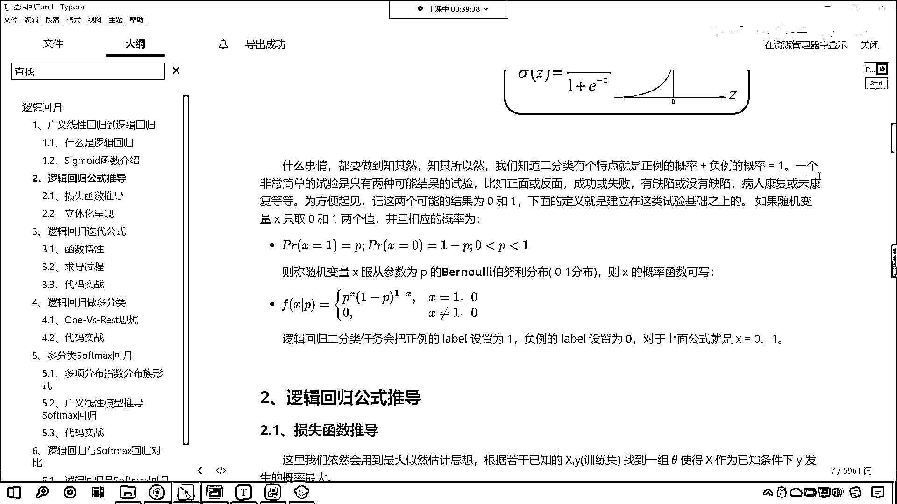

# 7天爆肝整理！AI量化交易-机器学习全套教程，从入门到项目实战保姆级教程！（数据挖掘分析／大数据／可视化／投资／金融／股票／算法） - P103：2-Sigmoid函数介绍 - Python校长 - BV1KL411z7WA

咱们回到这儿啊，好这个呢 我们修改一下啊 可见这个算法的强大，来咱们回来 我们继续往下看，那么接下来呢 我们就介绍一下，逻辑4D回归当中Sigmoid的函数 我们对它呢进行一个详细的介绍。

逻辑4D回归就是在多元线性回归的基础上，咱们把结果缩小到0到1之间，在这个当中各位小伙伴就能够看到一个hθx，那这个hθx是对于咱们这个方程的一个描述，它是对于这个方程的一个描述。

其实这个方程你换成其他的名字是不是也一样呀 对不对，好那么我们知道Sigmoid的函数就这个函数它有一个作用，它可以将数据是不是变到0到1之间呀，既然变到0到1之间了。

那么咱们是不是就可以通过概率来进行类别的划分呀，对不对 哎 这就是它巧妙连贯的地方啊，咱们就根据概率来进行划分类别，那么hθ越接近于1它就属于是正例，正例就是咱们一种类别。

hθ越接近于0咱们认为它就是负例，这个负例就是另外的一个类别，中间0。5呢咱们将数据呢分为两类，那我们可以认为呢这个0。5呢属于是它的划分临界点，其中呢hθx就是咱们的概率函数，这个就是概率函数。

好那么各位小伙伴你就能够看到，你看我们在进行描述的时候，是吧咱们首先是一个hθx然后呢又来了一个jθtx，那么你看到这儿熟悉不熟悉，咱们之前在讲线性回归的时候，那么我们说了这个θtx它代表什么呀。

这个θtx你想一下，它是不是就是咱们的线性回归的方程呀，看到了它呢就是线性回归的方程，对不对这个就是线性回归方程，那既然是线性回归，你想这个值是不是可能很大这个值是不是也可能很小呀，对吧。

那我们进行分类这个线性回归它是没有办法解决的，怎么办呢，咱把这个θtx把它当成一个整体，那这个呢就是咱们的多元线性，这个就是咱们多元线性的这个方程，那这个整体。

看啊这个多元线性回归这个整体咱把它放到哪里了呢，现在你就能够看到我们是不是就把它放到了咱们sigmoid，是不是就把它当成了咱们的-x呀，对不对，注意啊它是一个整体，那有了这样的一个转变。

我们是不是就可以把它转成概率了，对不对，我不管你原来的线性回归这个值多大还是多小，是吧，无所谓，你原来的值是1万也好，是吧，是-200也好，只要经过这样的一个转换，那么你想最后是不是同。

它就变成了概率啊，这个概率呢就是在0-1之间，变成0-1之间，那咱们是不是就可以进行类别的划分了，所以说你看咱们的逻辑，4d回归是吧，它的概率函数，它的构建是不是非常的巧妙呀，对不对。

你看这就是数学家是吧，不知道他的大脑是哪个地方开窍了是吧，他就找见了这样的方法，然后呢，方便我们现在的人的使用，好，那么这个是方程的一个介绍，那我们知道分类器的本质就是找到边界，你看我们把它叫做分类器。

我们把这个也叫做机器学习的算法，你看我们人，看咱们人是不是可以进行各种类别的一个划分呀，对不对，哎，我们认为这个植物是吧，属于什么，这个动物属于什么，对不对，那我们其实呢，在大脑当中就有一个边界，是吧。

那你大于这个边界，我们把它划归到一种类别，小于这个边界，咱们呢，把它划归到另一种类别，那在咱们逻辑4d回归当中，咱们呢，可以把0。5作为咱们的分类边界，那我们要找的就是咱们要要找的就是谁呢，这个你看。

外上面是不是戴一个帽子，那这个方程怎么理解，看这个方程怎么理解，外上面戴一个帽子，这个是不是就是咱们的预测值呀，看了吧，这个就是咱们的啊，这个就是咱们的预测值，那你看这个预测值是不是就是咱们的hθ。

这个hθ咱们上面介绍了，这个是不是就是一个概率呀，对不对，这就是一个概率，因为我们是进行类别的划分，咱们其实就是通过概率的大小来来对它进行分类嘛，是吧，然后呢，就是1加上1的-θtx分之一等于0。5。

也就是说当我们的这个数值等于0。5的时候，你想它是不是咱们的这个边界呀，对不对啊，咱们这个时候就另了咱们这个z呢就等于θtx，也就是说它等于0的时候，咱们θ的解，那为什么这个要等于0呢，因为你想。

如果它等于0，看这个值如果等于0，我们把这个值带到咱们方程当中，看到了吧，把它带到方程当中会怎么样，我们自然底数e它的0次幂是不是等于1呀，是吧，1+1是不是等于2，二分之一是不是就等于0。5，对不对。

所以你看下面这个图，看到了吗，下面这个图是吧，这如果要带领是吧，那我们就认为它是一类是吧，这如果小于0是吧，咱们认为它是这个类别领，这如果等于0呢，是吧，那么我们求解出来这个值是不是刚好是0。5呀。

那这个函数在数学当中我们怎么对它进行称呼呢，这个呢叫做单位越界函数，那这叫做单位越界函数，与对数几率以对数几率函数，那叫单位越界函数与对数几率函数，看经过这样的一个转变是吧，也就是说只要你大于0。5。

通通把你归到类别一当中，小于0。5怎么样，通通把你归到类别零这儿，那这就好比是吧，咱们在评判一个人是富人还是穷人的时候是吧，只要你的这个财富在100万以下，那我们通通把你归为穷人是吧。

你有50万也好还是80万也好，都是穷人，假如说你的财富在1000万以上，是吧那无论是1000万2000万还是多少是吧，都认为呢他属于是这个富人，是吧假如说你要是钱更多是吧，你的财富超过10个亿。

你无论是这个50亿也好还是100亿也好，还是3000亿也好，其实这辈子你都不可能花钱，都都不可能把这笔钱花完对不对啊，那这个就是超级富豪，就像马云一样，是吧他即使剩8个败家子儿，他的钱有可能败光吗。

那也不可能败光是不是，所以说呢这个就是单位越界，就是说你超过了某一个临界点，是吧那么就怎么样，哎那么你的这个类别就变了，就像就像咱们的第一宇宙速度7。9，只要你超过了7。9千米每秒，那么你就可以。

那么你就可以这个脱离地球的约束飞出去，是不是，这个函数只能分为二类吗，哎当然不是了，咱们可以进行多分类啊，只不过咱们今天晚上讲的是二分类，咱们由二到三是吧，再衍生更多，他更多的分类也是可以实现的啊。

好那么接下来呢，咱们就看一下他的求解过程，你能够看到在这个图当中，看看咱们这个图当中，你看咱们左边这一部分，看到了吗，X1W1XIWI还有咱们XIW这个这个最后这个爱。

那你想这个是不是就对应着一个线性方程呀，对吧，我们这一块呢，他呢就是一个线性方程，这个线性方程我们使用哪个符号来表示呢，看这个方程咱们使用哪个符号，看咱们使用Z等于看到了吧。

这个是不是就是一个线性方程呀，好有了这个线性方程之后，你看这个B呢就是咱们的结句啊，看到了吧，这个B就是结句，好，那么我们进行了一个这个符号，这个符号叫什么，来哪位同学可以告诉我，咱们这个符号叫什么呀。

看到了这个符号叫什么，你想一下，这个符号就叫Sigma，看这个符号就叫这个这个Sigma，好那么他呢就对应咱们的Sigma的，那这个就对应咱们的Sigma的，是吧，那我们对于Sigma的一一进行转变。

你看到了吧，下面是不是就是咱们的这个Sigma，Z它的方程呀，好，然后的话是吧，你看咱们这个，他所对应的方程就是咱们刚才在代码当中所画出来的这个S型曲线，是吧，所以说这个就是咱们，逻辑回归它的一个过程。

那咱们什么事情呢，我们学习算法，咱们肯定要知其然还要知其所以然，那我们知道二分类呢，有个特点就是正类的概率加上负类的概率等于一，看到了吗，这就是特点，就是你要么属于类别零，要么属于类别一是吧。

你这两个概率加和等于一一个非常简单的试验，是只有两种可能的这个实验，比如正面和反面成功或失败，缺陷或没有缺陷，病人康复或未康复等等，是吧，好比咱们抛硬币是吧，你抛硬币要么是正面，要么是反面，对不对。

为了方便起见，是吧，咱们这所说的这个正类和负类是吧，在咱们代码当中，咱们一般不使用这个字符去表示，咱们一般使用什么来表示呀，0和1，咱们使用0和1，这个0呢就表示咱们的负力，这个1呢就表示咱们的正理。

一般情况下，我们更加关注正理，咱们更加关注正理，你比如说这个病人康复或未康复，是吧，那你想这个病人康复和未康复，大夫更关心哪一个呀，大夫是不是更关心未康复的呀，是不是康复了，那你就回家就行了。

该吃吃该喝喝，未康复的，大夫特别关心，说为什么这个用药，这个病人他没有好呢，咱们得研究研究，得会诊一下，是吧，得给他开点不一样的药，是吧，保证把它治好，所以说呢，这个你看现实生活当中是吧，这个大夫是吧。

他就去找这个未康复的，因为你见过的未康复的病人多了，这个就属于是疑难杂症，为什么一些大城市大医院里边的顶级专家，顶级大夫是吧，去我们这个去这个市里边，或者去这个小地方做诊，那一天老多钱了，是不是，哎。

就是因为他在大城市里边见多识广，见到了更多的未康复的病人，是不是，这个就是疑难杂症，那么他就可以解决这个问题，所以下面的定义呢，就是建立在这类实验基础上的，如果随机变量，X只能取0和1两个值。

并且相应的概率呢，咱们把它表示成这个，看到PRX等于1，那这个概率是P，那么你想，另一类的概率，咱们是不是可以用1-P来表示呀，对不对，你看你发生就相当于咱们之前所讲到的红球和白球。

一个罐子当中有红球也有这个白球，是吧，拿了一个球，请问这个球是红球还是白球，如果我们假设红球的概率是P，那么白球的概率是不是就是1-P呀，是不是，那我们呢，咱们就称为变量X。

服从参数为P的这个伯努利分布，哎，你看，那我们在进行这个这个公式书写的时候，咱们呢，就可以写成下面这种形式，看到了叫做FXP，是吧，这个就是它的一个概率密度，这就是它的一个概率分布，现在你能够看到是吧。

咱们把概率，咱们把概率是不是写成一块了，是吧，那你下面这个零比较容易理解，那就是X不等于1也不等于0，看注意啊，此时的X是类别啊，注意啊，此时的X是类别，你不要把它理解成连续性的咱们坐标轴上的数值。

那样是不对的啊，你看这个1和0代表类别，就是咱们上面所说的，是吧，你看就是咱们上面所说的抛硬币的正面反面成功失败缺陷或没有缺陷，病人康复或未康复是吧，如果说你看你病人康复和未康复是吧。

你既不属于是康复和也不属于未康复是吧，那这种情况一般情况下是不存在的是吧，所以这个那它的概率就是0，那上面的是PX，然后1-P1-X，那这个概率咱们怎么去理解啊，就这个概率怎么理解，你只要把咱们的。

X的值带入到这个方程当中，你把它带入到这个方程当中，你就能够看到它的这个概率是怎么一回事了，假设说我们把函数X=1带进去，你看咱把X=1带进去带进去之后，你看这个时候得到的概率是多少。

因为1-P它的密次是不是1-1，1-1=0，任何数的零次密是不是都等于1，所以说这个时候咱们的概率是多少，是不是就是P，那如果要X要等于0呢，看到吗，X=0咱把它带进去，你既然等于0了。

你P的零次密是不是等于1，是不是1-X，X是不是0，那1-0是不是就是1，那这个时候你看我们的概率是不是就是1-P，对不对，所以说，咱们的这个P和1-P它俩一合并，它俩只要一合并，就是咱们这个公式。

所以说看到这个公式，你不要感觉到惊讶，数学家喜欢把不同的公式给它合并，是吧，这个就是咱们合并之后的公式，这就是合并之后的公式，好，那么现在呢。

咱们对于这个sigmoid函数呢。

我们进行了一个深入的介绍。