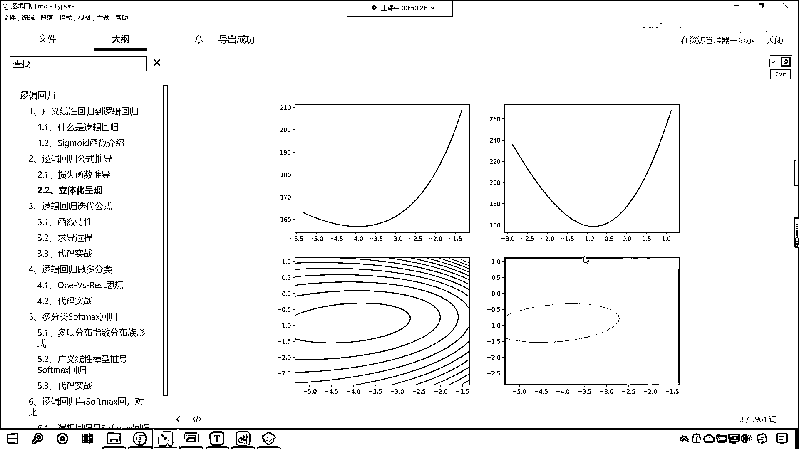
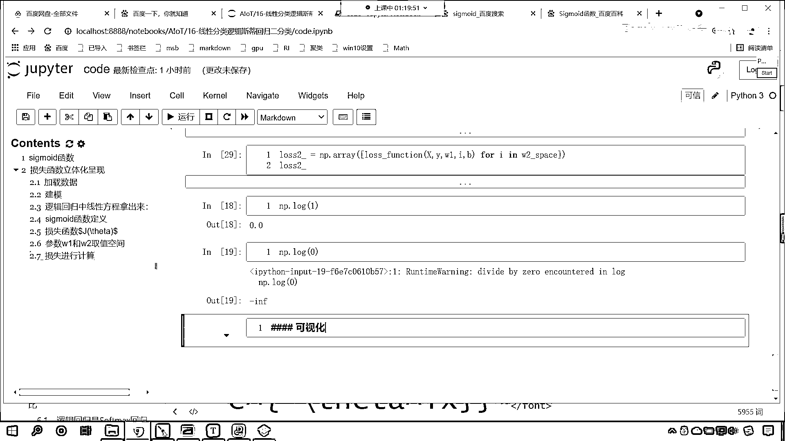

# 7天爆肝整理！AI量化交易-机器学习全套教程，从入门到项目实战保姆级教程！（数据挖掘分析／大数据／可视化／投资／金融／股票／算法） - P105：4-损失函数立体化呈现（一） - Python校长 - BV1KL411z7WA

好 那么接下来我们继续往下看啊，咱们接下来呢 我们就进行一个应用，咱们呢 来一个立体化的呈现，咱们使用这个逻辑4D回归，是吧 啥是立体化呈现呀，我们把这个图画出来 咱们让你看一下。

咱们说这个逻辑4D回归是吧，它可以进行这个梯度下降，那这个梯度下降 我们所对应的这个函数，它是all函数呀 还是to函数呀，对不对 那我们得。

那咱们就可以通过画图来对它呢进行相应的一个显示。

好 那么咱们这个数据很简单啊，来 现在的话咱们就回到代码当中，我们呢 进行操作一下啊，回到代码当中 咱们在这呢，再来一个三级标题，这个呢 就是咱们损失函数，它的立体化呈现，那首先呢 我们导入相应的包。

咱们from sklearn，咱们import datasets，把这个导进来，from sklearn，咱们线性模块下咱们导入咱们的logistic regression，同时呢。

import numpy as np，画图工具是不是也得导入进来呀，pyplot as plt，那么咱们这个图形当中呢 咱们有三维图形，所以说咱们把三维图形相应的插件给它导进来，叫做npl2k次。

那就是nplot3d，咱们从这个当中呢 导入咱们3d绘图的引擎，就是axes3d，然后的话 咱们呢，在进行数据处理的过程当中，我们得需要进行规一化，所以说咱们将规一化也导进来。

那就是from sklearn preprocessing，之前咱们导包的时候，咱们 看咱们导入的是不是standard scalar呀，那还有一个规一化叫scale，这个方法。

也可以进行zscale规一化，它呢 也对应着zscale规一化，所以我们把这个导进来，咱们使用一下，那我们说这个，这个scale和standard scalar，它俩是一样的啊，这个时候我执行一下。

导包就成功了，然后呢，我们去加载咱们的数据，接下来呢 我们再建一个标题，这个时候呢 咱们就加载数据，好 那么加载数据，咱们就使用上面刚刚导包的data sets，点咱们load一下，那么这个时候呢。

咱们load一个叫breast cancer，大家看这个就是乳腺癌，那这个数据呢，咱们加载的就是乳腺癌的数据，那乳腺癌的数据里面有一个参数，叫做return x y，默认情况下它是false。

如果这个参数我们要不指定，你看我一执行，咱们返回的数据是什么样的一个数据呀，是不是一个字典类型的数据呀，那如果说我要给它指定一个参数叫true，它是什么意思呀，就是只返回咱们的数据x和y，你有没有发现。

在咱们这个方法当中，它的参数x和y，x用的是大写，这个y用的是不是小写呀，这个和咱们之前的书写习惯都是对应的啊，看我执行一下，这个时候你就能够发现，咱们此时返回的这个数据，它是不是就是一个元组呀。

元组当中有两个数据，第一个数据就对应着咱们的，这个跟乳腺癌相关的这个特征数据，这第二个数据呢就是类别，这这个这个当中是不是还有0和1呀，0就说明你是健康的，这个1呢就说明你是乳腺癌的患者，对吧我们说。

这个0和1是不是代表正例和负例呀，对不对，那一般情况下这个1呢就是医生特别关心的，好那么咱们这个数据是一个二元的数组，咱们就可以使用xy来接收一下，x然后来一个逗号y。

这个时候给大家查看一下咱们的数据长什么样啊，咱们display x。shape，然后y。shape执行一下这个代码，我们现在就能够看到咱们这个数据呢，一共是569个样本，有30个属性，这些属性。

咱们有30个特征，那这些特征，都是跟健康相关的特征，跟健康相关的一些特征，我们不是医生，咱们的是计算机编程人员，我们的是数据科学家，咱们要对于这个数据进行相应的这个科学运算，那这个数据是什么。

这个属性是什么，对于我们而言，无所谓，它都是数字，就像咱们之前所做的那个项目，天池工业蒸汽量，咱们没有同学在这个电厂工作过吧，你看电厂工作，是就是煤发成电，没有这样的相应的工作经验。

我们依然可以对数据进行处理，进行建模进行预测，是不是，我们没有在医院工作过，但是呢，我们对这个数据是吧，依然可以进行相应的处理，好，那么我们的数据呢，有30个特征，现在的话，咱们对这个特征呢。

进行一个筛选，X就等于X，咱们来一个切片，冒号冒号，我们切到2，咱们现在呢，就切片，它的前两个特征，切片它的前两个特征，这样的话，我们画图比较方便，是不是，好，那么此时呢，咱们就执行一下。

现在大家看就是5692了，然后接下来，我们再来一个四级标题，咱们呢就进行建模，好，那么我们导包了，是吧，咱们导包呢，咱们声明一个模型，那就是model就等于logistic regression。

参数呢，咱们都使用默认的啊，后期的话，逻辑4D回归当中，这些参数，我们是可以调整的，有了这个模型，咱们就执行feat一下，我们直接将xy放进去，哎，你看和咱们之前的线性回归训练方法，是不是一样呀。

大家看啊，这一步，咱们的就是训练，这个和咱们之前，线性回归是不是类似呀，后面咱们再学到，看后面咱们接触的其他方法，其他算法，在进行训练的时候都是怎么样呀，都是类似的，知道吧，因为他们都是来自一个库，好。

那么这个时候你看我一直行，哎，咱们就有了，那模型训练好了，模型是不是就从咱们这个数据当中找到了相应的规律呀，对不对，你看带来一个四级标题啊，现在的话咱们将逻辑回归中的这个线性方程，我们给他拿出来，是吧。

那这个线性方程是不是就对应着咱们的系数呀，对不对，咱们给他拿出来，这个时候你看，我调用model，model，model。coif，那你还记得咱们线性回归的方程吗，是不是有coif呀。

coif就表示系数，这个时候你看我一直行，咱们这个系数是不是就得到了，看到了吗，这个系数就得到了，那这个是不是咱们特征一的系数，这个负的0。21，是不是咱们特征二的系数呀，来。

现在的话咱们把这个系数给他拿出来啊，好，那么拿出来之后呢，我们就叫做W1就等于，我们这个系数它属于是一个二维数组，是吧，咱们根据索引把这个负的1。046取出来，那么他所在的位置就是0。0，然后呢。

再把W2就是咱们第二个特征，它的系数取出来，coif中关号，那就是0和1，好，这个时候呢，我们就取出来了，取出来之后呢，咱们打印输出一下啊，好，这个呢就是咱们方程的系数，方程的系数就是W1，W2，哎。

你看我一执行系数是不是就得到了，好，那么有了这个系数之后呢，咱们接下来呢，我们就进行一个这个操作啊，那你想咱们除了这个系数之外，我们是不是还有一个，咱们是不是还有一个结句啊，来咱们把结句也找到啊。

结句等于多少，是不是就是model。intercept呀，对吧，那我们把方程的结句也打印出来，是吧，然后来一个冒号，看再打印输出一下print，好，那这个呢就是咱们方程的结句冒号，逗号。

咱们将币打印输出一下，这个时候你看我一直行，有没有，好，那么我们到这一步，各位小伙伴，如果你对于咱们代码写到这儿没有问题，那你在讨论区里边回复一个666，好不好，好，有问题的小伙伴呢。

及时在我们群里边进行反馈啊，好，那么我们拿到了系数了，接下来呢，咱们就定义这个sigma的函数，好不好，我们来一个四级标题，大家看啊，这个就是咱们sigma的函数的定义，好，那我们就定义方法。

那就是def，咱们起名呢就叫sigma的，来一个小括号，咱们这个sigma的呢，我们这个给一个数据x，看给一个数据x，然后把系数w1放进去，然后w2也放进去，然后结据b也放进去，你想有了x w1 w2。

咱们现在是不是就可以进行函数的计算呀，那这个函数值等于多少呢，z咱们呢就等于w1，我们让系数，这个时候咱们让系数乘以咱们x当中的数据，那x当中的数据呢，这个第一个系数对应零，所以说咱们就把零取出来。

然后加上w2，我们的w2呢，对应咱们第二个特征，咱们从x当中把1取出来，然后再加上b，你看我加上b，这个b是不是就表示它的结据呀，那我现在所写的这个z，它是不是就是表示咱们的线性方程呀。

你看像不像咱们之前，在讲损失，在咱们讲这个代码过程当中，你看这个是不是就是咱们的z呀，对不对，你看这个就是z，好那么有了这个z之后，你看这个是线性方程，那我们需要把线性方程进行一个转换。

咱们给它return一下，我们现在是不是就得需要把这个方程给它转换成概率呀，对不对，那咱们就return，那这个sigmoid的函数是不是就是1除以1，加上np。exp，是不是。

我们来一个-z是不是就可以了，来一个-z就可以了，好大家看到这个时候咱们sigmoid的函数，我们就定义完成了，这个比咱们刚才sigmoid的函数的定义稍微复杂一点，上面你看直接给-x就行了。

现在有嵌套，有什么嵌套呀，这个嵌套就是咱们的z，是不是，好那么现在呢，咱们这个sigmoid的函数就确定了，然后接下来我们再来一个四级标题，那么我们接下来呢，咱们定义一下它的损失函数，好不好，好那么。

接下来呢，我们定义损失函数，因为你想咱们的损失函数是不是就对应着咱们的jθ呀，对不对，你看损失函数就对应了就对应了咱们的jθ，dollar dollar，这个j小括号反斜杠，theta，执行一下。

损失函数就对应了咱们这个jθ，那咱们就定义一下，那就是def叫做loss function，function就表示方法的意思，那此时呢咱们传入相应的数据，x传进去，y传进去，那我们的系数呢也传进去。

咱们的系数呢就是we，w2，以及咱们的结局b，那为什么我们为什么咱们要传这么多的这个参数呢，看咱们的损失函数，看咱们刚才这个在立体化呈现之前，这个地方咱们是不是就给了一个损失函数呀。

现在你能够看到咱们损失函数所对应的这个方程当中，你看有没有y，看了吧有没有y，这个是不是y，这个ln hθx，hθx，这个当中是不是就有咱们的这个系数，是不是就有咱们的数据x呀。

所以咱们这个方程当中用到了y，那么我们在构建这个方程的时候，代码当中你看代码当中咱们就相应的这个参数传进去，好那么这个损失到底是多少呢，咱们先定义一下，就是初始一下咱们的loss。

然后呢你看咱们传入的这个数据x传入的这个数据y，现在呢咱们对它进行一个变力，因为我们传入的这个数据有可能不止一个，那就是fx_i y_i，那这个zip就相当于一次对于咱们的xy进行变力。

那这个就是一次对xy同时进行变力，从x当中取出一个x，复制给x_i，从y当中取出一个数据复制给咱们的下环线y，好那么在这里呢咱们首先计算一下概率，这个概率是p，概率是不是就是咱们的sigmoid函数呀。

sigmoid函数咱们上面定义了，那就是x w1，此时的这个x呢就对应咱们从f循环当中取出来的这个小x_i，然后我们把w1放进去，w2放进去，再把b放进去，好大家看这个时候。

咱们是不是就根据sigmoid计算出来了概率呀，这个时候呢，咱们呢就计算了概率，好那么有了概率，咱们紧接着呢，我们就计算一下他的loss，loss咱们的loss呢我们就来一个加等，因为这个f循环呢。

我们是变力了多个数据，所以说咱们这个损失呢，每一次f循环计算出来的这个概率呢，咱们都进行一个这个操作，好那么这个时候，咱们就来一个负号，根据咱们公式，现在呢咱们把这个公式给它复制过来啊。

这个时候咱们复制过来复制，复制过来好有一个对比，回到咱们代码当中，在上面插入一行，转化成markdown，在这来一个粘贴，你看这个时候我一执行，大家看这个公式就有了，是不是，那这个公式有了之后。

首先前面是不是带着一个负号呀，那我们首先给他来一个负号，这个时候就是负的多少，看咱们这个那这个时候就是负的，看啊那就是负的外下滑线i，看那这个时候就是负的外下滑线i，我们让他乘以什么呢。

你看因为这个外呢，它表示咱们的真实值，那此时的这个真实值，是不是就是咱们放循环便利取出来的这个外i啊，它和谁相乘呢，乘以np。log，你看log默认情况下，它的这个底数是e，log谁呢。

你看log后边是不是就是hθx呀，那这个hθx是不是就是咱们计算出来的这个sigmoid呀，看到了吧，这个sigmoid，因为这个hθx，看啊回到上面，咱们给各位看一下咱们这个hθ啊，你看这个hθx。

是不是就是e+e的负θtx分之一呀，是不是来咱们把这个公式，是吧我们也复制一下，这样的话你就知道它的一个对应关系了，对不对，咱们在上面插入一行，也来一个markdown，control v粘贴过来。

看到了吧，那那那也就是说咱们这个hθ，你看到了吧，这个hθ，也就是说咱们log当中的这个hθ，是不是就对应着对应着咱们这个sigmoid呀，对不对，那这个sigmoid，你看我是不是在这计算了。

看到了我在这计算了，没问题吧，是不是这个计算完之后的结果，我是不是用p来表示呀，所以那咱们log当中，看咱们log小块当中，我是不是放个p就行了，对不对来咱们现在呢，把p放进去，好那么放进去之后呢。

咱们再来啊，你看因为这因为这是一个负号，是不是看到了吧，你看这是负号，是吧那我们这样啊，负号小括号把它当成一个整体，看到了吧，小括号当成一个整体，前面部分咱们就写出来了，然后他是不是还有后面部分呀。

是不是一减外，那咱们小括号，一减去外下滑线，是不是，然后再乘以多少呢，来一个乘法，同样是不是np。log呀，小括号，你看这个时候这个log当中，是不是一减去hθ呀，那一减hθ不就是一减p吗，对不对。

好那么经过咱们这个fault循环，咱们的损失就求解出来了，咱们就return一个loss，这个时候求解出来了，来执行一下这个代码，也就是说这个公式是吧，我们完全就是按照咱们上面。

推导出来的进行的这个计算，好那么接下来呢，咱们再来，好那么相应的函数，我们都进行了声明，紧接着呢，咱们就这个定义咱们参数，看定义咱们参数，w1，因为我们要画图嘛，对不对，咱们定义参数w1和咱们w2。

它的范围，看我们就定义w1和w2的这个取值空间，咱们定义它们的取值空间，也就是说这个数据只有有一个范围，咱们是不是才可以画图呀，好那么我们就定义一下吧，那就是w1。

这个时候就是w1就等于w1下滑线space，这就是它的取值空间，怎么给它取值呢，线性划分，原来这个数据是w1，咱们让它减去2，也就是说从这个小于2这，到大于2这，然后w1再加上2，我们给它来100份。

是吧，这个时候就是线性分割，分割成了100份，那w2也一样，w2。space就等于np。line space，然后呢，咱们将w2放进去，然后减去2，w2我们让它加上2，同时呢也给它划分成100份。

这个时候，我将这个数据展示一下，给你看一下，展示其中一个就可以了，现在你就能够发现，你看咱们获取出来的数据，是不是长这个样，这就是它的取值空间，好那么有了取值空间了。

咱们现在是不是就可以进行相应的计算了，有了w1w2的取值空间了，那接下来的话，咱们就将损失，咱们就将损失来进行计算，那损失的计算呢，咱们叫loss1下滑线，就等于np。array。

然后呢我们来一个中括号，在这个里边呢，咱们来一个列表生成式，那我们就，FOR i in，我们w1 space，这个时候你看是不是就是从，咱们w1这个参数当中，给它进行了一个列表生成式。

把这个数据取出来了，然后我们对于这个i呢，咱们进行一个这个计算啊，咱们对这个i进行一个计算，那如何计算损失呢，上面咱们是不是定义了损失函数，叫loss function啊，来在这呢。

我们就把loss function写到这，那咱们就传参数xy，然后逗号，把i放进去，w2放进去，然后逗号结据b放进去，你看这个时候这个时候是不是就放进去了，你看你这个i是不是咱们w1当中的取值空间呀。

执行一下，哎大家看这个时候呢，咱们就这个计算完成了，那么计算完成了之后同样，咱们输出一下啊，那就是loss1，这个时候你看，大家看这个数据是不是就计算出来了，这个数据计算出来了，我们看一下啊。

咱们就是在进行这个损失函数计算的时候，是吧，这个divided by 0，也就是说，这个，我们看一下divided by 0 in log，也就是说我们在进行这个log计算的时候，它是不是这个。

分母为零了，是不是，i pass run time error，好，那么我们画出来图看一下效果啊，这个nf，看这个就表示infinity，你知道，日本有一款豪车叫做英飞尼迪，知道吧，这个nf。

这个叫infinity，这个呢就有无穷无尽的意思，看它有无穷，无尽的意思，有无穷无尽的意思，那为什么是，这个infinity呢，你看我跟你演示一下啊，你比如说咱们1除以0会怎么样，你看我一执行。

咱们1除以0，那这个时候它能除尽吗，是不是除不尽，是吧，它一旦它除不尽会怎么样，除不尽这个数据是不是就是无穷无尽啊，是不是无限大呀，对不对，所以说咱们这个infinity呢，也就是说它在进行计算的时候。

是吧，它这个不能计算了，所以说，这个数值就给了一个infinity啊，哎，你可以把它认为是异常值，好，那么我们的loss1就有了，咱们接下来我们计算一下loss2，那loss2也是一样的啊。

这个除数不能为0，是因为我们在进行log的时候，是吧，大家看啊，咱们在进行log的时候，你看啊，叫做np。log，小括号，如果我们要给个1，这个时候你就能够看到求解出来的是0，是吧，然后咱们np。

log，如果我要给个0呢，看到了吗，如果我们要给个0会怎么样，咱们求解出来的结果是不是就是infinity啊，对不对，你看求解出来的结果是infinity，那你现在知道为什么咱们这个方程。

你看我们求解出来，它是这样的一种情况了，因为我们把这个数据，咱们将这个数据带进去之后，传到这个方法当中，它首先是不是进行了一个概率的计算啊，对不对，咱们进行了概率计算之后呢，这个时候呢。

咱们就产生了一个这个产生了一个这个数据，是吧，它所产生的这个数据呢，它趋于0了，那这个时候咱们怎么办呢，大家看啊，咱们可以进行相应的一个这个判断，之前咱们在学numpy的时候。

你有没有学过clip这个函数呢，有没有学过clip，clip这个函数它的作用是什么，clip这个函数，它作用是不是裁减呀，咱们传入一个a，比如我们传入一个3，给一个最大值，是吧，这个给一个最小值。

给一个2，是吧，然后咱们给一个5，咱们执行一下，你看如果我要给个1的话，你看它会变成2，如果我要给个10的话，它会变成什么，它会变成5，这个就是裁减，之前咱们在讲numpy的时候，我们给过啊。

0123456，你看这个时候我一执行，你看咱们的数据是什么样的一个规律，我们给了一个数组，0到6，是不是，然后咱们给了裁减的范围是2和5，也就是说，你看，你所产生的数据只能在2和5之间，你小于2。

会把它变成2，看到了吧，你要是大于5，会怎么样，是不是把它给裁减到5呀，所以咱们所求解的这个P，咱们也来进行一个这样的操作啊，看啊，调用咱们np。clip，小括号，我们将P放进去，看咱们将P放进去。

你最小我们给到多少呀，0。001吧，最大我们给到多少啊，0。999，那这样的话，你看，这个P是不是就裁减了，这个P在进行裁减之后，它是不是保证不会出现0呀，对不对，你不可能出现0，如果你一旦小于0。

我是不是就把你变成了0。001呀，对不对，好，那么这个时候呢，咱们接收一下，这个就是咱们新的P，好，大家看啊，我们进行了相应的裁减，这个时候就不会出现这种情况了，这个代码执行一下，现在的话。

咱们再次计算咱们的损失函数，这个时候你看我一执行，现在还报那个错吗，是不是就不报了，来，此时呢，我给你演示，此时呢，咱们把数据打印输出一下啊，那就是loss1，这个时候你看。

这个数据是不是就不会报这样的错了，看到了吧，此时这个数据呢，就没有这样的错了，是不是啊，但是没有这样的错，咱们发现很多数据是不是就都变成了1464了，是不是，好，等会啊。

咱们将这个我们调的这个值肯定大了，咱们再给两个零，看啊，再给两个零，那你想这个时候看一下一共有几个啊，咱们是不是这个百万分之一啊，看到了吧，百万分之一啊，好，那么这个999呢，咱们多给几个9。

这个时候呢执行一下，看啊，然后我们再去运行，查看一下咱们的loss1，这个时候你看我一执行，这个时候你看我一执行，好，大家现在来看，这个时候咱们这个数据是吧，就对了，就不会出现那种情况了，是不是啊。

我们说之所以出现那种情况，原因是什么，是不是就是咱们np。log来了个零呀，看到了吧，好，那loss1计算了，loss2咱们也计算一下，来，把上面这个代码复制一下，在这呢，粘贴过来，改个名叫loss2。

下面也也叫loss2，然后np。array x y，那这个loss2呢，它就对应着咱们，它就对应着咱们的这个w2，是吧，那这个w2呢，我们把w1改成w2 space，这个时候你看我一执行。

同样它也不会出现相应的问题，好，现在咱们这个数据咱们准备好了，有了这个数据，有了这个loss1，loss2，现在呢，咱们就对它进行一个可视化，好，那么这个时候呢。

咱们就来一个可视化。

謝謝。