# 7天爆肝整理！AI量化交易-机器学习全套教程，从入门到项目实战保姆级教程！（数据挖掘分析／大数据／可视化／投资／金融／股票／算法） - P106：5-损失函数立体化呈现（二） - Python校长 - BV1KL411z7WA

接下来咱们继续往下看，只要咱们经过这样的一个转变，那么咱们计算出来的概率就不能无限小，为什么这样它就不会报那个粉红色的提示了，因为我们进行了这个裁减，那也就意味着咱们计算出来的值它不能无限小。

这样的话就不会出现NF这种情况了，好那么咱们的数据都准备好了，接下来呢咱们就进行一个可视化，好那么咱们首先呢咱们就可视化，咱们首先呢就可视化咱们W1是吧，那这个时候呢咱们就创建一个figure。

咱们plt。figure给它调整一个尺寸，figure size咱们给一个12和9，有了这个figure1之后呢咱们plt。subplot，这就是添加一个子式图，两行两列第一个，然后呢咱们就plt。

plot这个时候就开始画图，咱们画咱们的线性图，将咱们的W1 space绘制出来，然后呢损失函数不也有了吗，咱们将loss1发进去，我们给一个color咱们这个color呢等于gern。

这个时候你看我一执行，哎大家现在就能够看到，你看这个是不是就是咱们所绘制出来的这个损失函数，此时就是咱们绘制出来的损失函数，那你看到这个损失函数你告诉我咱们这个损失函数，它其实是，看这个损失函数。

它是不是一个这个突函数，这个损失函数是一个下突函数，对不对，那你想这个损失函数是一个下突函数，那请问它是不是就有这个最优解，咱们这个损失函数呢它是一个突函数，我们也把它叫做下突函数。

看这个呢就叫做下突函数，那么它呢是存在最优解的，对不对，我们是不是就可以通过t度下降一步一步找到它的解呀，好大家看这是对咱们W1而言，这是对于一个系数而言，那同样我们是不是还有第二个系数呀。

第二个系数是咱们的W2，接下来呢咱们就绘制一下W2啊，好那这个时候呢就是plt点咱们这个，添加一个子式图那就是plt。subplot，咱们来一个两行两列这个时候是第二个，是不是，好那么咱们plt。

调用plot这个函数，咱们将W2 space放进去，咱们将loss2放进去，选中咱们的W2 space，然后这个loss2放进去，这个时候我们给一个color咱们让这个color等于red。

这个时候你看我一执行，大家现在就能够看到W2是不是也一样呀，对不对，注意啊这两个这两个W1和W2它的范围是不一样的啊，你看这个W2的范围，这个我们这个时候呢咱们给它一个这个标题吧，那就是plt。

title是吧，这个是咱们的W1，然后下面这个呢我们plt。title，tite咱们呢给一个W2，这个时候你看我一执行，大家看这个是W1这个是W2，注意它俩是不一样的啊，范围是不一样的。

这个范围是从-3到1，这个范围你看是从-2到1。5，是不是，哎你注意，注意咱们有一个区域，看到了我们有一个区域是不是，你看是不是基本是水平的呀，那为什么它是水平的呢，你知道这个区域为什么变成水平了的吗。

是吧，为什么是因为呢，我们上面这个数据在进行计算的时候，咱们这个数据在进行计算的时候，它是不是有趋近于0的这种可能呀，对不对，你看它有趋近于0这种可能，所以说呢，一旦它太趋近于0的话。

你想它是不是就平了呀，对不对，你看它趋近于0，那么这条线呢就平了，知道吗，所以说它有这样的一个情况，好，那么我们如果说你看到这个曲线，这个不美观怎么办，咱们可以调什么呢，看啊，上面咱们滑动。

咱们在给W1W2这个区间的时候，你看我们是不是W1-2啊，然后W1+2是不是啊，那么我们这个范围，咱们是不是可以把它调小一些啊，看我跟你调小一些就可以了，咱们怎么样让它减1，看我们依然让它减2。

但是我们不让它加2了，是吧，我们让它加1，你看这个是不是可以调呀，数据的范围吗，这个是可以调的啊，执行一下，看现在我微微做了调整，W1+1，这是W2+2，然后呢，咱们这个重新计算一下运算。

loss1计算一下，loss2计算一下，然后呢我们画出来图，这个时候你看我再执行，现在你再来看这条线，是不是就不存在这样的问题了，看到了吧，然后呢我们接下来再画图啊，咱们再画的这个图呢。

它呢就是咱们这种图形了。

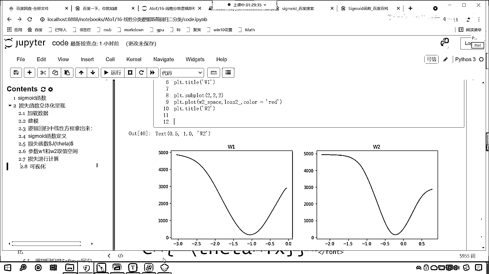

你现在来看啊，就是咱们这种图形。

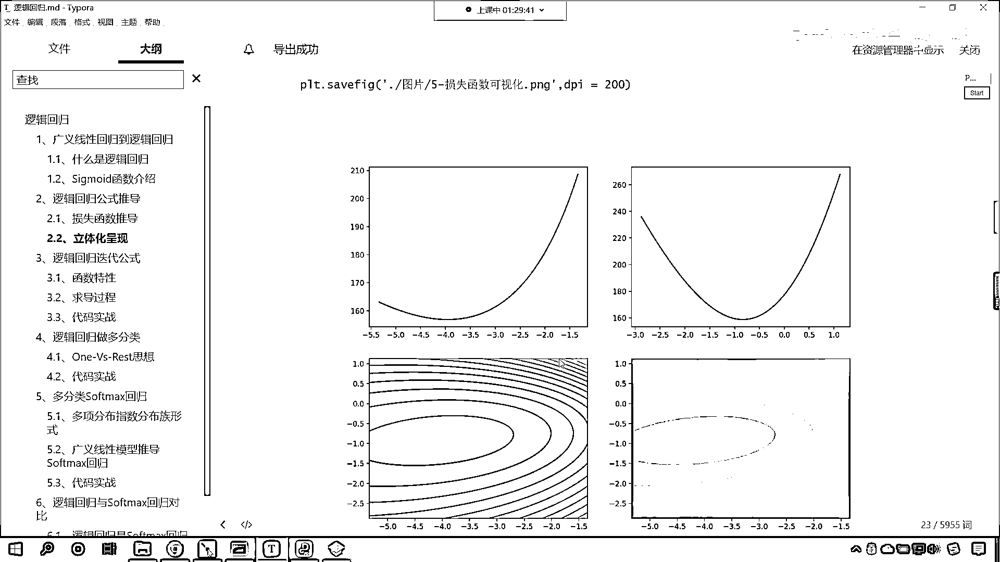

你知道这种图形叫什么吗，这种图形叫做等高线，就是里面这个圈是吧，它是一个等高线，越往外面是吧，这个等高线就越高，还有咱们这个颜色。

好。

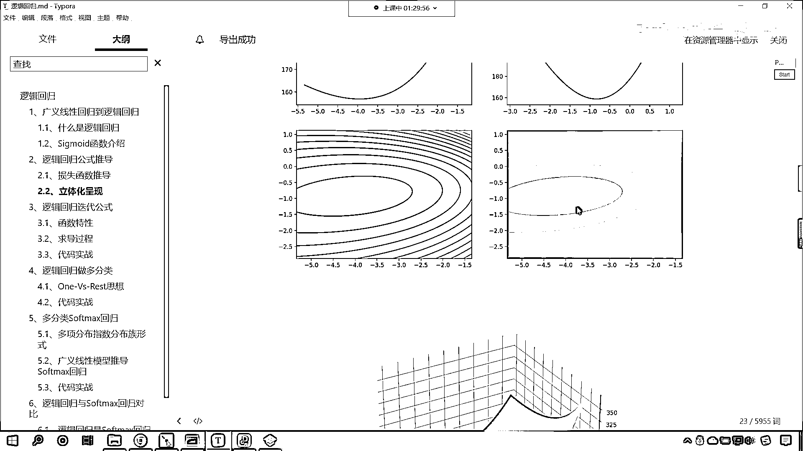

那么我们上面这个图咱们画的是W1，第二个图画W2，咱们能不能把W1和W2同时给它画出来呢，可以，横坐标是横坐标是咱们的W1，纵坐标是咱们的W2。

这个是可以画出来的啊。

来现在回到代码当中，咱们呢给各位演示一下啊，此时呢，plt。subplot，咱们添加一个子室图，两行两列，那就是第三个，现在的话咱们就绘制一个，这个呢叫做等高线，叫等高线，那我们将W1和咱们的W2。

咱们的同时进行和W2，看咱们同时来进行绘制，好，这个时候如果想要同时绘制的话，咱们得绘制一下网格线，NP里边有一个方法叫MASH GRID，这个MASH就有交叉的意思，GRID就有网格的意思。

那这个是什么意思呢，看咱们把W1 space放进去，W2 space放进去，那么它就会生成一个网格线，我给你演示一下啊，看NP。MASH GRID，让你看一下什么是网格线，中国号咱们来一个135。

逗号再来一个中国号246，你看现在咱们是不是给了这样的数据呀，这个时候你看我一执行，大家现在来看，咱们的123和246，它就变成什么样的数据了，你看，它是不是根据对方的这个形状，进行了一个衍生呀。

是不是进行了一个数据的衍生，你看它是怎么衍生的，你原来这个数据是不是只有123，对不对，你看你原来的数据只有123，现在怎么样了，你看到了吧，123，现在你有没有发现这个数据就变多了，你看变成二维了。

是不是我现在呢，再给你增加一个叫2468，咱们再来看一下它的规律，现在你就能够发现，你看咱们的数据，看看咱们的数据啊，原来是123，现在你看变成的这个二维的数据，是不是123123123123。

它是不是变成了四行，看它为什么变成了四行呀，因为我们第二个数据，你就能够发现，看咱们的第二个数据，第二个数据是不是四个，这第一个数据是三个，对吧，看咱们第一个数据是三个，没问题吧。

2468第二个数据是不是四个呀，那么它俩进行网格交叉，它俩进行网格交叉，最后变成的结果是什么，看变成的结果，咱们这个你看，因为你对应的数据是四行，你发现规律，它是不是就是四行。

看这个是不是就是四行三列呀，对不对，你看那这个四行三列，你就能够发现，这个123123，你看它就变成什么了，看到了吧，这第一行是123，第二行也是123，第三行是123，第四行是不是也是123呀。

这为啥变成四行，就是因为它的第二个数据，2468是四个数，所以说就变成了123，那我们再看咱们第二个数据，你能发现咱们第二个数据，你看它是不是也是四行呀，看到了吗，它呢也是四行，它是不是也是三列呀。

对不对，你看它也是三行三列，这个时候你就能够发现，你看我们的列，这第一列是2468，第二列是不是也是2468，第三列是不是也是2468，这什么叫网格交叉呀，我给你举个例子啊，看咱们就画一个水平的好不好。

咱们再画一个竖直的，我们水平的这个数据呢，咱们假设说就给成，看咱们水平的这个数据呢，看我们就给成一，给一个二，然后呢给一个三，竖直的这个数据呢，咱们给一个二，给一个四，给一个六，然后再给一个八。

看什么叫网格交叉，非常形象，你看啊它非常形象，啥叫网格交叉呀，看你这不是一点吗，向上滑，这是二点向上滑，三向上滑，水平的这个二，看到了吗，水平的四，水平的这个六，然后八，现在你就能够发现。

经过咱们网格交叉之后，咱们这个数据就变成啥了，看你看我们是几行几列，咱们是不是四行三列，现在你看咱们生成的数据，是不是就是四行三列的数据，看到了吧，咱们来一个橡皮擦啊，好我们来一个橡皮擦。

咱们把这个给它擦掉，看是不是，看到了吗，怎么样看到了吧，是不是，好那你想这个时候，我们选其中的一个点，看这个时候，我把其中的一个点，给你这个描述出来，看你比如说这个点，它的数据应该是多少。

是不是一和六的一个组合，对不对，你看这个是不是就是一和六，是不是，然后那这个点呢，是不是就是二和六，这个点是不是就是三和六，对不对，所以咱们在进行这个交叉的时候，你看啊我们化成这个，咱们化成这个绿色的。

看666，它是不是就是三个六，看那它和谁进行这个组合呢，它是不是和123啊，看了你这个时候666和咱们的123，是不是就是在对应咱们绿色的这三个点啊，所以说如果数据是这样的。

我们画图形是不是就可以画一个网格线啊，是不是就可以画一个这个等高线啊，好这是咱们这个方法的介绍，那咱们现在就使用这个方法，我们进行相应的一个这个转换啊，那这个时候就是w1下滑线，greed w2下滑线。

greed等于好，有了这个数据之后，咱们紧接着呢，根据咱们这个数据，咱们进行一个计算，好那这个时候咱们就调用咱们的，这个loss function，好那么我们将x放进去，咱们将y放进去。

然后呢将w1grid放进去，将w2grid放进去，这个时候它会统一进行计算，然后最后一个参数把b放进去，那我们求解出来这个值呢，就是咱们的loss，loss叫lossgrid。

我们现在放的数据是不是就是一个矩阵啊，看到了吗，现在咱们求解出来的这个，求解出来的它就是矩阵，那矩阵求解出来之后呢，我们把这个方法，把矩阵放到咱们loss function当中，咱们求解出来的也是矩阵。

那矩阵是不是就有行合力啊，那咱们就画出来，看那怎么才能画出来呢，那就是prt点啊，我们调用count，看con counter这个方法，咱们呢将，横坐标w1放进去，纵坐标w2grid放进去。

那我们对应的数值呢，就是咱们的lossgrid，这个时候呢我们给一个颜色，咱们这个color呢，我们就给一个purple，给一个紫色的，来这个时候你看我一执行，哎来大家现在就能够看到。

你看此时的这个等高线，咱们是不是就画出来了，看了吧此时的这个等高线就画出来了，那么我们此时所画出来的这个等高线，各位小伙伴能够看到，咱们这个等高线是不是不像一个圆圈呀，对不对，为什么呀，哎就是因为我们。

这个，这个空间范围是吧，咱们这给的是负二，是不是啊，我们让他加，我们让他加上了一，那咱们现在呢再来调整一下啊，来执行一下，执行一下，现在的话，重新计算一下w1和w2，重新计算一下咱们的w1和w2。

现在的话，咱们再来绘制一下啊，现在咱们再来绘制一下，好大家现在就能够看到，此时你看我画出来这个，是不是就像一个等高线了。

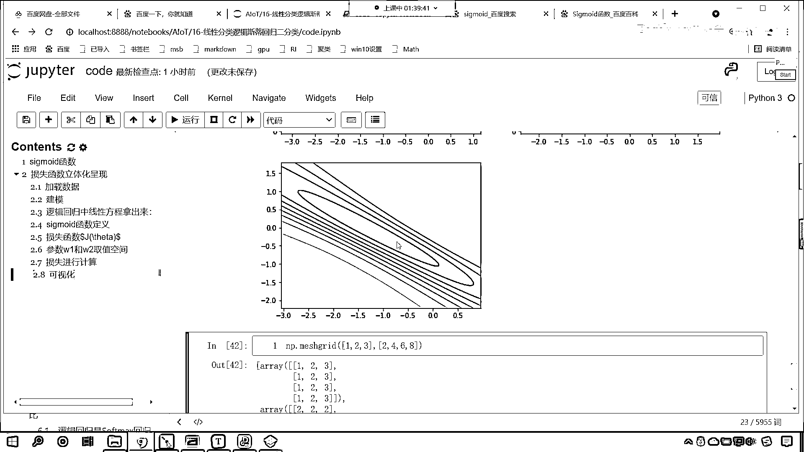

但是，和咱们，和咱们上面这个代码画出来的等高线，是不是还是不太一样呀，对不对，你看上面这个等高线画出来就是一圈一圈，就像咱们扔一个石头扔到水里边。

是不是产生的一个一个波纹呀。

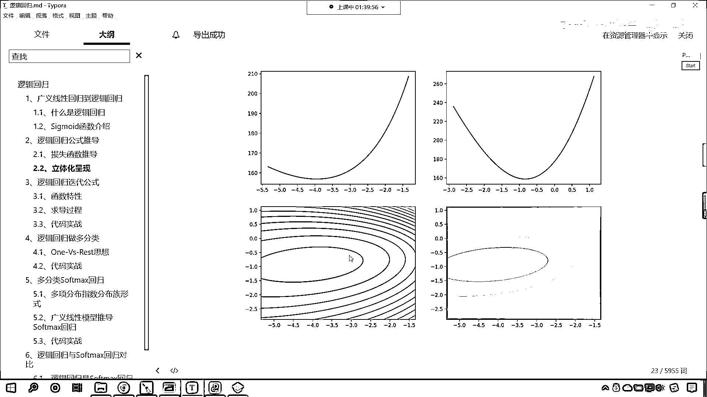

这个更完美，那我告诉你为什么啊，为啥咱们这个就不行了呢，是因为我们截据的影响，是因为咱们截据的影响，你看啊，咱们求解出来的截据是多少呢，咱们求解出来的截据，是不是这个呀，你看这个截据是不是19。6呀。

这个截据大不大，看这个截据是不是特别大，np。log，咱们使用咱们的sigma的函数，你看1除以1加上np。log，咱们将19放进去，你看这个np。exp是吧，exp19放进去，你看。

我们单单把咱们的截据19。67放进去，你看我求解出来的，咱们所求解出来的这个概率，它是1的-9次幂，看到了吧，这是1的-9次幂，这个数是不是特别特别小呀，对不对，这个数特别特别小。

那我们有了这个方程的截据，咱们在进行这个sigma的计算的时候，看到了吧，这个时候咱们是不是，这个方程它是不是受咱们截据的影响特别大呀，因为你这个幂是19对不对，所以说呢，就对它有一个非常大的影响。

这也就是为什么，咱们只要把这个幂一放进去，我们画出来这个图呢就不够好看，现在怎么办，咱们呢操作一下啊，看我们怎么操作呢，我们令幂=0行不行，这幂=0意味着什么，幂=0是不是意味着，我就不算截据了。

对不对，来重新执行一下啊，看啊，不要截据了，现在咱们进行一个说明啊，咱们计算时，咱们忽略，计算时呢，我们忽略截据，那咱们忽略截据，那为啥可以忽略截据呢，因为我只研究，那因为咱们只研究w1和咱们的w2。

对吧，我们研究w1和w2的规律，所以这个时候呢，咱们忽略截据也没关系，执行一下，截据就忽略了，这个时候咱们的截据呢就忽略了，好，那么这个截据忽略之后呢，咱们我们这个p呢，这个裁减，咱们就给他注掉啊。

执行一下，看我们现在就不裁减了，注掉，因为啥呀，因为你想我计算出来的对数，我使用sigma的计算出来的这个概率，你想他是不是可以很小呀，只要我给19你就能够发现，他是不是1的-9次密。

咱们现在给的这个是多少，是不是百万分之一呀，这百万分之一大还是咱们的1的-9次密大呀，很显然是不是百万分之一要大得多呀，所以现在既然我们忽略了截据，是不是，那么我们就不要对这个p进行裁减了。

把这行代码注掉之后，你这个代码要执行一下啊，注意啊要执行一下，现在呢咱们重新计算一下咱们的loss1，然后呢再计算一下咱们的loss2，现在你就能够发现，这个此时是不是又出现了一个nf呀，对不对。

你看此时又出现了一个这个nf是吧，它依然出现的这个问题呢是divided by 0，是不是啊，这个也没关系啊，我们照样画图把它画出来，是不是咱们一起来看一下啊，好那么可视化一下执行。

这个时候呢我看一下啊，咱们所画出来这个数据呢，大家看啊这个虽然有拐弯，但是效果呢是不是也不太好呀，我们出现了这种情况呢，咱们还得去我看看还得去调一下啊，来我们往上滑看一下咱们的，这个取值的空间。

我看一下啊，往上滑一点，看一下咱们w1 w2的取值空间，我们是w1-2 w2+2，是不是啊，那我们调一下咱们的这个空间吧，调一下咱们这个空间，我们对于w2呢咱们这个各取1。5，看一下怎么样啊。

其实咱们为了研究这个数据，我们希望呢画出来这个图形漂亮一些，是不是来执行一下，好那么现在呢咱们就有了这样的一个范围，然后呢我们就计算咱们的这个损失函数，好那么这个损失函数在进行这个操作的时候。

因为我们的币呢给了个零，所以说这个sigmoid计算的时候，他就用咱们传入的这个数据，好那么执行这个代码，loss1就出来了，没有问题，再执行这个代码，loss2也就出来了，现在是不是就不报那个问题了。

我们如果给的这个数据范围太宽的话，他就容易出现咱们刚才的那种情况，容易出现inf就是英菲尼迪那种情况，现在呢来咱们绘制一下，好大家看啊这个就是咱们的这个等高线，那我们发现咱们这个等高线是吧。

依然不太行是吧，这个颜色呢让他自定义就行了啊，我看一下啊，这个时候咱们画出来这个图形依然不太像，是不是啊，w1 space w2 space，你看我们这是不是又给了个币，咱们把币调整成零。

这个时候大家看这个就是咱们的这个等高线，好那么这个没有出现这个涟漪是吧，那么大家可以在课下的时候，根据咱们上课的这个代码，我们呢来进行这个调整一下就可以了啊，根据咱们上课的这个代码调整一下。

因为你就能够看到，我们这里边咱们进行相应的操作是吧，我们不一样的地方咱们就是加了一个币嘛，是不是这个这个是没有太大影响的啊，来咱们继续啊，好那么这个时候你看他有这个粉红色的这个提示，是不是啊。

那这个粉红色提示呢，咱们可以我们在上面插入一行，咱们导一个包啊，import warning，我们设置一下叫filter warnings，咱们给一个一个now，因为这个粉红色的提示归根结底。

他呢只是一个提示而已，知道吧粉红色提示，他呢只是一个提示而已，好那么有了这个有了咱们这个数据之后呢，咱们紧接着呢再画一个啊，我们刚才画了一个等高线是吧，咱们再来一个等高面啊，再来一个等高面。

那这个数据呢咱们已经获得到了，那这个等高面呢咱们就添加指示图，plt。subplot两行两列，咱们第四个这个时候指示图就有了，然后呢咱们就叫counter F，看上面这个counter是等高线。

那counter F呢就是咱们的等高面，把数据放进去，在这呢control v，依然是横坐标纵坐标咱们求的数据。

这个时候你看我一执行。

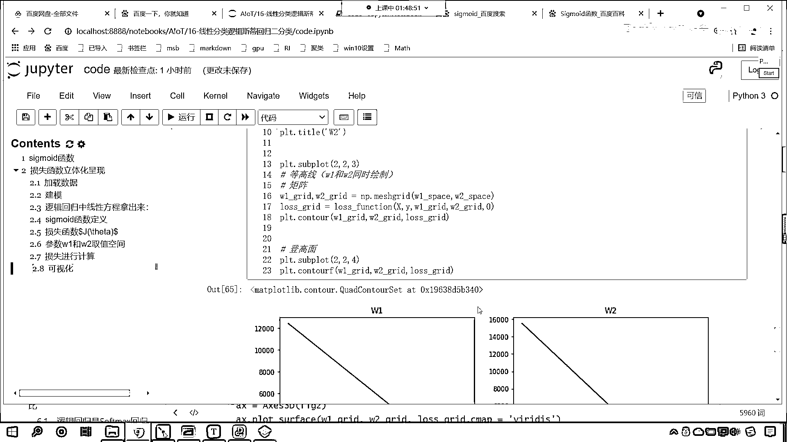

哎现在你就能够发现，你看这样的一个这个等高，这样咱们的一个这个等高线是吧，哎我们就出来了啊。

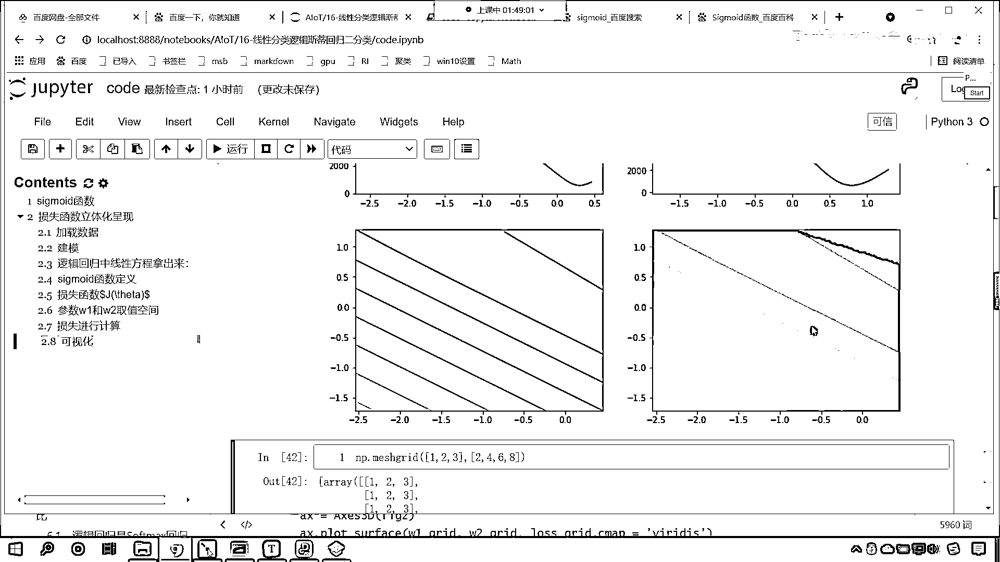

这样的一个这个等高面咱们就出来了，好那么咱们现在呢还是要去这个看一下啊，为什么咱们这个数据是吧求解出来，这个他就有点偏差呢，是不是啊，那我们得这个研究一下啊。

那这个出现问题的地方可能就是在这个地方叫we space，来我们调一下咱们的代码，其实咱们可视化这个案例呢，基本上就讲完了，讲完了之后呢来咱们去调一下啊。

看一下咱们这个看一下是哪个地方可能出现了一丁点问题啊，来那么我们代码重新执行一遍好不好，好那么各位小伙伴就能够发现，咱们这个数据当中呢，看咱们这个数据当中是不是没有进行标准化呀，啊我们没有进行标准化。

现在呢咱们对这个数据进行一个标准化，你发现不进行标准化。

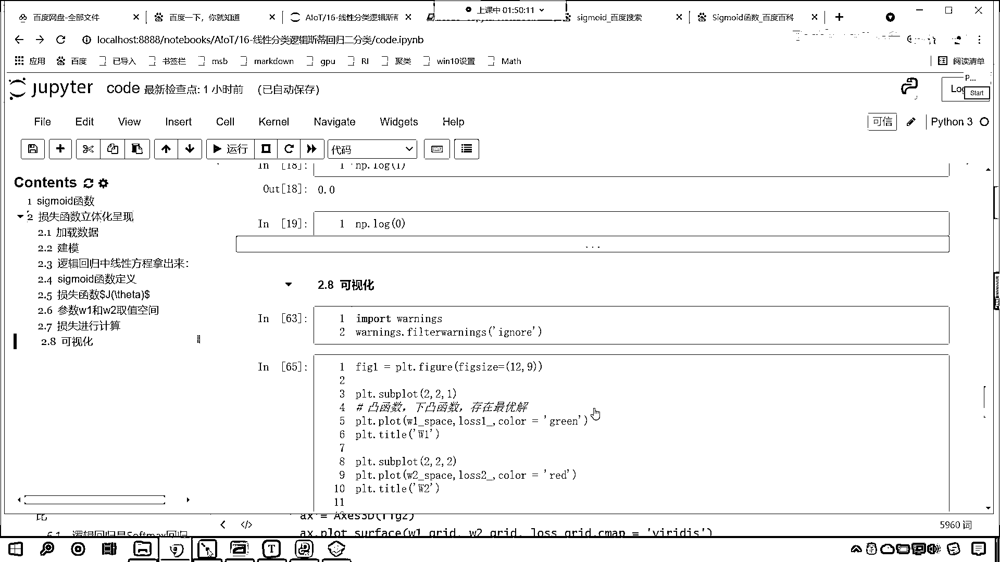

咱们画出来这个数据是不是不太好看呀，来现在呢咱们就进行一个这个数据的标准化。

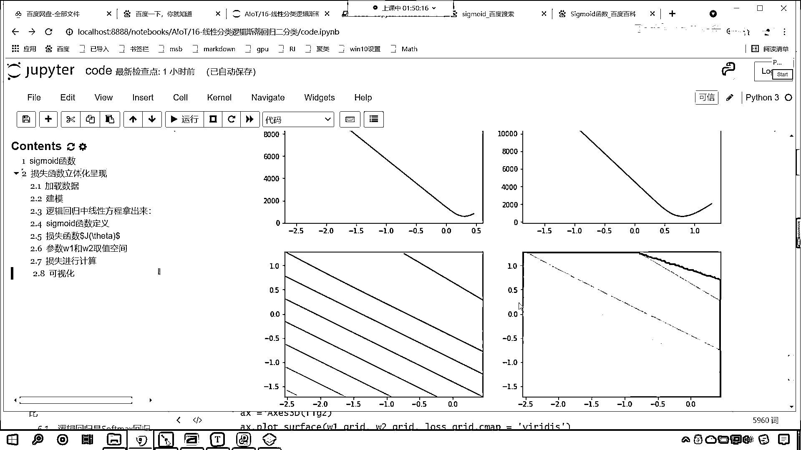

好那么数据标准化，咱们呢需要对于咱们的这个x进行一个标准化，那么我们就往上走，找见咱们的x，x呢就等于scale小括号，咱们将x放进去，在这呢咱们进行一个说明，好这个地方呢咱们对数据，进行zscore。

进行zscore的这个归一化，好那么我们执行一下这个代码，你看我们如果要对x这个数据进行zscore归一化，那大家想咱们这个数据范围是不是就变成了一个正态分布了，然后呢咱们进行训练。

训练之后呢咱们获取他的这个数据，训练之后咱们获取相应的这个数据，获取了相应数据之后，大家看啊进行了归一化之后，你看方程的结局是不是就小多了，那么定义函数咱们依然给这个函数，是吧给他b。

然后呢咱们定义咱们的这个损失函数，执行，然后呢咱们声明咱们的这个，这个参数waw的这个命名空间，我们将这个1。5呢。

现在咱们再给他调回成2啊。

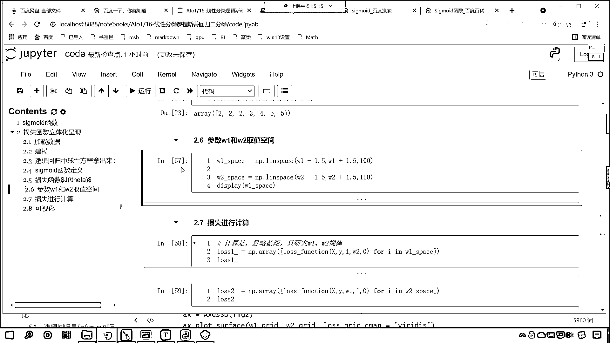

选中他来一个f，咱们将这个1。5你看。

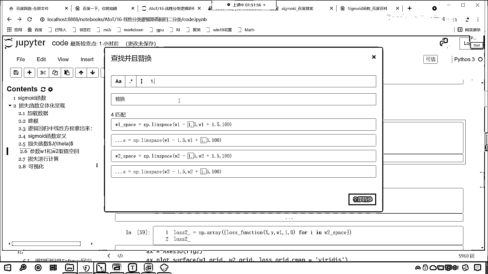

然后把它替换成2，然后全部替换你看是不是就全部替换成2了。

选中他nf，上面是你想要替换谁。

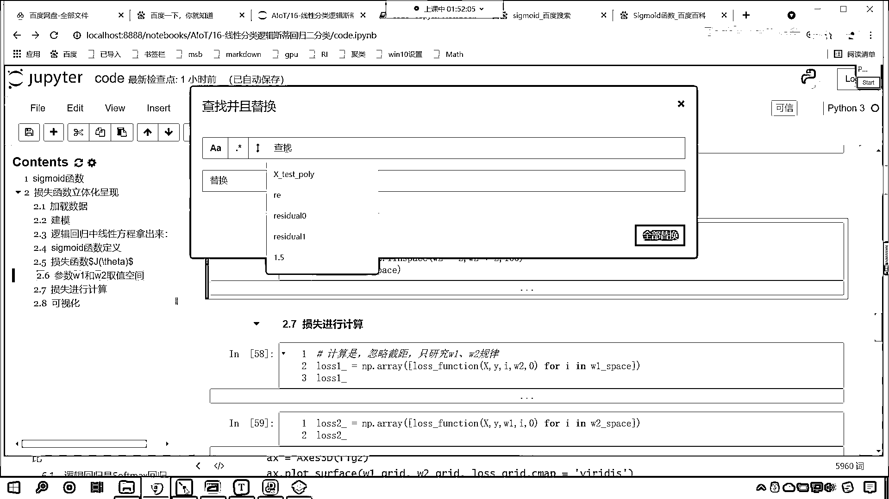

下面是替换成的值就可以了，然后呢我们进行计算，大家看现在就计算成功了，这是归一化的数据，loss2咱们也进行一个计算，这也就计算成功了。

好那么开始画图吧。

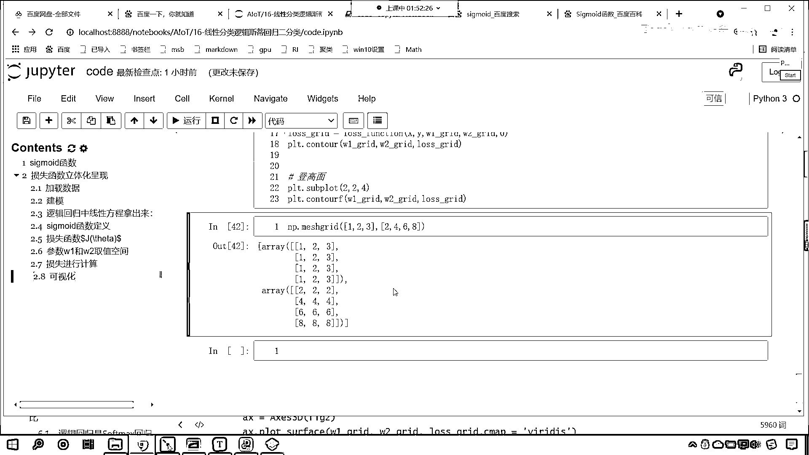

这个时候你看我一直行，哎大家现在来看，此时是不是就像了，看到了吧，此时是不是就就像了呀，那我们把它的范围给他调宽一些啊。

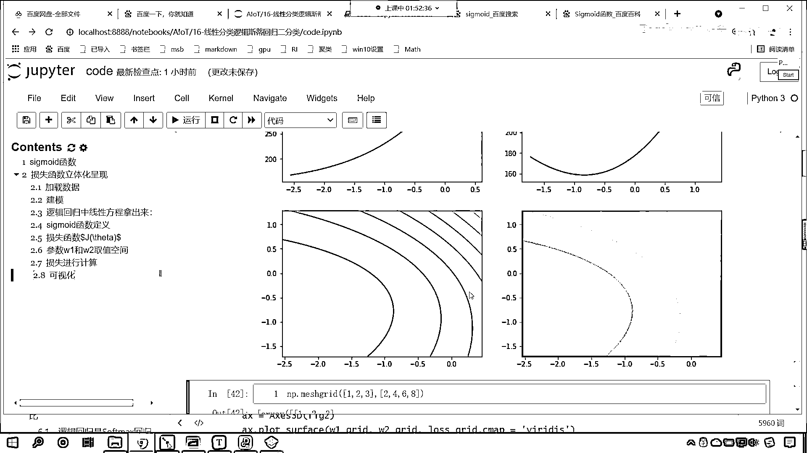

好不好，咱们将它的范围调宽一些，我们这个地方不是减2吗，咱们调成减4好不好，调成减4，这个时候范围就宽了，损失函数呢重新计算，然后呢咱们这个l2呢，我们也重新计算，画图。

现在呢咱们看一下。

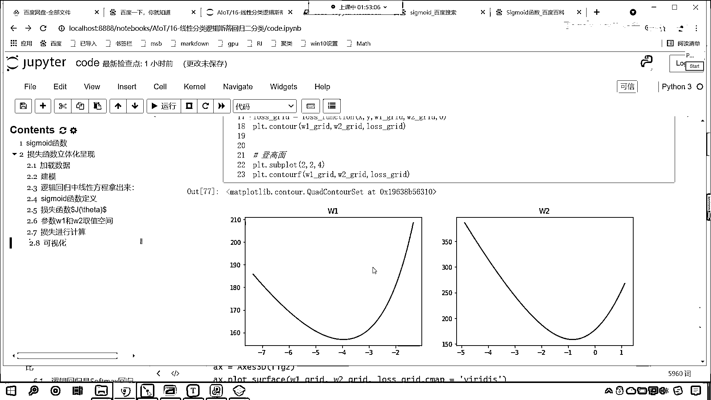

现在你就能够看到怎么样，这个数据是不是就看到了吧。

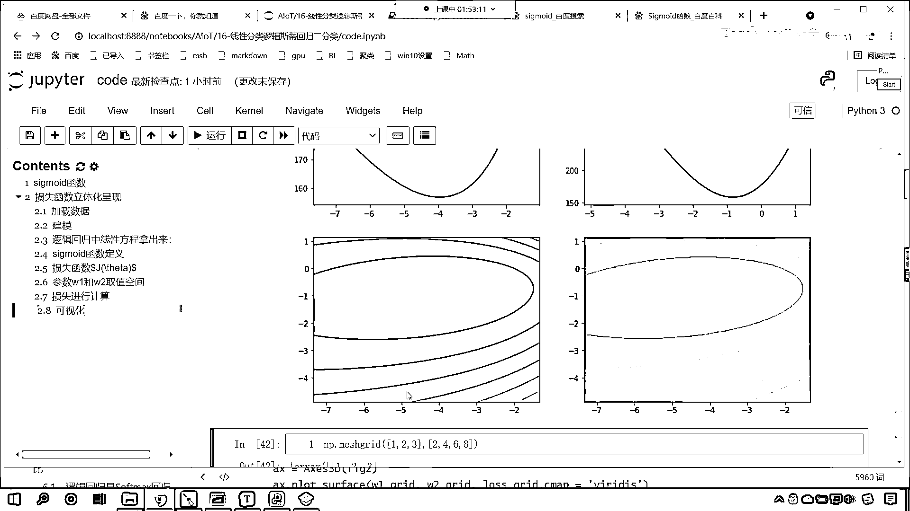

你能够发现，w1是不是t度下降呀，可以找到最低点，w2是不是t度下降。

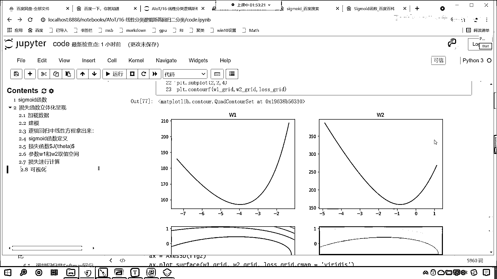

也可以找到最低点，我们现在得到的这个图呢，看咱们现在得到的这个图，你现在就发现，你有没有感觉到，我们就是比如说这个等高面啊，咱们在向下走的过程当中，是不是越来越深。

是不是越来越低呀。

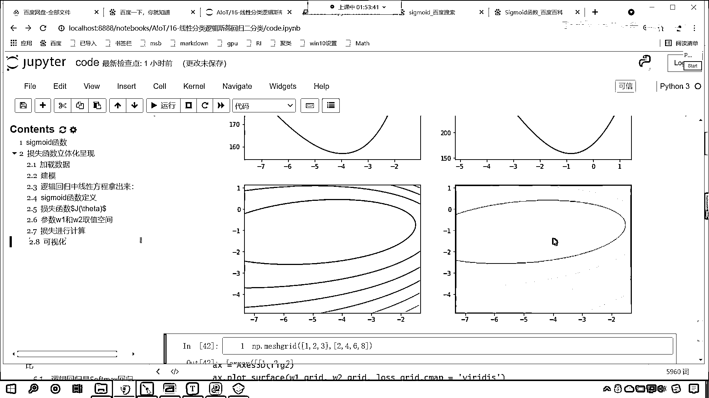

我们再调一下啊，咱们让它加4，这个2呢也让它都变成4好不好，这样的话咱们的范围就更宽了，是不是，计算l1计算l2是吧，重新计算一下啊，计算l1计算l2，好，然后的话咱们就画图。

这个时候你看我一直行。

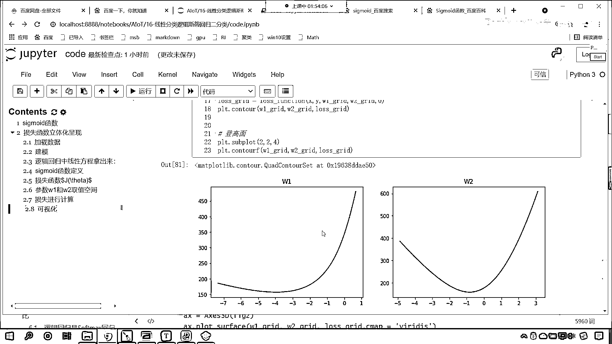

哎大家现在来看啊，哎这就是咱们求解出来的这个数据，是不是就是，越往中心，你可以认为越往中心，看啊越往中心，这就是咱们的这个，谷底，它越深说明离我们越远，这就是这就是咱们下山的时候，那个那个山谷。

所以这不就是，可以进行梯度下降吗，从最高的地方，我们是不是可以一步一步的，向下走呀，对不对啊，走到这个地方。

咱们就找到最优解了。

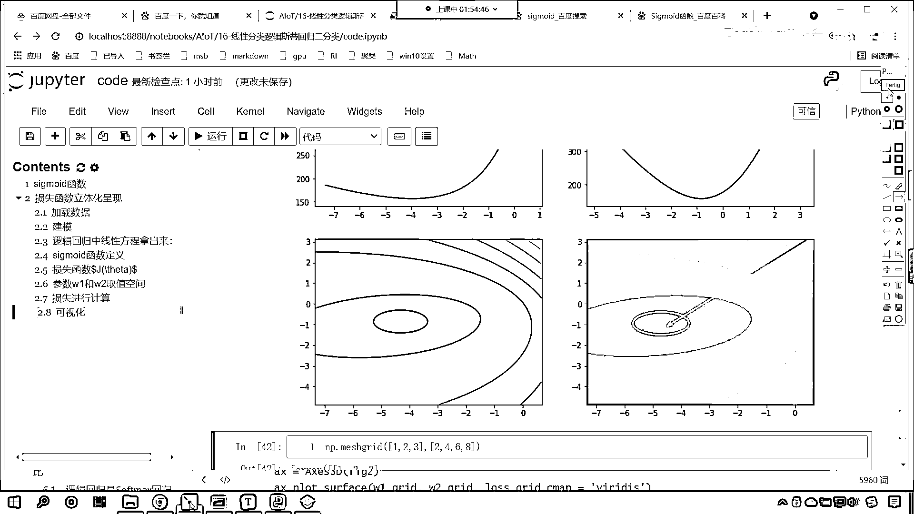

所以这个呢就是咱们，数据可视化的这部分代码，好，那么我们最后呢，咱们还有一个这个3D的可视化，是不是啊，来现在的话咱们就，绘制一个这个3D的可视化啊，好，那么来咱们这个再给他添加一个这个子标题。

这个呢就是3D，这是咱们3D的一个，可视化，好，那么3D的可视化呢，咱们给他创建一个子室图，叫Figure2就等于PLT点，咱们创建一个Figure，尺寸给他调整一下，那给他一个Figure Size。

咱们呢就给一个12和9，根据咱们刚才的这个操作呢，你也能够发现，我们在进行这个模型训练的时候，规一化是不是不可避免呀，对不对，你看不进行规一化，咱们这个数据呢就不太好看，是不是，所以说这一步规一化。

它呢是很重要的啊，好，那么创建咱们的3D子室图，有了这个3D子室图，AXIS咱们调用它的PLOT，PLOT，它里边呢有一个方法叫PLOT SURFACE，SURFACE就有MIR的意思。

咱们将求解出来的W1Grid放进去，然后W2Grid放进去，W1Grid放进去，然后W2Grid放进去，这个W2Grid不就相当于咱们的这个纵坐标吗，然后将咱们的LossGrid放进去，GRID。

然后呢我们给它一个颜色吧，CMAP，那这个CMAP就是它的颜色对应啊，这个颜色对应可以选很多，然后PLOT接下来就是设置，咱们设置一下它的横坐标，起个名叫W1，然后再设置一下它的纵坐标，PLOT。

YLABEL，咱们给一个这个W2，这个CMAP大家之前没有接触过，是不是啊，好 马上呢我们就给大家这个介绍一下啊，然后调整一下它的视图，视图的角度，30和-30，执行一下这个。

看一下咱们某一个地方给错了是吧，Has no property，这个是CMAP啊，这个M和A是吧，给写反了，这个时候你看我一执行，咱们现在是不是就将3D的这个，可视化给画出来了呀。

那我们知道这个CMAP代表颜色，你看这个颜色呢，我可以给一个Gray，Gray是不是就表示灰色呀，看了吧，我们还可以给什么呢，还可以给Rainbow，这个Rainbow呢就代表彩虹色。

那这些颜色咱们可以去哪里找呢，看那就是PLOT。COLOR，看PLOT。COLOR，叫做COLORMAP，你看我一执行，这个当中是不是有很多颜色呀，你都可以选啊，知道吗这个颜色都可以选。

COLORMAP当中这些都可以选，所以说你看到这个3D图形，是不是也能够看到它有一个谷底呀，看了吧，它也是有一个谷底的啊，好那么这个呢。

就是咱们相应的这个损失函数。

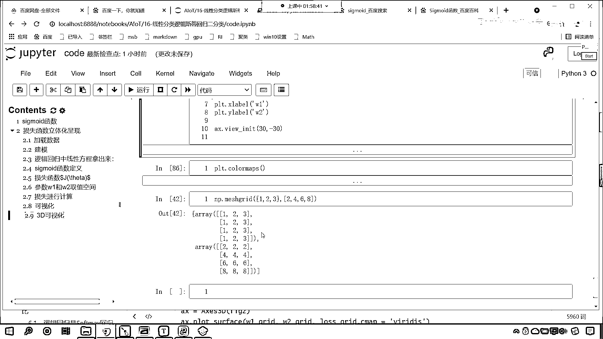

它的立体化呈现。