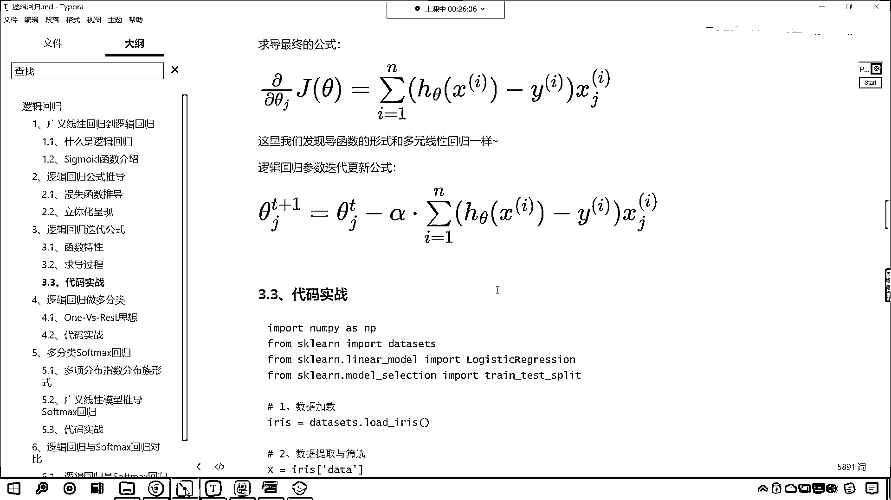

# 7天爆肝整理！AI量化交易-机器学习全套教程，从入门到项目实战保姆级教程！（数据挖掘分析／大数据／可视化／投资／金融／股票／算法） - P108：1-逻辑回归梯度下降更新公式 - Python校长 - BV1KL411z7WA

好 那么首先呢。

咱们简单回顾一下上一节课，是吧 我们所讲的内容，咱们上一节课呢 我们学习了逻辑回归，那我们介绍了Sigmoid函数，那这个函数呢，它可以将咱们的数值，无论多大或多小，可以把这个数据呢变到0到1之间。

这个其实就是一个映射，是吧 就像我们人的内心一样，是吧 就是一个人如果经历了很多事情，那以后无论发生多大的事情，在他那儿是不是都可以，都可以容得下呀，对不对 都可以轻轻松松的过得去。

Sigmoid函数的作用呢就是类似的，我们计算出来通过线性回归，计算出来的数据，有可能特别大 有可能特别小，没关系 放进去，传到Sigmoid的函数当中，都可以把它变到0到1之间。

变到0到1之间 这个就是概率，那我们的计算机，咱们所说的算法，在进行分类的时候，其实就是通过概率来做的这个决定，那我给你举一个例子啊，其实咱们人世间都是概率，我给你一个选项啊，比如说这个A选项。

你可以百分之百的得到100万，再给你一个B选项，你有50%的概率会得到一个亿，那请问你选哪个呀，来各位小伙伴，好 咱们有有同学选A，有同学选B呀，来我们其他的小伙伴也回复一下啊。

我看一下到底选A的多还是选B的多，来现在呢，咱们Jericho Swann选的A，Later选的A，好 卡猫选的B是不是啊，来其他小伙伴，好 那如果说我们从确定性这件事上，来选择的话。

那无疑选A这个是不是百分之百确定，你就可以得到100万呀，是不是啊，但是我告诉你这个题有唯一的答案，如果说我们从概率的角度，咱们从概率的角度来计算，你想哪个概率更大呀，你看你上面是1是吧。

那你1乘以100万是不是等于100万呀，那我们下面是不是0。5，0。5乘以一个亿，是吧 0。5乘以一个亿，你算一下它等于多少，它是不是等于5000万呀，很显然我们应该选择，我们应该选择B。

那有同学说这个是吧，但是50%是瞎蒙的，是不是啊，那我告诉你啊，这是一个选择，看到了吧，这是一个选择，那这个选择呢，你可以把它卖出去，那么你可以卖出去，你比如说对于很有钱的人，他们不在乎钱。

他们在乎的就是选择，你比如说卖出去，你卖给马云，你说我现在有一个创业，这个现在有一个项目，这个项目要成了，那么你就能得到一个亿，这个概率是50%是吧，现在呢，我以1000万卖给你，你看卖出去，卖给马云。

很多人，对于他来说，这个金钱就是一个数字而已，比如说马云，是不是金钱就是一个数字，他要的是机会，那我再给你比举一个例子啊，比如说马云100岁了啊，咱们假如说马云100岁了，是吧，他还不想死，怎么办。

医院呢，开发了一种药物，医生呢，这个开发了一个药物，那这个药物呢，医生就说了，开发成本比较贵，是10个亿，是吧，对于马云来说，10个亿这都是小钱，是不是，那这个药物你吃了之后，可以延长，是吧。

它可以延长10年的寿命，但是呢，这个概率是50%，那你说马云愿不愿意花这10亿，买这50%的概率啊，是吧，我这个价钱虽然贵一点，是吧，概率是吧，50%，是吧，那他当然愿意花这笔钱去买这个概率。

这个概率呢，就是选择，所以大家呢，在学习一些知识，提升自己技能之后，你不仅仅要学知识，随着你年龄的增长，阅历的增加，那有可能你会，以后会有一个很大的突破，是吧，有可能你会做管理层，是吧。

有可能你以后会挣很多钱，有可能你会以后是吧，为国家做出很大的贡献，这个呢都未可知，所以说我们看问题，咱们学习了机器学习之后，咱们看问题的角度，也会有一定程度的提升，我们的思维方式，也会发生一个转变，好。

那么咱们现在呢，回到咱们逻辑回归这里啊，在上一节课，这个过程当中呢，我们介绍了逻辑回归，他公式的推导，是不是啊，那么这个公式的推导呢，最后呢，我们推导出来，是这个绿色的损失函数，这个损失函数越小。

咱们就所求解的这个解呢，就越准确，那这个呢和咱们之前所讲的线性回归，不谋而合，那咱们接下来呢，我们看一下咱们逻辑回归的迭代公式啊，这逻辑回归呢，他在进行计算的时候，他是通过梯度下降，那既然是梯度下降。

那么我们就有这个权重的更新公式，大家现在所看到的这个公式，看你现在所看到的这个公式，哎，就是咱们的权重更新公式，那我们T加一次的权重，他是在第T次权重的基础上进行的一个梯度下降，谁是我们的梯度呢，哎。

大家看这个就是咱们的梯度，那这个其中还有一个R法值，这个R法呢，就是咱们的学习率，我们可以把它认为这个呢，就是一个系数，是吧，这个系数控制着咱们梯度下降的这个步子脉的大和小。

那决定着咱们梯度下降的快和慢，好，那么这个系数咱们说得需要调，不能给的特别大，也不能给的特别小，对不对，咱们要给合适的，那么我们才能够求解出来，最优解，好，那么大家看啊，这个是他的这个更新公式。

那接下来呢，咱们看一下这个具体的这个推导啊，那上一节课呢，咱们在讲课的过程当中，我们介绍到了Sigmoid的函数，叫做逻辑回归函数，这个逻辑回归函数呢，他也叫Sigmoid函数，Sigmoid函数。

只要你100度，你就能够找到他对应的公式，那么他对应的公式呢，就是咱们下面看到的这个公式，在这个里边，是不是有一个自然底数E啊，2。718这个数字很神奇啊，在很多公式当中，他都出现了，你想这个2。

718是不是在咱们，正态分布高斯分布当中，是不是也出现了呀，对不对，如果说你遗忘了，你可以翻看咱们之前的那个公式啊，好，那么咱们这里边的Z呢，他就表示这个θTx，这个不就是线性方程吗，对不对，好。

那么现在的话，咱们对于这个Sigmoid的函数，咱们对于逻辑回归函数，我们对他求一个导数，看到了吗，我们要对他求导数，那为啥要对他求导数呢，你想咱们上一节课所推导出来的，T度下降的公式，看上一节课。

咱们所推导出来的损失函数，这个当中你能够看到，咱们这个Hθx，是不是就是我们的Sigmoid函数呀，对不对，你看这里边就是Hθx，这个就是咱们的Sigmoid函数。

那么我们的Sigmoid函数有什么样的特征呢，是吧，为什么这个创建逻辑回归的数学家，这个算法工程师，他就选择了这个函数呢，你看，你想一下，是吧，为什么选择了这个函数呀，对不对，那一定是这个函数。

它有特别的功能，咱们一起看一下啊，那首先呢，我们看一下它的导数，它的导数呢，可以用它自身来表示，看这是它的这个特征之一，也就是说它的导数可以用它自身来表示，你说奇怪不奇怪啊，对不对。

你就像咱们的E的x方，是吧，这个函数的导数，是不是依然是它自身呀，对不对，你看这个函数的导数依然是它自身，是不是完美不完美，那我们上面看到的Sigmoid函数，它的导数可以用它自身来表示。

那我们大家看这有详细的推导过程，我们如果要对它进行求导数，那么因为这个这是在分母上的，所以说就来一个二次幂是吧，分子上呢，就继续对它进行求导，求导之后我们该拆开，咱们就拆开，拆开之后呢。

你看就可以写成一加上E的负Z分之一，乘以小块一减去一加上E的负Z分之一，那么前面这一部分就是JZ，用它自己来表示，后面这一部分呢，咱们可以写成一减去JZ，你看巧妙不巧妙，是吧。

那我们回到逻辑回归的损失函数，这个时候是不是就开始求导了，大家注意啊，此刻你要想明白啊，上一节课咱们只是得到了损失函数，对不对，我们上一节课没有对损失函数进行求导，那这一节课呢，咱们就继续进一步。

有了这个损失函数之后，咱们看一下这个损失函数写成这样，是吧，能不能通过求导的方式，咱们在代码当中通过放循环呀，或者挖有循环呀，能够自动的进行计算，这样的话，那这个算法不就出来了吗，你要知道所有的算法。

它都不神秘，知道吗，你看啊，这个算法呢，咱们学算法，学原理，其实呢，就是把它神秘的面纱，神秘的面纱，给它一层层，给它揭开，你看这就是学算法，这就说明我们学会了，神秘面纱一层层揭开。

上一节课咱们得到的这个损失函数，那有了损失函数，咱们说是不是可以通过梯度下降来进行更新咱们的权重呀，那梯度下降当中，你能够看到，是不是就有对于咱们损失函数的求导呀，大家看。

梯度下降当中就有对咱们损失函数的求导，那么我们现在呢就对于咱们的损失函数来进行一个求导，大家现在就能够看到，这个就是我们详细的求导过程，那我们选其中的一部分，咱们进行一个说明啊，比如说这一部分。

为什么他进行求导之后会得到咱们下面这个结果，你来看一下，首先这个YI是不是写下来，对不对，然后这个lnHθXi，那么我们如果要对他进行求导的话，你想一下，lnX他的导数是多少，lnX。

根据我们之前所学的数学知识，他的导数是不是就是1/X啊，对不对，所以我们对他进行求导之后，这个地方就出现了一个分式，那我们就发现咱们的HθX，他是不是符合函数呀，那求完之后。

咱们需要继续对他根据链式求导法则，什么是链式求导法则呀，就是你的函数不是X，就是说你是一个复杂的函数，符合的函数，那我求完导之后继续再对他进行求导，继续再对他进行求导，这个就叫链式法则，那么到了这之后。

大家看啊咱们再画一个线啊，到了这之后，你就发现你看，这个Hθ咱们说它是什么函数，它是不是sigma的函数呀，sigma的函数求导是不是可以用它自身来表示呀，对不对。

sigma的函数求导就可以用它自身来表示，所以说这就是为什么数学家，他就喜欢使用这种特殊的函数来构建我们的方程，是吧，冥冥之中自有天意是吧，也就是说这个天意呢，或者说这个大自然。

这个根据某定的根据某一规律，为我们限定的这些特征，数学家呢，找到之后，那我们就可以在电脑当中大展身手，后面这个后面这一部分求导也是一样的，经过求导之后，合并同类项合并同类项之后呢，哎我们一步一步的化解。

哎各位小伙伴，你要注意了啊，这个里边咱们看到的这个公式很复杂，其实呢，其实他都是什么，他都是基本的求导过程，在这呢，咱们进行一个说明啊，看这些呢都是基本的求导，基本的求导步骤，是吧，该根据链式法则。

我们就根据链式法则，是吧，那个浪寒数，他的导数呢，就是这个x分之一，是吧，就是hθx1/2，然后该合并合并，那最后呢，我们就可以得到，最后咱们就可以得到这样的一个结果，哎。

大家看我们就可以得到这样的一个结果，那最终呢，我们把这个结果给他换一个颜色，咱把他写成红色的，你看到这个结果熟悉不熟悉，就是hθx1-yixjxi，熟悉不熟悉啊，这简直太熟悉了，这个为什么这么说呢。

因为到这里我们就发现，这个导寒数的形式和多元线性回归一样，咱们说到这之后，你就要翻看一下咱们之前线性回归，t度下降，它的权重更新规则和这呢就一模一样了啊，那这也就是为什么咱们的逻辑回归。

我们在进行导包的时候，你是不是就发现，他所在的这个包是不是线性回归下边的呀，看他是一脉相承的，只不过呢，他在这个地方进行了一个变化，原来线性回归适用于解决回归问题，而我们逻辑回归呢，经过了一定的变化。

把它转换成了概率，那么我们这个地方解决的是分类问题，仅此而已，所以说这就是这个老子所说的是吧，道生一一生二二生三三生万物，是吧，你研究最基本的东西，你就会发现是吧，物理世界当中的这个质子和中子，是吧。

一个质子，这个一个质子一个电子，是不是构成氢原子呀，是吧，然后随着它的增加，是不是就氢氦锂铍，碳氮氧，福奈啊，本质上来说，他们都是质子中子电子组成的，但是因为数量不一样，那么他们的化学性质完全不同。

有的能燃烧，是吧，有的就是惰性气体，是不是，好，那么到此为止呢，各位小伙伴就能够看到，咱们绿色的这个，就是咱们逻辑回归，它的参数迭代更新的公式，你根据这个公式，你也可以写出来，这个逻辑回归的算法。

知道吧，你知道原理了，你根据这个，你也能写出来逻辑回归的算法，所以说咱们刚才说到的，我们学算法，把原理搞明白之后，其实呢，我们就把神秘的面纱一点点给他揭开了，那写SK论这个算法的这些前辈们。

你想他们有特别伟大吗，是吧，他们有特别牛吗，是吧，他们一个月挣10万美金，你通过学习训练，你是不是也可以做到呀，对吧，不断的突破自己，不断的精进学习，你也可以知道吗。

好。

