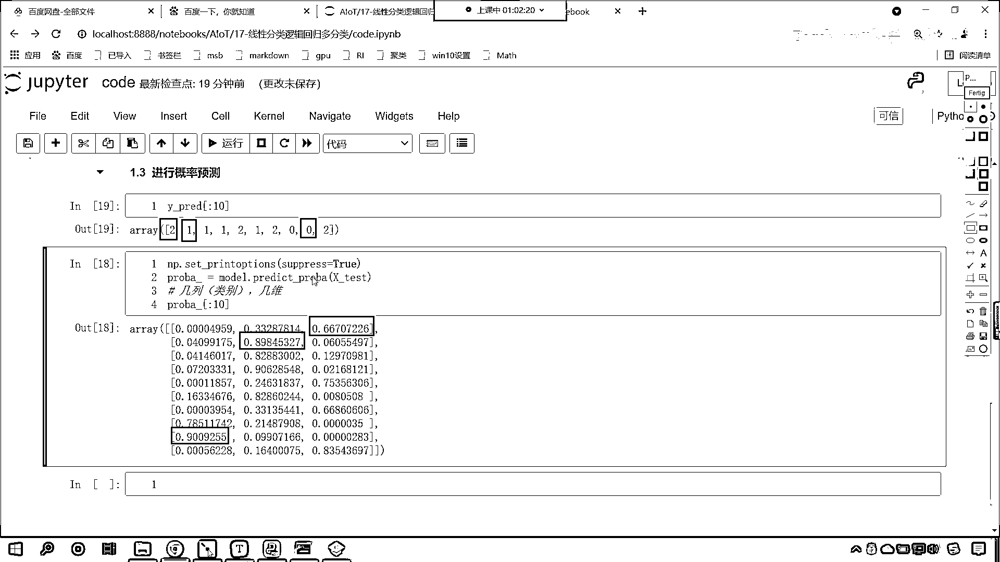

# 7天爆肝整理！AI量化交易-机器学习全套教程，从入门到项目实战保姆级教程！（数据挖掘分析／大数据／可视化／投资／金融／股票／算法） - P109：3-逻辑回归OVR建模与概率预测 - Python校长 - BV1KL411z7WA

现在呢咱们回到代码当中，好，那么我们看一下OVS它的使用啊，创建一个代码，给这个代码改个名，叫做code，现在呢我们导一下包，import numpy as np，from。

然后呢我们from sklearn，从linear model当中，咱们导入logistic regression，同时呢，from sklearn，咱们import datasets。

执行一下这个代码，咱们在选中它，在第一行代码的上面插入一行，来一个三级标题，那我们这个三级标题呢，就是咱们O就叫做OVS rest，这个呢就是咱们的举例说明，好，那么我们导包了，然后咱们就加载数据。

那就是datasets。咱们load一个iris，这个就是原文花，里边给一个参数，return x，y，我们让它等于true，这个就表示，加载数据的时候，不用为我返回其他的这个详细介绍信息，说明信息。

直接返回xy就可以了，咱们接收一下xy，那有了这个数据之后呢，咱们from sklearn，model selection，从这个当中咱们导入trimtest split，这个方法的作用。

它呢就是拆分数据，它呢会随机打乱顺序，它会随机打乱顺序，那我们现在呢就调用trimtest split，将咱们的数据xy放进去，默认情况下它有一个参数，叫test size，这个呢会是给一个0。

2的比例，那这个是什么意思呢，也就是说咱们测试数据的比例是0。2，也就是20%，我们一共有150个数据，原文花这个数据是150个数据，它呢是分三类，我们把它叫做150个样本，它呢有三个类别。

原文花是一种植物，是吧，我们不太关心它的三个类别到底是什么，那对于植物学家而言，他们研究之后发现是吧，因为生长环境不一样，就导致呢这个同一种植物，不同的环境下，慢慢进行了这个演进，慢慢进行了演化，是吧。

最后呢类别不一样了，但是呢它依然是同根同源的，就像我们人和大星星是吧，现在看起来完全不一样了，是不是啊，但是呢你这个几百万年以前是吧，我们都是同根同源的，好那么，拆分之后呢，咱们就接受一下啊。

那就是x下滑线，x下滑线test，它先将x拆分成两份，y呢也拆分成两份，y下滑线test，现在呢咱们展示一下这个数据，那就是display x下滑线春点shape，我们查看一下它的形状。

那x下滑线test也调用一下它的shape，那么再来一个display，接下来呢我们看一下目标值，y春点shape，y下滑线test点shape，执行这个代码，各位小伙伴你就能够看到，是吧。

总数据是150个，拆分之后一个变成了120，另一个变成了30，对不对，这说明咱们数据拆分是没问题的啊，好那么咱们春test split里边，还有一个参数叫random state。

这个是一个随机数的状态，那我们如果要给1024的话，这个时候呢咱们随机产生的数据，它所产生的数据就是固定的，我给你举一个例子啊，看一下咱们x春看一下它的前五个数据，这个时候你看一直行，看固定了状态。

无论我执行多少次，上面咱们是不是说这个春test split，它可以随机打乱顺序啊，现在呢我给了1024，那么它在打乱顺序的时候，只能按照这种规则来打乱顺序，你看五点，大家看这个数据5。4，5。46。

16。45。65。8，我再执行一次啊，你看啊光标放到这儿，现在是三，我再执行一次，是不是变成四了，变成四之后，你发现是不是还是5。46。16。45。65。8呀，一模一样，如果说我们要不给这个参数。

那么它每次划分就都会不一样，你看这次划分是不是5。46。56。55。56。5呀，我再执行一次啊，看啊大家注意观察啊，现在是五，咱们再执行一次，它是不是就变成六了，现在你看这个是不是就变成5。7了。

是不是啊，所以说为了我的代码和你的代码统一，咱们呢给random state，给一个固定的值，你知道这个参数它的作用是什么，就可以了啊，咱们在这儿呢进行一个参数的说明。

那么我们的test size是咱们测试数据的比例，测试数据的比例，下面这个random state是咱们的这个随机打乱顺序，随机打乱顺序，它呢就固定了，这个时候呢，我写的代码和你写的代码。

咱们的结果就是一样的了，并且呢每一次执行也都一样了，来双击合起来，咱们在上方呢，给它插入一行四级标题，这个呢就是加载数据，那么我们所加载的数据呢，咱们查看一下咱们的外，查看一下咱们的外。

这个时候就能够发现，确实是三分类问题，是不是啊，那之所以是类别0，是不是由于它的特征决定的，是吧，之所以是类别1，也是由它的特征决定的，类别2也是由它的特征决定的，好，那么咱们现在呢。

我们就使用逻辑4D回归，来对于我们这个数据，咱们进行一个建模，好，现在呢咱们就建模，咱们使用OVR来进行建模，那我们就生成咱们的模型，model就等于logistic regression。

这个里边咱们现在呢就要给相应的参数了，哎，大家现在能够看到这个pentalay，是不是就是惩罚的意思呀，你能够看到这个是L2对不对，大家要注意啊，这个是L2而不是12啊，这个这个就是惩罚项。

之前咱们讲线性回归的时候，咱们是不是讲过领回归，咱们是不是讲过螺丝回归呀，还记得螺丝回归，弹性网络对于我们天池工业蒸汽量，是吧，这个分数的提升是不是非常有帮助呀，好，那么L2呢，就是咱们第二范数，是吧。

这就是第二范数，它所提供的一个正则项，是吧，它可以将咱们的系数进行缩小，从而防止过拟合，好，那么我们看一下咱们的，看一下咱们其中一个参数，叫做Multi class，这个Multi呢就有多的意思。

这个class呢就有这个类别的意思，那默认情况下，这个参数是Auto是不是啊，对不对，那你默认情况下是Auto，那我们现在要使用OAR这种形式，那我们看一下啊，我们往下滑。

看一下它对于Multi class这个参数是如何说明的，来我们往下滑，大家看是不是在这里啊，看到了吗，在这里，在这个当中你能够看到一个叫Auto，Auto就是默认的，默认的话就是你不用指定。

我根据你传入的数据来决定，到底是这个二分类还是多分类，那OAR呢，咱们就强制指定了，它必须得是这个one vs rest，这种形式来进行划分，还有一种形式叫Mutational。

Mutational就有多项式的意思，就有多分类的意思，现在呢，我们要验证的就是咱们的OAR这种情况，所以说这个参数咱们给它OAR，然后咱们就使用模型进行训练，咱们将X寸放进去，Y下滑线寸放进去。

这个时候大家看咱们模型就建好了，模型建好之后呢，咱们看一下这个模型，它的情况啊，model点咱们predict，我们预测一下，那就是X test，Y下滑线test，预测一下，预测的话不需要Y test。

预测的结果咱们接受一下，那就是PRED，那就是Y下滑线PRED，好，那么这个就是咱们的预测结果，这个时候呢咱们Display一下，将咱们的Y下滑线test，这个是不是真实值啊，对不对。

我们查看一下它的前十个，那预测值呢是Y下滑线PRED，咱们也查看它的前十个，这个时候你看我一执行，大家看前十个是不是一模一样呀，正确是不是，那准确率怎么样呀，准确率咱们是不是可以使用Score。

叫做model，调用model。score，查看一下它的分数，那咱们把相应的数据放进去，想要求它的Score，是不是把数据放进去，真实答案放进去啊，数据就是X test。

真实答案就是咱们Y和它对应的Y test，这个时候咱们打印输出一下啊，我print一下，咱们不仅打印，不仅把它的准确率打印输出一下，同时咱们在这个地方呢，再来一个这个文本，这个呢就是咱们逻辑回归。

这就是咱们逻辑回归，OVR是吧，这种实现方式，我们的准确率，号是多少，你看一直行，大家看准确率是0。966，那么除了直接调用Score这种方式求准确率，我们呢再导一个包，from sklearn。

咱们从matrix下导一个包，叫做accuracy score，咱们导一个包，大家看导包我根据快捷键提示多了一个C，把这个C删掉再来执行，看导包就导进来了，那什么是accuracy score呢。

什么又是matrix呢，matrix就有评估的意思，这个matrix就有评估，评估的话就是对模型评估，那accuracy score呢，翻译成中文，这个就是准确率分数，这就是准确率分数。

那咱们现在呢就使用准确率分数，我们来算一下它的准确率，那就调用这个方法，这个方法里边给什么参数呀，光标放进去shift+tab，你来看一看我们该传什么样的参数。

我们是不是传一个y_true传一个y_predict呀，y_true是不是就是咱们的y_test，这个是不是保留下来测试数据的准确值呀。

那y_predict呢是不是就是咱们计算出来的y_predict呀，你看我一直行，这个准确率是多少，0。9666和上面一样不一样，是不是啊，看和上面一样，那接下来呢我们再自己算一下啊。

这个每次咱们在调用模型方法的时候，我们都感觉这个好神奇呀，是不是啊，看了吗，直接一运算出来一个结果，是不是啊，一训练一预测是吧，一定要用score出来一个结果。

我们调用accuracy这个方法也能出来一个结果，它俩一样，它俩也必然一样，对不对，那这到底怎么算的呀，既然我们上面已经有了y_predict，咱们已经有了咱们的这个y_test。

那我们自己算一下好不好，这怎么算呢，准确率准确率是不是就是比较它俩是否相同呀，你要全部相同的话，是不是就是全部正确，全部正确那你是不是就是100分，是不是就是百分之百，是吧，那咱们比较一下呗。

那就是y_predict等等，咱们的y_test，你看这个不就是咱们的运算吗，是不是，它俩一比较这个时候你就发现看到了吧，得到的值是不是true和false呀，然后呢咱们小括号括起来啊，咱们怎么样呀。

看求一下它的me，你看我一执行，哎我的乖乖各位小伙伴，看我们求解出来的结果是不是0。966和上面一样呀，现在你明白accuracy这个方法，它里边到底是写了什么了吧，你知道这个方法里面是怎么写的吗。

看就这个方法里面，这个方法里面，它的原理就是这一行代码，知道吗，就是比较，那现在有小伙伴可能不太清楚，说老师为啥你求me直接就出来了，看咱们得到的结果是true false，这不是数呀，那我告诉你。

在咱们代码当中，python代码当中，这个true呢，它就相当于1，咱们的false呢，它就相当于0，看了吗，false就相当于0，那我们如何求准确率呢，是不是，如何求准确率呀。

你想是不是就相当于求一个和，然后再除以它的总数呀，我们的总数训练数据测试数据，是不是30个，对不对，哎你看我一执行，咱们得到的结果是不是0。966呀，对不对，咱们得到的结果是0。966。

咱们有的同学全是true，是不是啊，咱们说了，来咱们的jerrycos1，你的random state也是1024吗，random state是不是也是1024，来在讨论区回答一下啊。

那我们在进行随机数生成的时候，刚刚咱们在进行随机数生成的时候，因为我们的电脑也是不一样的，知道吗，因为我们的电脑也是不一样的，所以说，就是在相同的电脑上，咱们固定了1024，那么他的这个操作。

才是这个要得到的结果才是一样的，这个跟L2是吧，这个跟你是否设置L2，它是这个没关系的，默认情况下，你能够看到，他都是设置L2的知道吗，看到了吗，默认情况下都是设置L2，你不写那他也是L2正则化。

所以说呢，咱们这个随机数是吧，Twin test split，它是受咱们数据划分的一些影响，那数据不同，咱们得到的结果肯定是不一样的，无论他怎么不一样，但是他的原理都是一样的啊，好，那么咱们建模了。

接下来呢，咱们就使用这个模型，咱们就进行概率的一个预测啊，大家看咱们进行概率预测，好，那么咱们就使用model，调用它的方法叫predict probe，我们将X下方线test放进去。

得到的结果proba，咱们打印输出一下他的前十个好不好，我一执行，你在你的大脑当中，想象一下，咱们probe这个数据，它是几维的，它有几例，你想一下，咱们这个数据有几例，咱们的这个数据是几维的。

你想一下咱们这个数据是几维的，一旦我这么问的时候，是吧，咱们有很多这个小伙伴肯定就猜出来了，你既然问了是几例，是吧，那这个几例跟什么有关呢，这个几例呢，跟咱们的类别有关，我们是不是有三个类别呀。

那你既然有三个类别，那么他就有三个概率，是不是一个类别，是吧，那一个类别是不是就占一类呀，你投票的时候是吧，他就有一个概率，几维呢，二维啊，你看我一执行，现在你能够看到咱们这个数据，是不是就有了。

看到了吗，这个数据就有了，好，咱们这个数据呢，它属于是科学技术法，咱们给他设置一下，np。setprintoptions，superpress，咱们给他来一个true，这个时候你看我一执行，好，大家看。

是不是有三列数据呀，对吧，那请问这个概率是如何得到的呢，对吧，咱们的概率是怎么得到的呀，你想一下，概率是如何算的，对不对呀，这为什么是你看，我们在上面插入一行，咱们将咱们的真实值，y。

predict输出它的前十个，这为什么第一个类别是2呢，看到了吗，你为啥第一个类别是2，因为咱们概率当中，0。667，它是不是最大呀，为什么第二个类别是1，看到了为什么它是1，因为咱们第二个样本当中。

它的概率是不是0。898呀，对不对，那咱们再看一下倒数第二个，为什么这个是0呢，对不对，我们看到数第二个，你看这个的概率是多少，是不是0。90992呀，是不是还是比大小呀，谁大。

那么我们划归类别的时候。

是不是就会选择它呀。