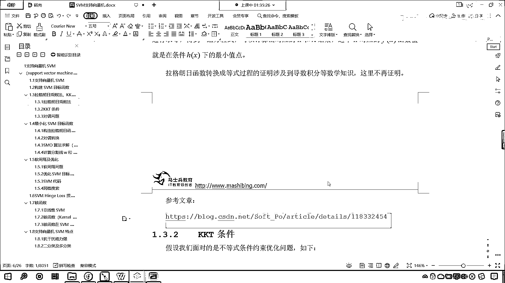

# 7天爆肝整理！AI量化交易-机器学习全套教程，从入门到项目实战保姆级教程！（数据挖掘分析／大数据／可视化／投资／金融／股票／算法） - P117：4-拉格朗日乘子法介绍 - Python校长 - BV1KL411z7WA

好，那麼接下來呢，咱們繼續往下看啊，好，那麼，這個你看，現在呢，我們已經有了這個不等式約束的求二次形的這個優化問題，那這個問題呢，你看，那這個問題呢，咱們得需要對它進行一個轉化，就是說你有約束條件的。

咱們在進行操作的時候，這個約束條件往往它是礙手礙腳的，沒有辦法直接進行操作，那這個該怎麼辦呢？，好，那咱們接下來呢，這個就講一些乾貨，講一些數學上的應用，這一部分呢，大家要仔細聽啊，有可能會這個。

有可能會枯燥一些，有可能對你來說稍微難一些，我盡量把這部分講的通俗易懂，好，那麼我們就看一下，在咱們這部分呢，我們一共有三部分知識點，一個是拉格朗日乘數法，另一個是KKT條件，還有就是隊伍問題。

那我們先看一下拉格朗日乘字法，咱們這個地方是吧，它是拉格朗日乘字法，和咱們拉格朗日中值定理是吧，這個還有一點不一樣啊，拉格朗日乘字法主要是將有等式約束條件的優化問題轉化為無約束優化問題。

現在你就能夠看到，咱們拉格朗日乘字法它是轉化什麼呀？，是不是有等式約束的條件優化呀？，對不對，看啊，有等式約束的條件優化，我們支持限量機，你看一下，它是什麼樣類型的約束問題，咱們支持限量機。

你就能夠發現，咱們的約束條件，它是不是大於等於1呀，誒，我們有同學總結了一下，這個是不等式約束，對不對呀，那不等式約束呢，它比等式約束更複雜，那對於更複雜的這個問題呢，咱們得先從等式約束說起。

所以說我們先講拉格朗日乘字法，那麼既然它是等式約束，那麼我們的等式約束，咱們的形式，我們就可以寫成這種形式，你現在能夠看到，我們想要求f(x)的最小值，那麼我們的約束條件呢，就是h(x)=0。

我們把這個就叫做等式約束，那你看到這個，沒有問題吧，看到了嗎，看到這個，沒有問題吧，沒有問題，你就扣一個1，也就是說對於拉格朗日乘數法，咱們的這個等式約束，我們相應概念的一些定義，到這裡。

如果你沒有問題，那你就扣個1啊，那就扣個1，有問題的話，我們扣個2啊，好，那麼拉格朗日呢，他這個人非常聰明，是吧，他說你既然帶約束的，不好算嘛，是吧，帶約束的不好算，怎麼辦呢，我們可以引入一個自變量λ。

λ是可以取任一值，上面嚴格等價於下是，現在你就能夠看到，看到了吧，我們增加了一個λ，上面這個問題求解，咱們就變成了下面這個問題求解，那就是f(x)+λ*h(x)，你求解上面的，就等價於求解下面的，你看。

神奇不神奇，那到了下面，你就發現，這個方程它還有，你看下面這個方程它還有約束條件嗎，上面這個它呢是有約束的啊，上面這個是有約束的，下面這個是無約束的，無約束的求解比有約束的求解，那這個就方便多了。

知道嗎，那麼我們Lxλ這個就叫做拉格朗日函數，λ呢就叫做拉格朗日乘子，這什麼是乘子呢，其實就是系數，咱們令Lxλ對x求導，讓這個導數為0，咱們對λ的導數求導，令它為0，求解出的xλ的值。

那麼x就是咱們f(x)再附加條件h(x)下的極致點，你看，方程就進行了一個轉化，有約束的就變成了無約束，是不是就方便多了呀，這就是天才之舉，知道嗎，原來你是有約束的，有約束你的求解往往就不好求。

你知道吧，有這個約束你得時時考慮這個約束，你求導令導數為0吧，還不太方便，因為我們知道咱們其實求極值，咱們往往是不是就是令導數為0，求一下它的這個值呀，但是這個時候呢，你是有約束的。

你得時時考慮約束對它的影響，也就是說你求出來這個極值，不一定是你想要的答案，因為它存在約束，那拉格朗日這個數學家呢，他就把上面這個函數，他就嚴格等價於下市，那我們有同學可能會想，老師為什麼呀，對不對。

我們往下看啊，以上就是拉格朗日乘數法，那通俗理解拉格朗日乘數法呢，咱們就是將含有等式條件約束，這個優化問題，咱們把它轉換成無約束的這個優化問題，咱們構造出拉格朗日函數，這個拉格朗日函數它多了一個系數。

沒關係，在我們解方程的時候，多一個系數少一個系數，這個都不是問題，問題是啥呀，你像上面這個約束，它就是一個大麻煩，它呢就是一個大問題，因為你有約束是吧，它就是限制著你，實時它就沒有辦法讓你。

自由自在的通過數學當中的公式去求導數，令導數為零，是吧，來求解，而構造出來這個拉格朗日函數，和上面完全等價，所以說咱們就可以，這個很方便，很自由的求導令導數為零，那咱們，讓咱們構造出來的拉格朗日函數。

以未知數X和λ進行求導，咱們就可以得到一組方程，有了這組方程，我們就可以計算出對應的X和λ，那麼這個X呢，就是咱們對應的FX函數的這個最小值點，拉格朗日函數轉換成等式，這個過程的證明呢。

它涉及到導數的微積分等數學知識，那這裡呢，不再進行詳細的證明，但是呢，我為你寫了一篇文章，咱們將這篇文章的鏈接地址，給各位發過去，這個是我寫的一篇文章。

咱們呢。

先將剛才所講的知識點。