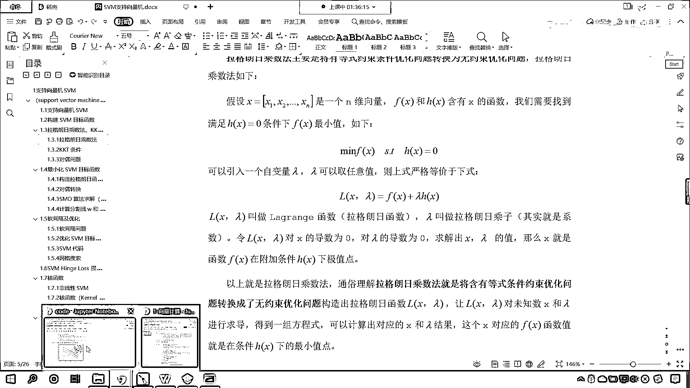
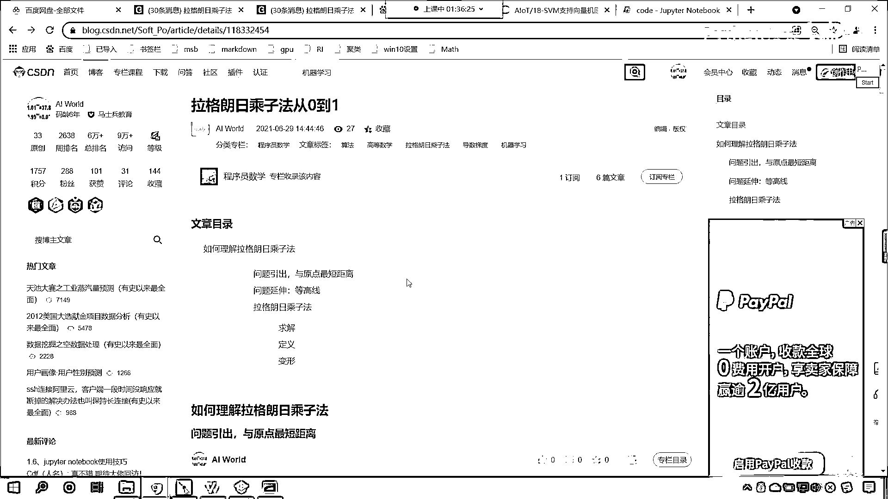
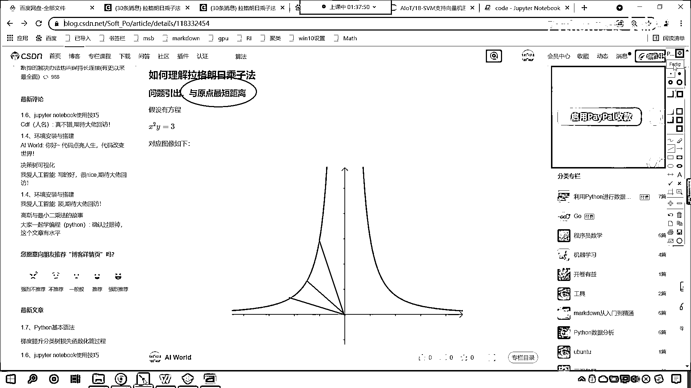
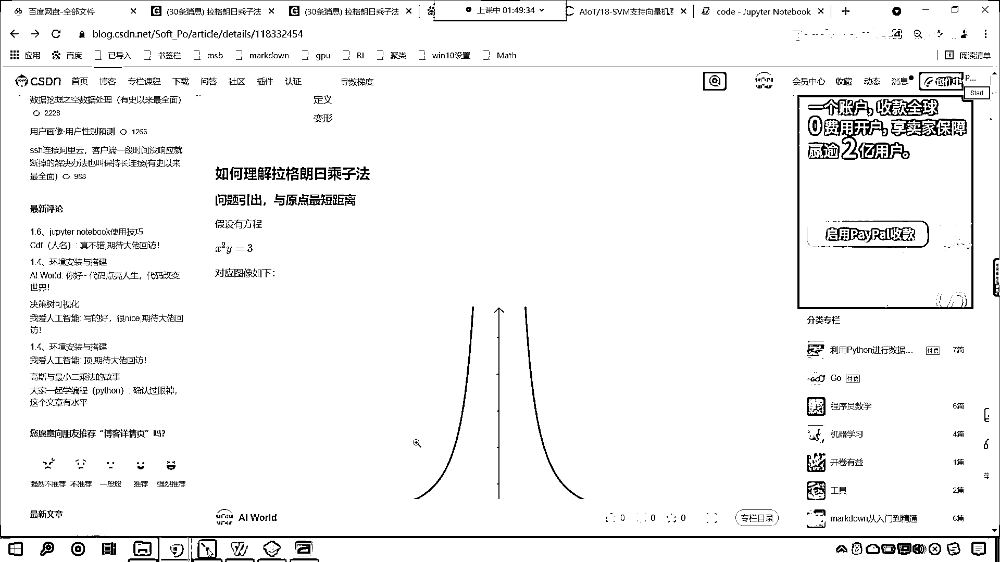
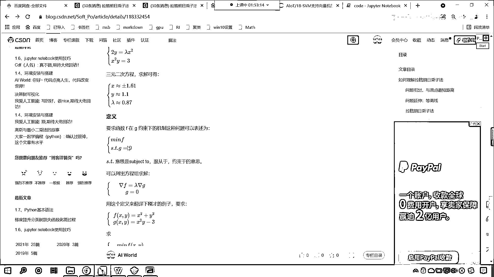
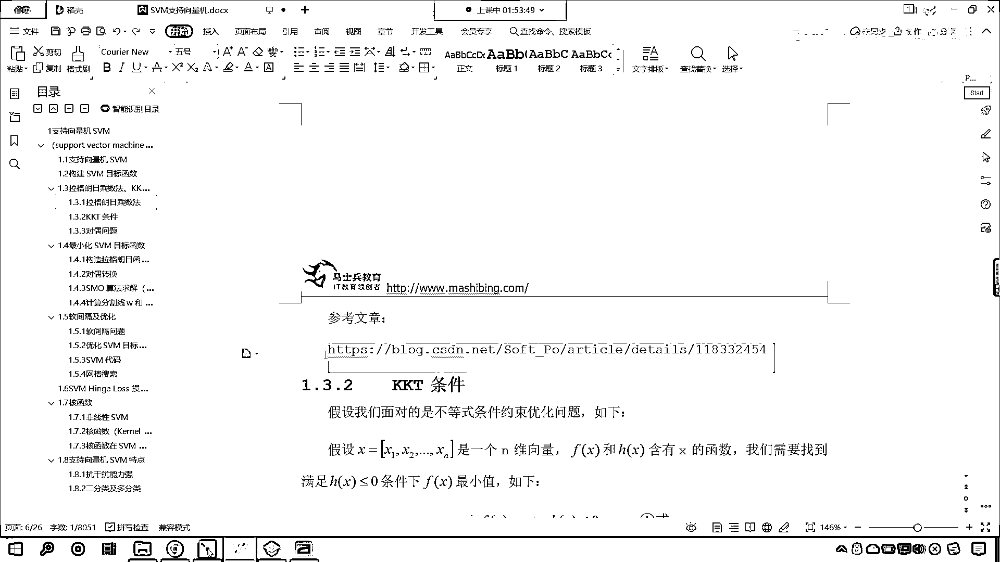
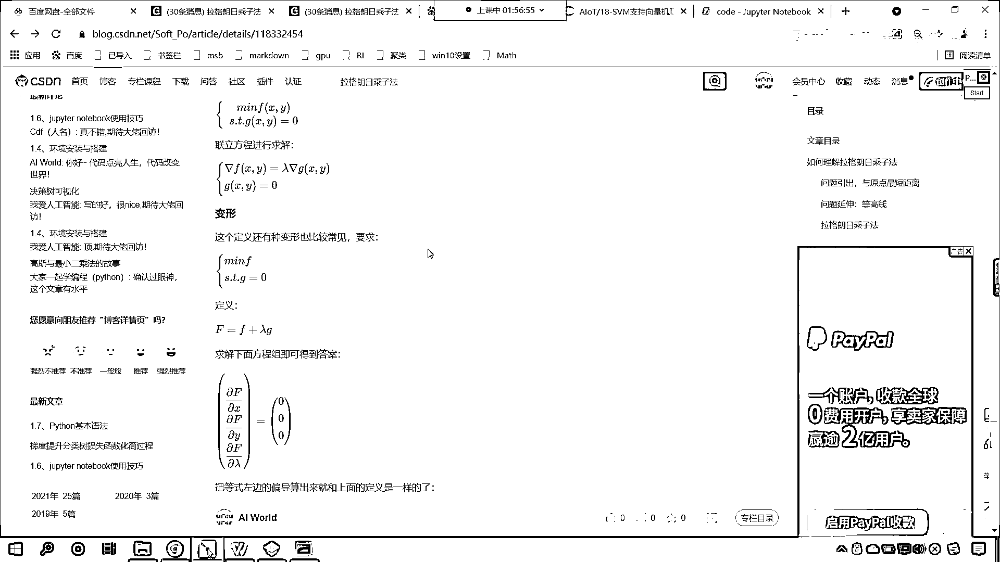
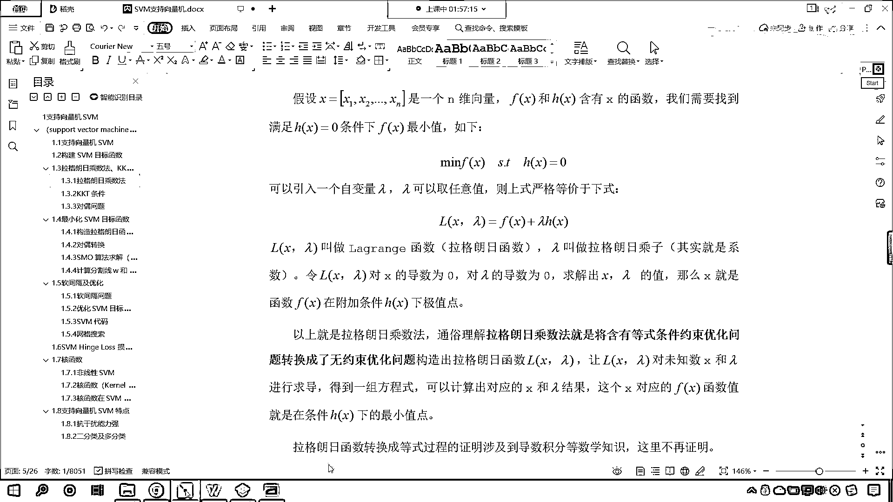
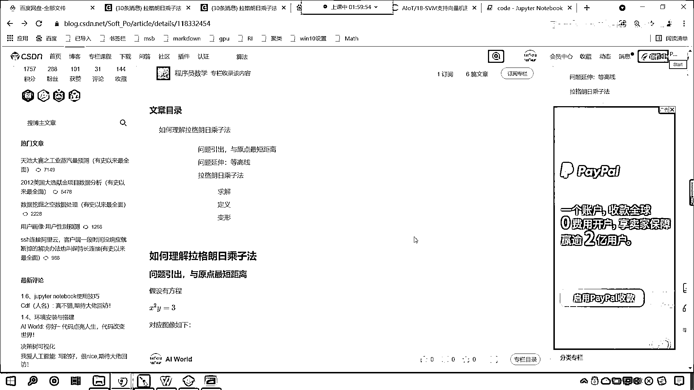
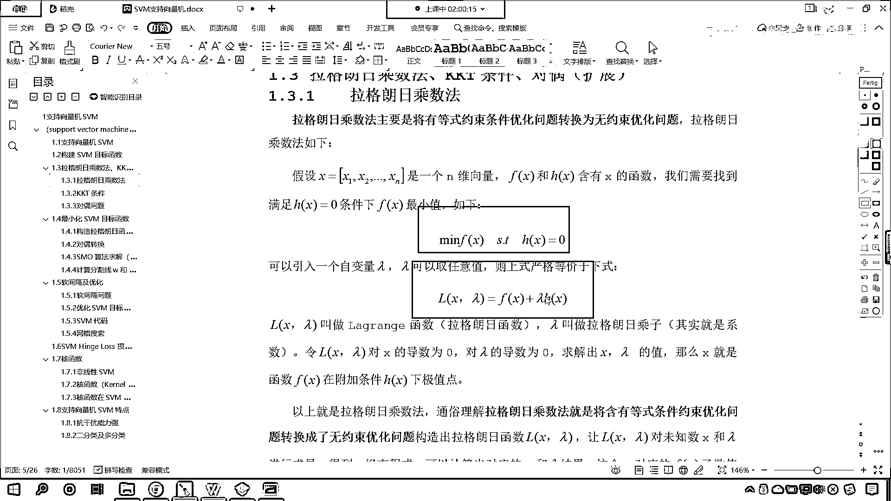

# 7天爆肝整理！AI量化交易-机器学习全套教程，从入门到项目实战保姆级教程！（数据挖掘分析／大数据／可视化／投资／金融／股票／算法） - P118：5-拉格朗日乘子法原理推导 - Python校长 - BV1KL411z7WA

好 那么接下来呢 我们一起来看一下，这个拉格朗日乘字法是吧，这个到底怎么，是吧 它由这个不等式约数，是吧 你看 拉格朗日怎么由咱们的等式约数，变成了无约数的一个求最小值的问题，好 你想知道吗 是吧。

那你想知道为什么上市，它可以写成下市这种形式吗，来 现在的话咱们就回到我们这个里边。

我们一起来看一下咱们拉格朗日乘字法，从0到1，好 那么在这里呢。

就我们如何理解拉格朗日乘字法呢，如何理解 那我们呢，这个把问题咱们引出一下，那我们有一个方程，看 x^2 y=3，这个方程对应的图像呢 大概是这样的，这个方程对应的图像大概是这样的。

好 那么你就能够看到，因为咱们是x^2+y=3，所以说你随着x和y是吧，你无论越正也好 还是越负也好，咱们的y是不是都是越小呀，你越接近于0，这条线是不是就是变得特别特别大了，对不对。

好 那么我们的问题引出呢，咱们要看一下就是这个函数上，它与原点的最短距离，看啊 就是我们蓝色的这条线，它是不是有与原点最短的距离，你看 就是蓝色的这条线是吧，这个函数它哪个距离咱们的原点距离最近呢。

看到了吗 是这条线吗，还是上面这条线，还是咱们这条线呢，你想一定有一条线是不是离原点距离最近呀，对不对。

好 那么我们该如何求这个问题呢。

你看啊 那我们现在呢，想要求其上的点与原点的距离，你看 咱们在这呢给了个动图，你看到了吧，它从最远到最近是不是，会有一个变化是不是，那这里呢 咱们就介绍一种思路啊，你看 想要求原点的距离。

那我们是不是可以这个绘制一个圆呀，咱们假设说与原点距离为α，它是不是就全部落在半径为α的圆上了，看到了吧 你这是原点是不是，那你看 那么我们逐渐扩大半径，这个时候你就能够发现，这个时候你就能够发现。

那什么时候咱们所画出来的这个圆，我们和咱们这条蓝色的线，它的距离最近呢，是不是咱们正好相期的时候呀，看到了吧 显然第一次与x的平方，y等于3相期的点，你想一下，它是不是就是距离最近的点呀。

好 那我们到这之后呢，我们稍微暂停一下，你能够理解咱们得到的第一个结论吗，就是第一次与x的平方y等于3相交的点，咱们所画出来这个圆啊，它的半径就是咱们最近的这个距离。

能够理解咱们相切这个点是最近距离的小伙伴，来 我们在讨论区里边，咱们扣一波666，我们在讨论区里边，好 看来大家的这个数学是吧，确实很棒啊，你的这个直观感觉是吧，告诉你没问题啊，好 那么你看此时呢。

咱们继续再往下看啊，咱们的圆和曲线，它是不是就相切了呀，看了吧，我们专门是不是画了一个切线呀，看了圆和咱们的这个曲线，它就是一个相切关系，看 至此我们就分析出这样的一个结论，在咱们的极致点。

咱们的圆是不是与曲线相切呀，对吧，看 在极致点，这个圆和咱们的曲线相切，那接下来呢，我们再进行一个问题的延伸，是吧，那我们就引入一个等高线，你想 咱们刚才在画圆的时候，咱们是不是一圈一圈在画呀，对不对。

你看我们是一圈一圈在画，对不对，好 那么这个时候呢，咱们就引入等高线，那这些等高线，你就能够发现它是不是同心远呀，看了一个圈一个圈一个圈是吧，只要是圈上的，只要是同一个圈上的。

那么我们可以认为它呢是等高线，看 咱们现在给一个方程，你看上图可以看成x的平方加y平，加上y的平方它的等高线，x的平方和y的平方，如果我想要把图形画出来，那么其实咱们就是在三维空间当中画出来。

其实就是绿色的这个，看到了吧，就是绿色这个，那我们画圈圈，你看越往上是吧，这个圈圈是不是就越大呀，对不对，越往上这个圈就越大，是吧，那么它的等高线是不是值就越大呀，那么根据梯度的性质。

看啊根据咱们梯度的性质，上面这个方程就是x的平方加y平方，是吧，你看他的这个一系列的等高线，他的一系列的等高线是不是就相当于这个呀，对不对，你看他的等高线就相当于这个啊，好，那么，接下来呢，咱往下看啊。

那么根据梯度的性质，看根据咱们梯度的性质，上面我们对于x，我们对于这个函数进行求梯度是吧，我们求偏倒，那这个是不是就2x2y啊，看到了吧，他就是2x2y，因为你是x的平方呀，因为你是y的平方呀。

如果我要对于这个方程对于x求偏倒得到结果是2x，对于y求偏倒是不是就是y呀，看那大家看啊，那这个是偏倒，那我们这个偏倒呢，他就是等高线的法线，看啊，我们的这个梯度，他就是等高线的法线，咱把他画出来。

你就能够看到他是向外发散的，有没有发现，咱们的这些向外发散的箭头，他和咱们的等高线是不是一个垂直关系啊，你看他和咱们的线是什么关系，看我们的，咱们的导数和咱们的等高线，你看他们是不是一个垂直关系。

对不对，因为导数呢，是他最快的一个方向啊，他是一个垂直关系，好，那么这个是咱们，法项，这个是咱们等高线，他的一个这个求导之后，咱们得到的一个结果，对不对，那，咱们另一个函数，看另一个函数，x的平方。

y他的等高线是什么样的呀，看了吗，他的等高线是这样的，一个一个画，是不是一个一个画，那么，我们要求的那个函数，是不是x的平方，y等于三，是不是就是其中值为三的这个等高线，看到了吗，就是这个蓝色的。

是不是你其他的，只要你把三的值给他改大或改小，我们画出来的是不是就是这个不同的这个线条呀，因此，咱们这个函数，他是不是也有等高线，我们看一下他的等高线啊，咱们是不是可以对他进行进行梯度求解呀，一样的啊。

看2xyx的平方，是不是，你看我们如果要对他求导数的话，是吧，那大家看他就是2xyx的平方，那么，这些等高线，咱们这个梯度和这些等高线，它是什么关系呀，同样也是垂直关系对不对，因为你求导之后。

他和这个函数自身他的关系呢，就是一个垂直关系，那么，梯度向量呢，就是咱们等高线的法线更准确的描述就是咱们的梯度与等高线的切线是垂直的，因为你等高线的切线呢，上面我们是给了一个切线，看到了吗。

这个绿色的就是他的切线，等高线和切线是一个垂直关系，那么这个里边呢，咱们很多都涉及到了咱们数学当中的知识啊，看到这么优美的图是吧，你有感触就行啊，那么得到了这个结论之后，咱们紧接着呢。

我们就看一下这个拉格朗日乘字法是吧，他到底是咋回事，那么我们现在呢就对他进行一个求解啊，那根据咱们刚才所观察的规律，咱们说这个距原点最近的点，他是不是和咱们粉色的这个圆是不是进行了相切呀。

那咱们就来看一下，等高线是曲线怎么垂直，你往上看，你看啊，等高线是曲线，咱们的这个咱们的这个法，看咱们的这个法相，咱们梯度向量是等高线的这个法线，是谁垂直呀，和咱们等高线的切线垂直。

让他和等高线的切线垂直，那什么是切线呢，你看我给你画一个啊，你比如说咱们这个地方啊，看咱们这个地方，看比如说这个底，看到了这个底，他的切线是不是红色的呀，那我们所说的垂直呢，是看啊，是这个发现。

和咱们这个切线，他俩是垂直的啊，哎，所以说呢，好，那么接下来呢，我们继续往下看啊，那么咱们刚才咱们刚才呢是介绍了这个发现是吧，那接下来呢，我们继续再回来，咱们知道，如果说我们想要求这条曲线，蓝色的曲线。

他距离原心的最近距离，咱们是不是就是从原心开始画圆一点一点画等高线，他们俩第一次相切的时候，是不是就是咱们最近的距离呀，你看一下最近的距离有一个特点，你看一下最近的距离有一个特点。

你有没有发现这个最近的距离，你看我们现在呢，分别求的是，我们这个浅蓝色的这条箭头，他是咱们函数X平方Y的发现，我们浅咱们这个浅红色的这个箭头，他是谁的发现呀，他是不是咱们圆的发现，当他俩距离最近的时候。

当他俩第一次相切的时候，你有没有发现咱们圆的梯度向量和曲线的梯度向量，他们俩这个时候是不是就变成平行了，看了吧，一点一点靠近是不是靠近靠近靠近看平行了吧，重合了吧，是不是哎，我们就根据这个特点。

咱们就可以进行相应的求解，也就是梯度向量平衡梯度向量平行，那么我们用数学公式如何去表达呢，这个时候呢，就是德塔F就等于狼不打德塔G，你看这个德塔F是不是咱们这个方程，这个德塔G是不是就是咱们的等高线。

看到了吧，这个德塔G就是咱们的等高线啊，我们往上划啊，你看啊，咱们这个FX呢，看这个FX就是咱们的等高线，是不是啊。

咱们这个G呢。

看看咱们这个G是什么啊，我们把G呢就定义成了咱们这个函数啊。

就是G就定义成咱们这个函数，所以说呢，这两个函数啊，我们另一个函数就是GXY就等于X平方加Y它的这个等高线，所以当他们当他们俩是最小值的时候，那么他们重合，重合的话也就是平行平行的话。

也就是这个DN这个德塔F就等于狼不打德塔G，大家注意啊，这个地方是不是表示导数呀，看到了吧，这个德塔F是不是表示导数呀，这个狼不打呢，表示乘以合适的系数，是咱们方程左右相同，你这个狼不打可正可负是吧。

这个都可以啊，那我们还必须引入条件，X的平方，Y等于三这个条件，否则你看有这么多的等高线，咱们是不是不知道指的是哪一条呀，对不对，你看啊，这个时候呢，来咱们现在呢把这个F，你看这个FX是吧。

它是不是代表着咱们的等高线，是不是就代表着X的平方，是不是加上Y的平方呀，对吧，那么我们的G呢，看咱们的方程G呢，就等于啥，是不是就等于X的平方，然后乘以Y，对不对，哎，这个确实绕了一个好大的圈子啊。

不然的话，你可能永远也不知道这个拉格朗日乘字法，它到底是怎么来的，然后呢，我们有一个约束条件，看到了吧，这个约束条件是什么呀，是咱们的X的平方，Y是吧，它等于三，这个约束条件，因为你想我这个方程是吧。

这个等这个等高线是吧，它有很多呀，是吧，它可以有取很多值呀，到底哪一条呀，是不是就是咱们X的平方，Y对它进行了一个约束，有了这个约束，咱们是不是就回到了咱们刚才最初始的那个问题呀，对不对，好，那么。

到此呢，咱们就继续往下看啊，好，那么我们就连立方程，看到了吧，因此连立方程，delta f等于lambda，这个delta g，X的平方加Y等于三，咱们对它进行展开，这展开之后呢，看到了吧。

2X2Y等于lambda2XYX的平方，那我们对它进行化解，化解之后咱们就得到了这个三元二次方程，看到了吧，化解之后咱们就可以得到三元二次方程，这个三元二次方程，你也可以解出来。

我把解出来的答案都已经告诉你了，X就等于约等于正负1。6，Y约等于1。2，lambda约等于0。87，你看是不是就解出来了呀，对不对，好，那么，咱们接下来再来看啊。

看那我们就对咱们拉格朗日乘字法进行一个定义吧，看要求函数F在这一约数下的机制，这种问题是不是就可以描述为，min F，S T g等于0呀，看到了吗，这个时候到这里。

像不像咱们的拉格朗日乘字法呀。

看到了吗，你看来我们回到咱们拉格朗日乘字法啊，看回到拉格朗日乘字法，看到了吧，min F X，S。T，HX等于0，是不是，看是不是拉格朗日乘字法，只不过拉格朗日乘字法，他告诉你说，其他的你不用管。

你把它带带进去就就能求解，对吧，但是我们现在给大家这个博客呢，就是告诉你为什么可以带进去。

看为啥可以带进去啊，看这个S。T呢，就表示subject to就是服从于约数余的意思，那咱们就可以列出方程组，是不是咱们就是这个delta F等于lambda，这个G然后这个G呢，是不是等于0。

这个G就是咱们的约数条件啊，这个G呢就是看这个G就等于啥，看这个G呢，看这个G呢就等于看咱们的方程，X的平方，Y是吧，加3，是吧，他等于0，对吧，看他就等于这个啊，这个就是等于这个就是咱们这个方程，好。

那么，用这个定义翻译一下刚才的例子，是吧，看咱们刚才的例子就是FX就等于X平方加Y，GX就等于X平方Y减3，求mean Fxy，这个S。T。GXY等于0，看了吧，我们是不是就把刚才的这个问题。

是不是把它转换成了咱们这个问题，看是不是把它转换成这个问题，这个是不是就是等式约数的求极值问题，这个呢就是咱们等式约数求极值，对不对，我们刚才求解出来了吧，等制等式约数是不是咱们求了极值呀。

我们刚才已经求解出来了，对不对呀，我们是怎么做的呀，咱们是不是连理方程求他的是不是求了个这个，对不对，好，那么大家看啊，咱们紧接着呢，我们就进行一个变形啊，你看啊，我们讲原理这部分快结束了，看啊。

咱们紧接着来一个变形，咱们怎么变形呢，我们定义新的方程，F大大F就等于F加上朗姆达G，看到了吧，F加上朗姆达G，那么我们求解下面方程组，即可得到答案，求解下面方程组即可得到答案，好，那么这个时候呢。

看啊，就是偏F乘以这个偏X，偏F乘以偏Y，偏F乘以偏朗姆达，那你就能够看到，咱们所构成的这个F这个函数，它是不是就增加了一个变量，朗姆达呀，LMBDA是不是，对不对，好。

那么我们就顺着这个增加的公式向下看，你看啊。

F等于F加上朗姆达G，是不是就相当于，咱们在课节当中所说到的这个呀，看相不相当于它，对不对，那课节当中告诉你了，说你构造这个方程直接求解即可。

是吧。

那我们在这呢还告诉你为什么啊，看那咱们就操作一下呗，看我们拼接了这个咱们构造的这个方程是吧，令导数为零，看这个导数我都给你求解出来了，是吧，你看，构造出来这个新的方程，看啊，咱们根据拉格朗日乘字法。

这个是根据拉格朗日乘字法构造出来的方程，看在这咱们说明一下啊，这个呢就是拉格朗日乘字法，咱们构造方程，构造了方程之后呢，我们求导数令导数为零，啊那就是求导，令导数为零，我们就求解这个方程。

现在你就能够看到求解出来的方程，看到了吧，求解出来这个方程和上面，一模一样，只不过这个朗姆达咱们求解出来的是负零点八七，那这个朗姆达是引入的系数，你求解出来是正的也好，是负的也好，不影响。

因为我们真实求解的，我们其实就是要求X和Y对不对，我们是在朗姆达的帮助下求解出来了X和Y，巧妙吧，所以说，你看，这个是不是就成立啊，对不对，你看到这你就能够明白，这个拉格朗日乘字法是吧，为什么要这样写。

他为什么这样写是成立的是可以的，妙不妙是吧，这就非常巧妙啊，看最后我还告诉你了，咱们上面求解的结果略有差异是吧，朗姆达是引入的，他的正负是无关紧要的，你只需要调整GX，就可以了，因为我们上面的GX。

你能够发现是X的平方Y减三，你只需要把，这个X的平方减三调整成三减X的平方，把它调整成这个，那么你求解出来的朗姆达，他就是正的0。87，所以，咱们这个，博客是吧，你好好的去，观看一下啊，天才吧是吧。

拉格朗日他确实是一个天才，是吧那我们呢就站在天才，站在巨人的肩膀上，去直接使用就行了。

现在呢，你终于明白，这个拉格朗日乘字法，他到底是怎么一回事了，是吧，如果是等式约束，那么我们直接写成这样。

咱们就可以求解出来。

我们想要的答案，按個鈴鐺。