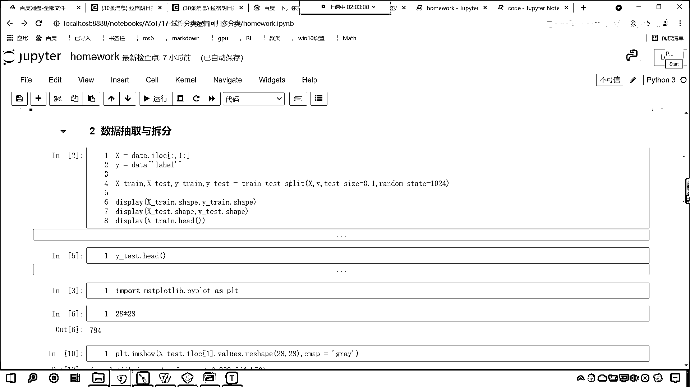
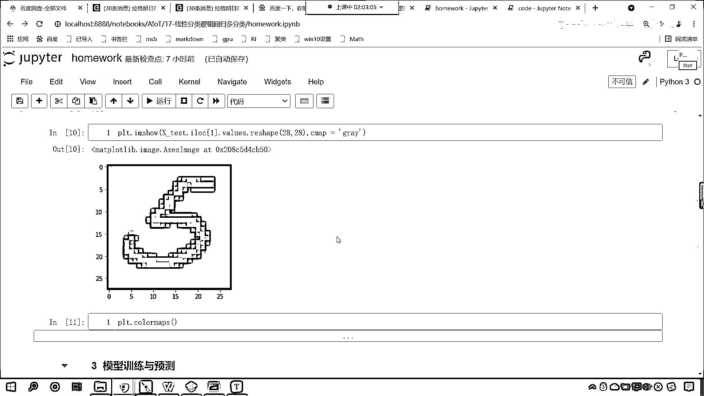
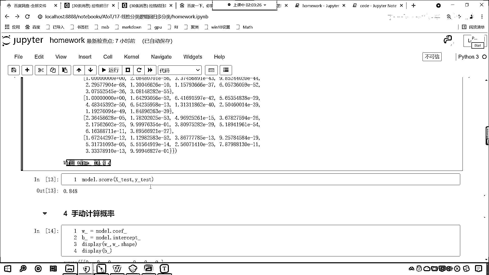
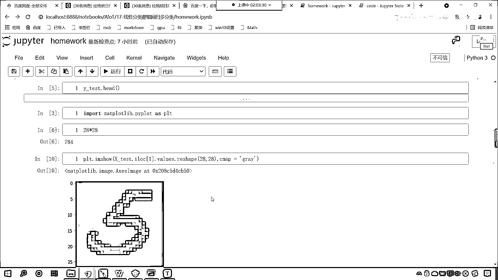
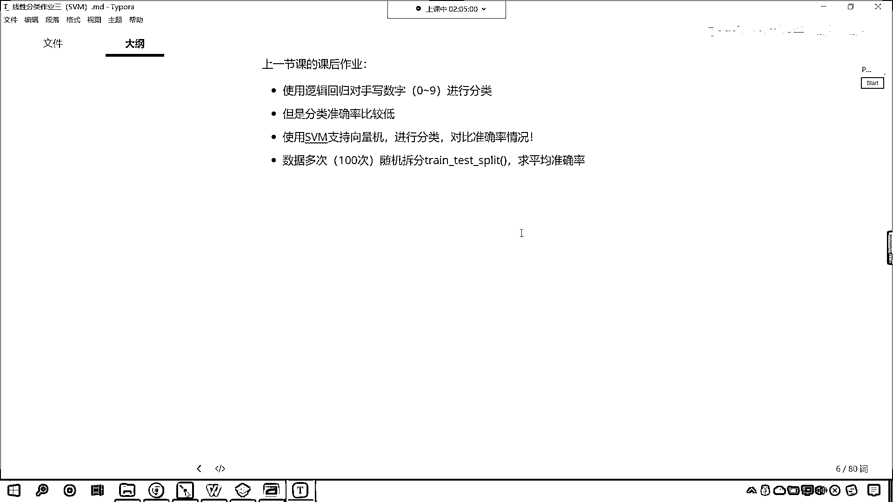

# 7天爆肝整理！AI量化交易-机器学习全套教程，从入门到项目实战保姆级教程！（数据挖掘分析／大数据／可视化／投资／金融／股票／算法） - P119：6-支持向量机SVM作业介绍 - Python校长 - BV1KL411z7WA

好，咱們現在呢，對於我們今天的作業，咱們進行一個介紹，那我們使用邏輯回歸，咱們對手寫數字進行了分類，這個是咱們上一節課所留的作業，使用邏輯回歸，對於手寫數字進行分類，那麼它花費的時間呢是比較長的啊。

現在我給你看一下啊，上一節課是17，這個homework，那因為這個視頻當中都有詳細的介紹啊，大家看咱們視頻就行了啊，樣本量比較多，4萬2000個，特征也比較多，所以我在這進行了抽樣。

咱們抽取其中的5000個，然後拆分，是吧，這個測試數據的比例是0。1。

那這個代碼當中都有演示啊。

好，你能夠看到啊，咱們對於這個4500個數據進行訓練的時候，我們花費的時間呢，這個大概是14。5秒，你的電腦性能不一樣。

這個時間長短可能會略有差異。

大家注意啊，這是我給了多長時間呢。

這是我給了多少數據啊，這個4萬2000個當中取了5000個，如果你4萬2000個數據全部交給他進行訓練，那麼這個花的時間會更長，可能得十幾分鐘，所以說我才取其中的5000個樣本作為咱們的這個訓練。

那這個準確率怎麼樣呀，這個準確率是吧，邏輯4D回歸的準確率只有0。848，他只有0。848，那不太高，咱們今天呢，我們不是學了這個支持線量機嗎，對不對，大家呢，使用支持線量機，咱們進行分類。

咱們對比一下準確率的情況，那麼我們不僅僅是對比一次，咱們怎麼樣對比100次，咱們數據多次隨機拆分，數據多次隨機拆分，是吧，咱們求平均準確率，這個時候呢，我們就可以比較一下。

咱們的這個支持線量機和咱們的這個邏輯4D回歸，對於我們手寫數字，咱們這個樣本數據，看一下支持線量機和咱們手寫數字，哪個更加優秀啊。

這個是咱們作業的一個介紹。

