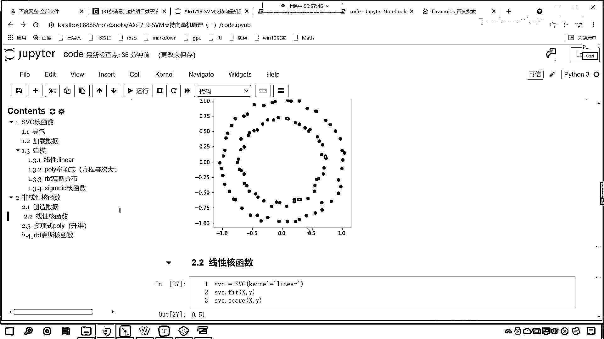

# 7天爆肝整理！AI量化交易-机器学习全套教程，从入门到项目实战保姆级教程！（数据挖掘分析／大数据／可视化／投资／金融／股票／算法） - P122：3-非线性核函数介绍 - Python校长 - BV1KL411z7WA

咱們先回到咱們的代碼當中，我們呢一起來看一下咱們和函數它所對應的方程是怎樣的，那我們的這個課程呢咱們如果要從上往下講，我們首先講到的都是一系列的算法 這個比較枯燥。

所以咱們現在呢把課程當中的內容咱們進行一個拆解，我們先看和函數 因為這個是比較簡單的，好 我們剛才呢討論區裡邊呢有一個小夥伴問了一個問題，那怎麼確定用哪種參數呢。

我們在訓練模型的時候 你看咱們是不是都有這個模型評估呀，你看這個accuracy score它是不是就是模型評估，你看這個是不是就是模型評估呀，咱們根據模型評估的結果咱們來確定使用哪種參數。

那分數越高那我們是不是就選擇用哪種參數呀，對於我們這個案例而言 咱們就能夠發現我們的線性和函數，它的得分是不是很高呀 看到了吧 是0。97，那麼對於我們葡萄酒分類這個案例而言。

咱們知識線量機所選的和函數是不是就是linear呀，對不對 各種和函數都有存在的必要，所以說呢咱們就需要花時間去調整參數 是吧，這個時候才能夠得到一個比較好的一個結果啊。

來 現在呢我們對於這個和函數呢 咱們進行一個介紹啊，那麼咱們所提供的多項式和函數，咱們所提供的這個高斯分布的和函數，它其實呢都叫做非線性的和函數，那線性的和函數比較容易理解。

線性的和函數是不是就是咱們的線性方程呀，對不對 對不對 轉換成了線性方程之後，然後進行概率的轉換，最後的話我們進行了類別的一個劃分，那麼大家看這個圖 你看看這個圖。

我們有兩類底 一個是紅色的 一個是藍色的，請問我們能用一條直線把這兩類底給它分開嗎，很顯然是不行的 對不對 看到了吧，很顯然是不行的 你想一想是不是。

很顯然不行的 所以這個時候咱們就得需要用什麼樣的和函數呀，那你比如說我現在呢 咱們在代碼當中，咱們做一個操作 做一個演示啊，來 回到代碼當中，好 那麼我們首先咱們在上面插入一行。

咱們來一個二級標題 這個呢就是SVC和函數，現在大家就能夠看到 是吧 咱們這個層次結構就出來了，好 那麼接下來呢 咱們再插入一行，我們再來一個二級標題，好 那麼接下來呢 咱們就介紹一下。

這叫做非線性和函數，那此時呢 我為你創造一些數據啊，此時咱們創造一些數據，那我們能夠看到 是吧 咱們這個數據是這樣的 是不是，那咱們就創造一下啊 看一下這個數據，來 現在呢 咱們就回到代碼當中。

咱們創建一個和它類似的 叫做DataSets，咱們Make M-A-K-E 裡邊有一個方法叫做MakeCircle，Circle是不是就有圓圈的意思呀 對不對。

那麼它會生成多少個數據呀 它會生成100個，那對應的參數呢 咱們給它聲明一下，nSample它是100個 裡邊還有一個參數叫Factor，這個Factor呢 就是我們圓圈的大和小，咱們給它調整成0。7。

那麼得到這個數據之後 我們會得到X 會得到Y，現在呢 咱們將這個畫圖畫出來，大家就知道它是什麼樣的了，先要畫圖 咱們將MattePlotLib導進來，PiePlot as Prot 執行一下這個代碼。

那麼對於咱們所生成的XY它長什麼樣，咱們Display 查看一下它的形狀，然後Y。Shape 這個時候你就能夠發現，你看咱們的數據是不是100和2 然後給了個100呀。

那Y長什麼樣呢 你看一執行 它是1010，這個時候是不是意味著咱們的Y是兩個類別呀，那麼我們把它畫出來，那就是Prot 咱們調用Scanner來一個小括號，Scanner我們給一個橫坐標。

橫坐標呢 咱們選擇它的第一例，再來一個縱坐標 縱坐標的話 冒號 咱們選擇它的第二例，然後呢 我們給一個顏色 C呢 就對應咱們的Y，對應咱們的類別 這個時候你看我一執行。

現在你就能夠發現 你看這個數據是不是就有了呀，大家看這個數據是不是就有了，那麼這個顏色呢 咱們也可以給它調一下，我們調成一個藍色 調成一個紅色，現在你能夠發現 你看這個畫的是不是不是圈圈呀。

對吧 沒關係 咱們可以調整尺寸的大小 把它變圓，Prot。figure 這個時候呢 咱們給一個figure size，我們讓它是5和5 這個時候你看 是不是就變成一個圓了呀，好 那麼變成了一個圓之後呢。

咱們這個數據呢 我們可以給它稍微加點噪聲，大家看 咱們加點噪聲，那X我們讓它加等 np。 咱們調用random，咱們調用randn 這個呢 就是一個正態分布。

咱們也來一個100 來一個2 這個時候你看我一執行，大家看咱們加的這個噪聲是不是有點大，那我們讓它乘以多少呀 咱們讓它乘以0。1，這個時候你看 再來執行 這個還是有點大 是不是，我們再來一個0。

01 這個時候你來看 是吧，0。01這個又有點微小了 是吧 再執行啊，咱們給它加一個0。03 這個時候你來看，好 現在你就能夠看到 我們創造了這樣的數據，那麼咱們對於這個數據 我們進行一個劃分好不好。

咱們對於這個數據 咱們進行一個劃分，咱們剛才說呢 我們想要給它調整顏色 對吧，咱們調整顏色呢 我們可以給一個Cmap 是吧，我們把它調整成什麼顏色呀 調整成一個紅色 調整成一個藍色。

那這個時候咱們就得需要導包，咱們就from matplotlib。 它裏邊有一個color，咱們從colors當中 咱們導import一個對象，叫listColorMap 把這個導包導進來 導的是這個。

那麼我們就給它創建一個colorMap 就叫做Cmap，Cmap就等於listColorMap，那這個裏邊呢 咱們就給它填充顏色就可以了，那我們就給一個colors 咱們讓這個colors等於多少呢。

我們給它一個red 然後呢 咱們給一個blue，有了這個顏色 咱們將Cmap進行複製，Cmap就等於Cmap 這個時候你看我一執行，這個顏色是不是就有了呀 如果你想要讓裏面是紅色的。

那麼我們將red和blue咱們調一下順序，這個時候就可以了啊 大家看啊 這個blue，然後逗號咱們來一個 第二個呢 咱們給一個red，這個時候你看我一執行 現在這個顏色是不是就有了呀。

好 那麼有了這個之後呢 咱們就使用咱們的和函數，我們進行一個操作啊，在這裏的話 咱們來一個三級標題，上面呢 是咱們創造數據 對不對呀，這個就是創造數據，那我們這個呢 咱們就使用線性和函數。

咱們看一下它的分類情況怎麼樣，那在我們第一個案例當中 咱們使用知識線量機，我們對於葡萄酒的分類 使用線性和函數效果很好 對不對，接下來咱們使用SVC，那麼聲明一個SVC 裏邊呢 咱們給一個kernel。

這個kernel呢 我們首先給linear，然後呢 咱們就SVC。r 咱們調用fit這個函數，將x和y放進去，然後呢SVC。score一下啊，咱們將x和y放進去 這個時候你看我一執行。

大家看 此時這個準確率只有多少啊，是不是只有0。51啊 你看為啥，因為我如果給你這樣的一個數據，讓你用一條線把它分開 你想可能嗎，能不能分開 它就不可能分開 對不對，所以這個時候你看這個線性和函數。

它是不是就黔驢技窮了 對不對，線性有的時候呢 它是低微的，它解決不了這個問題，那接下來呢 咱們使用多項式的，咱們使用多項式Poly，那這個多項式Poly 它表示什麼呢，它表示升維 啥是升維呢。

什麼是升維啊 就是維度給變多了，那我們看一下它怎麼樣啊，咱們將上面這個複製一下，Ctrl+C 在這來一個粘貼，你思考一下這個效果會好嗎，來 我們在討論區 是吧，咱們可以回復一下啊。

這個效果比咱們的線性回歸好還是不好，來 認為好的 是吧 咱們這個回復一個6啊，認為不好的 咱們回復一個0，看看你的感覺啊 怎麼樣啊，你看我一執行 大家現在就能夠看到，那Poly多項式 它是不是就變成0。

69了 是吧，那麼如果我們使用Poly多項式，既然是多項式 裡邊有一個參數叫degree，你知道這個degree表示什麼嗎，我們配眼鏡的時候 這個degree就表示度數，就表示維度 就表示咱們是幾次密。

默認情況下它是三次密，那咱們可以怎麼樣呀 咱們可以給它改成二次密，我們執行看一下 大家看，效果怎麼樣 我改成二次密之後，你就發現 是不是逆天的好呀，你知道為什麼嗎。

你知道為什麼改成二次密 它的效果非常好嗎，來 咱們看一下咱們這個數據啊，你看 這個數據 它是不是一個圓環呀，對吧 它是一個圓環，那我怎麼才能把這個數據分開呢，你想 咱們是不是這樣。

畫一個圈 它是不是就可以分開，對不對 畫一個圈是不是就可以將這個數據分開呀，那麼你知道 咱們所畫的這個圈，它所對應的方程是什麼樣的嗎，它所對應的方程 那我告訴你它所對應的方程是什麼。

它所對應的方程 是不是就是f，它是不是就等於x的平方，咱們假設說它的這個圓心是圓點，是不是就是x的平方加y方，看到了吧 它就是x的平方加y方 是不是，所以說 你看 這個是不是就是二次密。

對吧 那我在使用Poly多項式核函數的時候，我給一個2 你看 效果是不是一下子就非常好了呀，二次密變成一個面 是吧，它進行了這個相應的切開啊，將咱們這個數據給切開了，好 那麼我們來一個四次密呢。

你看四次密也比較好 是吧，咱們來一個這個五次密，五次密就不行了 咱們來一個三次密呢，你看一直行 這就是0。69 是吧，那來一個一次密呢 你看 來一個一次密，看到了吧 來一個一次密。

這個時候你能夠發現一次密怎麼樣了，一次密和咱們上面這個0。51是不是就一樣了，因為這個一次密呢，因為咱們這個一次密和咱們上面的線性核函數，它呢就是等價了啊，咱們來一個六次密啊 六次密是不是也是1。0呀。

其實這個更高的次密呢 對它這個影響呢是一樣的啊，我們執行一下啊 這個時候咱們就發現，它就變成1。0了，這個呢就是咱們的這個數據的一個情況，好 那麼我們接下來繼續往下看。

咱們複製一下 我們再來一個三級標題，好 那麼我們使用RBF 這個呢就是高斯核函數，咱們看一下它這個怎麼樣，RBF 那麼如果要是RBF 咱們這個degrade這個參數就沒用了，這個degrade這個參數。

看degrade這個參數，它呢只針對於Poly多項式，現在你看我一執行，你有沒有發現，咱們的高斯核函數準確率是不是也高呀，那通過這個案例我們就發現咱們的非線性核函數，是吧 對於我們非線性的數據。

是不是起到非常至關重要的作用呀。

好 那麼。