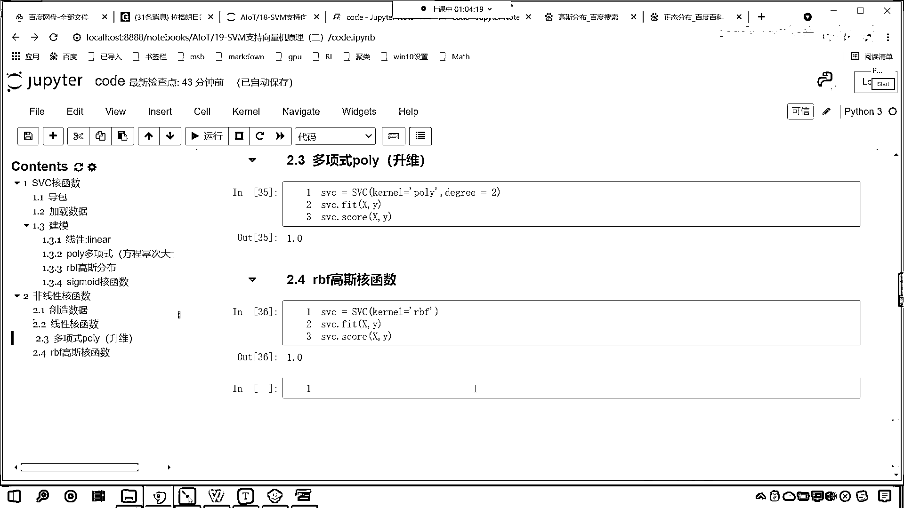

# 7天爆肝整理！AI量化交易-机器学习全套教程，从入门到项目实战保姆级教程！（数据挖掘分析／大数据／可视化／投资／金融／股票／算法） - P123：4-核函数对应数学公式 - Python校长 - BV1KL411z7WA

繼續往下看，回到課程大綱中，現在就能看到，這個地方給了一個生微，我們可以使用生微方式來解決這種線性不可分的問題，假如說目前只有兩個維度xy，那麼我們可以基於已有的維度，對它進行演變，變成更多的維度。

那這個時候就是x1x1，x1x2，x2x2，通過這種演變之後，就能看到維度變多了之後，你看這個紅色的底和藍色的底，就能發現它是不是就有一個位置的移動了，它就會有一個位置的移動了，那麼有了這個知識向量機。

多項式的數據生微，那麼我們就發現，這個數據就可以分開了，因為我們給它增加一個維度，那麼它就發生了一定的變化，給它增加一個維度，這個數據就發生了一個改變，那麼接下來呢，咱們再來看，我們的和函數呢。

更高的維度呢，比如說這個平方呀，立方呀，它都是可以的，那上面咱們介紹了多項式和函數，接下來這個線性和函數呢，咱們就一筆帶過了，你看這個線性和函數，其實就是咱們的矩陣乘法，那麼我們的多項式和函數。

看這裡邊為什麼涉及到這個矩陣乘法了呀，X(i，t)乘以X(i，j)是不是，你想一下咱們之前所講的線性回歸，咱們所講的正規方程，裡面是不是就用到了相應的一個矩陣運算呀，那看一下咱們的多項式和函數啊。

你能夠看到，這啥是多項式和函數呀，我們參數當中是不是有一個degree呀，看到了吧，參數當中有一個degree，那這個degree，那這個d表示什麼，這個d是不是就是表示咱們的幾次幂呀。

就是咱們參數當中的這個degree，它呢就表示幾次幂，好，那麼下面呢還有一個高斯和函數，你能夠看到這個高斯和函數呢，你看它進行了這樣的一個轉變，這個這個σ呢，就是咱們的這個標準差，σ就是標準差。

它上面呢是X(i)-X(j)平方，那這個高斯和函數呢，裡邊呢就涉及到咱們高斯和函數的這個概率密度分布，它就涉及到相應的概率密度分布，所以說咱們現在所看到的這幾種和函數，它所對應的數學公式。

就是咱們所看到的這樣，我們能夠看到如果說這個d=0，看啊，這個d=0它會怎麼樣呀，看啊，在這兒咱們就假設一下，這個d=0會怎麼樣，d=0之後，這個d=1，咱們說錯了啊，d=1是不是就表示它是一次密啊。

對不對，看啊，d=1是不是就表示一次密，那這個一次密你就能夠發現，它是不是就和上面咱們的這個線性和函數是不是就一樣了呀，看到了吧，如果你的d=1是不是和上面就類似就一樣了，所以說這個多項式和函數。

其實就是在咱們線性和函數的基礎上，咱們是不是給它加了個次密呀，對不對，僅此而已，而高斯和函數呢，這個變化就比較大了，這個變化它考慮了我們數據的特征分布，那你可以去查一下這個高斯和函數，是吧。

它的這個概率密度分布，我們只要一搜，咱們就能夠找到相應的這個數據，你看我搜一個高斯分布，咱們就能夠看到百度百科裡邊，它有相應的這個概率密度的這個計算，在這你就能夠看到，你看啊，我們這個概率是如何算的。

你能夠看到它的前面是不是一個場量呀，後面是不是exp看到了吧，exp然後-2^sigma x-mu^2，你看和咱們公式當中所講到的，你看一樣不一樣，這個是不是exp看到了嗎。

exp這個函數是不是就是e的多少次密呀，大家仔細觀察啊，看啊，這裡邊有一個-1啊，看到了吧，這裡邊有一個-1，2sigma^2，看到了嗎，樹幹樹幹，右上角是不是帶著一個平方呀，看到了吧。

右上角這是帶著一個平方的啊，所以說呢，這個就是咱們高斯和函數，那我們剛才呢，已經在代碼當中，咱們是不是進行了相應的展示呀，那我們文檔當中咱們給的示例呢，是圓圓花的示例，咱們在代碼當中。

咱們給的示例是不是葡萄酒的示例呀，同時咱們在代碼當中還給各位演示了咱們的這個非線性和函數，它的一個應用，是吧，對於這樣的數據，那我們使用非線性和函數，它的效果就比線性和函數要好很多。

好。

那麼，剩下的把握在自己的手中。