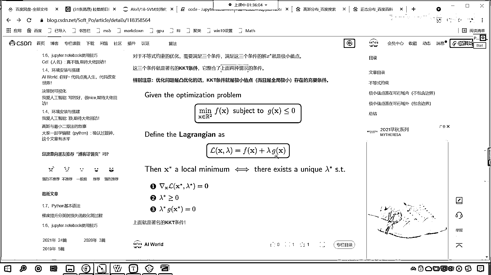

# 7天爆肝整理！AI量化交易-机器学习全套教程，从入门到项目实战保姆级教程！（数据挖掘分析／大数据／可视化／投资／金融／股票／算法） - P124：5-KKT条件介绍 - Python校长 - BV1KL411z7WA

各位小伙伴，咱们接下来继续往下看，回到咱们的课节当中，刚才咱们介绍了不同核函数的使用，接下来呢，我们就沿着咱们支持线量机，沿着咱们上一节课的算法，咱们继续向下去推进，那我们已经知道拉格朗日乘字法了。

对不对，它可以对咱们的等式约数进行方程的转换，把之前的等式约数转化成没有约数的优化问题，那我们所提供的这个博客呢，咱们也进行了详细的讲解，咱们这一节课呢，咱们就不再进行拉格朗日乘字法的说明了，现在呢。

我们看一下，我们把这个问题难度给它加大，现在我们要面对的问题是不等式约数，很多时候呢，它是不等式约数，比如说咱们不等式约数的这个公式，它就是这样的，现在你能够看到，我们想要求f(x)的最小值。

它有什么样的一个约数呢，S(t)H(x)<=0，翻译成咱们的大白话，也就是说，在H(x)<=0的前提下，咱们找函数f(x)的最小值，那么针对于上式呢，它显然是一个不等式约数，因为这是<=，它是不等号。

咱们就不能使用拉格朗日乘字法，为啥呀，因为拉格朗日乘字法针对的是等式约数，我往上滑给你看一下，拉格朗日乘字法标准的一个使用应该是这样的，你现在就能够看到，H(x)=0。

那对于等于0的情况是不是就简单多了呀，对不对呀，你看H(x)=0，这个就简单多了，那它简单，所以说我们就可以使用拉格朗日乘字法把它转换，我们给它引入一个拉格朗日乘字，这个其实就是系数，原来的这个方程。

原来的这个表示呢，就可以写成下面，写成下面你就发现是不是就简单多了呀，对不对，因为这个最小化，L(x)Λ，它那是没有约数条件的，这就是一个方程，你根据t度下降进行一步一步的更新。

那么你那么你就可以找到咱们最优解，注意啊，这是等号的，而我们的问题往往比较复杂，是吧，那我们是H(x)<=0，<=0很显然和上面不一样，对不对呀，那该怎么办呢，兵来将挡，水来土掩，是吧。

咱们呢可以加入一个松弛变量，α的平方，你这不是<=0吗，对不对，我让你加上一个数，你想，H(x)只要<=0，我是不是可以加上一个正的数，是不是把它变成0呀，可以不可以，没问题吧，最基本的加减法，是吧。

加上这个α的原因呢，就是保证它是非负数，咱们的α的平方呢，就是A的平方是大于等于0的，是吧，现在呢我们还不知道α的值是多少，但是没关系，我们是不是一定可以找到一个合适的呀，对不对。

你看一定可以找到一个合适的α的平方，使咱们这个方程成立，对不对，一定存在，没错吧，好，那么就像你一样，你学好了咱们的课程，掌握了相应的知识技术，你一定可以找一个高薪的工作，对不对，你要相信自己，是不是。

所以说我们数学当中呢，这是基本的一个推理，那你看，我们把这个方程给它转化成这样了，现在你就能够看到，这里边是不是有一个等号了，咱们是不是就可以使用拉格朗日乘字法对它进行转化呀，看到了吧，那我们进行转化。

大家看我们就到这一步了，是不是，我们把上面这个方程是不是写成了，λHX+α的平方，好，那么从上一步到这一步，能看懂的小伙伴，我们呢，在咱们的讨论区里边，咱们就扣一个996，好不好，从这一步，是吧。

到这一步，能够看明白的是吧，我们就扣一波996啊，好，因为这个其实就是拉格朗日乘字法，它的一个使用，好，那么接下来呢，咱们继续往下看，那么咱们上市当中的λ，它必须得满足λ>=0。

那为什么它必须得是>=0呢，看到了吧，为什么它必须得>=0呢，对吧，那么我呢又写了一个博客，是吧，咱们一起来看一下啊，这为什么这个λ必须得>=0，来，现在咱们就进入咱们的浏览器，是吧。

我们一起来看一下啊，我把这个网址给各位小伙伴发过去，大家也可以在自己的电脑上打开同步，咱们看一下，好，那么这个里边呢，为了让大家能够理解，为了让大家能够理解咱们的这个KKT条件，你看啊。

我们现在讲的是什么，咱们现在讲的这个主题叫KKT条件，一看到这个KKT条件，我们就懵逼了，是吧，不知道他在，不知道他要讲什么，这啥是KKT啊，这KKT呢是三个外国人名字的缩写。

他们发现了这样的一个数学公式，所以说我们就把它叫做了KKT条件，这个呢就是为了解决咱们不等于是约束，而提出的一个条件，那我们一起来看一下，这个到底是何方神圣，是吧，它到底是怎样的一个转换。

那首先呢我们介绍一下不等式约束，这个对于咱们G(X)<=0，这个和等式约束H(X)=0，它俩呢是不一样的啊，为啥说不一样，因为如果要是等于0，咱们是不是可以在平面上画出一条等高线啊，对不对。

可以画出一条等高线，而G(X)<=0是一个区域，这里你要注意，咱们所说的这个G(X)，还有咱们上一节课所讲的H(X)=0，这个都是我们的约束条件，注意啊，咱们要统一这个，咱们要统一一下，统一一下共识。

这个呢就是约束条件，看到了吗，这个就是约束条件，约束条件我写方程，是不是想写成什么就可以写成什么呀，那么咱们的H(X)=0它呢是一个等高，它是一个这个等高线，上一节课咱们在讲拉格朗日乘字法的时候。

是不是画了很多等高线呀，对吧，旺季的同学，翻看一下咱们上一节课的内容啊，而G(X)<=0你看到了吧，它是<=0，那么它呢就是一个区域，你可以这样认为，这个<=0是吧，它是不是有多条线组成呀。

你线越来越多，线越来越密，那么它是不是就是一个区域了，是吧，很多个等高线堆叠而成的一个区域，我们把这样的区域，在数学上有专有的一个名词，叫做可行域，也就是说你想要找最优解，那么你就从这个范围内来找。

是吧，你想要找最小值，那么你的这个所找的这个数据，就在这个范围，就在这个可行域内，好，那么接下来呢，咱们再来看啊，我们的不等式约束，咱们呢分两种情况，咱们来讨论一下。

这第一种情况呢就是极小值落在可行域内，这啥叫极小值落在可行域内呢，下面我们会具体介绍，第二种情况呢就是极小值点落在可行域外，就是包含边界，那你看一个是可行域内，另一个是可行域外，是吧，那这个可行域内。

可行域外，我不知道是怎样的一个情况，是吧，是怎样的一个描述呢，来，咱们先看啊，极小值点落在可行域内，那我们就给两个方程，大家看啊，现在咱们要求，函数f(x)=x1+x2的平方，我们想要求它的什么。

想要求它的最小值，箭头向下划，表示求最小值，那你的这个x1和x2，你的范围是什么样的一个范围呢，接下来你就能够看到，这个Jx是不是对它就进行了一个约束呀，看到了吗，咱们进行了一个什么样的约束。

那就是x1+x2-1<=0，看，这是不是就是一个不等式约束呀，对吧，也就是说在这个范围内，在这个可行域内，我们找目标函数的最小值，你想，你看一下咱们这个图，这个显然f(x)的极小值是不是原点0和0呀。

看到了吗，一看就知道是不是，当x1=0的时候，x2也等于0的时候，它是不是最小，是不是极小，那这个时候，我们这个点，你想一下，看这个原点，它其实是不是就是在咱们的正中心呀，那此时你看这个原点。

是不是在咱们的可行域内，这也就是说我们在，Jx<=0在它的这个范围内，这个范围内我们可以把它认为成，红色的这个圈，看到了吧，红色的这个区域，就是咱们不等式约束，因为我们知道如果它等于，如果Jx=0。

那它是不是半径是1的一个圆呀，如果咱们Jx<=0，你想一下，它是不是就是咱们的，红色的这个区域呀，对不对，它对应咱们红色的区域，现在呢，我们把它关联一下，就是这个，对应红色的区域，咱们红色的区域。

咱们红色的区域，红色的区域，就是咱们的约束，也就是说你在这个区域内，找最小值，找哪个函数的最小值呀，就找Fx=x1+x2的平方，那你想一下，这种情况咱们的约束起作用吗，看到了吧，思考一下。

这种情况约束起作用吗，看到了吧，约束不起作用，没用是吧，因为呢，你有这个约束，我求解出来的最小值是不是00，没有这个约束，我求解出来的最小值，是不是也是00呀，我就告诉你一个方程。

Fx=x1+x2的平方，它的最小值是多少，你告诉我，看它的最小值是多少，是不是就是00呀，因为两个数的平方，想要求它的最小，那自然是每一个数都是平方呀，所以你看这个时候，咱们所给的约束，还起作用吗。

是不是就没有作用了呀，那你想一下，为什么它不起作用了，那你想一下，为什么它不起作用了，是不是就是因为，咱们这个极小值点，它是不是落在了可行域内呀，你看这个可行域就是咱们红色区域。

而我们的最小值点又刚好落在这个可行域内，就是说你有它和没有它，结果一样，那这个约束呢就不起作用，这个约束呢就是多余，所以说如果我们令咱们的极小值点是这个，右上角加一个星号，这个就表示极小值点。

此时它就是0和0，这个时候呢，咱们的JX=0，这个FX星号它的t度呢等于0，那你像我们如果想要求解这个函数的最小值，咱们是不是求导，令导数等于0，令导数等于0，你就会发现X1等于0，X2也等于0。

这就是它所说的，它的t度等于0，而咱们的JX小于0，看到了吧，这个JX小于0，最后呢，你看它的结论是这样的，我们假设说这个F，我们假设说这个X右上角的星号，它呢表示极小值，也就是说我们找到了。

这就是答案了，那么这个答案对于我们的约束而言，你看是不是小于0，对于咱们的函数FX而言，它的t度是不是一定是等于0的呀，因为你到这个0点了，是不是，看它的t度呢一定是等于0的，你看咱们的函数，看到了吧。

函数FX是咱们蓝色的这条线，一个圈一个圈在转圈，是不是，最小值当它等于0的时候，变成一个点了，那么这个函数也就消失，所以这个时候它的t度是0，好，那么，现在各位小伙伴你理解。

什么叫极小值点落在可行域内了吗，这个就叫极小值点落在可行域内，极小值点，它落在可行域内，那么，我们明白，咱们画了个图，如果对于我们刚才所讲解的内容，理解了，那么你就在咱们的讨论区，扣一个1024，好。

那么我们接下来呢，咱们再看，接下来咱们再看极小值落在，可行域外，那想要展示它落在可行域外，那么我们就更改一下咱们的函数，你看我在更改函数的时候呢，f(x)=x1-2，x2+2。

那你想这个是不是也是一个圆呀，那么对于我们这个圆而言，对于我们这个圆而言，蓝色的这个区域看到了吧，蓝色的这个圈是不是就是表示咱们这个方程，f(x)=x1-2+x2+2，那么不等于约数呢，还是刚才那个。

x1+x2-1=0，显然f(x)的极小值为原点，这个为点，为点2和-2，是不是落在可行域外，可行域以原点为原心，半径为1，你想一下是不是，因为我们可行域的这个范围呢，它是这样的一个范围。

可行域的范围是这样的一个范围，可行域的范围是这样的一个范围，对不对呀，f(x)的最小值你知道它是多少吗，肯定是0是不是，那么它的最小值就是咱们这个原心，其实你一计算这个值肯定是0。

一计算f(x)这个值肯定是0，但是呢我们现在有了约数了，说你x1的平方+x2的平方-1，-1=0，也就是说在这个红色的区域内，把这个底的坐标带到这个方程当中，让它求解出来的值最小。

看到了吗这个是咱们的方程，就是说你这个方程是吧，你比如说我如果要把0 0带进去，咱们如果要把0 0带进去，我们求得的结果是不是就是2^2+2^2=8呀，那如果说我要把1和0带进去呢，咱们把1 0带进去。

那1和0是不是也在这个可行域内呀，对吧你看1和0也在可行域内，那1带进去是吧，0带进去2^2=4，1-2-1^2=5，加起来是不是等于5呀，所以说你看咱们的这个数据，在这呢为了让大家能够清楚和明白。

如果我的x1，如果我给一个0和0，咱们带进去我们得到的结果是不是8呀，看到了吧你看这个00是不是在咱们的可行域内呀，对吧这0肯定是满足这个条件的，然后咱们再给一个10，你看我计算出来的结果等于多少。

是不是就是5呀那很显然，那00和这个10哪个点更小呀，是不是这个10这个点带入到咱们的目标函数当中，它是不是更小呀，你看你就把它带进去，计算一下它的值，把这个也带进去计算一下它的值。

我们就找啊找呀是不是总能够找到一个最小值呀，你想是不是能够找到一个最小值，一定是存在的对吧，就是说满足这个条件，咱们就找x1和x2一定存在一个最小值，是不是，大家注意啊不是2和-2。

知道吗这个时候不是2和-2，我们把2和-2带进去会怎么样，得到的结果是多少，看咱把2和-2带进去，得到的结果是不是0呀，对不对0是不是这个时候是，肯定是绝对值最小，但是你的2和-2。

满足咱们上面的这个约束条件吗，看到了吧你看你这个2和2是吧，这个时候呢它就不是一个解，为啥它满足上面的吗，是不是取不到呀对不对呀，你看不满足啊，所以说它就2和2虽然是咱们方程的最小，如果没有约束的话。

那2和-2是不是最优解，现在是有约束这个时候呢，你就取不到2和-2了，所以说它就不在红色的这个区域范围内，我们刚才有小伙伴说了是吧，这个高中数学和咱们这个是不是很像呀。

你知道一个人的智力在什么时候是巅峰状态吗，那就是高三是吧，高中时代那个时候你的智力是最最生猛的，对吧你如果学完了进入大学是吧，你马上考四级你一定能过，所以说只要你高中是好好学的，现在你学我们的机器学习。

学咱们的深度学习都没问题，咱们中国人是世界上数学功底最高的，知道吗数学底蕴最最好的是吧，因为我们经过了这么多年的这个训练，好那么大家看啊，这种情况咱们的约束是不是就起作用了，看到了吧约束起作用了吧。

你的这个目标函数是不是就不能随随便便的去取值了，这个时候叫约束起作用，要考虑求解FX在可行域内的极小值，是吧就是红色区域，你找一下你的最小值是多少是吧，那么对于FX而言，看对于咱们这个目标函数而言。

咱们要沿着负梯度的方向走，我们才能够走到极小值点，看就是下面咱们蓝色的这个图，看蓝色的这个箭头，看什么叫负梯度呢，看这就是这个FX，因为这个蓝色的这个圈它越画越大越画越大，它的它的梯度呢是朝外的。

咱们来一个蓝色的啊，看你比如说这个地方的梯度是多少，看这个地方的发线是多少，它是不是向外的呀，对不对，你看这个地方和它垂直和它的切线垂直，是不是向外对不对，那它的这个它的这个负梯度呢。

就是我们怎么样把它变小，咱们把它变小变小的话，那么就是负梯度，那这个时候呢就是方向相反，这个时候就是方向相反，那现在你就能够看到，对于FX咱们要沿着FX的负梯度方向走，咱们不是要去求它的最小值吗。

对不对，看我们要求FX的最小值，那这个时候梯度下降，咱们做的是不是一个减法呀，对吧，我们减法，那只要咱们进行减法，你想一下，是不是就是负梯度的方向上来走呀，每走一步负梯度就是向下走，是不是。

那这个时候GX它的区域呢，是发散的，如咱们红色的箭头，对于我们的这个不等式约束，它呢是向外发散的，它是向外发散，那么显然，当咱们走到极小点的时候，GX的梯度和FX负梯度，它是方向就相同了。

那你看哪个是我们的最小值点，咱们现在呢画一个绿色的，你就能够发现，你看这个方这个位置，是吧，这个点标出来这个点，你想它是不是我们的最小值呀，那这个点有一个什么特点呢，如果我们要对这两个进行求导。

咱们对于FX求导，对于对GX求导，那他俩是不是方向相同呀，对不对，就是说FX的负梯度，它的方向是不是相同，对不对，哎，所以说，看啊，所以说，对于这个点，看啊，所以说对于咱们这个点，对于这个点。

那这个梯度方向同向了，那么我们如何用数学公式来表示呢，大家看这个就是咱们这个数学公式，你仔细来看啊，这个倒三角，这个是不是表示求导呀，是吧，delta XFX，注意啊，因为我们在表示求导的时候。

它的这个蓝色的，也就是咱们对于我们的这个函数，咱们是不是求了一下，它的负的梯度呀，对吧，所以说FX这儿，你看这个地方有一个什么，是不是有一个负号，看到了吧，有一个负号，这个就表示负梯度，等于什么。

lambda，delta X GX，这个GX，它是不是就表示咱们的约束条件啊，那我们俩不一定相等呀，就是蓝色的线和红色的这个箭头，它不一定相等，我们给它个系数，这个系数是不是就是lambda，对吧。

你让它乘以一个特定的数，它是不是就一定会相同呀，因为他们俩方向相同呀，所以这个时候你乘以一个lambda，那么一定有一个合适的lambda，是不是让它相等呀，这个时候咱们这个lambda有一个要求。

这个lambda得怎么样，得大于理论，看到了吗，为什么呀，因为我们蓝色的箭头和这个红色的箭头，这两个向量，他们是同向的，那么既然是同向的，那如果说我们想要将咱们这个两条线，把它缩放到一样的。

那我们就只能要求咱们的lambda怎么样，必须得大于零，是吧，因为咱们的负的deltaFX和咱们的delta GX，它俩是同向的，你既然是同向的，那么你的lambda就必须得大于零。

你看这就是咱们课程当中所讲到的，是吧，这个lambda大于等于零，它的原因所在，那我们再看一下，咱们看一下总结，刚才呢，我们介绍了极小值点落在可行域内，这个时候约束不起作用。

另一种情况是极小值落在可行域外，这种情况呢，咱们的红色区域的这个约束，它是起作用的，那我们看一下总结啊，大家看啊，极小值落在可行域内，不包含边际，这个时候可行域它的限制不起作用，有它和没有它是一样的。

那咱们想要求最小值，是不是直接求fx的t度等于零，这个时候是不是就得到一个结果了呀，第二种情况是极小值落在可行域外，就是包含边界，反正呢，你就两种情况，一种是可行域内，另一种是不是可行域外啊。

可行域的限制这个时候就起作用了，咱们极小值点应该落在可行域边界上，如果你要落在这个可行域外，那么这个时候呢，你想要求的最小值一定是落在可行域的边界上，对不对，你想一下是不是根据咱们这个图。

根据咱们画出来这个图，一定落在可行域的边界上，没错吧，所以说看这句话啊，这个极小值点应该落在可行域的边界上，gx等于零，好那么，这一步很关键，来各位小伙伴，对于我们第二种情况，极小值落在可行域外。

你理解了在我们的讨论区扣一个1024，为什么，极小值是吧，它会落在可行域的边界上，我们画出来这个图形，你根据图形，你就有一个直观的认识和了解，类似于等值约束，看到了吧，看类似于等值约束。

那只要它是等值约束，是不是就可以使用拉格朗日乘字法呀，此时gx的梯度和fx的负梯度方向相同，那么两种情况，咱们进行一个总结，这个case1，哎，就是落在可行域内，这个case2呢，就是落在可行域外。

那么这个时候呢，你看我们如何求解这个方程呢，那这个时候你只需要，求fx函数它的导数，令它等于0，这个时候求解即可，那第二种情况呢，落在可行域外，咱们呢，这个时候你看，这个方程就出来了。

此时这个方程就出来了，这个gx，我们说x上面带一个星号，是不是就表示它的最优解呀，看这个时候它等于0，等于0是不是就表示落在边界上呀，看到了吧，等于0就表示落在边界上，然后呢。

负的fx它的导数等于lambda，gx的导数，那这个时候就有一个约数，是不是lambda大于0呀，看到了吧，lambda大于0，以上两种情况，可以构造拉格朗日乘数法，来转换求解咱们的问题。

那么对于不等式约数，咱们需要满足三个条件，满足这三个条件的解，那么我们的x星号就是极小值，那么这三个条件呢，就是咱们著名的kkt条件，那么这个kkt条件，它就整合了上面的两种情况。

无论你落在可行域内也好，还是落在可行域外也好，那么我们对它进行整合之后，咱们现在呢进行，咱们现在就进行这样的一个操作，各位小伙伴你就能够看到，你看到啊，这个是不是咱们的不等式约数呀，看到了吧。

不等式约数，我们对它进行转换，很显然这个转换，就是从上到下，从上到下，如果要按照拉格朗日乘字法，这肯定是不行的，对不对，因为你上面是什么，是不等式约数，而拉格朗日乘字法要求必须得是等号，对吧。

那我们如果要能转换，咱们得需要条件，什么样的条件呢，就是咱们这个条件，看到了吧，就是这个条件，就是你的损失函数等于零，然后呢，你的lambda呢，得大于等于零，你lambda乘以gx，它得怎么样。

它得等于零，得等于零，那为什么这个lambda乘以gx，必须得等于零，你这个地方，因为你lambda大于零，是不是就要求咱们gx，必须得等于零，看到了吧，上面咱们也说了，上面咱们也说了。

如果说这个gx等于零，是不是就是表示，咱们的这个最优解，是不是就落在了可行域的边界上，看到了吧，可行域的边界上，对不对，所以说呢，这就是著名的kkt条件，也就是说我们将不等式约束，使用拉格朗日乘字法。

对它进行一个转换，那么这里边是有相应条件的，满足这个条件，我们就可以转化，求解出来这个值，它就是咱们最优解。

以下是視頻中的第一部分 請別忘了按讚及訂閱喔。

