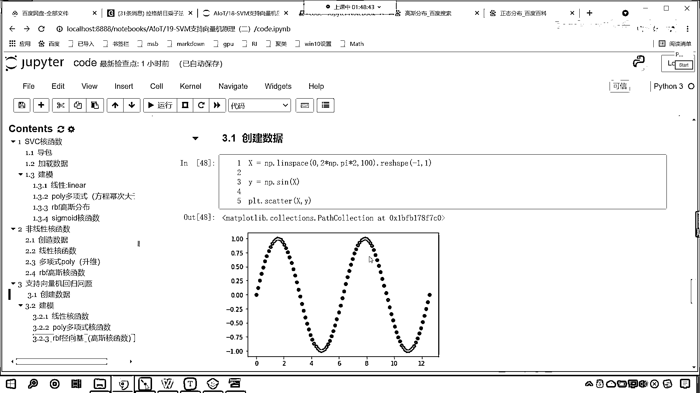

# 7天爆肝整理！AI量化交易-机器学习全套教程，从入门到项目实战保姆级教程！（数据挖掘分析／大数据／可视化／投资／金融／股票／算法） - P125：6-SVR支持向量机回归核函数差异 - Python校长 - BV1KL411z7WA

现在回到我们的代码当中，咱们在这儿呢 我们进行了，刚才呢，咱们这个SVC，它呢 属于是一个分类问题，那我们的分类核函数当中，它有线性的 它有多项式的，还有高斯核函数，那么我们今天。

开课讲到了 我们说咱们的支持向量机，它既可以解决分类问题，是不是也可以解决回归问题啊，来 现在的话 咱们呢，来一个这个标题 咱们看一下，支持向量机 S，支持向量机 我们看一下它的，这个回归问题。

那么我们导一下包啊 咱们，import numpy as np，然后咱们from sklearn。svm，咱们导一下包，import我们叫做svr，咱们呢 把这个给它导进来，导进来之后呢 我们再。

import matplotlib。pyplot，画图工具呢 咱们给它导进来，那执行一下这个代码，那接下来呢 我们就去，加载数据啊 咱们就，创建 咱们就创建一个数据。

那我们创建这个数据呢 咱们首先给一个x，x就等于，np。我们来一个，x。linespace小括号，我们让它从0，逗号 咱们让它到10，我们把它分成多少份呢，咱们把它分成50份，这个x就有了。

然后呢 再给一个y，y呢就等于np。synx，那这个plot咱们plot一下，这个，咱们画一下它的伞底图，x y放进去 执行，现在你就能够看到咱们得到的这个形状，它是不是一个这样的形状呀。

看到了吧 此时咱们得到的一个形状就是这样的一个形状，好 那么我们给它范围呢，咱们给它一个完整的正旋波啊，我们让它2倍的np。pi，我们把它分成50份 大家看，这就是一个比较完整的正旋波。

那我们所生成的y呢，大家看 咱们，就让它是这个图形了 咱们现在呢，不给它增加 咱们现在呢不给它增加这个延了，好 那么，数据准备好了 此时呢，咱们的x形状呢 得需要转变一下，因为x它的形状是。

一维的 咱们在这呢，进行一个reshape -1和1 这个时候你看，打印的数据 输出的 显示的数据还是一样的，但是这个时候这个x它变成二维了，好 那么建模了 接下来呢，创建了数据 接下来呢我们就进行。

建模，那这个时候呢，咱们svr就等于，svr，那我们给一个和函数kernel，我们让它等于linear，你想一下，我们给的这个和函数让它是linear，你想咱们能够预测出来吗，那调用svr。fit。

咱们将x和y传进去，然后svr。，调用predict我们进行一个预测，咱们将x放进去，返回的结果我们就叫y-，那这个时候咱们就画图，先将原数据的散点图画出来，然后呢plt。plot，咱们将x放进去。

我们将y-放进去 这个是不是咱们的预测值啊，我们给一个color 我们让它等于red，代码的上面咱们来一个注释，那这个呢就是绘制，那这个就是绘制我们的预测结果，那这个就是绘制我们的预测结果，你想一下。

我们上面这个数据，它是不是一个正弦波，对不对 你看它是一个正弦波，那么它预测出来的效果会是怎样的呢，你看这个时候我一执行 各位小伙伴就能够看到，咱们得到的数据是不是红色的这条线，那么很显然。

这个是不行的对不对，看到了吧 很显然这个是不行的，那拟合出来这条线呢，不能满足咱们数据的一个走势对不对，这个时候你能够发现咱们是不是出现了一个粉红色，看到了吧 为什么出现一个粉红色。

因为我们数据外的形状，因为咱们数据外的形状，咱们上面调用np。syn之后呢，它其实呢这个y也是一个二维的，我给你看一下啊，咱们输出一下这个y，看到了吧 为啥说它是二维的。

是不是一个中国号两个中国号呀 对不对，那正是因为它的存在 看到了吧 y，please change the shape of y to n samples，是不是让咱们进行转化呀。

for example，还给你举了个例子你可以使用revel这个方法，看到了吧 有好不有好，那咱们就在进行fit的时候，咱们就点，ra，vel 调用revel，这个时候就相当于把它变成一维。

那此时我在执行，你看还有那个粉红色的提示了吗 是不是就没了呀，其实你不管那个粉红色的提示，也能运行啊，看到粉红色往往感觉不舒服，我就要把它去掉 所以说呢，仔细读那个英文你能够，找到解决的办法。

好 那么这个就不好是不是，咱们在上面插入一行 这个来一个四级标题，这个呢就是咱们的线性，这个就是线性的这个和函数，不太好 那接下来呢我们再来看，再来一个四级标题 咱们使用Poly，多项式和函数。

好 那么上面这个代码，咱们复制一下 在这来一个粘贴，我们把linear改成poly，默认情况下这个degrade等于3，咱们先给一个3我们执行一下看怎么样，你看效果好不好 不好 那我们给一个2呢。

你看执行一下 这个效果是不是也不好，看到了吧，因为它就 你想咱们这个，正弦函数 它是多项式函数吗，很显然不是对不对 所以说，你使用多项式去拟合这样的规律，也行不通 对吧 那接下来咱们继续看。

是吧 咱们使用RBF 是吧 这个叫什么呀，看 这个叫做镜像机，这个镜像机 它呢也是高斯，核函数，这啥叫镜像机呢，来 看咱们核函数，它的这个介绍这 看咱们核函数，它所对应的公式，你现在有没有发现。

我们这带着一个什么 叫xi-xj，平方 看到了吧，xi-xj平方，这个平方，是不是就有圆 是不是就有半径的意思呀，看到了吧，因为你能够看到，咱们的这个，正态分布 它对应着什么，x是不是减μ的平方呀。

看到了吧 所以说，我们的这个算法，它也叫什么 也叫镜像机，上面这个复制一下 咱们粘贴过来，把Poly呢改成RBF，这个时候degrade这个参数对它就没有用了，Shift Tab，咱们把它打开。

我们往下走 是不是就能够找到，咱们的这个kernel，是不是就能够找到咱们这个kernel呀，对不对 你看，常用的就这几项，来 执行一下 后面还有一个pre-communicate，这个一般没用啊。

知道吧 这个，常用的就是咱们这四个 是吧，pre-communicate 你把它这个kernel写上，它没啥作用，这个时候你看我一执行，大家现在就能够看到，是不是就比较吻合了呀。

咱们曲线的规律是不是也就拟合出来了，看到了吧 那我们现在呢 我们再来啊，咱们将数据给它变得稍微复杂一点，我们这个np。py之后呢，咱们再乘以2，再乘以2这个时候你就发现。

你看这个数据规律是不是就变成这样了，然后呢 样本点咱们给它多一些啊，看到了吧 这个时候是不是就两个正弦波呀，对不对 那两个正弦波，咱们再来看一下，把上面这个代码复制一下。

我们在下面插入一行control-v，这个时候咱们再来执行，哎 大家看，两个正弦波，咱们这个RBF，是不是依然能够很好的进行拟合呀，看到了吧 依然能够很好的，能够进行拟合啊，一般情况下这个RBF。

在进行分类的时候，如果说我们的数据，它的分布是正态分布，那么咱们使用RBF效果比较好，那在进行回归的时候，在咱们进行回归的时候，咱们这个数据呢，你就能够看到这条线是拐来拐去的，是不是啊。

所以我们使用RBF，这个它也叫镜像机，它也叫镜像机，那么咱们就可以沿着它的上下，来进行一个拟合，这个时候效果也比较好，那么对于数据，我们往往是黑盒，我们看不到数据内部是，怎样的一种结构。

那么我们最简单的办法，咱们就是尝试，你比如说，对于我们这个数据，是吧，对于我们给的正弦波这个数据，那我们一开始不知道用哪种效果好，所以咱们就进行了一一的选择，使用线性，使用多项式，使用镜像机。

最后咱们就发现，这个镜像机的效果是最好的，也就是高斯核函数，这个效果是最好的，那么当然，我们给的数据比较简单，所以咱们是不是可以画图画出来，以后如果说你的数据，以后如果说你的数据复杂，你没有办法画出来。

那么我们可以使用，模型的评价指标，来进行对比，得分高，那么就说明。

咱们这个核函数效果好，其實裡面都是黑色的。