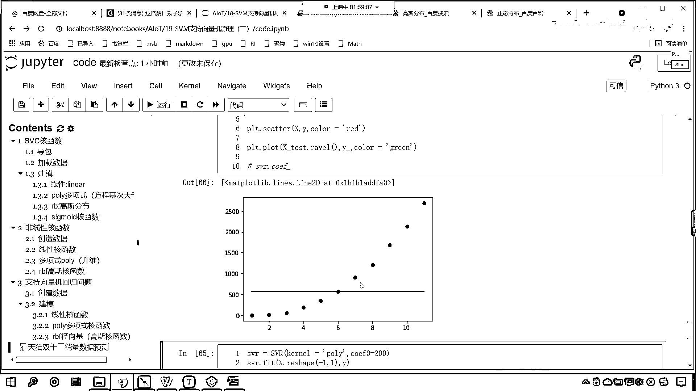

# 7天爆肝整理！AI量化交易-机器学习全套教程，从入门到项目实战保姆级教程！（数据挖掘分析／大数据／可视化／投资／金融／股票／算法） - P126：7-SVR支持向量机回归拟合天猫双十一销量方程 - Python校长 - BV1KL411z7WA

之前呢 我们是不是介绍过天猫数据啊，对不对 来 那么现在的话 咱们来一个二级标题，这就是天猫，双11它的销量数据预测，那么我先把这个数据呢 先给各位发过去，这个数据外呢 就是它的销量。

放到咱们的讨论区当中，来 现在的话 咱们首先呢 创建一下数据，那我们给一个x x就等于n p点，咱们调用Arenge，2009年开始一直呢到2020左逼右开2020取不到。

我们的年份呢 这个绝对数据比较大，咱们现在进行一个操作 我们都让它减去2008，同意减去2008，这个时候x有了 然后我们给一个y，外呢就等于咱们刚才复制的第一年是0。5亿 第二年9。36。

2019年呢 它是2684亿，我们画一个图画出来pltscanter，咱们将x放进去 y放进去 这个时候我们给一个颜色color我们让它是red，现在你就能够看到是不是就有这样的一条曲线呀。

那么请问这条曲线 请问这条曲线是什么样的一个规律呀，我们一眼就能够瞅出来 咱们这个数据它是不是一个，看它是不是一个这个抛物线啊 对不对 那这个抛物线咱们可以使用。

二次密三次密都可以进行拟合 三次密的话它是局部拟合，对不对 你看二次密三次密都可以形成这样的一个拐弯 好 那么咱们现在呢就操作一下啊。

上面x数据咱们是ev的 那我们训练的时候这个数据是可以调的啊 是可以改的，来 现在的话咱们就操作一下 使用咱们的sv，svr就等于svr，你想一下这个和函数 咱们如果使用linear 你想一下行不行。

肯定是不行的 是不是啊 咱fit x y x这个时候是ev的 你看我一执行，是不是就报错了 报了个什么错 看啊，你的expect 2d array got 1d array instead。

就是我要的是二维数据 但是你给了我个一维的 你怎么办 reshape-1告诉你答案了吧，以后大家写代码报错了 仔细看他的提示啊 叫reshape data either using reshape 是吧 那咱们就往上滑。

x不是数据不合格吗 咱们根据他的提示reshape-1和1 这个时候你看我一执行，看下面的是不是fit这个地方 咱们调用点reshape。

咱们给一个-1和1 这个时候你看我一执行 没毛病 是不是就可以了，好 那么接下来呢 咱们就预测一下啊 咱们的数据x呢 进行了一个操作 减去了2008。

咱们使用svr点 我们调用predict 咱们呢 就将这个数据有点稀 你知道吧 一共11个，现在呢 我们给他一个xtest 在上面插入一行，x下回见test=np。

lanspace 我们依然让他从2009，到咱们的2020 那这个lanspace 他在切数据的时候是左避右避 所以说咱们也给一个2019，我们把它分成多少份啊 分成100份。

然后对他进行一个reshape 那就是-1和1，你看现在我们同样是在这个范围内 但是咱们划分的份数是不是多了 看咱们划分的份数，多 那为什么要划分这么多份啊。

咱们画图的时候 咱们这个曲线呢 它更加的柔和 知道吗 哎 所以执行，来 现在对于xy这个数据进行了拟合 那么就会有一个方程，咱们就使用svr点对他进行predict 将咱们。

数据xtest放进去 返回一个结果就叫y-，那有了这个数据之后呢 咱们现在就画图展示一下吧，把上面这个画图是吧，scatter粘贴过来，然后呢 咱们plt点plot 看我要画线。

画线的时候 如果你的底不够密集 那你画出来的这个就不够，就不够平滑啊 我们用这个词来形容，更加准确 是不是好 那咱们就plot一下 咱们呢就将x下滑线，这个test放进去 然后y-放进去 大家注意。

此时咱们的xtest它是二维的 所以咱们调用什么revel，把它变成一维的 这个时候我们给它一个颜色啊，那我们预测值画出来这个颜色 咱们让它是Grid，这个时候你看我一执行。

哎 大家现在就能够看到得到的数据是这样的 是不是，这个，看这个是不是咱们的这些点，这个右上角是不是这条线 为什么 因为我们没有减去2008，现在呢 咱们减去2008 统一减2008 是吧 执行。

现在你看画出来这条线是不是就是这样的呀，因为是因为我们要画直线 是不是，所以这就相当于是上面和下边取了一个平均 是不是，这个线就是斜着的 很显然效果不好 那我们再来。

来 我们复制一下control-c 咱们在这来一个粘贴，我们把这个linear是吧 我们给它改成rbf，哎 现在你来看，改成rbf，这个是不是就是高斯和函数呀。

也不行 看到了吧 也不行 然后再来复制一下，看 那我们知道之前我们解这个方程，咱们知道它是一个多项式 现在你看我使用这个多项式，你看效果是不是一下子就好很多了呀。

看到了吧 此时的这个效果一下子就好很多了，那这个里边的参数呢 咱们是可以调的啊，看我们可以调谁呢 可以调咱们的，咱们可以调咱们的这个coef 看到了吧 可以调coef0，那这个coef0表示什么。

回到咱们的科技设当中 你看这个多项式回归 看到了吧，多项式和函数 你能够看到这个里边是不是有一个c啊，现在我们已经知道这个d表示什么了，这个d是不是就是表示它的密次呀 那这里边还有一个c呢。

这个c表示什么 这个c呢是不是就是表示咱们的节句呀，看到吧 这个c是一个常数 α呢是不是也带了一个系数呀，来 回到咱们代码当中 咱们对它进行一个调节啊，来 回到代码当中 你看这里边就有一个这个coef。

那我们就调一下咱们的coef，来 coef0 咱们给一个200执行一下，现在你能够发现 我们调整coef的时候，这条线拟合的效果是不是就很好了呀。

原来这个coef是0 我给你看一下啊 你不写默认它就是0，现在你能够看到 如果要是0，咱们拟合的效果是不是就不是特别好呀，你看这几个底是不是就下边这三个底是不是就这条线没有经过它。

那我们调整coef给它是200 这个时候你看我一执行，你看结果是不是就拟合的比较好了呀 对不对 看到了吧 所以说呢，咱们SVR是吧 它不同的核函数 它其实是用于解决不同的问题。

好 那么我们对于每一个核函数 咱们找一下它的coef，看啊 这个是线性的 你看我一执行，咱们是不是能够找到它的coef呀 看到了吧 是30，那么对于高斯核函数 咱们能不能找到它的coef呢。

你看一执行 是不是就报错了 没有啊，那多像是呢 也没有 知道吧 你看啊 执行一下svr。coef 你看一执行，也报错了 它说只有咱们的核函数是线性的时候 咱们呢才存在，才存在咱们的这个系数。

所以说呢 这个是没有的 control+反斜杠把它注掉，上面也是control+反斜杠注掉 是吧 再执行这个时候。

这个就会画出来 这个就会画出来图形了 就不会报错了。

