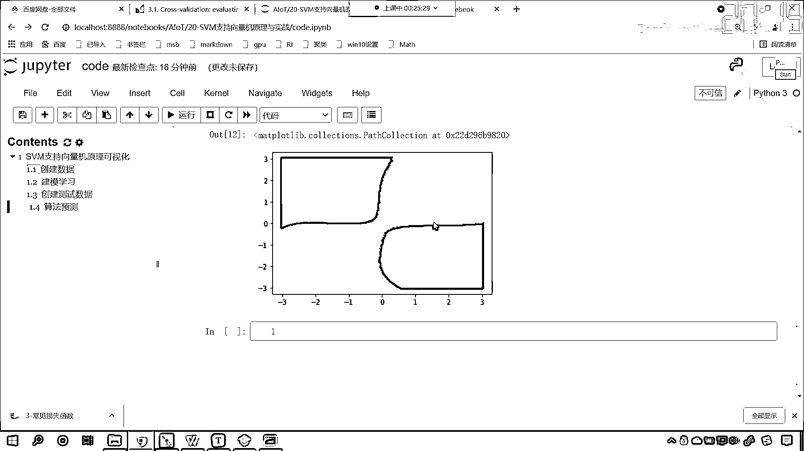
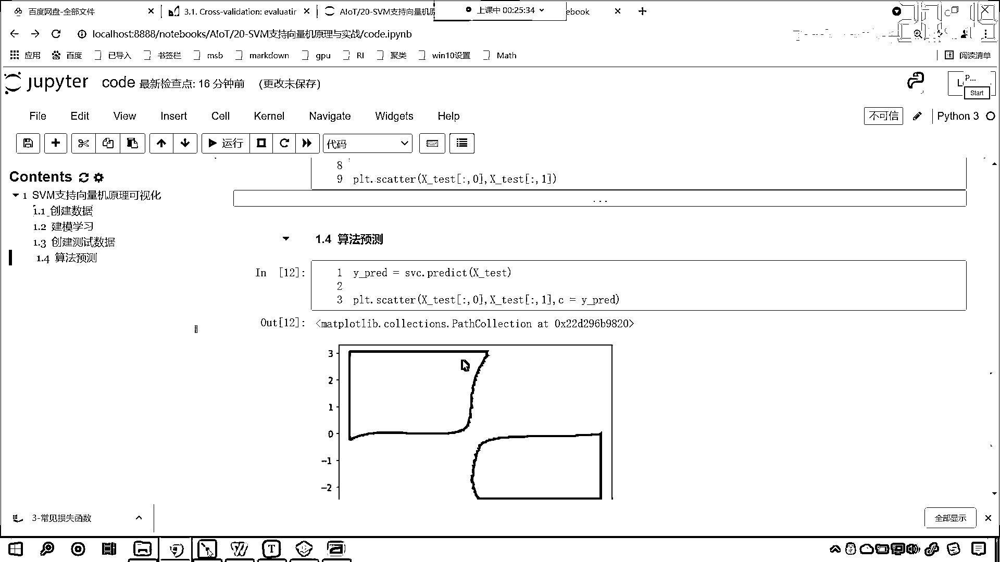
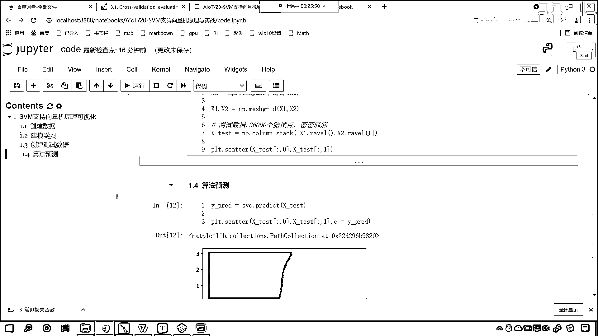
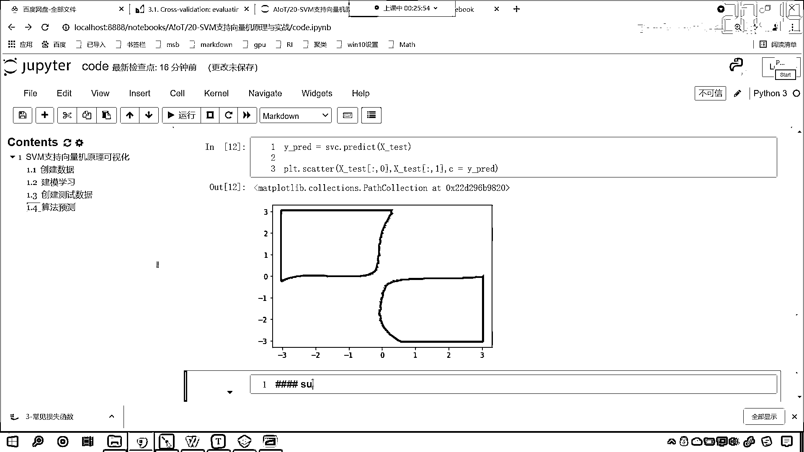
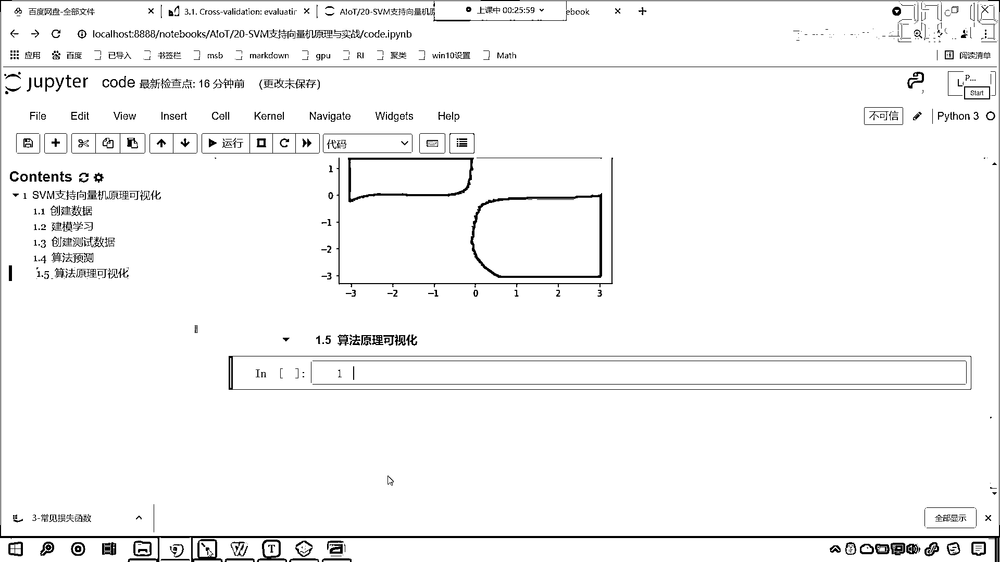
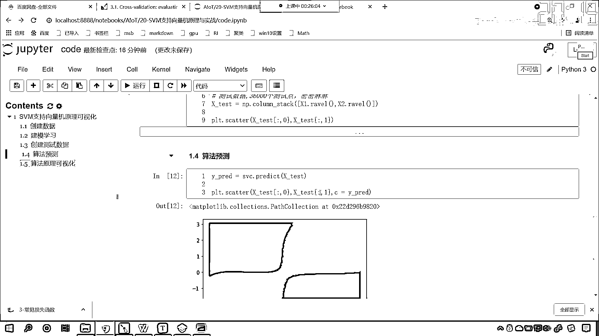
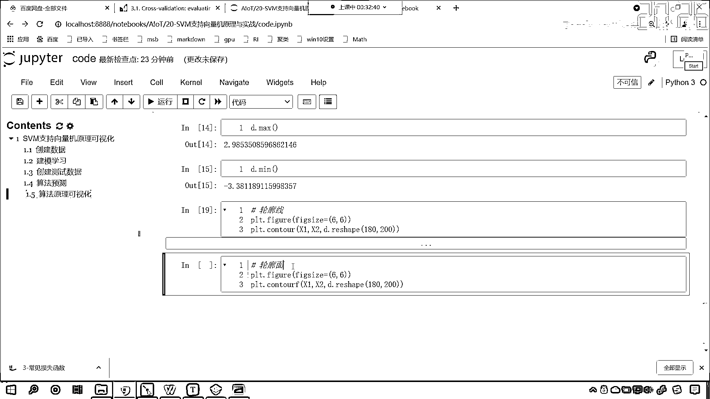
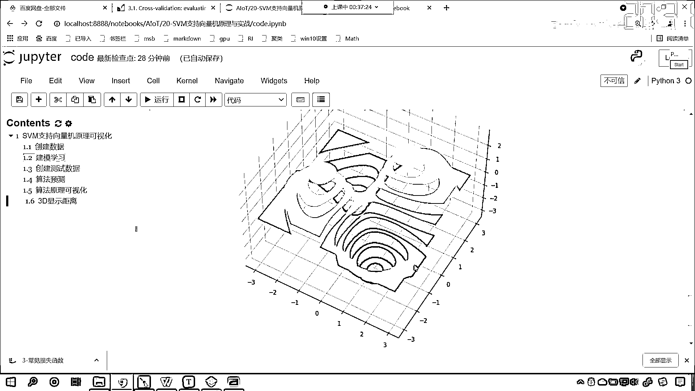

# 7天爆肝整理！AI量化交易-机器学习全套教程，从入门到项目实战保姆级教程！（数据挖掘分析／大数据／可视化／投资／金融／股票／算法） - P127：1-SVM支持向量机原理可视化 - Python校长 - BV1KL411z7WA

好 那么首先呢 我们看一下支持线量机它的可视化啊，我们通过一个小案例 咱们呢 再来研究一下，咱们支持线量机它到底是如何进行操作的，好 那么咱们现在呢 就回到我们的代码当中。

那么今天呢 是我们的第20节课程，那我相应的文件夹已经创建好了 咱们进入进去，那么大家看这里边 我提前准备了一个数据，这个数据在哪呢 在咱们的百度网盘当中，你就能够看到 看到了吧 在这呢。

好 那么以及呢 今天晚上的作业，还有呢 一个这个比较大的数据，这个是人脸识别的数据 300多兆，所以说 你需要提前下载，那咱们现在呢 就开始，来 我们现在呢 创建一个python文件。

给它起个名 就叫做code，现在的话 我们导一下包 import numpy as np，然后from sklearn 从svm下面，咱们导一个包 咱们将svc导进来，然后呢 我们将画图工具导进来。

import matplotlib，那么咱们把画图工具导进来，那么待会呢 我们还要绘制三维的可视化图形，所以说 我们从mpl2 case，它里边有一个mplot3d，从这个当中 咱们导入画3d的引擎。

叫做axis3d 执行一下代码，那么我们在它上面插入一行，咱们来一个3D标题，那这个呢 就是svm支持限量机，它的一个原理可视化，咱们通过可视化呢 来对它进行一个研究，那接下来呢 我们就创建数据。

大家看啊 咱们创建数据，那我们这个数据的创建呢，咱们刷新一下啊 重新加载，重新加载 那我们就可以出现，咱们的这个左侧出现咱们的目录了，好 那么我们创建数据，这个时候呢 咱们就给一个x，x=np。。

我们现在呢 给它一个种子啊，np。random，给一个random state，我们给它一个256，那这个种子是怎么回事呢，有了这个种子 咱们生成的这个数据，它是不是就是固定的呀。

因为我们random是随机数 是吧，这个是一个种子，这是一个种子 那么我们生成的随机数字，它呢就固定了，如果我们要不写 默认情况下，它每次生成的这个数据呢 都是变化的，好 那么我们就使用rs。

咱们呢调用其中的randn这个方法，咱们呢给它生成一些数据啊，那咱们就生成300个点，我们生成两个，这个时候呢 咱们就接受一下，x就等于它，那我们randn呢 是一个正态分布，它生成的数据就有正有负。

现在咱们把这个数据给它画出来，那就是prt。scatter，x(0)，然后x(1)，0就表示它的第一列，1就表示第二列，这个时候你看我一执行，这个图形是不是就画出来了，你能够看到咱们的范围是不是就是从。

纵坐标是-3到+3，横坐标是不是也是从-3到+3呀，图片的尺寸咱们给它调整一下，我们把宽度高度都给它调整成6和6，这个时候你看我一执行，画出来这个图形是不是就是一个方块呀，你能够看到咱们这个数据。

如果说我们要按照向线来对它进行划分的话，你来告诉我，咱们这个是不是就分为1，3向线，是不是又分为2，4向线呀，对不对，看到了吧，1，2，3，4向线是不是，那么我们现在这样，咱们将这个1。

1向线和第3向线它是一类，这第二，第二向线和第四向线是一类，你能告诉我这1，3向线和24向线有什么样的特征吗，1，3向线是不是都是正的，这个1，3向线，第1向线是正的，第3向线是不是都是负的呀，对吧。

24向线是不是一正一负，好，那么我们就可以根据这个符号来创建咱们的Y，咱们的目标值Y，我们呢就让它等于，大家看这个时候呢，咱们就让这个咱们来一个这个列表生成式啊，那就是来一个中国号，X中国号冒号0。

我们让它乘以X中国号冒号1，你首先有一个乘法，看到了吧，有一个乘法，你想一下，第1向线和第3向线乘完之后，它是不是就是一个正数呀，对不对，这第二和第四向线乘完之后，它是不是就是一个负数呀，对不对。

所以说那么我们就可以这样来操作，叫放爱印它，叫放爱印它，前面呢咱们来一个判断，叫做一负爱，如果要大于0，如果咱们这个爱大于0，咱们怎么样，else怎么样，那这个如果要大于0的话，咱们就把它设置成1。

else的话，咱们就把它设置成0，看这个是一个列表生成式，同时呢，我们是不是又给了一个判断呀，那我们判断的到底正不正确呢，咱们画图的时候，我们给一个颜色，这个参数叫C，这个C呢就是咱们上面的类别。

看这个Y呢，是我们的目标值，咱们现在呢就，就让13向线，我们让13向线，让它是1，咱们让24向线，我们呢让它是类别0，这个时候呢，咱们把得到的这个Y放进去，这个时候你看我一执行，现在你就能够看到。

结果是不是就出来了，你看，现在有没有分开，看13向线是不是就连成一片了，这24向线是不是也连成一片了，24向线是不是就变成一类了，所以说我们上面，咱们这个列表生成式。

以及我们对于列表生成式取得的这个数据，i进行的判断，没有问题，你能够看到通过这一行代码，你就知道python的强大了，如果这个用Java写，如果这个用C语言写，那这个没有十行代码下不来。

所以说python的一行代码就能搞定，现在的话咱们就创建数据了，好，大家看咱们是从负3到正3，纵坐标也是从负3到正3，那么我们呢就用算法，知识线量机，来对于这个数据咱们进行一个学习。

那么它会学到什么样的规律呢，就是13向线的数据，它要分开，24向线的数据，它是不是也要分开啊，好那么创建数据了，接下来呢，咱们就再来一个四级标题，接下来呢，咱们就建模，进行学习。

好那么我们声明一个SVC，这个时候咱们就给一个SVC，那我们给他一个核函数，咱们让他是RBF，这个RBF就叫做镜像机，那么我们使用咱们的这个，算法咱们呢进行训练，我们fit一下XY。

这个时候咱们的算法就学到了相应的规律，那我们说了这个规律是什么样的呀，看了吧这个规律是啥样的，是不是这个13向线，13向线是一个类别对不对，24向线是另一个类别对不对，好那么学算法学好了。

接下来呢我们再来一个四级标题，那么我们呢创建，接下来呢咱们就创建咱们的测试数据，那么我们的测试数据呢，咱们给的稍微多一点，我们给一个X1，我们让他等于NP点，大家看啊咱们来一个line space。

我们让他从负三到正三，咱们把它分成20份，然后呢再来一个X2，这个X2呢也来一个NP点line space，我们也让他从负三到正三，咱们把它分成18份，那这个时候这个X1和X2，大家看他是一维的。

现在呢咱们使用之前介绍过的，一个方法叫mesh grid，咱们对他进行一个，咱们对他进行一个这个合并啊，你看这个NP点mesh grid，那么我们现在呢就将X1和X2，作为参数呢放进去，X1 X2。

那么他在进行mesh grid之后，那这个数据会变成什么样的呢，咱们接收一下啊，X1 X2，那这个时候呢，大家看啊咱们上面这个数据，我们display一下，那就是X1。shape X2。shape。

合并完之后经过咱们的mesh grid，这个叫网格交叉是不是啊，咱们呢再来查看一下他的形状，那就是display，那就是X1。shape X2。shape，这个时候你看我一直行，现在你就能够发现。

这X1 X2经过mesh grid，是不是就变成了18和18呀，看到了吗，他就变成了18和18，那么这个数据长什么样呢，这个数据长什么样呢，我画图给你画出来啊，咱们plt。scatter。

咱们呢将X1放进去，我们将X2放进去，这个时候你看我一直行，咱们得到的数据，大家看长这个样，看到了吧，得到的数据长这个样，那如果说我要把它分成五份，下面这个分成三份，你看我一直行。

咱们是不是你看这是几行几列呀，是不是就是三行五列，我们把它划分的越细，大家想它是不是分的就越密呀，你看也就相当于X1呢，是咱们的这个水平的，X2呢是咱们的数值的，这个分成200份，这个分成180份。

这个时候你看我一直行，咱们得到的数据是吧，其实我们画出来的是散点图啊，但是呢这个散点图太密集了，导致看导致它看起来，是不是就像一个，是不是就像一个面呀，你看我再调小一些是吧，你比如说我把这个上面。

这个调整成50，下边这个调整成40，你还能够看到它的间隔，看能不能看到它的间隔呀，看到了吧，能看到间隔是不是啊，所以说这个多和少，只是这个数量的一个不同，那么我们操作完这个之后呢。

咱们不是有了X1和X2吗，接下来呢，咱们np。concaginate，咱们对它进行一个这个集联啊，来一个中国号，那X1呢是二维的，咱们来一个revel，revel就相当于把它放平，变成一维的。

那么我们的X2呢，它也是这个二维的，这个concaginate这个方法，要求咱们的数据有一个形状，现在呢咱们调用column stack，我们调用这个方法，那这个column stack这个方法。

咱们之前也介绍过，这个是不是列的合并呀，对不对，那我们就给它一个列的合并，那列的合并，X1和X2咱们都对它进行平铺，平铺就是revel，其实就是把它变成一维的，就是这个从前往后一直向后路啊，就这个意思。

好那么得到这个数据呢，咱们起个名就叫xtest，得到的这个xtest，它呢就作为咱们的测试数据，这个就作为我们的测试数据，你知道为什么把它当成测试数据吗，你看它的范围，是不是从负3到正3。

X2是不是也是从负3到正3，上面咱们画的这个图，你看我们给的这些，我们给的这个图当中这300个点，它的范围是不是也是从负3到正3，是不是从负3到正3呀，所以我们的测试数据呢。

咱们在这个范围内我们给了更多，是吧那就是200 180，这个时候呢就是36000个数据，那这个时候呢这个数据合并了，那我们呢就把这个图画出来啊，Display咱们现在呢知道它的形状是什么了。

我们就没有必要去看了，那咱们现在呢在绘制scatter的时候，咱们调用test，中国号冒号0，这就是第一维，相当于横坐标，X下方键test中国号冒号1，这个就相当于纵坐标，这个时候你看我一执行。

你看这个图形是不是也出来了，这就说明咱们的数据，测试数据的这个合并没有问题，好那么有了咱们测试数据了，咱们接下来是不是就应该使用咱们的算法，对它进行一个预测了，对吧上面咱们已经声明了算法。

那接下来呢咱们就算法预测，好那么这个时候呢咱们就svc。，咱们就调用predict这个方法，我们将x下滑线test放进去，咱们会得到一个预测值，我们起个名叫background predict。

预测的准确不准确呀，咱们现在呢画图画出来啊，plt。scatter，看看它能不能把我们这36000个测试数据，大家注意啊咱们是36000个测试点，这个点呢密密麻麻的，是不是那，我们训练咱们训练的时候。

咱们虽然只学习了300个数据，那我们测试的时候咱们即使给36000个数据是吧，只要规律学到了，是不是这个预测出来都不会有问题啊，那我们看一下有没有将这36000个点预测准确。

那我们还得需要把这36000个点画出来，然后呢给它着上颜色，那这个颜色呢，c就等于咱们算法预测出来的predict，这个时候你看我一直行，现在你能发现，看到了吧，一三项线和二四项线。

咱们这个算法规律是不是就找到了呀，看了吧，我们的算法呢将这么多的数据，36000个数据对它进行了一个分类，看到了对它进行了一个分类，这个一三项线你看连通的这个是不是就是黄色呀。

这个二四项线是不是就是紫色呀，那么我们画出来这个图，这个当然不规则啊，因为我们给的数据你来看，你看我们给的这个数据，是不是也不足够多呀，看到了吧，我们给了300个数据，因为我们的数据呢。

大家看它是一个正台分布的数据，那也就意味着那有很多数据，它是不是在零附近呀，看到了吧，在零附近进行了一个汇聚，你就像咱们所画出来这个图，你能够明显的看到，一三项线是不是连成一片了呀，对不对。

所以咱们的算法预测出来的一个，大致的规律。

是吧，那这个时候呢，哎就说明咱们的算法，哎这个学会了。

那我接下来呢，我们就要看一下，这到底是这个怎样的一个规律呢，是吧，咱们的核函数是RBF，这个RBF叫镜像机。

那么它到底是怎样的一个原理呢。

来接下来呢，咱们进行算法原理的可视化。

算法原理可视化，好那么我们有我们有很多底儿。

对不对呀。

咱们有这个三万多个点儿，三万六千多个点儿，那么我们知道咱们的知识线量机，知识线量机，它对于数据的划分SVC，它对于数据的划分，咱们知道这个两个特征，平面上它是不是通过一条直线来划分两类呀。

我们上一节课当中，咱们是不是把线性的知识线量机，我们给它划出来了，对不对，那如果要是高维呢，那如果要是高维，它怎么进行划分呢，我们把这个叫做超平面，那啥是超平面呀，我们在二维当中，我们把这个叫做直线。

三维当中想要把两类点儿划分开来，是不是就得用一个面儿给它切一刀呀，就像我们切西瓜一样，就像我们切蛋糕一样，是不是我们可以一刀下去，是不是一分为二，那么我们知识线量机，在对数据进行划分的时候。

咱们呢一个平面下去，把数据呢就分成了左右两边，所以说呢这里边就有一个超平面，那既然有超平面，你想一下咱们不同的点儿，咱们距离这个超平面，那它距离超平面，是不是不同呀，对不对，那么我们知道。

咱们在使用知识线量机，对数据进行划分的时候，我们是不是有知识线量呀，知识线量是不是就是这个临界点儿呀，那知识线量肯定离咱们的超平面最近，对不对，好那么现在呢我们插入一行，里边呢它就有。

知识线量机里边就有这样的一个参数，叫做decision function，这个参数是干嘛用的，Evaluate the decision，Evaluate就是计算，计算咱们的decision就是距离。

From the samples in X，看到了吧，它呢就是计算距离的，那我们就算一下距离，咱们把距离划出来，这个时候就是X test，那我们就会得到一个距离D，那么我们有多少个数据。

咱们是不是就有多少个距离呀，咱们现在呢有三万六千个距离，那这些距离我给你看一下，它长什么样啊，你看一直行，大家看这就是算出来的距离，那这个距离呢，我给你查一下啊，它的最大值是多少，你看我一直行，2。

98，那距离的最小值是多少，me，你看我一直行，是负的3。38，这个距离为什么会有正负呢，你想一下这个距离，为什么会有正和负呢，是不是因为咱们的这个超平面，把咱们的数据分成了上和下呀，对吧。

如果我们把上面的距离当成正，那么我们为了区分下面的这些点，到咱们超平面的距离，是不是就是负的呀，所以说它有正负之分啊，好有了距离，接下来咱们就绘制图吧，那就是plt。counter。

咱们就调用concounterF，那这个是什么呢，这个呢是咱们的轮廓面，我们也把它叫做等高线，这个叫什么，这个叫做轮廓，这叫做轮廓，我们先画轮廓线吧，咱们调用一个counter，那咱们把数据放进去。

X1，X1，然后呢X2，接下来呢咱把距离放进去，那就是d，这个时候这个d是一维的，而咱们的X1，X2，是不是咱们上面MASHGrid生成的呀，它的形状是什么样的形状呀，我们刚才也打印输出了。

它是不是200和180呀，而咱们的d呢，你看一执行这个时候就报错了，因为这个形状不对啊，看到了吗，input的z，must be 2d，咱们得到的是1d，那怎么办，是不是reshape形状改变呀。

这个时候咱们。reshape，给一个200给一个180，这个时候你看我一执行，啊这个弄反了，是不是啊，X是100和280，那我们调整一下啊，那就是180，后面这个是200，这个时候你看我一执行。

现在你就能够发现，这13相线和24相线，你看它的颜色是不一样的啊，我们尺寸给它调整成方形的，plt。figure，咱们呢给它来一个figure size，我们让它是6和6，现在你就能够看到，大家来看啊。

你看我们13相线的，看到了吧，这个13相线的中心，看到了吧，颜色是不是一样的呀，那颜色一样说明什么问题，我们把这个叫什么，我们把这个叫等高线啊，那你就能够发现这个等高线，看到了吧。

如果等高线颜色一样说明什么，说明它们的距离相同，知道吧，距离相同，这就说明你看到了吧，13相线是不是就被划归到一类了，这个24相线，你看它的颜色是相同的，你有没有发现，咱们越靠近咱们的这个零点的时候。

那我们就发现这个颜色是不是很接近呀，看到了吧，在零这儿，你看它的上边和下边，颜色是不是比较接近，看到了吧，你知道为什么颜色接近吗，因为边际的地方是不是分不开呀，分不开的话，你的颜色就接近。

也就是说我们能够把样本给它分开，咱们距离超平面是不是越远，那它是不是就越能够划分的开呀，对吧，交界处是吧，它的颜色就类似了啊，好大家看这个是咱们的轮廓线，接下来我们把这个代码复制一下。

咱们在这来一个粘贴，我们counter来一个F，那这个线呢，它就变成轮廓面了，你看我一执行。

来各位小伙伴，你就能够看到，这回是不是就看得更加清楚和明白了，看到了吧，那我们就是这一块是吧，看到了黄色这个区域和这个黄色区域，他们呢是一类，距离等高面呢，也是相同的，那这个紫紫色的是吧，也是一类，好。

那么我们现在呢，你要想象一下是吧，咱们黄色是向上凸起来的，咱们这个黑色呢，是向下凹进去的，因为距离不是有正有负吗，那平那这个超平面，我们就认为是咱们这个，现在这个面是吧，那一个就是凸起来。

另一个就是凹进去的，那我们在平面上不好演示，接下来咱们画一个三维的啊，来一个四级标题，那这个呢就是3D显示，3D显示咱们的距离，好，那么这个时候呢，咱们就，plt点，我们设置一下它的尺寸。

plt点figure，这个当中呢，咱们给一个figure size12和9，然后呢，plt点subplot，在这个当中呢，我们给一个一行一列，第一个，然后呢，给他一个projection。

projection就表示项目，那我们用3D来绘制，那么我们就会得到一个子室图，这个时候你看我一直行，看到了一个三维的，是不是就出来了，然后呢，我们就调用axis，咱们就调用它的count，f这个方法。

那你想此时我们是不是就可以绘制面了，x1放进去，x2放进去，d放进去，d就是咱们的距离，来一个reshape，那么我们呢就给他一个这个180，200，然后呢你看我一直行，哎，现在你，有没有发现。

咱们黄色的是，是不是向上秃的，咱们这个紫色的是不是向下秃的，那我们调整一下它的视角，那就是axis。view，init，咱们给一个40，咱们给一个-60，这个时候你看我一直行，现在你来看。

那这些数值都可以调，比如说我们给一个50，现在你来看，你能够看出来，通过这个立体的图形，你能够看出来，这13相线是不是被抬起来了呀，这24相线是不是被降下去了呀，对不对，那么我们这个分离超平面。

是不是就在中间呀，看了咱们的分离超平面就在中间，所以通过咱们这个画图，通过咱们这个画图，你现在明白，那么我们知识项链机，是如何将咱们平面上这个数据，给它分开了吧，因为我们所创建的数据是x，目标值是y。

你现在能够看到，你看你现在能够看到，它其实是在一个平面当中的，对不对，那在平面当中的，你想如果想要把它分开，你看这怎么分呀，我们一条线肯定分不开，看到了吧，线性的你看你这样分能行吗。

左边是一类右边是一类，不能行对不对呀，你无论怎么画，你都分不开，那这个知识项链机，它是怎么办的呢，它通过它的各种各样的核函数，通过它各种各样的核函数，其实是将咱们的数据进行了一个变化，将咱们的数据呢。

进行了一个升维，那为什么咱们黄色的底儿，为什么咱们黄色的底儿，它跑到上面了呢，你想一下，为什么黄色的底儿跑到上面了呢，为啥它跑到上面了，是不是因为一三象限的数据相乘，它是一个正数呀。

所以它是不是就跑到上面了，二四象限的数据相乘，是不是一个负数，它是不是就向下凹进去了呀，这个就是咱们可视化的一个原理啊，大家现在明白了吗，看明白咱们图形的，是不是啊，知道咱们这个知识限量机。

如何将咱们这些点儿化分成了两类的，我们在讨论区里边扣一波666啊。

