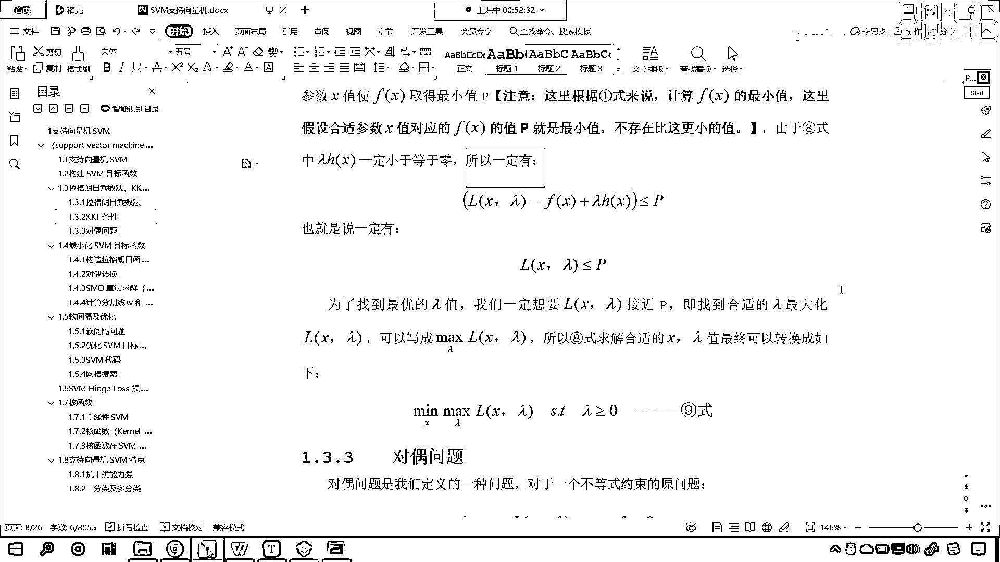

# 7天爆肝整理！AI量化交易-机器学习全套教程，从入门到项目实战保姆级教程！（数据挖掘分析／大数据／可视化／投资／金融／股票／算法） - P128：2-SVM支持向量机KKT条件详解 - Python校长 - BV1KL411z7WA

那么我们写了一部分代码了，接下来我们就看理论，在上一节课，咱们讲了著名的KKT条件，对不对，是吧，我们讲了著名的KKT条件，也就是说我们的约束条件，无论是等于也好，还是大于等于也好。

无论它是等式约束也好，还是不等式约束也好，我们都可以对这个问题进行一个求解，那么根据咱们上一节课，我们对于不等式约束的一个，一个这个变量的添加，我们添加了α，那么它就变成了等式约束，对不对。

看我们给它加上了一个α的平方，它就变成了等式约束，到了这之后呢，咱们呢就继续往下走，各位你就能够看到，那么其实我们是不是就是最小化，咱们这个损失函数呀，这里的L，它往往表示损失啊。

看这里的L它就表示损失，那就是Xλα，那就是FX加上λHX+α的平方，那么我们上一节课已经说明了，咱们这个λ怎么样，是大于等于0的对不对，看了吧它呢是大于等于0的，那么我们对于上数的公式呢。

咱们进行一个拆分，是不是就变成了FX，你看，它呢就变成了这种形式，看了吧你把它乘开，是不是就变成了λHX+λα的平方呀，因为α的平方大于0，λ的平方λ大于0，所以说这个λ乘以α的平方一定是大于0的。

这个没问题吧，所以咱们进一步化简呢，我们就可以把上面这个数值呢给它去掉，对吧，因为我要求这个最小值，而你上面这个一定是大于0的，对吧，所以说我就可以把这个数据呢给它约掉，看到了吧，对不对。

因为你是一定大于0的，你想你加了一个大于0的数，对于我求最小值有关系吗，是不是没有关系，也就是说你加上这个λα的平方，你想一下，看这个数一定是一个正数，对不对，看了吧这个数一定是一个正数，对不对。

这个数一定是一个正数，好，那么假设说啊，看啊，假设说咱们现在看这是一个，那这个点是最小值点，那你想如果这个函数它统一加上了一个，看它统一加上了一个正数是吧，比如说它往上挪了一点，是吧。

假如它往上挪了一点，我们往上挪啊，看咱们假设说它往上挪，那你想它加了一个正数，它是不是向上平移往上挪了呀，对不对，你看那我们求解出来的这个横坐标的值，你看是不是还一样呀，对吧，因为你只是整体向上挪了。

当我在求最小值的时候，你看我求的是谁呀，我求的是x，看到了吧，我求的是横坐标，你你纵坐标整体向上移，所以说对它没有影响，所以我们可以怎么样，哎，咱们就可以把这个给它约掉啊，咱们就可以给它满足。

把这个给它约掉，好，那么到现在呢，我们就我们就得到了八式，看满足最小化八式对应的x，lambda，一定也要满足KKT条件，对不对，你看啊，我们之所以能够写成上面这个公式，是不是就必须满足KKT条件呀。

对吧，他假设我们找到了合适的参数x，使fx取得最小值p看到了吧，我们现在呢，我们就假设最小值是p，你想这个最小值一定是存在的，对不对，是不是，也就是说看啊，那不存在比这个更小的值了。

因为我们就另它是最小，所以说就不存在比它更小的值了，对不对，是不是，嗯，那么由于八式，lambda h，由于咱们八式，lambda h呢，一定是小于等于零，所以说呢，所以说一定有下面这个公式。

看一定有下面这个公式，为什么lambda h小于等于零呀，为什么这个lambda h小于等于零呢，因为KKT条件呀，你往上看看了吧，往上看看了吧，这个，hx小于等于零，lambda h等于零。

lambda hx等于零，这个lambda是大于等于零的，是不是，所以说，咱们的看啊，所以说咱们得到的这个结果，所以说咱们得到的这个结果，所以咱们hx是小于等于零的，而咱们的lambda是大于等于零的。

他俩如果要相乘，看他俩如果要相乘，他是不是小于等于零呀，对不对，所以呢，我们刚才定义的，fx这个目标函数，也就是说我们的损失函数，我们令它的最小值小于最小值小于p，而咱们的lxlambda。

他呢就等于fx加上lambda hx，所以说你看你加了一个负数，加了一个小于等于零的值，所以说小于等于p，你看这个是不是成立的，看了吧，小于等于p成立的没问题吧，也就是说一定有。

lxlambda小于等于p，它存在这样的一个这个公式，因为我们的损失函数当中有x有lambda，那么为了找到最优的lambda值，我们一定要使，为了找到最优的lambda值。

我们一定要使lxlambda接近p，也就是说你越接近于p，当你等于p的时候，是不是说明咱们就找到最优解了，看了吧，为了找到最优的lambda值，我们一定要想方设法，让咱们的lxlambda接近p。

即找到合适的lambda，最大化咱们的这个，lxlambda，你要注意啊，这个lambda是咱们拉格朗日乘子，也就是说我们，像咱们原来的方程当中，咱们多引入了一个系数，就是lambda。

所以我们要写成什么呀，所以我们要写成看到了吗，maxlambda，lxlambda，那这个时候你看怎么就变成球最大了呢，看这个时候怎么就变成球最大了，因为我们想要求解x，其实咱们是分步求解。

是先求lambda再求x，你要注意啊，这个x和lambda是吧，它是分开的啊，所以咱们8式求解合适的x和lambda值，最终可以转换成如下公式，最终可以转换成如下公式，我们先找到合适的lambda。

这个就是拉格朗日乘子，是咱们，里面这个方程让它最大，让里面这个方程最大，你里面这个方程最大，里面这个方程最大，是不是就是一点点接近这个p呀，然后呢，再怎么样，minx，让我们的这个方程。

让咱们这个关于x的这个损失函数让它最小，那听到这，各位小伙伴有可能这个有点迷糊，好，那么咱们再往上啊，我们看一下咱们所构建的损失函数，看咱们现在呢，看一下咱们的损失函数，现在你就能够看到。

你看这个是不是就是咱们的损失函数呀，看了是不是咱们的损失函数，我们期望怎么样，咱们是不是期望它越小越好呀，看了我们希望这个me是不是越小越好，对不对，那这个其实就对应着咱们的看到了这个me1/2w。

它呢就对应着咱们刚才，所写到的这个fx，看它就对应着这个fx，但是这个方程呢，是在有约束条件下的方程，你没法直接求，知道吧，没法直接求，那所以，我们才会怎么样，才会有拉格朗日乘字法。

这个拉格朗日乘字法是等式约束，现在呢，你看这个上面是不等式约束，对不对，看到了吗，上面是不等式约束，怎么办，想要把不等式约束进行拉格朗日乘字的转换，那么你就必须满足KKT条件，那满足KKT条件之后。

满足KKT条件之后，我们怎么转换了，咱往下滑，满足KKT条件之后呢，你看咱们怎么进行了一个转换，往下滑啊，你看我们是不是就得到了八式啊，看到了吧，咱们就得到了八式，那得到的这个八式。

你能够看到这个里边我们写方程，咱们是写成了fx，你要注意这个fx是不是就是要求咱们，方程当中这个系数w呀，对不对，那看到了吧，我们为了方便我们把它写成了这个fx啊，看写成了fx。

因为这个是根据拉格朗日乘字法咱们来的，因为你看拉格朗日乘字法是什么，它叫meanfx，s。thx=0，看到了吗，它是这样，那根据拉格朗日乘字法，咱们就可以写成这样，叫做Lx=fx+λhx。

你根据这个你就可以求解出来这个x的这个最小值，那么这个里边的fx就相当于什么，你看这个里边的fx是不是就相当于咱们，这个呀，看到了吧，它和这个fx，你想一下是不是等价的，看到了吧它俩是等价的。

只不过我们在进行公式推导的时候，咱们统一就用fx来表示了啊，大家明白吗，所以说呢，所以说咱们的kkt条件，我们经过转换之后是吧，咱们就得到了8式，看就得到了8式，那么得到这个8式呢。

他说你这个fx求最小值，你是加了一个λhx，对不对，你加了一个λhx，那你加的这个λhx呢，它是小于等于零的，所以呢，就一定有fx加上λhx小于等于p，因为我们规定了是吧，咱们fx取得最小值p，是吧。

我们就规定它的最小值是p，所以说存在这个小于等于这个等式，那么我们方程当中呢，看咱们的方程当中，这个新的方程咱们是构造出来的，大家注意啊，这个损失函数lθ，这个lxλ是我们构造出来的，有两部分组成。

一个呢是这个fx，另一个呢是λhx，那么我们得到了这样的一个，看得到了这样的一个公式之后呢，我们说为了找到最优的λ，我们一定要，我们一定想要咱们这个lθ是不是接近p，你如果等于p。

你看你如果等于p说明什么，说明咱们所求解的fx是不是就是最小值呀，对不对，你看你等于p呢就说明它就是我们的最优解，所以说呢，咱们想要找最优的λ，我们一定要让这个lxλ接近p，因为它小，所以说这个时候呢。

咱们就希望它怎么样呢，沿着λ的这个方向，让它一点一点变大，变到什么呢，和p一模一样，这个时候呢就最好了，既找到合适的λ最大化咱们的lxλ，那么既然是最大，我们就可以写成什么样，看既然最大。

那么我们就可以写成max，看到了就是这一部分，对于λ这一部分，咱们希望它越大越好，越来越靠近p，所以咱们巴氏求解合适的，咱们上面那个巴氏求解合适的xλ，我们就可以写成如下，这种公式，看到了吗。

那这个是什么意思呢，就是对于咱们的函数lxλ，我们先我们先沿着λ的方向求它的最大值，求完之后，其实就相当于固定了λ，固定了这个拉格朗日乘子，那你想这个里边是不是还有咱们的x，然后我们再去求什么。

然后咱们再去求咱们的x，也就是说先求最大，先沿着λ，我们把其他的都当成咱们的常量，先沿着λ的方向让它最大，你即使最大，你是不是也只能到咱们的p，对不对，最大也只能到p，那到了p之后说明这个λ就合适了。

那接下来我们再分步去求解咱们的x，让它一点一点降低，是吧，最后的这个条件呢，限制条件就是λ大于等于0，那当然还包含咱们的kkt条件啊。

好。

