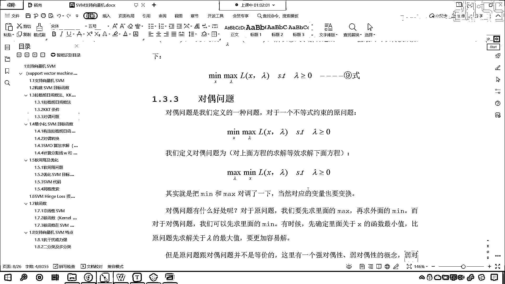

# 7天爆肝整理！AI量化交易-机器学习全套教程，从入门到项目实战保姆级教程！（数据挖掘分析／大数据／可视化／投资／金融／股票／算法） - P129：3-SVM支持向量机对偶问题转化 - Python校长 - BV1KL411z7WA

得到這個之後，不太好求，因為先求λ的最大值不太好求，那麼我們現在定義一個對偶問題，一聽對偶問題，咱們就感覺好高大上啊，啥是對偶問題呢？它其實就是一個定義，咱們上面是不是得到了9勢啊，我得到了9勢。

那我怎麼樣呢？你裡邊是max，外邊是min，我把它對調一下，maxλminx，這個就叫對偶問題，也就是說，對偶問題，我求下面這個方程，求解起來更簡單，因為先求最小，咱們求導數就可以了，然後再求max。

下面這個更簡單，求上面這個就複雜一點，那現在你想一下，這兩個方程，我們把反過來，min，max反過來，這樣寫成立嗎？就相當於把它們對調了一下，能不能對調呢？，那這個就是對偶問題啊，那下面呢。

在對偶問題這個裡邊，我們就介紹了一下，我們這樣寫是可以的，數學上是可以證明的，我們把咱們通過KKT條件推導出來這個方程，我們把它叫做原問題，我們把max和min顛倒過來，我們把它叫做對偶問題。

有的時候這個原問題不好求解，那對偶問題呢，容易求解，對於原問題，我們是先求裡面的max，再求外面的min，而對於對偶問題，我們是先求裡面的min，那有時候呢，咱們先確定裡面關於x函數的最小值。

比原問題先求解關於λ的最大值更容易求解，那麼這個呢，咱們也不做證明啊，我的水平有限，我也沒有辦法證明，大家知道就行，以後你出去進行面試的時候是吧，你講到這一層也就可以了，好，那麼。

但是原問題跟對偶問題並不等價，就是說你原來是裡邊是最大，外邊是最小，現在你外邊最大，裡邊最小，它倆等價嗎？那麼這個裡邊呢，有一個強對偶性，弱對偶性的概念，弱對偶性對於所有的對偶問題，是吧。

這個弱對偶性對於所有的對偶問題都有一個性質，看，就是下面這個性質，我們先說弱對偶性啊，啥是這個對偶性呢，啥是強對偶呢，這個強對偶呢，就是你轉換之後求解得到的答案完全一樣，這就叫強對偶，你弱對偶呢。

就是你翻轉之後求解出來的結果不太一樣，是吧，這就叫弱對偶，那我們看一下弱對偶對於所有的對偶問題都有一個性質，是什麼樣的性質呢，那麼你看，它有一個我們原問題，大家看一下啊，後面這個min，x，max。

lambda，這個是不是咱們的原問題啊，那麼右邊是原問題，左邊是咱們的對偶問題，那麼我們對偶問題，它呢是小於等於，小於等於咱們的原問題，那為什麼是這樣呢，為什麼是這樣呢，看啊。

對於x星號和lambda星號，那這個表示什麼呢，是函數取最大值最小值時對應的最優解，也就是說，我們把lambda星號，咱們將lambda星號帶到咱們這個方程當中，我們所求解出來的。

咱們將這個lambda星號帶進去，那麼我們所求解出來的，咱們所求解出來的就是它的最大值，那看這個星號呢，就是最優解，星號就是最優解，那這個地方也是以符號來表示，這個地方也是以符號來表示，也就是說。

原問題呢始終是大於等於對偶問題，那為什麼呢，看啊，下面呢我們會有一個這個說明，如果咱們的問題是強對偶，那麼兩邊就完全相同，那為什麼會是上面這個公式呢，為什麼是對偶問題小於等於呢，咱們看一下它的推導過程。

我們不用看推導過程，你想一下就行了，你看我們現在是不是有一些底兒，咱們上面這個公式是吧，從兩側，我們從左側來看，你看啊，lambda值合適的情況下，咱們是不是就找到了最小值，lambda值合適的情況下。

咱們就找到了最小值，那這個是什麼意思呀，就是從一堆小的當中，我們找到最大的值，因為你看，你能夠發現，我們裡面是不是在求最小值呀，看到了吧，叫做me，那麼你外面有一個max，這個表示什麼。

是不是從一堆小的當中，咱們找最大值呀，你max，我們把這個當成一個整體，是不是就相當於從一堆小的當中找最大值呀，那從一堆小的咱們就排吧，排排排排排，你看，到這之後是吧，是不是我們就找到了，中間這個。

咱們就相當於從一堆小的當中，我們就找到了最大值，因為你看，啥叫max呢，max是不是就說明它最大，對不對，所以說就是從一堆小的當中，咱們找見最大值，那我們從右側看，你現在就能夠發現，也就是說。

x值合適的情況下，咱們找到了最大值，這個是從一堆大的當中，咱們是不是找最小值呀，你看，從一堆大的當中找最小值，因為你就能夠發現，你看這個符號，咱們是不是mex呀，你mex後面跟的這個叫什麼。

後面跟的這個是不是叫max，後面這個跟的這個是max，那就是從一堆大的當中找什麼，找最小值，所以說你看中間這個，它就是從一堆大的當中找了一個最小值，就是從這一堆大的當中，我們找了一個最小值。

從一堆大的當中找了一個最小值，所以說咱們的這個關系呢，它就是從小到大，那麼，我們這個隊友問題，咱們的這個隊友問題呢，那麼就是，隊友問題它小於等於咱們的這個原問題，所以說呢，咱們可以通過隊友問題。

將咱們的原問題來進行一個轉化，通過它來進行一個轉化，那因為我們的這個隊友問題，看到了，因為咱們的隊友問題是不是比咱們的原問題小呀，看到了，隊友問題比咱們的原問題小，所以你想，我們所求解出來的這個X。

是不是和咱們的原問題也是一點一點趨近呀，對不對，你看，就是說咱們的這個，那我們在最終呢，咱們都是要去求解誰呀，最終都是要去求解它，是吧，你這個原問題呢，是從一堆大的找咱們的小的，我們的這個隊友問題呢。

是從一堆小的找咱們的大的，最後都怎麼樣，殊途同歸，最後呢，我們所求解的這個最優解，它們呢是一致的，這個呢，就是咱們的這個隊友問題，就是在隊友問題這個地方，我們就介紹了一下。

我們原問題為什麼可以寫成隊友問題，因為呢，它有這樣的一個小於等於的這樣的一個關系，那我們將原問題寫成隊友問題之後，那這個問題呢。

就更加容易求解了。

