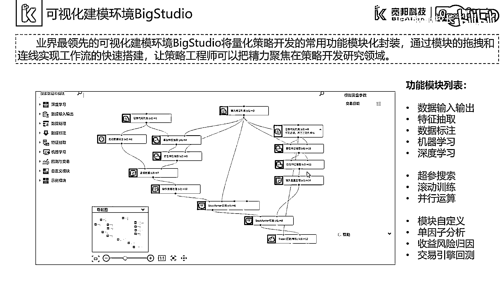
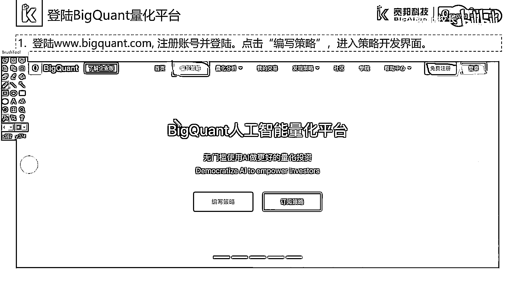

# 7天爆肝整理！AI量化交易-机器学习全套教程，从入门到项目实战保姆级教程！（数据挖掘分析／大数据／可视化／投资／金融／股票／算法） - P12：2.2.1-可视化坏境BigStudio - Python校长 - BV1KL411z7WA

这一节我们介绍一下BigStudio，BigQuant提供的可视化编程界面。

首先，我们通过登陆网站www。bigquant。com注册账号并登陆，我们通过点击右侧的"免费注册"可以进行账号的申请，申请账号后我们可以进行登陆。

随后我们点击"编写策略"按钮进入策略开发界面。

在策略开发界面中，我们可以点击"新建"按钮，在团窗中我们选择"可视化AI策略"。

我们可以进入BigStudio的策略开发环境，观察我们的网页页面可以发现，我们的页面从左至右分为四个区域，依次为策略列表区，BigStudio的模块区，BigStudio的画布区。

以及模块参数和帮助文档区，我们通过点击模块参数，可以实现参数的修改，在页面中我们可以发现图中绿色的方块内，有一些箭头，我们可以通过点击这些按钮和箭头，来实现这四个面板区域的展开或者收缩。

在画布的下方我们可以看到，这里有一个导航栏，我们可以通过加号和减号来进行画布的缩放和扩大，我们可以通过1:1这样一个按钮实现实际尺寸的显示，此外我们可以实现画布的移动。

以及画布的自适应显示。

