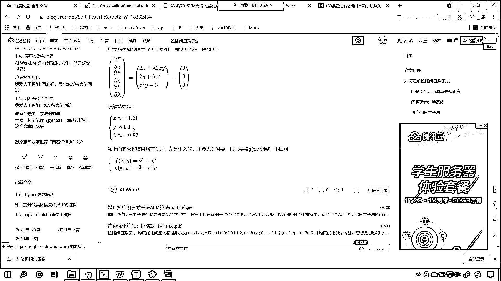
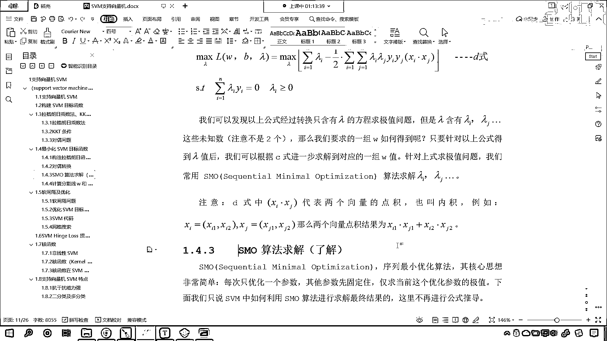

# 7天爆肝整理！AI量化交易-机器学习全套教程，从入门到项目实战保姆级教程！（数据挖掘分析／大数据／可视化／投资／金融／股票／算法） - P130：4-SVM支持向量机目标函数构建 - Python校长 - BV1KL411z7WA

对于SVM的函数进行构造，我们对它进行最优化，到这儿我们稍微慢一点，你看咱们最小化SVM的目标函数，根据咱们之前所讲的，是不是就是它呀，对不对，就是它，那我们就根据拉格朗日乘字法，根据KKT条件。

根据队伍问题，我们就可以按照如下步骤，来计算SVM目标函数当中的，W了，只要我们能够求解出W，那么这个问题就求解了，好，那么接下来，我们就构造拉格朗日，函数，现在你能够看到，我就构建一下，你来看。

你看我在构建的时候，你看上面是不是原函数，那么这个是不是咱们的约数，我怎么构建，你看我是不是给一个Lambda，看到了这个地方，我是不是给一个Lambda，看到了，这个地方，我是不是来了一个求和。

对不对，我让Lambda乘以谁，是不是乘以咱们的约数，对不对，最后咱们ST，我们是限制一下，要让咱们的LambdaI大于等于0，这个咱们已经证明过了，你现在就能够发现，我们的公式，看我们的公式从这。

到这个地方，你看从这到这个地方，你现在能够知道，你看为什么可以写成这种形式吗，从这到这，我们是不是就，构建了拉格朗日函数，对不对，构建拉格朗日函数的时候，你看是不是就让它乘以。

是不是就是让它乘以一个Lambda，对不对，Lambda乘以咱们，约数条件这个方程，对不对，因为我们是有多个，多个数据，所以说Lambda，它也是有多个，Lambda1，Lambda2。

一直到Lambdan，好，那么你现在就能够看到，我们如果想要对它进行优化，我们在这是不是来了一个max，Lambda，然后在这来了一个mean，W和B，对不对，因为我们，是要求谁的最小值。

我们是不是要求它的最小值，对不对，看我们要求它的最小值，现在我们给这个方程加入了一项，你看咱们加入的这一项，有什么样的特征呢，Lambda是大于等于0的，而咱们1-YWTXI，加上B它是不是小于等于0。

一个大于等于0的数，乘以一个小于等于0的数，那你想，它这个值，是不是一定是小于0的，它是向下的，是不是，所以说，咱们为了，让咱们这个模型，有一个最优解，咱们给了一个什么，max，因为你这个损失。

你这个损失加了一个负的，那不行，咱们得怎么样，找到合适的Lambda，让咱们这个是吧，尽量往上走，让它尽量最大，你大到一定程度，不就相当于，这一堆都是0了吗，是不是，你想你大到一定程度，这一堆都是0。

是不是和咱们原来的损失函数，是不是就一致了，对不对，所以说你看它有一个这样的逻辑，好，那么我们构造的，构造上面的，损失函数，它必须得满足一下的KKT条件，看到了，那就是1-YI，是吧，小于等于0。

Lambda大于等于0，然后Lambda，乘以咱们1-YI，让它得等于0，好，那么上面的，损失函数我们构建了，那不好求，怎么办，咱们进行队友转换，那我们在进行队友转换的时候，你看其实就是，Max。

在里面，现在你看我们是不是把它放到外面了，看到了吧，这个时候你看队友转换之后，咱们就放到外面了，在这里你只需要知道，我们可以进行队友转换，就OK了，我们是可以进行队友转换，因为我们在上面。

是不是对队友转换问题，进行了一个讨论，对吧，进行完队友转换之后，刚刚，得到了B式，针对于B式，我们假设参数，Lambda固定，那这个假设，Lambda参数固定，是不是就是把Lambda，当成一个常量。

咱们在这个地方，是不是求了偏导，你看我们在这，是不是求了偏导，看没问题，看我们在这求了偏导，对不对，因为你求偏导是吧，你这个Lambda就可以当成常量，好，那么我们在这就求了偏导，看咱们，求了偏导数。

对不对，好，那么有了偏导数之后，看我们另偏导数等于零，咱们就可以得到一个关系，看我们得到什么样的一个关系，你看，在这我们就可以得到这样的一个关系，大家仔细听，注意听，你看，因为你等于零。

那我是不是就可以，由上面的偏导数，是不是就可以得出下面的值，看了吗，你的W，是不是咱们要求解方程的系数，没问题，那这个W等于谁，是不是就等于咱们的，LambdaI乘以XI再乘以YI，对不对，没问题。

是不是，我们要求解的方程的系数，是不是有XI和YI，是不是咱们的数据，对不对，X是数据，Y是不是目标值，Lambda是谁，Lambda是不是咱们的拉格朗日乘子，对不对，然后你看。

LambdaIYI等于零，是不是，好，那么我们也就知道了，原来咱们的方程的系数，是由LambdaIXI和YI，他们共同决定的，我们按照方程组的思想，我们现在将，上面计算得到的结果，带入到咱们的B室。

看我们将带入到B室，看了吧，好，那么我们带进去之后是吧，你看现在，我们把它带进去，带进去之后，你现在就能够看到，我们经过一堆计算是吧，咱们就可以得到这样的一个结果，看啊，那带进去之后，你就发现。

这个方程当中，还有W，还有B吗，看到了吧，带进去之后，这个当中是不是就没有W，也没有B了，那我们就发现，咱们原来要求解的问题，还有W还有B，现在我们将问题转换成什么了，现在咱们是不是将问题转换成了。

只有W方程的求集值问题，对不对，看这就是非常巧妙的一个转变，那大家要注意，咱们的W，我们是含有Wi，Wj省略号，注意，咱们的未知数，它不是两个，这个时候未知数不是两个，那么我们要求的一组W如何得到呢。

只要针对以上公式，我们能够得到lambda的值之后，你想lambda的值，你要是能得到，看对于这一堆数据，只要你能够求解出来lambda，那么咱们求解W，是不是就易如反掌了，你再往上看，我们往上滑。

你看咱们的W等于谁，是不是就等于lambdai，乘以xi加上yi，是不是就等于它，看没问题吧，看就等于上面的，现在的问题，你看咱们就进行了一个转化，是不是，那么，我们要求的一组W，咱们就可以根据。

求解lambda之后，咱们进行求解，那么如何求解lambda呢，看现在的问题又出来了，是吧，如何去求解lambda呢，我们常用的方法是SMO。

叫Sequential Minimile Optimization，来求解咱们lambdai，lambdaj，各种各样的lambda，各种各样的拉格朗日乘字，注意，在咱们d式当中的。

看我们上面有一个d式，你看abcd，咱们找一下咱们的d式，你能够看到在d式当中，是不是有一个x，xi xj，对吧，中间是底，那这个底表示什么，这个底就表示咱们的矩阵乘法，它就表示内积，我给你举一个例子。

比如说xi等于xi1xr，xj就等于xj1xj2，那么两个向量底的内积，就是xi1xj1，是不是行成一列，对不对，这就是行成一列，好那么到这之后，你看咱们的问题，本来我们是要求w和b，现在咱们的问题。

是不是就变成了求解lambda，请问这个lambda是谁，这个lambda，是不是就是咱们的拉格朗日乘字，对不对，看这个lambda，就是拉格朗日乘字，那么之前我们在介绍，拉格朗日乘字法的时候。

我们为大家进行过相应的推导，你如果要有忘记，再看我写的这篇文章。

在这篇文章当中，我们就介绍了，拉格朗日乘字，它是如何构造的，一点一点，我这个前戏很长，是吧，一直引出到最后，是吧，才下了一个定义，我们构造拉格朗日乘字法，咱们构造拉格朗日乘字法，然后对它进行求解。

最终我们就可以得到，咱们想要求解的x和y的值，看到了吧。

最终就可以求解这个值，所以说，这些都是一步一步来进行关联的，这些都是一步一步进行关联的，好，那么现在。

