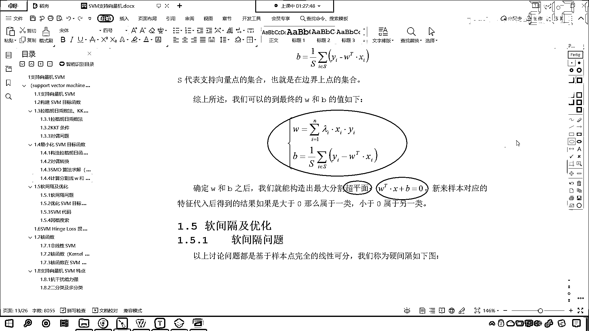

# 7天爆肝整理！AI量化交易-机器学习全套教程，从入门到项目实战保姆级教程！（数据挖掘分析／大数据／可视化／投资／金融／股票／算法） - P131：5-SVM支持向量机损失函数SMO求解过程 - Python校长 - BV1KL411z7WA

SMO算法是我们了解的部分，那么我也带着大家一起过一遍，让大家心里有一个数，SVM知识线段机这篇文章写下来花了多长时间，花了一周才捋顺搞清楚，所以你在看的时候，你得花一点时间。

咱们课堂上对你进行讲解的时候，那有可能你一遍没听懂没关系，你就根据这个顺序往下走，搞懂一部分，然后你再去看是吧，那你就一点一点就明白了，那这个SMO呢，翻译成中文叫做序列最小优化算法。

其核心思想非常简单，每次只优化一个参数，其他参数先固定，仅求当前这个优化参数的极值，下面我们只说SVM当中如何利用SMO算法进行求解，是吧，那我们看一下，咱们这里就不做公式的推导了，现在你看。

我们所有的问题是不是都落在他身上了，求他的最大值，只要咱们求解出来了，是吧，他的这个最大值所对应的朗姆达，那么我们所要求解的W所要求解的节句B是不是就迎刃而解了，对吧，好，那么他该如何求解呢。

看我们根据D咱们可以看到是吧，咱们的狼不大爱是吧，多个狼不打多个拉个狼是橙子，是吧，他呢是有很多参数，由于咱们的优化目标当中的约束条件，你看就只有这一个叫做狼不打爱外等于0，那这个是怎么来的呢。

看看这个是怎么来的，来，咱们画出来图是吧，先把它框起来是吧，这个是怎么来的呀，是不是我们上面求导数得到的呀，你看我往上划啊，来，咱们找到他是怎么来的啊，你看看在这儿呢，看到了在这儿呢。

我们对于谁进行了求导数，看咱们是不是对B求偏导，是不是就得到他了，看到了，这是一个很重要的条件，也就是说我们的拉个狼是橙子法，乘以咱们的目标，乘以咱们的目标值，他所有的结果得到的是不应该是零呀，对不对。

看到了吗，他是这样的啊，好，那么来咱们接下来呢，我们有这个条件之后呢，那么我们就充分利用一下啊，因为我们在讲解这个知识限量机的时候呢，咱们这个令外，他所代表的样本，他属于是负一或一，看他属于是负一或一。

那你知道，咱们其他的这个案例当中，其他的这个项目当中，我们的外目标值，有的时候是不是012啊，对不对，有的时候是0123，这个都没关系啊，你要知道这个没关系，这个负一和一。

他是不是就是一个数字的一个表示呀，我们为了能够更清楚的讲明白他，所以说我们给了个负一和一，所以说你看这个知识限量机是吧，咱们给了红色的点，给了蓝色的点，红色的点是正的，那么蓝色的点就是负的啊，哎。

他这他是这么个意思啊，好，那么，那根据sm算法，我们假设是吧，朗姆达三朗姆达四朗达恩这个参数固定，其实一开始的时候，咱们想要求解，朗姆达一朗姆达二，一直到朗姆达恩，我们不知道他是多少，那怎么办。

我们先随机给他这个创建一个，是吧，随机创建一系列的这个数据，那么我们先假设这些值固定，那么朗姆达一朗姆达二之间的关系，也就确定了，因为他们总的和是不是等于零，所以你看我是不是就可以写成这个公式。

因为他们总的和是零，所以我是不是就可以写成这个意识，那其中这个c等于c是谁，c就是咱们朗姆达三，朗姆达四，朗姆达恩，这所有的这个和，是吧，我们看这叫先什么先假设，看到了，因为这个还是因为这个变量太多。

但是方程太少，看到了吗，变量太多，方程太少，想要求解这样的方程，没办法，知道吧，你不能求导数，没办法，所以说我们就只能假设，是吧，假设他们参数固定，先求谁呢，咱们先求朗姆达一，朗姆达二，这叫各个击破。

是不是，好，那么乘以对应的类别外，你看得到常数，根据意识，我们可以发现，咱们这个朗姆达一和朗姆达二之间，它是有等式关系的，你看你根据意识进行化解，是不是就能够得到等式关系，在这咱们就不做细说了。

也就是说我们可以使用，朗姆达一的表达式来代替，朗姆达二，你看对不对，你看因为这个朗姆达二，是不是完全可以用，用咱们的朗姆达一来表示，这样我们就可以将d式看成，只含有朗姆达一大于等于0。

这个条件下的最优化问题，这样我们就可以将d式，啥是d式，咱们往上划，看看什么是d式，你看这个是d式，看到了吧，看到了这个是d式，d式当中，因为有朗姆达一，朗姆达二，一直到一直到朗姆达n太多了，对吧。

怎么办呢，咱们把其他的参数都固定，你固定成多少，这个无所谓，对吧，全把它固定一下，那么我们经过，只保留朗姆达一，朗姆达二，我们朗姆达二，又可以用朗姆达一来表示，所以这个时候，就只有朗姆达一了。

这个方程当中只有朗姆达一，那么我们，你看d式当中，只含有朗姆达一一个位置数，求极致问题，我们是不是就可以求导，求导，然后令导数为0，咱们是不是就可以得到，朗姆达一的值，然后根据朗姆达一的值。

咱们计算朗姆达二的值，通过以上固定参数，多次迭代，计算得到一组朗姆达，你看多次迭代，计算得到一组朗姆达，这种方式，是不是就有点瞎蒙的感觉，看到了吗，参数太多，这种时候，是不是就有一种瞎蒙的感觉。

确实是有，他这个时候确实就有一种瞎蒙的感觉，因为我们计算机，它可以进行放循环，多次执行，因为我们刚才也说了，你看咱们这个方程是吧，它有一个方程，这个方程有多个系数，但是只有一个条件，看到了吗。

朗姆达i等于零，这个条件不够，也就是说，僧多肉少，那怎么办，我们就得先让方丈吃饱，是不是，然后再想办法，是吧，方丈去化缘，再让其他的小和尚吃饱，一个一个的去解决，你如果说要是大家抢的话。

最后谁也吃不饱饭，是吧，都得饿死，所以说，这个SMO算法就是序列最小化，这个方式就是各个击破，是吧，一个一个来，最终就可以求解出，最终就可以求解出一组朗姆达值，所以说它是多次循环来求解，好。

那么只要我们求解了朗姆达值，那么，是吧，咱们是不是就可以根据C式，我们说这个W和朗姆达什么关系，是不是就是，朗姆达I乘以XI再乘以YI，是不是就得到W，此时你的W只要有了朗姆达，那么你的W。

方程的系数就可以求解了，有了这个方程的系数求解之后，看我们再看KKT条件，是吧，你的KKT条件，是，你看，朗姆达乘以咱们的一减去YI，它是不是等于零，对不对，那么，根据F式，看根据F式，可是。

可知当朗姆达大于零时，看当咱们朗姆达大于零时，一定有一减去，YIWT加B等于零，看一定有它，那么，如果，我们的朗姆达大于零，这个，时候，咱们就找见了支持向量，看这个时候，咱们就找见了支持向量。

如果你朗姆达大于零，那么一定有它等于零，你看为什么，你看我们再往上稍微滑一点，你看因为一减去Y，因为一减去YI乘以WTXI加B，这个是不是小于零，朗姆达是不是大于零，而咱们的朗姆达乘以它。

是不是得保证它，等于零，如果你朗姆达要大于零，你看你朗姆达大于零，那你怎么保证中间这个式子等于零，是不是括号里边，必须得等于零，不就是它吗，对不对，你看就是它，是不是，一定有它等于零。

这样你才能保证中间，是不是，等于零，那么，只要咱们对应的朗姆达大于零，那么，这个点，它就对应的支持向量，它就对应着支持向量，如果朗姆达等于零，那么它就，不重要的点，它一分就被分开了，你看因为我们想要对。

这些数据划分开，你看我们想要对这些数据划分开，你像，你这条虚线外面的这些点，它是不是一分就分开了，它其实对于我们的算法不是特别重要，哪些才重要，就是咱们这条线上的底，线上的底，线上的底又叫支持向量。

那这个支持向量是吧，它所对应的朗姆达，就是大于零的，这样，你看，那么我们就知道了这样的一个关系，是吧，那咱们就带进去，看到了吗，对它进行化解，化解之后，你看，你的b，咱们的结据，看是不是就出来了。

看到了吗，b是不是就等于yi-wtxi，你不就是上面这个方程吗，是不是，看我们左右两边同时乘以yi，看到了吗，yi的平方，它就等于yi，因为yi的平方是吧，它一定等于多少，一定等于1。

你知道咱们的yi是什么，yi是不是就是咱们的目标值，我们现在所举例子，咱们的目标值，它是不是正一和负一，对不对，你看咱们的目标值，它是正一和负一，所以无论还是正一和负一，你只要平方一下，是不是得到1。

这个是不是就可以化掉，看到了吧，这个就可以化掉，化掉之后，b是不是就求解出来了，那么假设说我们有s个支持向量，是吧，如果是只有一个支持向量的话，这个结局就求解出来了，如果要是有s个支持向量。

我们可以求什么，咱们可以求平均，看到了吧，b就等于1/s是吧，把它都求和求平均，因为如果咱们的数据要是严格划分，那么b是一致的，你就好比，看咱们之前讲我们所举的例子，你看 p1点和p2点。

它俩所对应的结局是不是都一样，因为在一条线上，对不对，但是有的情况它复杂一些，如果要复杂的，如果要复杂一些是吧，我们可以通过求平均值，是吧，来得到一个平均的结局，所以看经过我们转换之后。

经过咱们拉格朗日乘字法，kkt条件转换，smo算法求解，我们最终是不是就可以得到，咱们的w和b了，有了w和b之后，是不是就构造出了，分割的超平面，看到了吗，分割的超平面，就是咱们这个方程。

那么我们把数据带入到这个方程当中，如果大于零，那么它属于一类，如果小于零，那么它就属于另一类，到此为止，看到此为止。

咱们smo算法。

我们就进行了一个讲解，他沒去看見你。