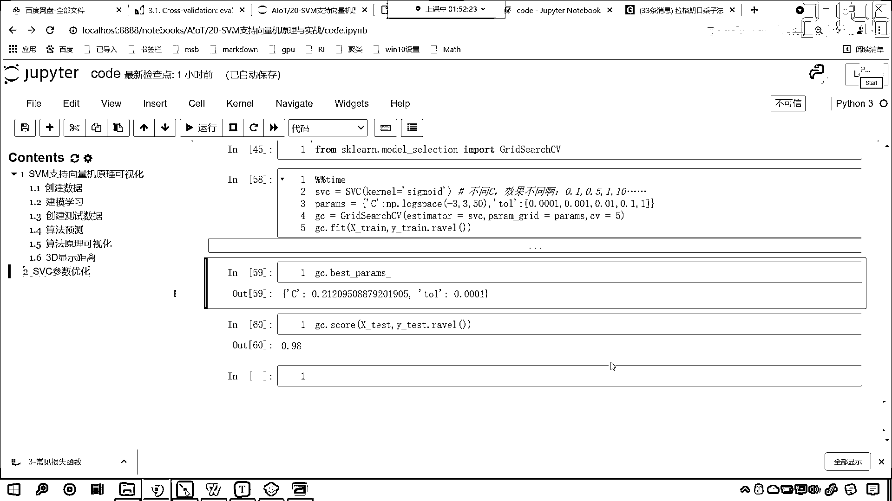

# 7天爆肝整理！AI量化交易-机器学习全套教程，从入门到项目实战保姆级教程！（数据挖掘分析／大数据／可视化／投资／金融／股票／算法） - P132：6-SVM支持向量机网格搜索参数优化 - Python校长 - BV1KL411z7WA

好 那么刚才呢我们看了一大段的这个代码，接下来呢 我们就看一下咱们的应用好不好，来 现在呢咱们就回到代码当中，好 那么我们把这个该合起来的给它合起来，在下面呢 咱们给它插一个插入一行。

好 那么插入一行 上面的这个呢 咱们就可以关闭掉了啊，一关闭全关闭了 是吧，我们往下滑 咱们再来一个三级标题，好 那么接下来呢 我们就看一下咱们这个SVC它的参数优化，我们就看一下参数优化，好 那么。

现在呢 我们就使用咱们这个数据啊，好 那么咱们当前目录下有两个文件，一个是测试数据 另一个是训练数据，那么现在呢 咱们先把数据给它加载进来，咱们的数据呢 这个时候呢 我们就得需要。

这个时候呢 咱们就得需要这个写一个方法，这个方法呢 这个用来加载咱们的数据 并且返回，好 那么我们各位小伙伴 大家呢 就复制一下就可以了啊，来 回到咱们的代码当中。

首先呢 我们导一下包 咱们import numpad as np，from sklearn svm，咱们import svc 执行一下代码，然后呢 我们就定义一个函数，那么这个函数的作用呢。

这个函数的作用 它呢 就是获取里面的数据，现在你能够发现，咱们这个里边是不是有很多都是红色的呀，我告诉你为什么啊，选中它shift+tab 咱们给它来一个缩近，然后呢 这个line这一行是吧。

也给它来一个shift+tab缩近，这个之所以它会飘红 就是因为它缩近的这个不太标准，那么我们选中再来一个tab，你看 统一是不是缩近了，然后这个line第三行呢，它是在位置里边 咱们也来一个缩近。

那对于这个方法 咱们进行一个介绍，这个方法呢 就是读取数据，那我们只要给它传一个文件的路径，咱们使用open python当中的这个io操作，把这个文件内容打开，你这个文件里边的内容 无论是什么。

是吧 无论是图片也好 还是文本也好，还是你没有后缀也好，你看 咱们给的这个txt data，trend data 是不是没有后缀呀，你看我能不能打开啊，默认情况下 咱们是使用什么打开的呀。

默认情况下 我们是不是使用咱们的，txt就把它打开了，它也是可以打开的啊，打开之后你看我们，这个是不是对应着数据呀，这最后一列是它的目标值，知道吗 最后一列是它的目标值，那么它的数据是一行一行的。

看到了吧 一行代表一个样本，一行代表一个样本，所以我们就要把它所有的行，给它怎么样呀 给它读取进来，这个读取进来之后呢，咱们就列表生成式，列表生成式，那有了这个列表生成式之后呢。

咱们将它的这个line呢，给它进行一个这个strip，就是把它的左右两边的这个空格，我们给它去掉，去掉之后呢，咱们来一个这个zap，来一个zap，这个时候咱们就批量的取出x和y了，取出x和y之后呢。

咱们将这个数据给它转换成numPy数组，下面这个你看它就简单了啊，下面这个它就简单了，好那么，现在呢我们执行一下，这个时候你看它就不飘红了，复制一下，这个呢是咱们python基础当中相应的知识点。

大家呢，这个如果要不明白是吧，那我们看一看咱们的python基础啊，来现在咱们就调用这个方法，咱们将当前目录下有一个data，data下面有一个trim是吧，咱们就获取trim这个文件。

那么我们得到的数据咱们接收一下，就叫xtrim，然后目标值呢我们就叫ytrim，好这个时候我执行一下这个代码，现在呢我给你看一下咱们数据是什么样的啊，咱们display一下。

这个时候我们看一下咱们xtrim。shap，是吧它是500个数据，那我们的目标值y呢，调用np。unique，我们将ytrim放进去，这个时候你就能够看到它是01，是不是就分两类呀，那训练数据得到了。

咱们接下来read data，点返斜杠data下面，再来一个返斜杠test data，这个就是咱们的测试数据，那就是xtest，外下滑线test，这个时候我执行一下，咱们对它进行一个输出。

看一下咱们的xtest它是多少数据，它是100个对不对呀，那么我们就用咱们的这个，声明咱们的算法svc就等于svc，声明算法之后呢咱们就svc。fit，x下滑线春，y下滑线春，那么svc。score。

咱们x下滑线test，y下滑线test，咱们看一下，大家现在就能够看到，你看我们的准确率是不是一下子就到1。0了，看到了吧这个准确率一下子就到1。0了，这是不是说明它很好呀，看到了吧准确率一下子就到1。

0了，现在我们就能够发现，你看又告诉我们什么，是不是又有一个粉红色的呀，该怎么办，咱们将这个外春呢对它进行revel，revel呢就相当于是把它进行平铺，那这个revel了test呢也得revel。

执行，现在你看准确率很高是不是1。0，也就是说100个数据，咱们是不是全部给猜对了呀，对不对，好那么那你全部猜对了，这个时候你想，我们还需要优化咱们的这个参数吗，那我们里边呢有一个参数叫c。

这个c呢就是咱们的惩罚项，默认情况下它是1。0，默认情况下这个惩罚项是1。0，还有咱们的这个kernel呢它是RBF，我们知道这些值是不是都可以调整呀，对不对你看，这些值都是可以调整的。

那么假如说我这个c给个10，你看一下会怎么样，是吧它依然是1。0，那假如说我这个c呢给一个0。001，咱们看一下，哎现在你就发现，你就能够看到你看这个时候，得到的结果是不是0。56呀，那么在这里呢。

咱们就默认情况下是1，看到了吧得到的结果是不是1。0，那我们呢给它一个合适的c，同时呢，咱们看一下它的这个kernel，看RBF那我给一个linear行不行呢，你看我一执行，给linear行。

咱们给一个poly呢，看一下行不行，也可以咱们给一个sigmoid呢，我们看一下啊，这个sig少一个g是吧，执行一下，看sigmoid得到的结果是不是就是0。83呀，对不对。

好那么sigmoid的情况下我们给个10呢，0。82，是不是，那我们给一个4呢，0。81，咱们调小0。1呢，看这个时候是不是就是0。98呀，看现在这样啊，看我们这样来操作，你看给它。

我们现在呢给它指明它的和函数是sigmoid，那么我们给c多少，它的分数比较高呢，这个是不是就是一个问题啊，那我们现在呢对于，对于咱们的参数进行一个优化，我们导一下包。

这个时候呢就from sklearn，咱们就从model selection当中，咱们选一个叫grid search cv，这个grid search就有网格搜索，这个cv呢就有交叉验证。

好那么我们就声明咱们的这个，这个，jc啊，叫grid search cv，这啥是网格搜索呢，当我们想要，想要搜索它多个不同的参数的时候，咱们就可以使用网格搜索，一个一个进行训练，一个一个进行验证。

好那么，这个grid search咱们就声明了，第一个参数是estimator，那咱们就声明一个estimator，那这个estimator，咱们是不是要找支持限量机当中，它的最优参数呀。

我们是不是要找支持限量机当中，它的最优参数呀，所以我们就声明支持限量机，那我们把svc放进去，你知道，咱们的svc当中，我们是不是给不同的c，它的效果是不是不同呀，对不对，那这个c应该给多少呀。

这个c是不是可以是0。1，是不是也可以是0。5，是不是还可以是1，是不是还可以是10呀，它是不是有很多，你想我一个一个去写，是不是就比较麻烦呀，那咱们现在怎么办，咱们就使用grid search cv。

让它呢批量的，从咱们的参数当中来找最优的，那grid search cv它的第二个参数，它叫做paramgrid，它还有一个参数叫paramgrid，那我们就给它一个paramgrid，这些呢。

这个paramgrid就是我们的参数，那么这个参数呢是以字典的形式呈现的，那我们就声明一个params来一个字典，我们svc当中还有哪些参数呢，是不是有一个大写的c呀，大写的c就是它的乘法项。

它的大小可以影响我们的准确率，咱们现在呢我们给一个叫log space，我们让它从-3我们让它到3，我们把它分成这个，咱把它分成50份，你知道你还记得log space这个函数吗，来我复制一下。

在下面呢，我给你演示一下啊，你看一执行，看咱们是不是生成这么多数据呀，到这之后你就有点看不懂了，是不是没关系啊，咱们现在呢把它变得简单一些啊，比如说我给6个啊，你看如果我要给6个的话。

大家看咱们得到的这个结果是吧，最后依然也是我看看啊，因为我们的密次是这个10的多少次密是不是啊，那么我们就给5个看一下啊，我们给7个呢执行一下，哎现在你就能够发现，这个时候你看咱们。

这个log space你就能够看出来，它是不是怎么划分了呀，咱们打印输出呢设置一下啊，set print options super，我们给它来一个true，这个时候你就能够看到。

log space是怎么样的一个划分，它是不是一个等差数列呀，看到了吧，10倍10倍10倍10倍10倍，是不是一个等差数列呀，因为我是从-3到3是吧，那我给7它正好是吧。

因为-3-2-10123正好是7个，那如果我要给更多呢，它是一个等比数列啊，刚才给说错了等比数列，你看我要给10个，这也是一个等比数列是不是啊，所以咱们上面就从-3到3，就是最小就是千分之一。

最大就是1000，咱把它分成多少份50份，我们呢就让咱们的grid search cv去找，那现在呢咱们把params放进去，jc就有了，然后咱们jc。fit x_train，训练数据放进去。

测试数据呢就是y下滑线test，那这个时候呢，你看我一执行，看一下咱们这个y_train y_test，我们看一下某一个地方给报错了，是不是，我们看一下它报了一个什么样的错啊，found number。

found with number of 500 1000，那肯定是咱们数据不太对了啊，那现在呢我们看一下咱们的，插入一行，看一下咱们的x_train，它的形状是多少啊，shape，是吧它是500和2。

咱们的y，我说呢看这个y，是不是应该叫y_train呀，对不对啊，咱们变量给写错了，再来执行，现在你就发现，这个时候是不是就没问题了，但是咱们现在发现是不是有一堆粉红色的提示呀。

还是因为这个y_train没有进行这个revel，咱们来一个revel，这个时候你看我一执行，现在你看是不是就没问题了，对不对，那么我们从这50个c当中有没有选一个合适的呢，来咱们下面看一下，叫jc。

bestparams，这个时候你就能够发现，我们选的c是多少，是不是0。212呀，看到了吧，0。212你想，如果要是你选的话，你是不是就得放循环一个一个找呀，对不对这个时候呢。

我们就使用jc让它一次性快速的帮我们找到了，其实呢，它里边也是进行了封装，也是进行了放循环，明白吗，好那么我们greatest search cv当中还有一个参数叫cv，看我们说这个cv叫什么。

greatest search是不是叫做这个网格呀，搜索cv呢叫交叉验证，默认情况下这个cv呢它是3，我们可以把它调整，咱们看一下这个cv，默认值是多少啊，我们往下滑，各位小伙伴你就能够看到。

看这个它是一个int类型的数值是不是，这个to use default 5，默认情况下是5，那么我们对它也进行一个讲解啊，这什么是交叉验证呢，这什么是交叉验证呢，你看它也有一个说明，看这个cv叫什么啊。

看叫做cross validation，交叉验证，那这个5呢就表示5fold，fold呢就有折的意思，就有部分的意思，什么意思呀，来我们进入sklearn它的官方文档。

大家看啊这个是sklearn的官方文档，在这个里边就介绍了什么叫做kfolder，看什么叫做kfolder呢，什么叫kfolder cross validation呢，我们将数据给它分成几份，看到了吗。

folder1，folder2，folder3，是不是一直到folder5，你如果k=5是不是就把数据分成5份啊，那分成5份怎么办，那么split1，split2，split3，split4。

split5，咱们呢把其中的4份拿出来作为训练数据，留的一份作为咱们的预测数据，然后把第二份拿出来作为测试数据，剩下的作为训练，这个3呢作为咱们的测试，4作为测试5作为测试，最后我们求平均，你想一下。

如果我们要按照这种方式来对于数据进行操作，那么咱们算法是不是就将所有的数据进行了训练，我们是不是也将所有的数据进行了测试呀，这个时候我们所求得的平均值是不是更加准确呀，对吧。

因为我全部对你进行了这个拆分，folder1，folder2，folder3，咱们都进行了，看到了吧，这是测试数据，这个绿色的就是训练数据，是吧，那训练完一遍，所有的数据都进行了预测，是吧。

那这个时候平均值是不是就更加稳呀，更加具有说明，更加具有这个说服力呀，对不对，所以它是这样的啊，来，the cv，现在你明白是怎么一回事了吧，来各位小伙伴，我们在直播间的小伙伴呢。

如果你明白了cv表示什么，你呢就在讨论区里边扣一波666，好不好，好，那么这就是咱们的cv啊，这个值你可以调，明白吗，哎，所以我们一执行是吧，那我们就得到了，好，那么对于这个网格交叉呢。

我们还可以再给一个参数啊，比如说咱们再给一个参数，看比如说呢，嗯，咱们给一个tol，看这个tol默认情况下是不是0。001啊，咱们还可以，逗号是吧，我们给一个tol，然后来一个冒号，中国号，你看它是0。

001逗号，0点咱们给一个0。01，然后呢，我们给一个0。01逗号，再给一个0。1是吧，逗号再给一个1，现在你就能够发现，你看我这个tol是咱们的容忍度，也就是说咱们算法的精确度。

我是不是给了一个两个三个四个，我是不是给了5个呀，看到了我给了5个啊，那么c它有多少个，c它是不是有50个，那我这现在有两个参数，我该怎么选呀，是不是得让这个c和这个tol，是不是得让它俩交叉呀。

对不对，就是说你首先呢，固定咱们的tol让它是0。001，然后从这50个当中是吧，选最优的，然后再固定咱们的0。001，也让它选最优的，所有的这个参数，他们grid交叉以后，那我们找最优的。

看我告诉你什么是grid啊，看好，好，好，啥是grid，看一二，这个是不是就是grid呀，你还记得，咱们，刚才在讲咱们数据可视化的时候，我们是不是有一个方法叫matchgrid呀，看到了吗。

咱们有一个方法叫什么，是不是叫matchgrid，这啥是grid，是不是就是行和列进行了一个交叉呀，对不对，所以说呢，咱们这个svc数据可视化这是吧，我们如果要给tol是吧，他也他就是这么个意思啊。

咱们现在呢，看一下我们这个代码运行花多长时间啊，看一下这个tol，他筛选出来的这个数据是多少，现在呢我们是50个，后面是5个，所以他要进行多少次迭代呢，250次迭代，那我这个代码呢非常强悍是吧，6。

76。7秒就计算完成了，现在咱们再看最合适的这个，最合适的这个参数，看到了吧，现在是不是0。001，看到了0。001，你知道默认情况下这个值是多少，我给你看一下，默认情况下他是不是千分之一呀，现在。

我筛选出来的最优条件是多少，是不是0。001，好那么我们就可以直接使用jc点，咱们调用pre咱们调用score，我们看一下筛选出来这个最优的，这个算法，他的得分是多少啊，那就是xtest。

外下环境test。revel，哎不要忘了revel，这个时候你看我一执行0。98，看到了吧，我们这个jc当中封装的这个svc，是不是sigmoid呀，我们刚才进行对比了，看到了吧。

如果我们要不进行条件筛选，咱们不进行条件筛选，我们的准确率是多少，看是不是0。83，我们经过一顿操作猛如虎，咱们进行了条件筛选，筛选之后，那么他的分数是多少，0。98，这个是不是有一个大幅度的提升呀。

如果你有更多的参数，那么你就在params当中去添加就行了，注意咱们这个c是随便写的吗，我们这个tyl我们是随便写的吗，当然不是，我们要调整支持向量机，它里边有哪些可以调整的参数，看这个c是啥意思是吧。

这个c呢是咱们的往下看啊，c是咱们的一个正则化的一个一个参数，c是正则化的一个参数，现在呢大家有这样的一个问题了是吧。

那我们就接着这个问题咱们就往下看啊。

