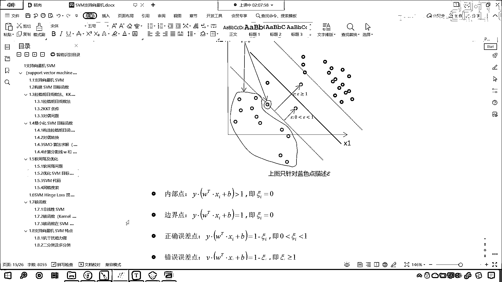

# 7天爆肝整理！AI量化交易-机器学习全套教程，从入门到项目实战保姆级教程！（数据挖掘分析／大数据／可视化／投资／金融／股票／算法） - P133：7-SVM软间隔及优化 - Python校长 - BV1KL411z7WA

那C是什么啊？我们通过软间割进行优化，在这里咱们就可以引出C表示什么，那什么是软间割呢？什么是软中华啊？，软中华抽起来是不是更好一些啊？，是不是更软啊？劲儿更小，以上讨论的问题都是基于样本底的线性可分。

我们上面讨论的都是完全可分，我们称为硬间割，就是这种情况，一分就分开了，但是你的数据都是那么完美吗？，你看这种情况，你就能够发现，是不是咱们这个红色的底跑到蓝色这个区域了。

咱们蓝色的这个底是不是跑到红色区域了，你怎么分你是不是都分不开啊？，对不对？，这种情况呢，我们就得有舍有得，那你像你这个红色的底和这个蓝色的底，那我把你判断错了是不是也没关系啊？，对不对？。

那么这个时候呢，我们就得需要用软间割了，那相比于咱们硬间割呢，条件比较苛刻，必须得分开，软间割呢，咱们怎么样，看我们允许看到了吧，允许个别样本底出现在间割带里边，看到了吧，看下面这个划分。

看下面这个划分，那中间这条黑色的线，咱们就将数据划分开了，这个时候你就发现，你能够看到这个底儿是不是没有划分好，这个底儿是不是划分错了，这个底儿看到了吧，这个底儿虽然把它分对了，但是看它在哪里。

看它是不是在咱们支持线量机的上面呀，你看这就是他所说的啊，允许某个个别样本底出现在间割带里面，是吧，所以说呢，这个时候误差是不是就存在了，这个是不可避免的，是不是，即我们允许部分样本底儿不满足约束条件。

看啊，这一点很关键，看到了吧，如果我们所有的样本底儿要都满足这个条件，这个是不是就是硬间割，你如果所有的样本底儿都满足这个条件，那咱们是不是就可以把数据分开呀，对吧，但是呢，数据呢，这个总有一些噪声。

是吧，像这种情况，这种情况，这种情况，你无论怎么找，你是不是都找不到一个合适的方程，能够把它分开呀，明白吗，看到了吧，就是说，我们出现了这些点儿，这些点儿和这些点儿，就是说无论你怎么找。

你是不是都找不到这样的方程，能够完美的把它们分开呀，对不对，好，那这个时候呢，我们就得退而求其次，是吧，咱们允许是吧，他们有一定的误差，那为了度量这个间割软到何种程度，是吧。

我们为每个样本引入了一个松弛变量，是吧，你可以松一点是吧，这个叫什么，可惜，看这个叫可惜，可惜呢，是大于等于零的，加入松弛变量之后，我们的约束条件就变成这个，就是咱们这个方程就变成了大于等于一减可惜。

就是说，你不一定非得大于等于一了，是吧，你大于零点五也可以是吧，这样不等式就不那么严格了，看，不等式呢，就不会那么严格了，看，那这个可惜呢，每一个样本和每一个样本还不一样，那你如果说是这个点，看了吧。

如果说要这个点，那么他的可惜就大一些，看了为啥呀，你都分错了，看到了吧，你本来属于是蓝色的底，但是呢，你跑道，是不是身在曹营心在汉，是不是啊，看到了你的心都跑到人家这边了，是吧，那这个时候呢。

他的可惜呢，就大一些，是吧，你看，如果你要在这个地方，看，大家看啊，如果要在这个地方，就是你在这个分割线和咱们的这个边界中间，那么这个可惜就是大于零小一，那如果说我们要在看，如果说我们要正好在这呢。

看正好在这呢，咱们的可惜就等于零，看，你要正好在边界上，那么可惜等于零，还有你如果要在这个边，在咱们的边界外面，是吧，那么可惜也是等于零的，是吧，因为这个时候完全分开了，对吧，那你看啊。

咱们再问一个问题啊，这个红色的底，他的可惜是多少呀，红色的底，红色的底是不是来各位小伙伴，那请问这个红色的底，他的可惜大于零大于一吗，大于一是吧，哎，因为呢，红色的这个底和咱们蓝色的这个底。

你看他俩是一样的，是不是啊，跑的是不是都比较偏呀，对吧，因为你只有把这个可惜给他加大，他才能跑到这边，是不是啊，哎，所以说呢，你看内部的点，可惜等于零，看到了吗，就是蓝色的点，咱们就举例了。

红色的点也一样，是吧，内部的点可惜等于零，边界上的点，可是也等于零，咱们正确的误差点，看什么叫正确的误差点呢，我这条黑色的线，把这个点分类，是不是分类正确了，你看也就是说你在咱们分类边界和咱们的这个。

在咱们的分类线和边界之间，这个叫做正确的误差点，他依然叫误差点，根据咱们硬间隔的标准来看，他就是误差点，因为如果说我们要能够找到一条线是吧，根据咱们硬间隔，你就应该画到这一堆里边，但是呢，是不与愿违。

是不是啊，你就应该在这，但是呢，他偏偏在这，那怎么样，哎，他呢，就是大于零，小于一，是吧，嗯，那错误的误差点呢，看到了吗，这什么叫错误呀，错误的误差点就表示咱们这个红色的点和这个蓝色的点是吧。

这个就是错误的误差点，错误的误差点呢，哎，你就偏离的有点大了，知道吧，我们说的正确呢，就是分类给分正确了，是吧，虽然你有一定的误差，但是呢，这个，在一定的误差范围内。

那么我依然认为你是这依然依然认为你是蓝色的这一类点，好，大家看啊，有了这之后呢，我们接下来就优化咱们SVM的目标函数，那你看这个时候，看这个时候咱们就有了个什么，看这个时候我们是不是就有了个C呀。

你知道咱们刚才在代码当中，我们说的那个C是什么了吧，看到了那个C是什么呀，那个C是不是就是他呀，看其中的C呢是一个大于零的常数，这里在原有目标函数当中，我们加了一个C这个求和。

可惜可以理解为错误的惩罚程度，我们希望对应条件下是吧，这个这个mean二分之一w的平方加上C可惜变小，你看，我们同样也是希望它变小，你知道为什么吗，因为你加了这个惩罚项，它变小，是不是你看。

因为我们知道你看正确的误差点，错误的误差点，他们这个可惜是不是都越来越大呀，你看到了吧，你只要就是说有偏差，那么这个可惜一定是越来越大的，是不是，那我们构建构建了惩罚项，我们同样也希望他俩求和越来越小。

那么对应的也是希望它变小，那如果我们的C无穷大，那么C无穷大，那么这个，符号，你看如果这个C无穷大，那么咱们这个可惜必然是不是无穷小呀，对不对，如果说你给的C很大很大，那你想你这个可惜是不是就是很小呀。

对吧，因为我们要让总体的这个是不是很小，你C系数变大了，你这个可惜是不是就得小一点，对吧，因为我们求的是最小值，是不是这样的话，SVM就变成了一个完全线性可分的，完全线性可分的SVM。

那当然你看如果咱们这个C越小，那么这个可惜是不是就越大，你看到了吧，你想一下，如果我们的C是吧，他这个越小，那这个可惜是不是就可以相对来说大一点，你可惜要是大会怎么样。

这个是不是就是咱们的软件哥那个系数，你可惜要是大说明什么问题，可惜要是大是不是说明咱们的误差会多一些，对不对，可惜要是大就说明咱们的误差多，你再往上看，可惜要是大误差多，分群就不明显，对不对。

大家的误性都很高，所以说，如果C为有对应的值，可惜对应会有一个大一等的值，这样的话，SVM就允许部分样本不遵守咱们的约束条件，是吧，那接下来我们一起来看一下，构造拉格朗日函数，看到了吗。

这个构造拉格朗日函数和咱们刚才是一样的，其实就是多了一项什么，就是多了个它，对不对，看就是多了个它一样的，看这多了这一项，是吧，那这个就稍微更复杂一些，是不是，稍微更复杂，那多了咱们可惜之后。

球界也一样，球界也一样，连立方程，是吧，大家根据咱们，刚才，我们对于SVM目标函数的这个构建，你自己走一下，多了咱们的多了咱们的可惜过程一模一样，知道吗，多了这个它过程一模一样，所以说呢，经过这个转变。

经过这个计算，是吧，经过这个计算，我们球界的结果也是一样的，球界的结果是一样的，好，大家看啊，C越大，看这个C越大，必然导致这个松弛越小，C越大，必然导致咱们的松弛越小，也就是咱们的可惜就越小。

如果C无穷大，这就意味着模型过拟核，那你看你这个C无穷大，是吧，你也就意味着这个时候你的条件是非常苛刻的，因为啥呀，你追求的是什么，你想你这个C无穷大，你追求的是什么，你这个C是吧，我们往上看啊。

再看咱们这个公式，咱们还按照这个公式来说，看啊，就这个地方，如果我们的C无穷大，可惜是不是就是无穷小，特别特别小，那无穷小对于咱们的可惜而言，因为这个可惜是不是大于零的，你无穷小是不是就相当于零。

对不对，无穷小是不是越来越接近零，咱们就会想方设法把咱们所有的数据都给它分开，你都给它分开，这个时候容易过拟核，为啥呀，因为你有一些点，你就不应该把它分开，所以说你如果追求这个C无穷大。

那么这个可惜无穷小这样的话就会怎么样呀，这样的话就会变成一个这个就会出现过拟核的情况，因为你通过各种各样的方式，你将咱们的数据训练数据给划分开了，但是你对于新的数据测试数据效果就不好了。

因为你给了这个C无穷大，导致你没有找到合适的划分规律，现在呢，咱们再回到代码当中啊，我们再看一下这个C，来咱们shift+tab进入这个方法当中，我们看一下这个C，看他是怎么说的啊，这个C是什么。

regularization parameter，是不是正则化的系数呀，the strength of the regularization，看就是说正则化的强度，inverse。

proportional to C，正则化的强度是不是跟C乘反比呀，inversely就是反比的意思啊，那反比是啥意思啊，反比是不是就是就是说你这个C越大，你的正则化强度是不是就越小呀，对不对，你看。

是不是这个意思，看正则化越大，咱们的这个强度就越小，好来我们其他小伙伴也反映一下，咱们的屏幕有没有动呀，屏幕有没有动啊，看这个C越大是吧，看C越大咱们的strength就越小，那你看。

我们课件当中讲到的，你看你这个C越大，可C越小，看这个C越大，这个可C越小，可C越小，咱们的这个，可C越小的话是不是就说明它分的越开呀，对不对，看可C越小分的越开，这个时候正则化的这个强度是不是就越弱。

对不对，这个时候我们本来希望把这个异常点给它找到，对吧，红色这个红色的点和这个蓝色的点，但是呢，你如果要是调大C，那么这个可C就小，可C就小，这个时候呢，你就找不到这个异常之点了，所以说呢。

C是什么意思，大家现在明白它是什么意思了吧，好，那么这里呢，我们就介绍了一下，这里呢，我们就介绍了一下咱们的软件哥及优化。

以下就是评论区的结论。