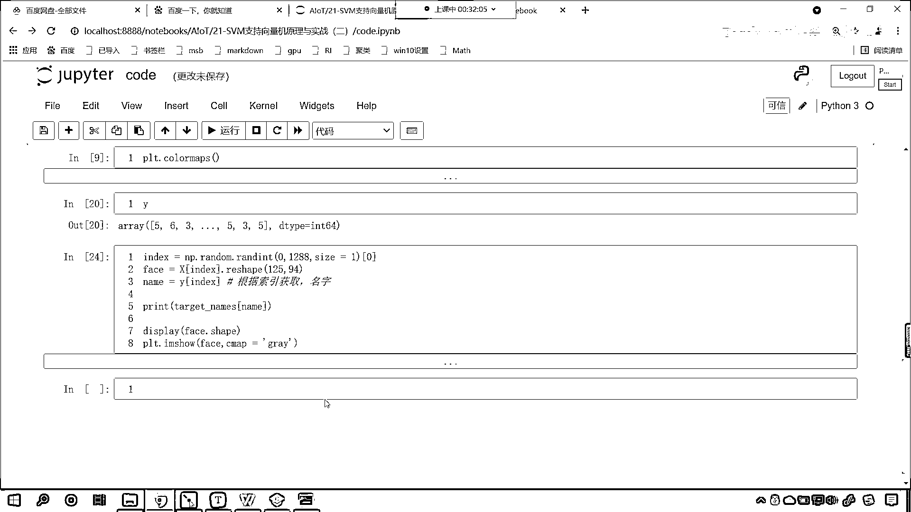

# 7天爆肝整理！AI量化交易-机器学习全套教程，从入门到项目实战保姆级教程！（数据挖掘分析／大数据／可视化／投资／金融／股票／算法） - P134：1-LFW人脸数据数据加载与介绍 - Python校长 - BV1KL411z7WA

那么咱们首先呢写代码，那我们代码所对应的数据，咱们在上一节课的时候，我们已经传到咱们的百度网盘了，在百度网盘这儿呢，大家就能够看到啊，一般情况下我们每一天上课所讲的内容，我们会分好类别。

比如说作业 课件 圆码，我认为对大家有用的学习资料，也会放到这个文件夹下，以及在咱们工作当中可能会用到的软件，比如说我经常用的软件呢，我也会放到里面，我们都可以在这儿找，那么咱们上一节课，咱们上一节课。

这个里边就有相应的数据，大家呢在这里下载，你能够看到这个数据是不是305兆呀，对吧 还是比较大的，所以说这个里边就包含一些人脸，把这个数据下载下来之后放到哪里呀，咱们呢就进入我们的电脑，进入咱们的C盘。

进入用户下面，进入，有声音吧，来我们的新闻黄小伙伴，其他的小伙伴在群里边这个回复一下，有声音啊，那这个新闻黄小伙伴，那你肯定得设置一下，或者说你把你的声音调大一下就可以了，那么在我们在你的电脑上。

你的用户呢就在这个用户名下边，在用户名下边呢，在这儿呢就能够看到一个文件夹，这个文件夹只要你使用sklearn，那么这个文件夹就会为你创建，就是特别是你从网上请求数据的时候，那么就会有。

如果你的用户名下边没有这个文件，那你就创建一下就可以了啊，我们创建这个文件就OK了，然后咱们就进入这个文件夹，在这儿呢，你就能够看到是不是有LFW Home呀，这个里边呢就有很多张图片。

那我已经把我电脑上这个文件夹压缩了，我把这个呢上传到咱们的百度网盘当中了，你把这个下载下来，放到咱们放到你自己电脑上相应的目录下，那你就那你就可以把这个文件夹下的图片呢，给他夹载出来，好。

那么这个呢是人脸的图片，咱们今天呢就使用我们所学到的支持线量机来对于人脸进行一个识别，这就是人脸识别好，那么数据呢，我们进行了相应的介绍，第一次你在加载的时候呢，他会连网，如果说你可以访问外网的话。

那么他可能花这个几分钟十几分钟就会把这个数据下载下来，但是很多情况下，你的电脑可能访问不了外网，所以这个时候你就需要干嘛呀，就得需要去百度网盘上去下载一下，把这个下载下来，放到你电脑上对应的这个目录下。

然后呢，在代码当中就可以对他进行加载了，那么咱们进入咱们今天的课程当中是支持线量机，他的原理与实战二，咱们进入这个文件夹当中，那此时呢，我们就创建一个python文件，咱们选中他给他改个名。

我们就叫code，那么此时呢，咱们就导一下包，我们的import numpy as np，from sklearn。，咱们从SVM下面咱们导一下包，咱们import svc，那么这里呢，涉及到人脸识别。

那人脸识别呢，他是图片数据，加载出来图片之后，咱们将这个图片展示一下，那么我们将matplotlib给他导包导进来，起一个别名，那咱们人脸的数据呢，我们还得需要拆分，所以说我们from sklearn。

咱们从model selection当中导一个包，true test split，那么我们人脸的数据呢，它的尺寸也比较大，咱们需要对这个数据进行降维，所以from sklearn。

那么降维呢是decomposition，在这个子模块下，咱们导一个包叫做pca，pca呢，这个之前咱们是不是就用过呀，对不对，那我们再导一个包，from sklearn。，咱们呢就从这个。

matrix下我们导一个包，咱们import，accuracy score，这个呢是测我们的精确度的，那我们分类算法到目前为止，咱们是不是还学过逻辑4D回归呀，为了和咱们知识线量机进行对比。

咱们将逻辑4D回归呢也导进来，它属于是一个线性模型，所以咱们从linear model下import，那就是logistic regression，导包咱们执行一下，这个时候呢，我们就导进来了。

咱们在上面插入一行，我们来一个三级标题，好，那么这个呢就是咱们相应的导包，好，那么导包咱们这个操作完了，等会啊，还差一个加载数据的from sklearn。

咱们从这个当中导包叫做data science，sklearn呢，这个库呢，它是机器学习当中的非常强大的一个库，那为了让我们很好的学习，那sklearn呢为我们提供了数据集。

这个数据集就是data science，对于一些比较小的数据集，咱们直接加载就可以，对于我们今天要操作的这个数据集，它有三百多兆，直接加载，那就得需要联网请求，那你第一次联网请求，它会为你下载到本地。

但是呢咱们说这个网络呢，因为服务器在国外，所以说不太稳定，建议大家去百度网盘上下载，把它放到特定的位置就可以，那咱们现在呢就使用data science，咱们就load一下啊，这个时候就不是load了。

如果要使用load，这个文件一般都比较小，比如说咱们之前加载原文花，是吧，iris，比如说咱们之前加载糖尿病，之前加载的数字，之前加载的这个波士顿房价是吧，这都比较小，那我们通过什么方法呀。

叫fetch，你看这个fetch呢，就有去某一个地方去取的意思，那我们获取什么数据呀，叫做fetch lfw people，这些呢就是咱们的人脸数据，大家注意啊，这个就是人脸数据，在这我们进行一个说明。

这个叫做加载人脸数据，那么对于这个数据呢，这叫l呢，叫做label的就是标记的意思，f呢就是faces，就是我们的人脸，咱们的w呢就是wild，那这个wild就是在野外标记的人脸，就是说这个自然而然。

我拍照拍下来的这个人脸，比如说这个我们待会加载出来这个人脸，你会发现这里边会有很多名人啊，一般都是名人的人脸，比如说之前的美国总统布什，那他是不是会开很多次这个新闻发布会啊，对不对，好。

所以说这里边呢都是名人的啊，好，那么我们调用了这个方法，这个方法里边就对应着相应的参数，在这你就能够看到这个默认情况下是吧，你看这个data home，它是9啊，我们可以看一下这个data home。

它对应着哪，你现在就能够看到，咱们这个data home默认情况下，是不是就是波浪线，3K的learn data，是不是就在咱们这个3K的learn data下面啊，对不对，那你你知道这个在计算机当中。

这个波浪线表示什么吗，这个波浪线在计算机当中，咱们的波浪线呢，对于windows系统而言，这个波浪线就表示咱们这个用户下边具体的用户名就表示这个，那它呢就相当于咱们波浪线，无论是苹果系统也好。

还是咱们的windows系统也好，是吧，都一样啊，无论是Mac系统也好，还是这个还是咱们windows系统也好，他们呢都差不多，好，那么在这呢，你就能够看到这还有一个参数叫resize。

这个resize就是把它的尺寸进行了缩放，那这个呢，我们为了看的更清楚一些，咱们呢，将这个resize我们给它调整成1啊，那1呢就是告诉他就不要进行缩放了，那我们再往下看啊，除了这个resize。

这个里边还有一个重要的参数叫做mean faces person，这个mean faces person呢，我们在加载这个数据的时候，咱们可以给他指名一下，也就是说我们希望呢，这个加载出来的这些人。

他的人脸多一些，那就通过他来调整，来进入咱们这个数据下面给各位小伙伴看一下，看进入这个里面，你在这就能够看到这是不是就有好多人脸呀，看到了吧，好多人脸啊，我一直向后滑有很多，比如说我们进入这个里边。

你就能够发现他的人脸是不是只有两张呀，对不对，很多人都是，你看他是不是只有一张，但是我们搜一下啊，咱们搜一下不实是吧，Bush，你看我一搜是吧，这儿呢就有这个，这儿就有布什的这个相片啊。

比如咱们进入这个啊，看看这个你看他的图片是不是十二张呀，对吧，我们再来搜一下啊，照指，这，我看一下那个布什叫什么啊，我们一搜布什，Bush是吧，咱们就搜到的是这些是吧，咱们再回退一下啊，咱们进入这儿。

我们搜布什叫Bush，我们看一下没有搜到是吧，照着W布什是吧，他是WBUSH，我们看看能不能搜到啊，大家看是不是在这个地方就出现了，看到了吧，这是不是一个文件夹呀，咱们现在进入这个照着W布什。

你就能够发现，你看这个就是美国总统是吧，当年的美国总统他里边的照片是不是就会多一些看到了吗，多不多，是不是这个二百多张，三百多张是吧，当时世界上最有权力的人是不是发动了这个伊拉克战争是吧，死了很多平民。

所以说你看他就530张，那我们不重要的那些人，你就发现图片是不是就比较少呀，对吧，那所以说我们通过这个参数就可以调整啊，来，那么这个时候呢，咱们就接受一下啊，咱们数据我们就叫data。

那我们查看一下咱们这个data长什么样，这个时候你看我一直行，哎，大家看咱们这个数据呢，就返回了，那我们在上面插入一行，咱们也来一个三级标题，这个呢，就是加载数据，好，那么我们对于data呢。

进行一个说明啊，这个就是类似字典的一个结构，你能够看到这个第一个K是不是data呀，那这个就是咱们的数据，那第二个呢，是image，这个就是咱们的图片，看到了吧，这个就是我们的图片，那么再往下看呢。

你再往下滑，这个就是target，target就是咱们的目标，就是这个人是谁呀，是吧，他索引是5，索引是6，索引是3，那你这个5是谁呀，是吧，我们接下来还有一个叫target names，是吧。

这个target names就是这张图片对应的，这个人叫什么，你看比如说我们这个索引5啊，我们看一下他是谁，看这个是索引0，这个是索引1，索引2，索引3，索引4，索引5，我们就知道，是吧。

如果说你要是出现了一个这个索引5的话，那么这个人对应的名字叫什么，是吧，就对应了他啊，看到了吧，Q指查韦斯，是吧，这是也是一个总统，是吧，你看最后这个Tony Blair，是不是英国首相之前的，是吧。

Tony Blair是吧，等等啊，这些都是这个达官显贵啊，好，那么咱们就获取一下这个数据吧，好不好，你看这个里边不是有，你看这个里边不是有images吗，是不是啊，那咱们获取data。

那这个data和images是什么关系呢，data和images是什么关系呢，他俩的数据是一样的啊，只不过这个形状不一样，这个data呢，他就是这个data，你能够发现他，你看他是几维的，他是二维的。

而我们的images呢，他是几维的，这个时候你能够发现他是不是三维的，咱们先把这个数据获取出来，我给你介绍一下他代表什么啊，好，那么咱们就data，我们来一个中框号，咱们将这个data放进去。

我们说这个就是数据，那数据的话，他就对应着x，那么我们还有一个目标值y，y呢就等于data中框号，咱们呢将target放进去，是不是我们说这是不是还有一个这个images呀，images就是咱们的人脸。

那我们这个faces呢就等于data来一个中框号，咱们将images放进去，那这个时候呢，我们就展示一下咱们的数据，给各位小伙伴看一下，你看x。shape，然后咱们将face。shape打印输出一下。

y。shape也打印输出一下，你能够发现我们一共有1288个样本，是吧，那这个数据的特征是11750，那你知道咱们刚才所看到的这个数据254，32。33，122，这个都表示什么吗。

那他所表示的是不是就是咱们的像素呀，对不对，我们最小从0最大到255，0就是纯黑色，255就是纯白色，这个是我们图片的一些图片，像素的一些知识啊，那我们看到这些是吧，冷冰冰的数字，咱们没有感觉。

那么我们把这个数字给他显示一下啊，比如说咱们找一个索引，这个索引我们随机生成一下，那就是np。random，咱们来一个randint，我们是0到1288，因为他一共有这么多样本，那我们生成几个呀。

生成一个生成这一个，你要注意用索引把它取出来，不然的话他就是一个numPy数组，好，那么index，你看有了，是不是啊，咱们接下来呢，我们就从faces里边中括号。

咱们就根据这个index怎么样来取一个数据，那这就是一张人脸，这张人脸长什么样，咱们是不是就可以调用prt。image。show，对不对，我们把face放进去，这个时候你看我一执行。

你看这个人脸是不是就出来了，是吧，我们就发现你看这个人脸看上去是是这个绿色的，是不是啊，这是他系统默认给的颜色啊，其实呢，这个颜色他应该是什么样的呀，他应该是黑白的啊，因为这个图片是二维的是吧。

那我们就给一个Cmap，咱们这个Cmap呢，咱们就给一个Gray，这个时候你看这张图片是不是就变成黑白的了，对吧，我再执行他选的就是别人，看到了吗，这个是美国之前的国防部长啊，来再执行看到了吗。

这是又一个人，这个人也是一个名人，是不是啊，好，那么咱们这个Cmap，我们可以有多种选择，比如说你想要换不同的颜色，那咱们就调用prt。，调用他的color map，我们只要调用这个方法。

咱们就可以找到看到了吗，颜色是不是有很多呀，那我们从当中随便选一个啊，咱们从当中随便选一个，那咱们大家看啊，咱们选择一个Bowen啊，复制一下是吧，我们在这把Gray换成Bowen。

让你看一下他是什么样的一个效果，看到了吧，是不是就是这种效果呀，对吧，我们还有Ocean，这个是海洋的颜色，现在你就能够看到是不是有这种颜色对吧，所以说咱们这个图片，咱们这个图片，我们在显示之前。

我在打印之前呢，我给你来一个Display，让你看一下咱们的Face，它的形状是怎样的，Display咱们这个Display写错了，这个把A和L现在你就能够发现看到了吧，这个是不是125和94呀。

看了吧，是125和94，那么这个125和94，这个125表示它的高度，这个94呢，表示它的宽度，是不是一般情况下我们的人的脸呢，它是一个长方形的，所以说125和94，那，125和94。

你现在就发现它是不是就没有第三围呀，对吧，没有第三围，那也就是说它是黑白的，那但为什么我们在展示这个图片的时候，它可以呈现不同的颜色呢，因为我们可以给它这个调颜料对不对啊，所以说那我们给成Gray。

那么咱们这张图片就是黑白的了，好，那么到现在为止呢，咱们就给各位介绍了一下我们的数据，那我们从Faces当中，Faces当中咱们获取的是不是就是这个数据啊，看到了吧，第二个打印输出的。

那我们刚才在介绍的时候，咱们说这个Data和这个Target，它俩的数据是不是一模一样呀，只不过形状不一样，你看那这个11750和下面的12594，它俩是什么关系呢，我在这插入一行啊。

咱们让125乘以咱们的94，你就会发现得到的结果是多少，是不是11750呀，那是不是就说明这个数据进行了Revel，进行了Reshape呀，那么咱们能不能从Data当中，从X当中获取数据。

把这个图片显示出来呀，当然也可以，现在你看我操作一下，咱们来一个X，这个时候来一个X，我要一执行的话，你就发现报错了，看到了吧，报了个什么错呀，从X当中直接取出数据，它无法进行显示，为什么。

叫Invalid Shape，就是非法的形状，11750，那这个形状是吧，想要在图片当中，想要展示成图片，它是不是必须得有宽度和高度呀，那所以我们在这个地方来一个Reshape，咱们让它的高度是125。

我们让它的宽度是94，形状一改变是吧，这个时候你看，效果是不是就出来了，对不对，所以说，咱们机器学习当中，我们其实就是要理解清楚，弄明白是吧，那这个数据对应着什么，是吧，好，那么这个时候你看，哎。

这个就出来了，出来之后呢，咱们紧接着呢，我们再获取一下，那就是说你这个人到底是谁呀，咱们来一个Target Names，就等于Data中国号，咱们将Target Names放进去，执行一下。

那我们打印输出一下，咱们将这个Target Names执行，现在你就能够看到，是不是就是这些大佬呀，那么我们从X当中随机找了一张图片，这个人是谁呀，对不对，咱们获取一下他的获取一下他的内幕啊。

他的内幕索引叫做获取一下他的这个内幕，那这个内幕呢就等于目标值，是不是叫做外呀，我们把索引放进去，你看啊，咱们呢，根据索引，我们来获取他的名字，那外当中是什么数据呀，我给你看一下，在上面插入一行。

你看这个时候我一直行，你能够看到这个外是不是就是这些数字呀，咱们说这些数字，如果我们要从名字当中去给他提取出来，是不是就知道这个人是具体是谁了呀，好，那么咱们的首先获取咱们目标值外当中他名字的索引。

然后呢，我们根据这个索引去咱们的Target当中去取名字，那就是Target中国号，咱们将内幕放进去，那此时呢，我们就来一个print打印输出一下，我们看一下这个人是谁，大家看啊，打印输出的是什么。

赵紫W布什看看是不是，是不是布什呀，没错啊，咱们再来运行一下啊，因为我们每次都随机选择，现在你看咱们得到的这个人是这个Colin，这个Pavel是吧，我再来执行一下，哎，你就能够发现是吧。

这个是又一个人了啊，史密特是吧，然后再来执行，涛尼布莱尔看到了吧，这是涛尼布莱尔，好，那么也就是说咱们是不是就获得这个数据了，对不对，好，那么到此为止呢，咱们就为各位小伙伴介绍了一下咱们人脸数据是吧。

标记的野外的人脸数据以及呢，我们介绍了这个里边对我们有用的可以调整的参数，我们呢，同时根据索引把数据取了出来，进行了相应的展示好，那么大家通过咱们这个这一段内容的讲解，你对于这个数据就有一定了解了。

那对于这个数据有了一定的了解，接下来呢，我们就通过支持限量机来进行建模。

