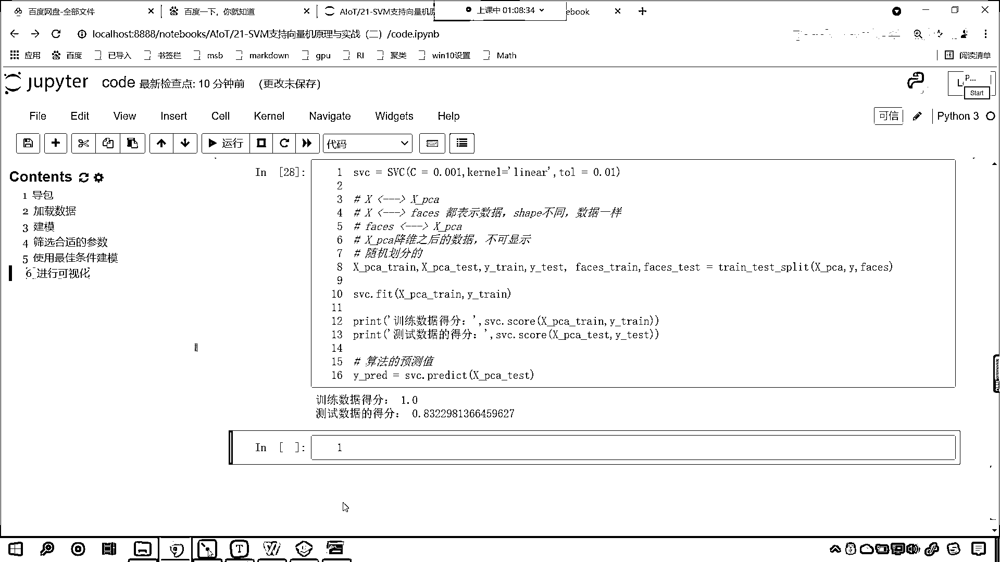
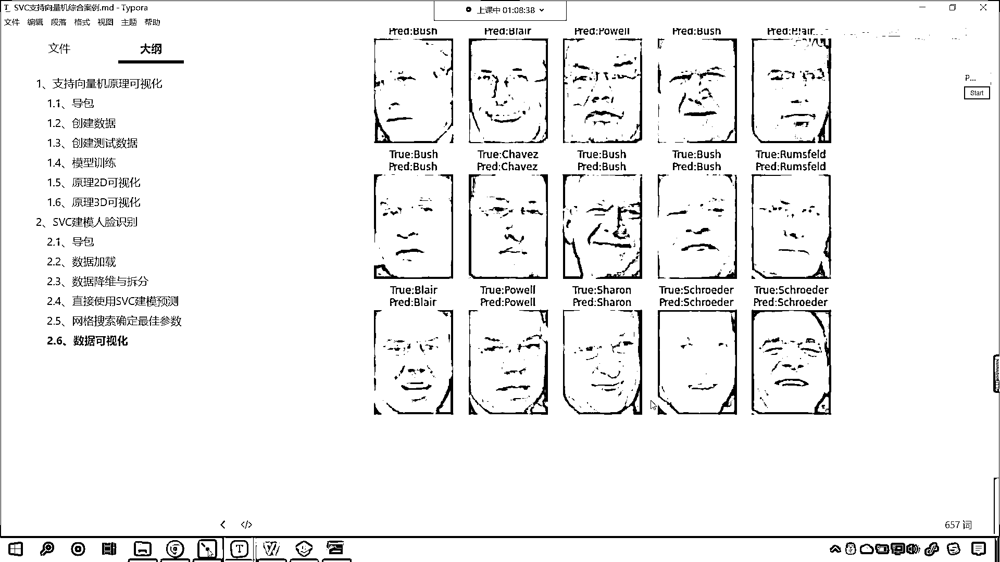
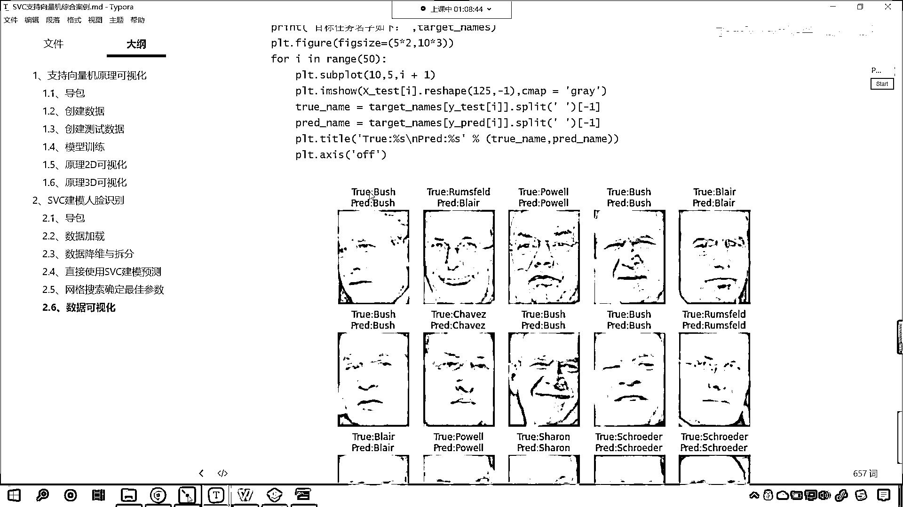
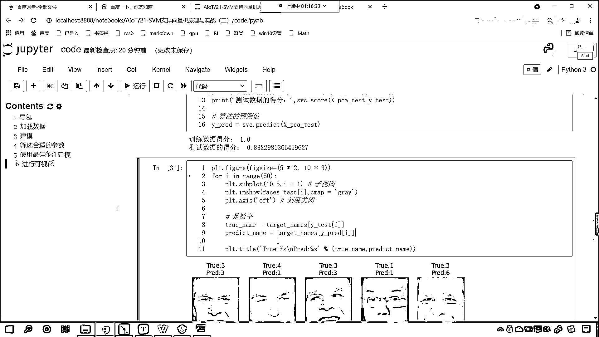
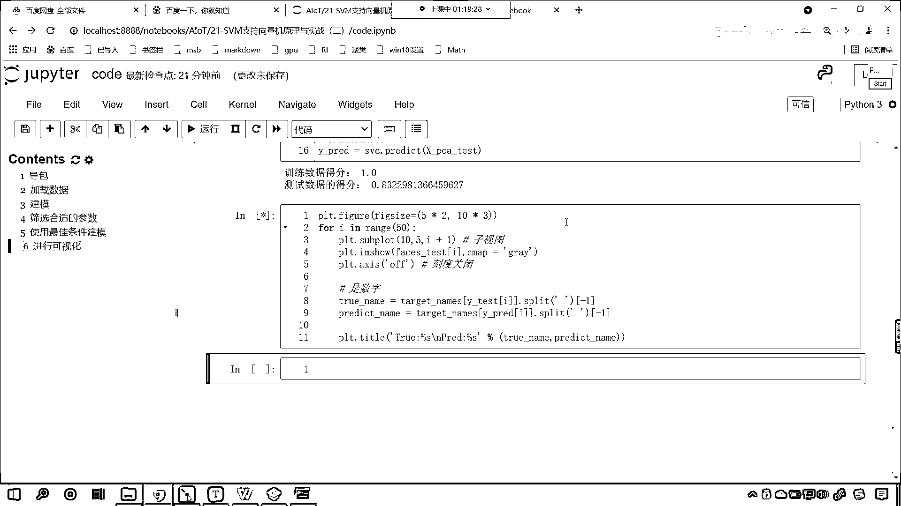
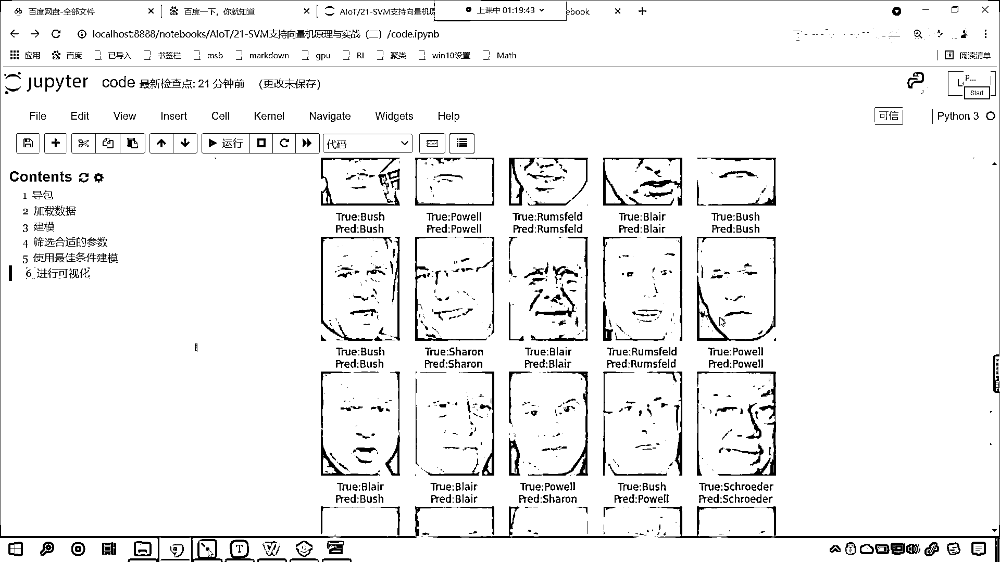
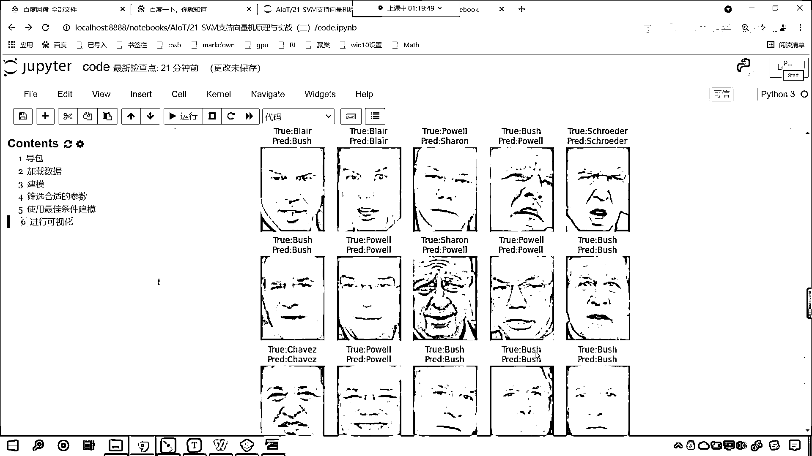
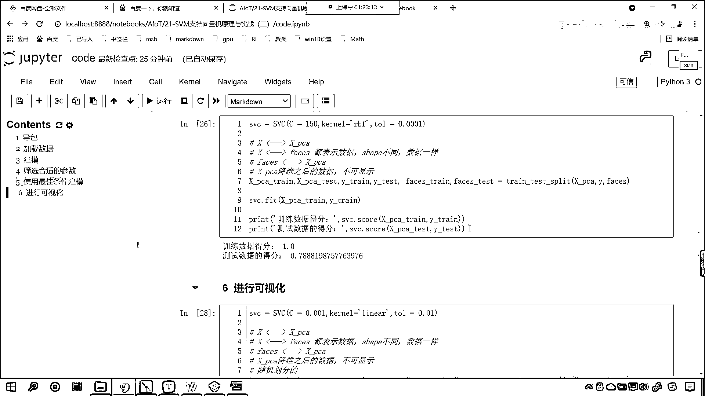
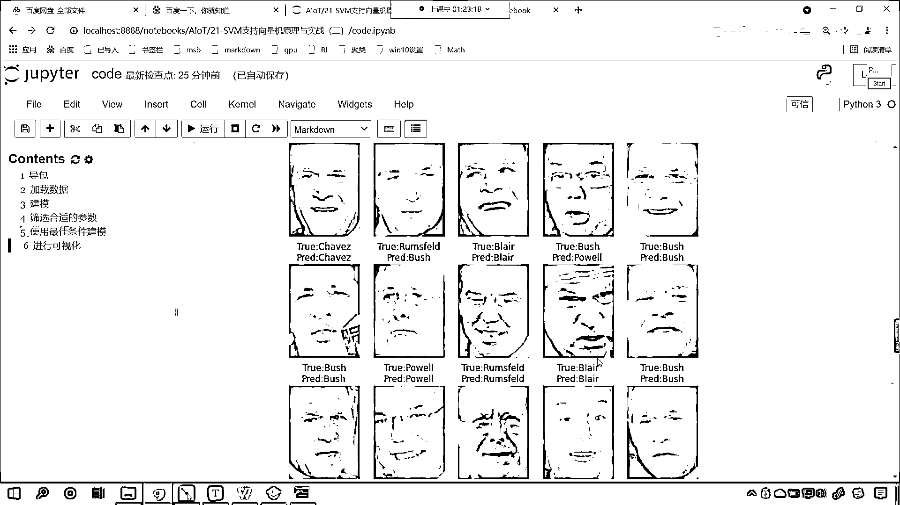

# 7天爆肝整理！AI量化交易-机器学习全套教程，从入门到项目实战保姆级教程！（数据挖掘分析／大数据／可视化／投资／金融／股票／算法） - P136：3-SVM支持向量机LFW建模预测可视化 - Python校长 - BV1KL411z7WA

接下来咱们具体看一下，我的花了5分钟，如果你执行我的代码，有可能你花的时间更长一些，好，那么咱们就往下，在下面这一行代码当中，咱们就使用gc。得到它bestparams，这个时候你看我一执行。

现在你能够发现，咱们所筛选出来的最合适的参数是什么，最合适的参数是不是c是0。001，咱们的kernel是不是linear，咱们的tol是不是0。01，看到了吧，费了多大的劲筛选出来的。

既然我们筛选出来了，咱们就使用这个作为模型创建的条件，好，那么筛选出了合适的参数，接下来我们再来一个三级标题，好，那么我们就使用最佳条件来进行建模，这个时候就声明svc=svc，我们给它相应的参数。

第一个c=0。01，第二个咱们给一个kernel，kernel我们就给一个linear，第三个就是咱们的tol，我们给一个0。01，好，那么咱们这个数据，咱们这个模型有了。

接下来呢我们对于咱们的数据进行一个拆分，那就是twin test split，那就是x下滑线pca，然后逗号，咱们的这个c少一个0，咱们现在呢再给一个0，好，那么x是咱们降维之后的数据。

y呢是咱们的目标值，然后接下来我们再给一个，咱们再将faces作为参数传进去，这个faces你想它是不是人脸呀，对不对，那这个faces和咱们的xpca，这是降维之后的数据，它俩是不是一一对应的呀。

在这呢我们说这样的一句话来一个注释啊，看这个xpca，看我们它是怎么来的，是不是x进行降维之后是不是就变成了pca呀，对不对，好，那么咱们的x和咱们的faces它俩是什么关系呢。

那我们的它俩关系是不是都表示数据呀，看到了吗，它俩呢都表示数据，对不对呀，只不过一个是二维的，一个是三维的，对不对呀，只不过呢数据形状是不是不一样呀，都表示数据，它们的shap不同，但是呢数据一样。

是不是这么个关系呀，所以你想一下，咱们的faces和这个xpca它俩是不是也能够进行对应上呀，所以说咱们的faces和咱们的xpca呢，它呢也是能对上的啊，咱们上面的是吧，它都是能对应上的啊。

咱们来这样的标记，是吧，所以说和咱们的x下滑线pca是一一对应的，那你要注意这个x下滑线pca这个是降维之后的，这是降维之后的数据，它呢不可显示，你想要画图画出来是吧，那这个不能画出来。

所以咱们在进行拆分的时候，咱们把faces也放进去了，为什么呀，咱们就是为了能够进行这个可视化，xpca是吧，好来，那么拆分一下，拆分一下咱们，那就是x下滑线pca下滑线try。

x下滑线pca下滑线test，然后y下滑线try，y下滑线test，那么还有faces呢，那咱们就faces下滑线try，然后faces下滑线test，那我们在这个方法当中咱们是给了三个数据。

一分为二是不是就会分成这六个呀，对吧，一一对应的啊，数据准备好了，咱们接下来就使用svc。我们就fit一下，x下滑线pcatry，然后目标值ytry放进去，训练完之后呢，咱们打印输出一下print。

那么这个就是训练数据它的得分冒号，那么咱们就使用svc。咱们score一个，上面少了一个是吧，有少吗？没少啊，face_train是吧，这少一个逗号啊，来咱们把这个逗号给它加上，faces_train。

faces_test是吧，faces_test。ytrun，好，那么咱们各位小伙伴的眼睛还是相当明亮的啊，来，那说明你很有写代码的这个天赋啊，一般情况下就是我多写了或少写了，这个都没关系。

只要一执行代码，代码马上就会告诉你哪里错了，所以我养成了这样的一个这个训练出了这样的一个这个特征，只要这个代码报错了，我看一眼就能解决，好，那么接下来呢，我们看一下测试数据的得分，是吧，冒号，然后逗号。

同样调用svc，咱们调用score，这个时候呢，x下滑线pca_test放进去，然后y下滑线test放进去，上面这个咱们修改一下，改成train，那此时我就执行这个代码了啊，咱们一运行，来。

大家现在就能够看到，你看，训练数据的得分是不是1。0，咱们测试数据的得分是不是0。78呀，看到了吧，测试数据的得分是0。78，那这个说明呢，大家看啊，咱们这个c是吧，和这个kernel，它的这个选择呢。

大家还要继续调，知道吧，你还要继续调，是吧，从而才能够选择合适的c是吧，那我这个之前呢，咱们这个模型，就是知识线上计这个模型，一般呢，使用这个RBF这个效果会好一些，咱们将这个TOL是吧，这个容忍度。

我们给它增大一些，那我们再来看一下啊，选择了一个不同的核函数，你看，这个时候咱们选RBF这个核函数，如果这个惩罚项是0。01的话，效果是不是就比较差呀，来，咱们把这个惩罚项给它调整成1，现在你来看。

是吧，这个时候是多少，0。95，0。74，是不是就快赶上上面这个了，那我们把c给它调大一些，调整成10，咱们再来看一下，现在你就发现，这个是不是就变成0。788了呀，那我要是给它调整成50呢。

咱们再来看一下啊，大家看，基本上是不是就到上限了，来个150会怎么样，让它更加苛刻一些，哎，你看，是不是和上面就差不多了，对不对，所以说，咱们通过gridsearch cv，筛选出来这个参数呢。

它是经得住考验的，好，那么，我们呢，再一次执行咱们上面的代码，再一次执行上面的代码，那么我们就运行一下，好，那么大家看，这回咱们的得分是多少，0。838，那这回这个得分为什么高了呀。

因为咱们的true test split，它是不是随机划分的呀，看到了吧，它呢是随机划分的啊，所以说呢，有一定的随机性，那这个分数呢，就有一定的波动性，好，那么，咱们根据最佳条件进行建模了，然后呢。

我们再来一个三级标题，接下来咱们怎么样，我们呢，就进行一个可视化，咱们进行可视化，我们就使用上面的svc，如果要进行可视化的话，我们为了这个结果统一，咱们将上面这个代码，我们先复制下来，复制下来之后。

咱们在这svc点，我们调用一个方法叫predict，我们将x下滑线pca test放进去，咱们这个时候，是不是就会得到预测值呀，接收一下啊，上面进行一个说明，这个就是咱们算法的预测值。

此时这个就是算法的预测值，那么我们可视化，咱们就要可视化一下，咱们的web predict执行一下，执行一下。

我给你看一下啊。

咱们画出来的图形大概是什么样的啊，你看一下这个数据可视化。

我们将这些人脸给它画出来，同时把他的名字给它写上。

那么我们就操作一下吧，咱们就回到代码当中，咱们这个测试数据呢是比较多的，我们画不了那么多，咱们就给他画25个吧，咱们就来一个五行五列的怎么样，或者说咱们来一个十行五列的，那就来一个Full循环。

叫Full eye in range，咱们就来一个50，好，那么这个接下来呢，咱们就开始画图，那既然是十行五列，这个时候就得添加子视图，咱们就调用subplot，十行五列第几个呀，第2个。

这个i是从0开始的，所以我们给他加个1，这个时候呢，我们就有了一个子视图，有了子视图，咱们就向子视图当中进行绘制图片，那就是image show，那我们在进行绘制图片的时候。

咱们的算法预测的是不是咱们xPCA test呀，对不对，那xPCA test他能画图片吗，他能可视化吗，他是不是不能显示呀，这个数据是降过为的，那我们在进行数据拆分的时候，你看我们专门留了一首。

这个里边是不是给了三个呀，为啥我要把faces放进去呀，他可以画图画出来进行展示，对吧，那么在进行拆分的时候，他们的规则是一样的，这个时候咱们的faces test和咱们的xPCA test。

他俩是一一对应的，他俩呢是一一对应的，你知道为什么吗，上面咱们是不是进行了说明呀，x和xPCA是一一对应的，因为这个是降为之后的数据呀，x和咱们的faces这个都表示数据，他俩只是形状不一样。

但是数据一样，那所以咱们的faces和这个xPCA是不是就是一一对应的呀，对吧，他和这个xPCA就是一一对应的，那他俩如果是一一对应的，就这两个如果是一一对应的，咱们在进行数据拆分的时候，你想一下。

我们把这个数据拆分成两份，那拆分成两份这个xPCA test和咱们的faces test，这俩是不是也是一一对应呀，对吧，那xPCA test和faces test，这也是一一对应的，既然是一一对应。

我们对于咱们的xPCA test进行了预测，那么我们想要画图的话，咱们是不是就是画faces test，从这个当中取数据是不是就可以了，所以说呢，咱们就plt一幂之兽。

我们呢就将faces test放进去，中国号咱们就来一个i，那么这个时候呢，你看啊，我执行一下看看能不能画出来啊，你看我一运行，大家看画出来了，太小了，是不是啊，为啥呀，我们没有调整尺寸。

那咱们就需要在Fall循环之外，调一下它的尺寸，那就是plt怎么调尺寸，是不是通过figure方法呀，里边有一个参数叫figure size，那我们就调一下吧，咱们说在调尺寸的时候。

这第一个参数咱们是给的宽度，宽度是由什么来决定的呀，宽度是不是有列呀，我们一共有几列，五列，我们让每一列的宽度是2，所以说就是5乘2，接下来第二个，第一宽度有了，第二个就是高度，高度是不是就有行决定。

我们有几行呀，我们有十行，我们打算让一行的高度是多高呢，我们打算让它的高度是3，所以这个时候咱们就来一个3，为啥是3呢，我们还需要往这张图片的上面，是吧，给它写上名字，因为咱们的人脸呢。

它是高度要比宽度，是不是要长呀，好，那么我们在显示这个图片的时候呢，咱们给它一个CMAP，我们让它是Gray，同时咱们这个图片在进行这个绘制的时候，咱们可以设置它的axis，把它的刻度怎么样呀。

给它关闭掉，你看不然的话，这会有一个01000100是吧，我们PRT axis，这个的话我们可以将刻度关闭，那此时我再来执行，哎，现在你来看，是不是就舒服多了呀，看到了吧，这就是我们的这些人脸，好。

所以说呢，你需要就我们这个代码是很简单的啊，不太难，那么你需要干嘛呀，你需要掌握它的规律，是吧，我们subplot也好，其实你看本质上来说，是不是就是一个剖循环呀，你也可以知道吗，你也可以。

你下回不要为我鼓掌了啊，下回呢，你为自己鼓掌好不好，来，那么这个人到底是谁呀，对不对，这个人到底是谁，我们把它的名字给他写上去好不好，那我们PRT咱们之前在讲，刚刚咱们之前在讲那个画图的时候。

我们说这个画图呢，它有一个函数和方法，叫做PRT。title，这个title是不是就是给他这个写名字呀，来咱们就写一个名字，写名字我们来一个true，true呢就表示真实名字，你这个名字是谁，2%s。

给他占个位置，然后返斜杠n，返斜杠n就表示换行，然后咱们接下来再来一个predict，predict就是预测，预测的这个名字是谁呢，也来一个2%s，那么我们字符串的这个格式化，就是通过这种形式来给定的。

里边有两个百分号，两个百分号就表示占位符，是吧，那么然后再来一个百分号，是吧，百分号小块里边就给我们的数据了，那我们就给数据吧，第一个是真实的是吧，咱们就来一个t，第二个是预测的，咱们就来一个p是吧。

好，那么我们给他起一个叫tname，后面这个叫pname，这就是算法预测的，好，那么tname，看你就是说你的这个真实的名字，是吧，真实的名字要不咱们写上吧，就truename，第二个叫predict。

pre，predict name，那你这两个字符串是不是还没有呀，对不对，这两个字符串还没有，那我们如何获取呢，就是truename等于多少呀，你的这个predict name等于多少呀，是不是。

咱们的true就是真实的名字，也就是说，你face test这张人脸对应的名字是谁，我们上面是不是有一个测试数据的保留值，它是不是叫做y test呀，y test里面是不是就是咱们真实数据呀，对不对。

你看这个y test当中就是我们的真实数据的目标值，但是它的数据呢是0123一直到6，那我们这个我们这个数据库当中是吧，有很多人啊，这个数据库当中有很多人脸，只不过我们在夹带人脸的时候。

咱们给了一个限制，我们夹带人脸的时候，咱们是这样，就是说你的这个人脸，每个人的人脸，你的数据得超过70个，我才会获取这个图片，好，那么这个时候呢，咱们介绍了这个y test就是它的真实值，是吧。

因为这个你看这个y test，你看咱们的y test啊，y test和咱们的x下滑线PCA，你看他俩是不是对应的，我们在进行测试数据得分的时候，咱们是不是也把他俩成对的放进去啊，所以他俩是一一对应的啊。

你看他俩是一一对应的，他是数据，y test就表示真实，他的类别，那么这个真实类别是多少呀，来咱们获取一下呗，那不就是通过外下滑线test吗，咱们把i放进去是不是就可以了，看到了吧，我们把i放进去啊。

因为这个i是不是咱们的索引呀，咱们是不是就是获取了face test当中，前50个呀，你获取了前50个，你的y test和他一一对应，咱们是不是获取y就行了，对吧，然后咱们predict呢也一样。

predict是谁，是y predict，上面你看，我是不是进行了算法训练之后，我是不是紧接着就对他进行了预测呀，y predict，这个就是咱们预测的值，预测值呢，咱们也得一下，得到之后，你要注意啊。

这个是什么呀，他们呢，得到之后呢，他们呢是这个数字，你看我执行一下给你看一下，你看predict3，predict4，是吧，你能够发现，这个是不是就是咱们的数字呀，那咱们怎么才能把它转成名字呀。

咱们这样转成名字，调用target来一个中国号，是吧，下面也一样，target来一个中国号，你看这个时候我一直行。

你现在就能够看到名字是不是就有了呀，但是这个时候我们我们发现这个名字呢就挤成一团了，对不对，看名字挤成一团了，这样看起来也不好看，你想你在喊美国总统的时候，你是不是就直接把它叫做不实呀。

那外国人的名字是不是都看他最后这个字啊，对吧，最后这个这个叫法，那咱们怎么办，外国人的名字有一个特点，是吧，last name是吧，他们名他们这个姓和名之间也也会有空格，咱们怎么样，split是吧。

根据什么来划分，根据空格，然后中国号来个-1，这个是不是就表示最后，点split，啊，你在听新闻的时候是吧，这个都是如此啊，来个-1，-1就表示最后，这个时候你看我再来执行。

哎。

现在你就能够看到，看结果是不是出来了，看了吗，第一个是不是不实预测出来了吧，第二个是不是给预测错了，不实这个布莱尔是吧。

这个预测错了啊，你看我们的准确率大概是多少。

是不是80多，你再往下看是吧，再往下看准确率88个80多。

那也就是十个当中是吧，可能会有两个给预测错，看再往下看，这些是不是都顺眼一些了，看到了，这一排全正确是吧，这一行呢，是不是也全正确，看到了吗，这一行全正确，这一行全正确，这一行是不是也全正确，这一行呢。

这有一个错的，看到了吧，这有一个错的啊，这一行呢，这有一个错的，是不是啊，这有错的，哎，你看这个就是，我们使用支持限量机，咱们进行了建模，你能够看到啊，大家跟着我一起学到这里，你就能够发现这个算法。

是不是还挺强大的呀，对于这些图片，我们经过了数据处理之后，咱们经过了降维运算之后，咱们是不是就可以，你看预测出来，这张图片到底是谁，是吧，你看通过降维运算之后，我们就我们就能够知道是吧，这张图片是谁。

另一张图片是谁，你想一下，我们人类是目前这个世界上，是吧，智能最高的生物了，为什么我们这么多年学习学下来，我们能够识别各种各样的东西呢，是吧，是不是因为我们大脑的训练，你之前肯定也听说过狼孩儿的故事。

是吧，刚出生的小孩，是吧，被狼给收养了，那么他长大之后，他的所有生活习惯，他的思考方式是不是都是狼的方式啊，对吧，他就不能再进行交流，是吧，不能够融入我们人类这个世界了，人类这个社会了，那算法也一样。

算法也一样，他呢，你只要给他合适的数学公式，他也会进行训练，也会进行特征的提取，是吧，知道这个，你比如说是吧，这个，新东方好未来，是吧，还有这些教育类公司，从7月24号到现在是吧。

基本上都一直在跌跌不休，一直在跌停状态，为什么呀，国家发布了新的政策，新的政策就不允许周六周日，不允许放假，不允许放假的时候给学生补课，那你想他们主要的收入是不是都是在这个上学之后呀，是吧。

学校上完之后，那所以说他们这个生意就不好做了，所以我们人类就很敏感，是吧，我们经学经济的也好，或者说我们即使不炒股，咱们也知道对于他们是不是就是一个利空呀，对吧，那所以说这个股价刷刷的就降低了。

新东方有原来的这个2300亿，一下子跌到现在的是吧，90%都跌跌没了，只剩这个2 30亿了，那你想那这就是人是吧，总结的规律特征算法也一样，是吧，咱们知识线量机，那我们对于数据进行处理之后，咱们呢。

这个使用网格交叉，我们选择了合适的一个使用网格交叉，咱们选择了合适的参数，然后呢，我们使用最佳的条件建模，最后呢。

我们进行预测。

最后呢，咱们进行可视化，好，那么这个呢，就是我们可视化的这个。

