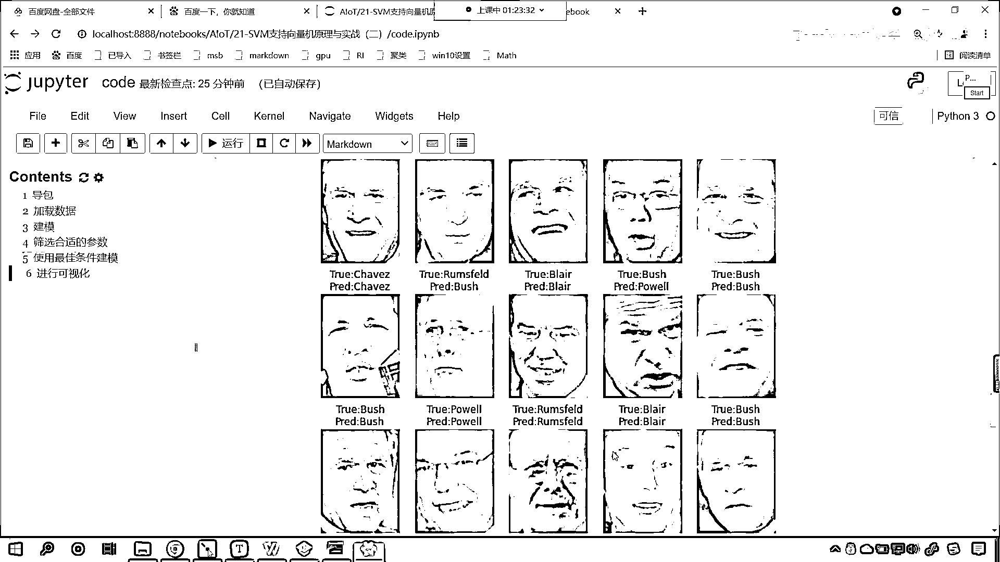
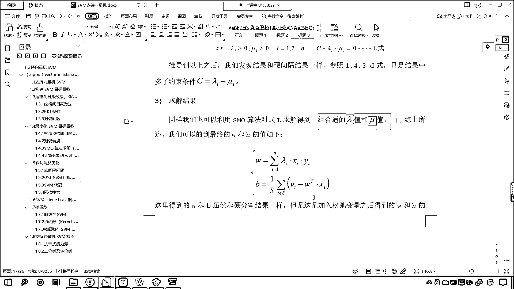

# 7天爆肝整理！AI量化交易-机器学习全套教程，从入门到项目实战保姆级教程！（数据挖掘分析／大数据／可视化／投资／金融／股票／算法） - P137：4-SVM支持向量机软间隔与优化目标函数构建 - Python校长 - BV1KL411z7WA

来来来各位小伙伴，咱们接下来继续啊。

接下来继续，刚才呢我们有小伙伴说了一下咱们这个数据是吧，其实你这个meanFaces，如果你这个参数你要不填是吧，你比如说你给个零是吧，那也就意味着所有的图片都会加载进来，这个时候我给你执行一下。

它会加载一万多张图片是吧，那这个加载的图片多，那么它耗费的时间就会长，这个时候呢，我们稍微等一下，看一下咱们这个数据是吧，会呈现一个什么样的状态，刚才的时候我们是1288，现在你看这个信号是吧。

还在执行，你知道我们计算机操作什么的时候，花费的时间比较长吗，叫IO操作，这个IO呢，它是两个英语单词的缩写，一个叫input，一个叫output，这个叫读写操作，我们在进行联网的时候。

联网请求访问其他网站的时候，那它耗时是吧，这个也是因为IO操作，比较慢啊，也是因为IO操作，特别你比如说你下一个电影是吧，你看你下一个电影，你发现这个速度是吧，跟你的网速有一定关系是吧，你下一个电影。

现在我们4G的时代是吧，你总得需要几分钟，是不是，那假如说你要是固态硬盘，你从自己的电脑上，拷到另一台电脑上，那可能就会很快，是不是啊，这个几秒钟是吧，就十几秒钟就拷完了，为啥呀。

因为固态硬盘它的速度快是吧，所以这个就是一个读写操作耗时，你看现在呢，我把所有的数据都加载进来了，你就能够发现，你看咱们有多少人呀，咱们有多少张图片呀，13233张图片，是吧，所以说那这个时候是吧。

它就慢了，所以我们得给它加一定的限制，就是说咱们在加载这个图片数据的时候，你每一个人是吧，每一个人你得这个至少还有70张图片，这样的话，我在进行训练的时候，那你想一个人有70张图片。

那咱们这个算法是不是就可以从这个图片当中去找到规律呀，对不对，样本多了啊，那我们有多少人呢，是吧，我们如果要全把这个数据加载进来，它有多少人呢，咱们就可以查看一下length，我们将target放进去。

你看是不是有5749人呀，有的人只有一张图片啊，有的人，那我们给70个啊，限定一下条件，这个时候你就会发现是不是很快呀，看到了吧，速度很快，是吧，出来了，这个时候有多少，有几个人呀，只有七个人。

这七个人都是世界级的政治上的大佬，好，那么我们知识限量机呢，今天呢，是我们讲的最后一节内容，那知识限量机呢，咱们一共花了三节课来对它进行介绍，那么最后这段时间呢。

我们会对于知识限量机的算法做一个整体的介绍，那我们呢，先看一下咱们的软件哥，好不好，咱们先看一下软件哥，上一节课呢，我们介绍了软件哥的知识点，但是呢，咱们没有深入详细的对于软件哥进行介绍。

大家现在也知道了，咱们知识限量机当中的那个参数C，是不是就跟咱们的软件哥有一定的关系呀，C就是咱们的惩罚项，那么现在呢，咱们一起来看一下，这个软件哥，有软件哥也有硬件哥，是不是啊，你看。

软的话咱们这个条件儿，你看，柔软是吧，这个软的话给你的感觉是什么呀，不那么生硬，是不是啊，这个软件哥，咱们的这个条件儿，软件哥，那它和硬件哥是相对应的，我们看到的这个图，是吧，咱们的数据比较好，是吧。

那这样的话，我们对于这个数据的划分，咱们就比较省心，是吧，这个一条线，一个分离超平面，就可以把这个数据分开，但是现实生活当中，哪有这样的好事啊，是吧，往往是没有的啊，你所遇到的问题，是吧。

往往都是这个各种各样的难题，就得需要你发挥聪明才智，才能够解决，是吧，你替别人解决了问题，最后呢，你是不是才能够挣到大钱呀，对不对啊，我也希望咱们的各位小伙伴，抱着这样的一个心态，是吧。

多增加自己的这个才能、技能，多为别人解决问题，这样的话，你一定能够挣到钱，好，那么，这种情况我们说比较少，真实世界当中，它往往是这样的，是吧，它没有这个，没有，你想，没有完全的对和错，是吧，孔子就说了。

说，君子求诸己，小人求诸人，其实呢，他所说的君子和小人都是一种状态，就孔子而言，你说他没有小人的状态吗，当然不是，只不过孔子大部分时候，他都是君子的状态，能以君子的要求，是吧。

能以君子的标准来要求自己而已，好，那么，我们看一下咱们这个数据，那么这个数据，无论你怎么划分，看到了，无论怎么划分，你都找不到一条合适的分离超平面，将这两个分开，是吧，它总有一长直点，总有错误点。

那这个时候怎么办呢，那对于这些一长直点，对于这个点，对于这个点，咱们就睁一只眼，闭一只眼，是吧，把它们呢，咱们就认为，你总会出错，你想，你考试的时候，考了这么多次，考了这么多次试，有几次你都是满分啊。

你看，我考了这么多次试，是吧，我能记得的满分，是吧，这个，趋之可数啊，也就两三次吧，是吧，到了高中之后，到了高中之后，数学就从来没有得过满分，是吧，都是，这个，140多，是吧，好，那么，咱往下看啊，那。

遇到了这种问题，我们该怎么去解决呢，是吧，那这个时候咱们就得需要软间隔，你看，啥是软间隔呢，我们在分这条线的时候，是吧，咱们允许它误差存在，上面，这个硬间隔，就是咱们要求，就是把所有的点都分开，是吧。

是黑就是，是这个红色就是红色，是蓝色就是蓝色，那，我们有了软间隔之后呢，咱们这个时候条件就宽松了，是吧，如果怎么分，怎么分是吧，也不能够把你分开，那怎么样，我们可以让它出错，是吧。

咱们这个时候就有软间隔了，好，那么，软间隔，咱们用，这个官方的这个术语，是吧，用学习当中的话来描述就是，我们允许部分样本点不满足约束条件，因为我们的约束条件就是，y*wt(x+b)>=1。

这个是我们最早一开始推导出来的条件，那我们允许它不满足，你看，来，我给你看一下，咱们在哪里，你看，就是最一开始咱们介绍的，你看，往下滑，你看啊，是不是推导出来这个了，是吧，你如果要是y=1的话。

你是一个类别，y=-1的话，是另一个类别，那这两个公式可以合到一起，合到一起之后，你看，是不是就是咱们这种形式啊，看到了吧，是吧，y*wt(x+b)>=1，不就是咱们现在所讲到的这个软间隔。

它这里所说的这个条件吗，是不是啊，你看，它怎么样啊，允许，你看，这就是软，是吧，这个部分样点不满足，是吧，我们在，我们要考虑大部分的情况下，是吧，考虑大部分的情况下，咱们允许一部分点不满足。

那这个时候是吧，咱们就更加灵活了，我们所训练出来的模型就会更加的适用，就会更加的朴实，是吧，放之四海而皆准，那咱们看一下它具体是怎么做的，为了度量这个软间隔的程度，我们这个时候呢，就引入了一个松弛变量。

我们这个时候呢，就引入了一个松弛变量，这个松弛变量就是可系，那我们看一下这个松弛变量它的这个具体描述啊，现在你就能够看到，有了这个松弛变量是吧，你现在发现，咱们在右侧，现在你就发现。

我们的公式是不是就进行了一定的修改啊，我们原来是大于等于1，这个条件比较苛刻，现在怎么样，我们让它大于等于1减可系，那啥意思呀，你的可系呢，是大于0的，那也就意味着是吧，你不一定。

比如说这个可系等于1的话，你是不是，你前面这个公式是不是大于等于0，你看，所以说，这个就相当于给降低了，看到了吗，降低了，降低了的话，那我们的条件就宽松了，条件宽松的话，也就意味着，有一些点可能就会。

画错位置，就不那么严格了，宽松了，是吧，好，那你比如说，你看这个，看到了吧，看咱们这个点，那我们这个红色的点，我们一划分，怎么样，这个红色的点是不是就划归到蓝色这个点了呀，很显然这个就划归错了，是吧。

你甭管人家红色的点在哪里，注意啊，你不要管人家红色的点在哪里，但是人家呢，就是归为红色的点，你比如说，现在美国是世界上是吧，这个霸权主义国家，你想，夏威夷岛，离它本土有多远呀，那老远了，是不是啊。

这个1万公里，但是呢，它就把这个夏威夷岛，是不是给占了，它说是它的，那就是它的，是吧，它在全世界各地是不是都有军事基地呀，是吧，离那么远，但是呢，军事基地那块地方就是它的，所以说呢，我们在看。

在这个分离的时候，是吧，我们在分类的时候，咱不能说这个红色的点距离，是吧，距离你这个蓝色的点近，就把它分成一类，人家数据归的是哪一类，那么它就是哪一类，好，那么内部的点呢，很显然，可系等于0。

边界上的点也等于0，它所说的边界的点就是这两条虚线，刚好满足，是吧，也等于0，接下来呢，咱们的正误差点，正确误差点呢，就是在咱们，黑色的这条线和这个，虚线边界的这些点，是吧，你要注意啊，这个叫什么。

叫正确误差点，咱们换一个颜色，这个点叫什么，这个点就叫做错误差点，因为如果说，你这个蓝色的点在这条线的下面，还有情可原，将就能够把你算作是，蓝色的点，但是如果你是分到上面了，你想这个蓝色的点是不是就。

划归到咱们红色这个点的类别当中了，所以说呢，你看，你错误的越严重，越离谱，我们可C是不是就会越大啊，它就会越大啊，所以说呢，它是这样的一个规律，那么接下来呢，我们看一下咱们优化SVM这个目标函数，那。

加入软件歌后，咱们的目标函数就会，有一个改变，现在呢，我们的方程就变成了，1/2W^2+C，然后可C，那为什么咱们的可C它是一个，累加和呢，因为呢，每一个样本对应着一个可C，所以说呢，是，这个累加和。

i=1，一直到n，那我们当然也有，咱们当然呢，也有这个，判断条件，也有约束条件，这个约束条件呢，就是，1-y，是吧，减去这个可C，小于等于0，是吧，这不就是咱们，上面公式演化而来的吗，然后可C呢。

怎么样，它得是大于等于，0的啊，这个值，对它有个约束，那么这个呢，就是咱们的H值，你看，你到这能够看明白吗，到这能够看明白吗，为什么这个地方加了一个C乘以可C呢，为什么加了一个这个呢，你看。

其中C是一个大于0的常数项，这个其实就是在原来的目标函数当中，是不是就加入了个它呀，对吧，那我们这个叫损失函数，是吧，我们是不是当然希望它越小越好，对不对，原来的函数咱们没有，加这个的时候。

我们也希望它越小越好，加了它了，我们是不是也希望它越小越好，对吧，我们希望找到合适的可C，为每一个样本都找到合适的可C，是吧，那这个时候不就刚刚好了吗，对吧，你越小，你看，你当这个底错误的时候，怎么样。

这个可C是不是比较大，如果我们能找到合适的可C，咱们是不是就减少错误误差底啊，你如果要减，以自己最大的努力，减少了这个错误误差底，是不是就说明你的算法就合适了呀，是不是就说明你的算法就合适了呀。

所以你看，这个目标函数就变成了，在原目标函数的基础上，咱们就加了一个C可C，到这儿，各位小伙伴能理解吗，看到了吧，那这个我们就把它叫做这个惩罚项，我们希望呢，咱们新的这个方程它变小，我们希望呢。

咱们新的这个方程它变小，你想一下极端的情况，如果说，咱们所加的这个惩罚项，它变成0了，假设它变成0了，这是一种什么情况呀，如果它要变成0了，是不是就说明咱们这个函数和原来的函数是一样的呀。

是不是就说明咱们这个函数和原来的函数是一样的呀，那你要是变成0了，那你这个函数是不是就是完全线性可分呀，那你这个变成0了，那你这个变成0了，那巴不得呢，我们巴不得解决问题解决的透彻一些。

解决问题解决的漂亮一些，不就是这种情况吗，完全分开了，所以说呢，所以说，咱们这个地方是吧，它要变成0了是吧，那这就说明这个很好，完全分开，彻底分开了，但是，这个天不遂人愿，那如果说你要变不成0怎么办。

你变不成0也没关系，我希望你尽量小，因为你越小，说明呢越好，咱们也是希望这个变小，那C它是一个参数呀，它是一个C的大小的，如果这个C要无穷大，很多时候这个数学家举例是吧，他没有办法一次性跟你说明白是吧。

他给你举一个极端，说这个C无穷大，你想，你在这个条件要变小的情况下，是吧，因为你要对它优化呀，如果你给的C很大，咱们找的结果是不是只能，给的这个C很大。

就好比咱们给参数C咱们给了个1000给了个10000，你这个很大，那你这个可C是不是就无穷小呀，因为你只有特别特别小，特别特别小，才能够保证整体是不是变小呀，那这个时候会怎么样呀。

这样的话SVM就变成了一个完全线性可分的，你看你，越来越小，你这个可C变得无穷小，这个就相当于是和原来的，和原来咱们的优化条件就，就类似了，这个时候会怎么样呀，完全线性可分，你完全线性可分。

这个时候就会出现过拟合的情况，那么过拟合咱们之前在讲，线性回归，这个领回归，还有螺丝回归的时候，我们对于，过拟合，嵌拟合，咱们都有相应概念的介绍，怎么样，大家对于过拟合，还有一定的认识吗。

还记得过拟合的各位小伙伴在我们的讨论区里边，扣一个666，来，我们其他小伙伴呢，好，很棒啊，你们对于我们的过拟合嵌拟合还有一定的了解，那已经很棒了，如果C有相对应的值，那么可C对应的。

它一定是一个大于0的值，这样的话咱们的SVM就允许内部，分样本不遵守约束的条件，那这个时候就宽松了，这样的话我们只要调整合适的C，咱们就可以防止过拟合，接下来呢，咱们在有这个参数的情况下。

我们构造一下拉格朗日乘字法，那这个构造的拉格朗日函数，其实和咱们上面的是一模一样的，我们看一下它到底是怎么构造的，现在你就能够看到这个方程就稍微复杂一点了，这个是我们增加了乘法项的，有两个，看到了吗。

这是一个，这又是一个，因为我们的约束条件往往是，有一个方程它怎么样，小于等于0，我们的可C咱们是不是说它大于等于0呀，但是如果说我们要把方向调整的话，这来一个负号，这个0，你加负号加正号，是不是都一样。

是不是都表示它，所以说负的可C怎么样，是不是小于等于0，你看你有两个条件，如何去构造拉格朗日乘字法呢，这个是前面的那一部分，怎么构造，你现在就能够发现它很巧妙啊，看到了吧，加上了一个什么，是不是λi。

然后又怎么样，看到了吗，是不是又有一项，就是μxc，因为它是一一对应的，就是咱们上面这一部分，这个条件，还有这个条件，构造了，如果要有多个，那么我们构造的拉格朗日函数，有多个咱们就增加多项。

有一个咱们就增加一项，所以说它是这样一一对应的，那么有了这样的一个函数，咱们接下来就，对它里边的参数进行一个说明，比如λiμi就是咱们的拉格朗日乘字，WB可C是我们要计算的主要问题参数。

我们有了这个软件哥，是不是就多了个可C啊，看到了吧，接下来咱们进行队友关系转换，一样的，这个方程稍微复杂了一些，咱们有原来里面球最大，咱们现在变成里面球最小，那转换之后这个方程还不变。

只要咱们这个队友关系，只要满足KKT条件，是不是就可以，这就是KKT条件，只要满足KKT条件，咱们方程就可以继续，去进行一步一步向下走，这个还是上面的，咱们的拉格朗日乘字，我们怎么样，求偏导。

令导数为0，我们求W求B求可C，那么对于这个偏导，它就是满足这样的公式，满足这样的规律，求偏导的话，其实就是之前咱们所讲到的，求导数的基本规律，如果导数是符合函数，那么我们求偏导的时候。

咱们根据的规则是链式求导法则，得到了这个导数之后，咱们继续往下化减，W就等于这个，λYI就等于0，C就等于λI+μI，一旦我们对于可C求偏导的时候，你要注意可C是有多个的，我们求偏导一化减。

这个时候就是CλI，-μI=0，你注意啊，求偏导是一个一个求的，可C呢它是一个样本，对应着一个软件哥，一个样本对应着一个软件哥，一个样本对应着一个软件哥，那对于咱们内部的这些点，看到了吧，内部的这些点。

不就是咱们红色的这一区域，还有蓝色的这一区域，它们所求解出来的可C就都是0，到这里之后呢，我们经过对応转换，然后呢我们求导，求导之后呢我们就会得到一些规律，得到一些这个等式关系，有了这个等式关系。

那我们就把怎么样以上的关系，咱们就带进去咱们原来这个方程，看到了吧我们把它带进去，这个方程不就是咱们刚才写的那个损失函数吗，这个方程就是咱们刚才写的，你不要怕麻烦，也不要看这个公式复杂。

你就把它带进去就可以了，这个方程里面有个W，W看到了吧，这个时候是不是就成开了，lambda i lambda j x i x j，是不是就变了，为什么这个点乘的时候，得把它写开，这个时候你看。

C乘以可C，C是不等于lambda i加上μ i，这个时候你看成开，是不是它，后面的也一样咱们就不做一一详细的展示了，我希望咱们各位小伙伴，仔细看咱们这个文档，你仔细找错了。

你就直接发给我或者直接发到咱们的群里边，希望你睁大眼睛是吧，这个都是一个一个写的，如果能找到错是吧，一般情况下我们是没有错的，但是鼓励各位小伙伴找错，所以经过化简之后呢，最后就简化了。

虽然我们的公式看着极其复杂，但是简化之后呢，你发现这个里面只剩下谁了，是不是只剩下lambda了，原来还有谁还有w还有c是吧，还有μ，这事就好办了，你这个方程当中只有lambda，那就可以怎么样。

咱们是不是就可以根据之前的smo，是不是对它进行求解，当然我们转换之后是吧，我们可以看是有相应的条件约束的，是吧是有相应条件约束的，lambda i大于等于0，这个是不是都是咱们拉格朗日乘子呀。

对不对是我们引入的系数，为什么这个地方必须是正呢，你还记得为什么这个lambda i和这个μ i必须得是正的吗，对吧，你看我们的KKT条件那篇博客文章里面就说的非常清楚，里面说的非常清楚。

就讲到了为什么这个lambda i必须得大于等于0，是吧我们从这个，咱们从导数是吧从t度的方向上，我们进行了说明和介绍，最后呢如果说我们找到了最优解，那么他们的方向一定是相反的。

所以说我们必须得让lambda i大于等于0才可以，这个时候还有一个条件就是c减去lambda i减μ，是不是也得等于0呀，这不就是咱们上面计算求导计算出来的等式条件吗，所以说这也有一个等式条件。

我们就发现啊，你看经过咱们上面对于max lambda μ，对于这个符合函数进行求导，是吧咱们发现与μ没关系，是吧但是为什么可以消掉是因为这个c等于lambda i加上μ。

所以在约束条件当中一定有此条件，所以呢我们得到最终的目标函数，是不是就可以写成这个，咱们就可以写成这个，这就是咱们最终的目标函数，那么推导以上推导已得到这个公式，我们就发现呢软间割和这个硬间割。

结果一样，硬间割呢是咱们1。4。3d式，这个是我们得到的l式，对比一下啊，看一下咱们1。4。3，你看一下这个d式，你就会发现这个是我们最一开始的时候，给各位小伙伴介绍的，咱们的这个损失函数。

你能够发现这个里边是不是也只有lambda呀，只有lambda，我们的约束条件是什么样的，lambda i*y=0，看咱们现在这个软间割的，你看这个软间割的，咱们得到的这个损失函数l。

它也类似你看到了吧，它也类似，你就能够发现，我们这是不是多了一个c-lambda i-mu i，这个约束条件，我们l式当中呢，也有约束条件，那这个约束条件是不是也是lambda i*y=0，对吧。

和上面那简直就是一模一样，所以说呢，因为咱们这就是加了一个软间割嘛，就是一部分，我们让一部分点是吧符合这个条件，另一部分点呢，可以不符合这个条件，其实就是在原来的基础上进行的一点点变化。

那么你想你基本原理没变，所以说你的这个目标函数，是不是也不会发生特别大的一个变化呀，对不对那我们求结果是吧，我们同样也可以使用smo算法是吧，对于咱们上面的l式进行求解，咱们所求解得到的w和b。

一样和原来的公式是吧，没有区别，和原来的是一样的啊，好那么大家看啊，这个就是咱们软间割，这个介绍以及它的优化，还有呢它公式的一系列推导，好那么你看啊到这里，到咱们1。5这里，咱们就将知识线软件当中。

那个重要的参数c是什么，是吧我们就这个介绍清楚了啊，好那咱们就将知识线软件当中，那个重要的参数c是什么。

