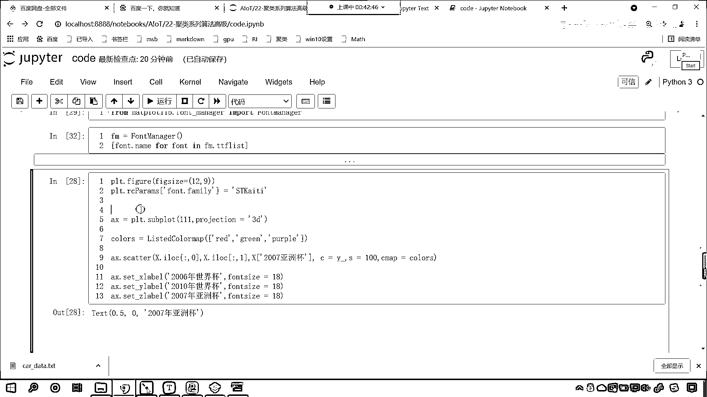

# 7天爆肝整理！AI量化交易-机器学习全套教程，从入门到项目实战保姆级教程！（数据挖掘分析／大数据／可视化／投资／金融／股票／算法） - P139：2-Kmeans聚类亚洲国家队类别可视化 - Python校长 - BV1KL411z7WA

我们对于亚洲队进行了一个划分，在这个里边需要注意的点我们也进行了说明，那么接下来呢，咱们对它进行一个可视化，咱们再来一个四级标题，咱们来一个可视化，那么可视化这个地方呢，咱们首先呢。

给它调整一下它的尺寸，叫plt。figure，plt。figure，我们调整一下尺寸figure size，那就是12和9，然后呢，这个plt咱们呢就调用，这个时候我们在进行画图的时候。

咱们是不是就可以，添加一个子式图，此时呢我们添加一个子式图，咱们就可以调用subplot，那就是一行一列第一个，然后逗号，里边给一个参数叫projection，projection就表示类别。

咱们给一个3D，那这个时候咱们是不是就有一个3D的图形了呀，好那么这个子式图咱们起名就叫axis，你看我一执行，这个3D图形是不是就出来了，那么接下来简单，咱们是不是只需要往这个里边给它绘制。

是不是只需要往这个里边绘制数据就行了，那么我们亚洲队的数据，他们的06年世界杯，是吧，咱们怎么给它表示呢，咱们这个时候就绘制一个scatter，这个就叫散点图，咱们的数据呢都在X当中，从X当中选第一列。

这个就表示06年世界杯，X中观二选第二列，你看1就表示第二列，这个呢就表示咱们10年世界杯，然后中观二冒号咱们再给个2，这个呢就表示咱们07年亚洲杯，那么它的颜色是什么样的呀。

然后呢我们给一个这个咱们呢，给它指定一下颜色，这个颜色就是C，C呢就是我们预测的结果叫Y杠，因为你的Y杠呢，因为咱们的Y杠呢，它表示它的类别不同，对不对，看这个Y杠表示类别不同，那你这个C呢表示颜色。

那这个C等于Y杠，它所表示的含义就是，咱们根据类别不同，为不同的类别去划分不同的颜色，因为这个Y杠当中，它的数值是不是012呀，那么我们就会为它分配三种颜色，然后呢逗号咱们呢再给它调整一下尺寸啊。

咱们来一个100，这个时候你看我一执行，好咱们现在看一下啊，这个一则invalid的key是吧，咱们看一下到底是哪一行代码给报错了，现在它是不是报咱们这个这一行代码给报错了，是不是啊，那我们看一下啊。

0 is a invalid key，来那么咱们把这个代码给它调整一下，我们看一下咱们的X，好，大家现在就能够看到，你看，咱们的X它是一个什么样的数据啊。

我们就能够发现你看它是不是一个这个data frame呀，所以说我们直接这样取数据那肯定不行，怎么办呀，咱们调用i lock，loc是吧，或者这个再来一个i lock，那么咱们最后一个数据呢。

咱们可以是不是直接使用中框来给它获取啊，这个就是2007年是不是亚洲杯呀，这个时候你看我再来执行，来大家各位小伙伴，你就能够看到这个代码是不是就执行出来了呀，看到了吧，此时这个代码ok了吧，对不对，好。

那么颜色呢我们也是可以调的啊，比如说这个时候呢咱们逗号我们给一个Cmap，那你如果想省事儿点是吧，那么你就给现成的这个颜色，那我们这个现成的颜色呢，啊，比如说我们给一个ocean，哎。

这个时候你看它就对应着一种颜色是吧，那我们还可以给它自定义颜色，在上面咱们插入一行，咱们就from matplotlib，从这个当中呢，点儿从这个colors当中，咱们呢导一下包。

咱们导一个list color map，好，那么有了这个list color map，我们在这个地方呢就可以给它生成一个颜色了，咱们就创建一个colors，就等于list color map。

那我们分别给它什么颜色呢，比如说我们给一个红色，咱们给一个绿色，然后咱们再给一个这个purple，p u r p l e，我们就给这三种颜色，color有了，那么我们这个Cmap呢。

咱们就把它复制成咱们的colors，这个时候你看我一直行，现在各位小伙伴你看，颜色是不是就是我们自己定义的了，好，那么在三维空间当中呢，我们看到紫色是不是有深有浅呀，是因为呢，这个是图像。

它自动给你生成的啊，这样的话你看起来就有远近的感觉了，对不对，好，那么咱们说这第一个呢，它表示06年世界杯，所以这个时候呢，我们就设置一下，咱们就set x label，设置一下它的标签。

那这个标签呢就表示2006年，是吧，这个是世界杯，好，那么我们设置一下它字体的大小，我们给它一个size，我们让它等于18，好，那么接下来咱们再设置一下它的纵坐标，那就是set y label。

我们对于这个label呢，它就是2010年，世界杯，然后呢，同样字体的大小，我们也设置一下，都让它是18，那还有一个轴就是咱们的z轴，咱们set一下z label，这个呢，就是2007年。

这个是不是亚洲杯呀，对不对，2007年亚洲杯，那么中英文切换一下font，size也给一个18，注意这个时候我们里边是不是有中文了呀，有中文，默认情况下中文不显示，咱们设置一下，那就是plt。。

那就是plt中国号，咱们呢，对它属性进行设置，叫做plt。，这个rc-params，来一个中国号，是吧，都有什么样的属性呢，font，点，咱们给一个family，在我的电脑上呢，我有这个st。，开体。

咱们现在呢，就给它设置一下st。，开体，这个t呢，应该是大写的，这个时候你看我一执行，大家看，这个2006年世界杯，2010年世界杯，2007年亚洲杯，这个数据是不是就出来了，看到了吗。

如果你不知道你的电脑上有哪些字体，你可以查找一下，看咱们就可以from，matplotlib，是吧，我告诉你怎么查找字体，matplotlib，然后呢，我们这里边有一个font manager。

从这个当中咱们导一下包，叫做font manager，导进来，在下面插入一行，fm就等于font manager，这个可以找到你电脑上所有的，对应的这个字体，好，那么有了fm了，是吧，咱们fm，点。

它里边呢，就有字体的一些数据，叫做ttflist，这个就表示它的相应的字体，好，那么这个，没有小括号，因为这个是它的一个属性，这个时候你看我一执行，大家看这个字体是不是就都出来了，这是一个列表。

咱们现在呢，使用列表生成式，我们获取字体的名字就可以了，那该怎么办呢，我们叫font，font，font，in，你看这个是不是就获取到了，然后呢，咱们点一下它的name，这个时候就获取了。

这个字体的名字，现在你就能够看到，这个是不是就是咱们，你电脑上所包含的所有字体，从这个当中找和中文相关的字体，你像放送送体，开体黑体这些，都是中文字体，可以正常显示中文，这个咱们就不再赘述了，好。

现在你就能够看到，看咱们红色的，你看红色的类别对应着谁，是不是对应着日本和韩国，他们属于是一流强队，是不是，好，那么我们紫色的对应谁，看咱们紫色的就在中国当中，然后我们中国就在紫色的当中。

那么绿色的就是朝鲜，巴黎就是朝鲜，沙特，是吧，他们这些亚洲的强队，好，那么你看，到现在为止，我们是不是就使用了K-means，聚类这个算法，对于这样的数据，咱们是不是进行了类别的一个划分，对吧，你看。

你想一下，咱们人是不是也可以对这个数据，进行人为的划分，他人和机器相比，你想一下谁的效率更高一些，对不对，很显然是咱们的机器，很显然是咱们的算法，特别是当这个数据的特征，特别多的时候。

你比如说我们统计的是从20，是吧，从2000年世界杯，一直到，这个20一直到2018年是吧，世界杯，我们统计了这么多年的，这个时候，你在如果数据的维度要增加的话，咱们使用人工来进行类别划分。

这个时候就难于上青天了，所以大家明白，计算机它强大的优势。

是吧，随着社会的进步，它的优势是越来越大的。