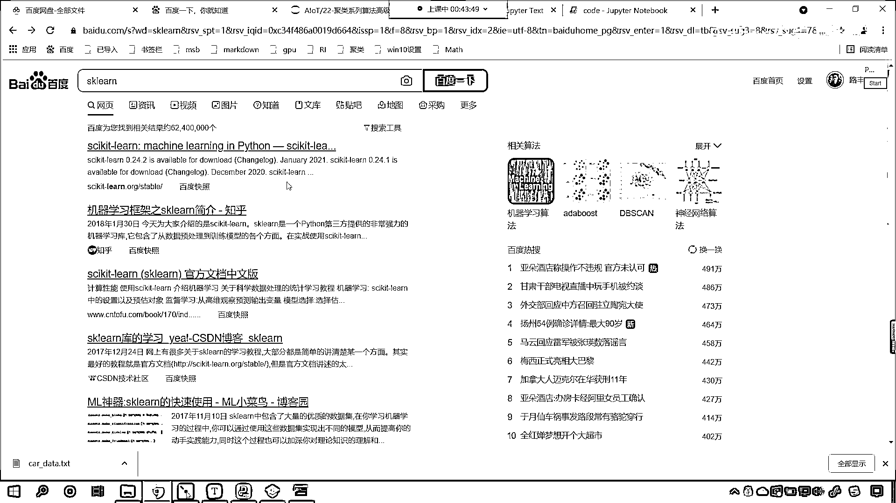
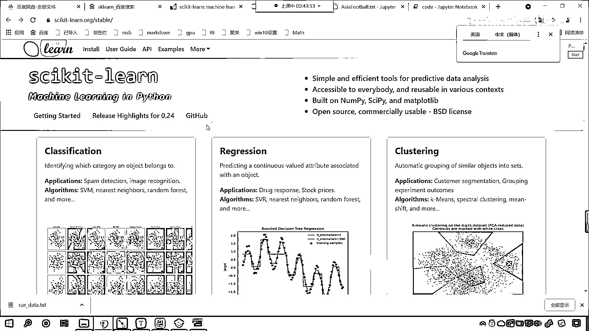
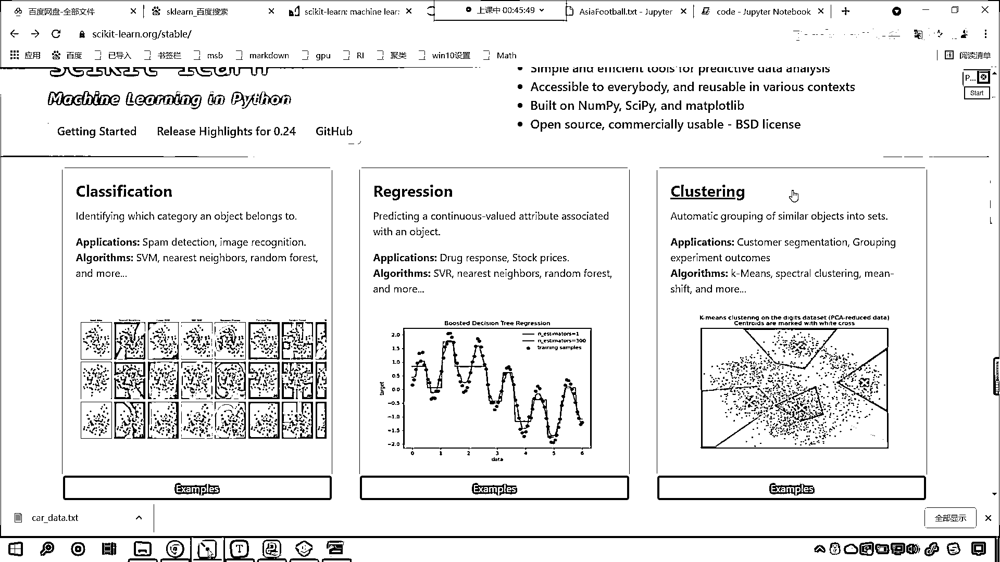
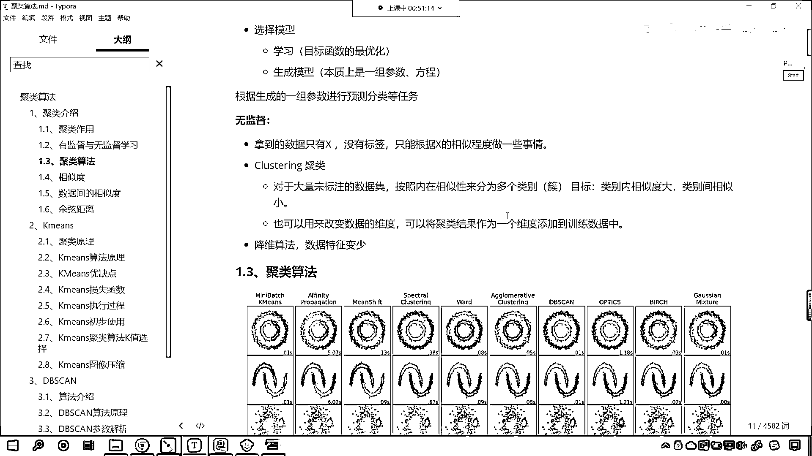
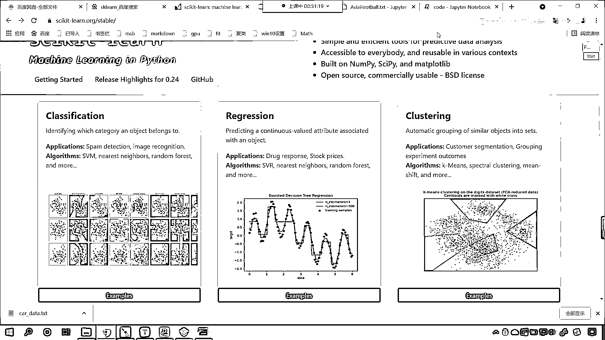
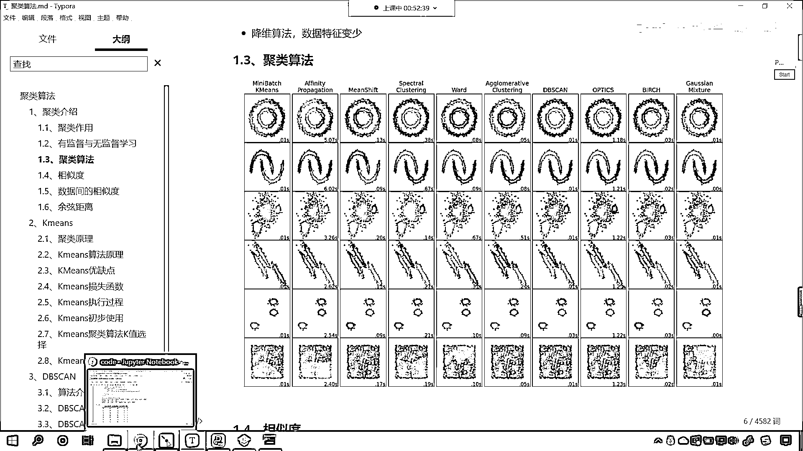
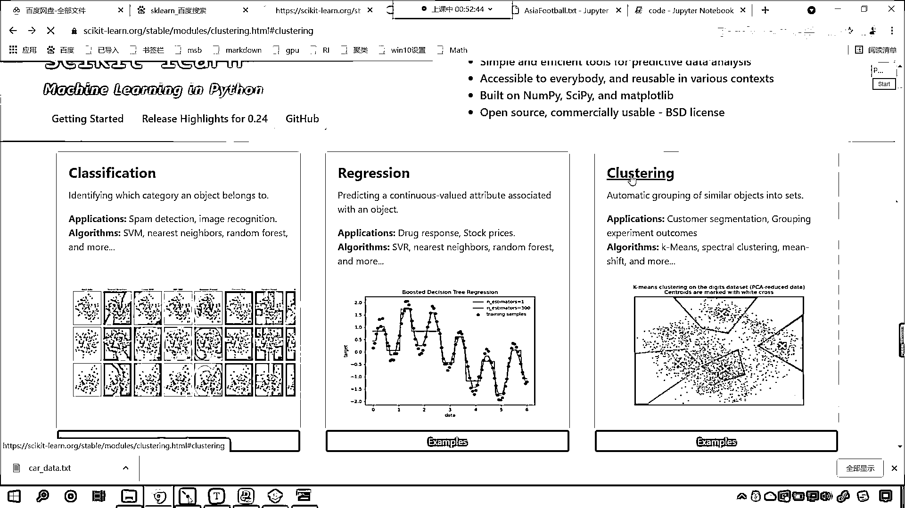
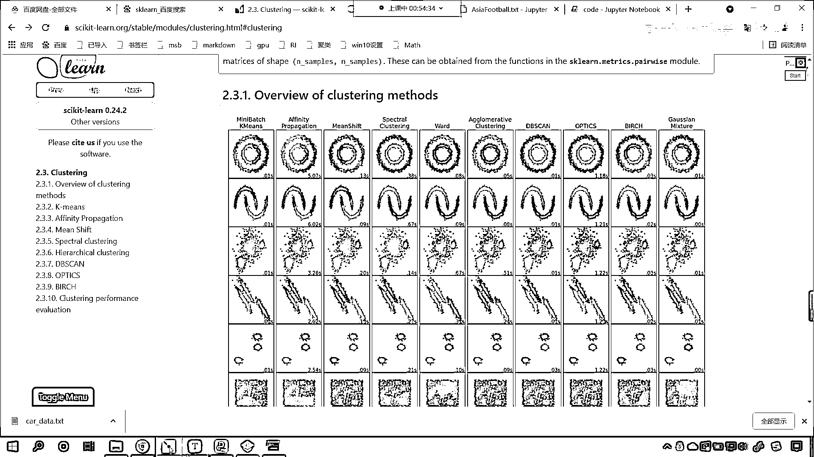
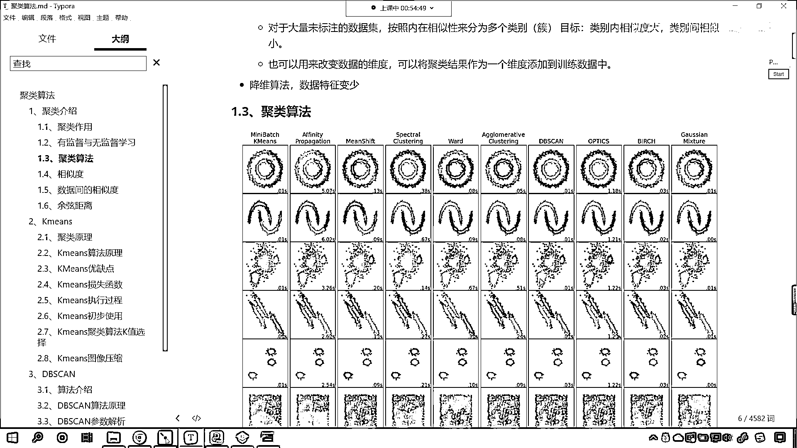

# 7天爆肝整理！AI量化交易-机器学习全套教程，从入门到项目实战保姆级教程！（数据挖掘分析／大数据／可视化／投资／金融／股票／算法） - P140：3-聚类算法概念介绍 - Python校长 - BV1KL411z7WA

好，咱们的项目呢，我们通过代码来完成了，现在有一个问题，那这个剧类算法它到底是怎么回事啊，它到底是什么样的原理呢，对不对，你看这个算法，它怎么就将我们这个数据进行了类别的划分呢，对不对，你想知道吗。

是吧，你先想一想这个到底怎么回事，是吧，怎么操作的，来，现在呢，咱们回到课节当中，好，那么我们呢要对于理论进行一个说明和介绍，咱们首先看一下这个剧类，是吧，这啥是剧类呢，来，我给你看一下什么是剧类。

比如说呢，咱们进入sklearn，这个是咱们学习的这个框架的它的官网。

一点击进去了，现在你就能够发现，你看，我们已经学了什么了呀。

看到了吧，这是英文的啊，你学习咱们的编程是你练习英文的一个很好的方式，classification， regression，看，上面，首先第一个是不是叫分类呀，第二个是不是叫回归呀，什么是回归。

再也没有比这个图更形象的这个说明了，回归就是找，是吧，这些点，这些样本它的规律和趋势，是吧，那什么是分类呢，是吧，你这个红色的点和这个蓝色的点，咱们就要想方设法把它分开，看到了吧，这就是分开。

所有我们现实生活当中的所有问题，要么是分类，要么是回归，是吧，那么在这个回归和分类这，是吧，又进行了一个分支，叫什么，叫clustering，这个分类和回归呢，它们所对应的数据。

它们所对应的数据是既有X又有Y，而咱们的clustering，咱们只有数据，我们没有目标值，是吧，那这个翻译成中文，它呢就是粗的意思，那这个也叫剧类，你看它的作用是什么，看这个英文你把它翻译一下。

叫automatic grouping of similar objects in two sets，它是不是就将相似的对象划分到一个集合当中呀，是不是划分到一个类别当中，你看下面这些点，是不是。

咱们怎么划分呢，是吧，红色的区域，绿色的区域，蓝色的区域，紫色的区域，是不是就划分成功了呀，好，那么我们在它的官网上带着各位小伙伴看了一下。

那么咱们回到咱们的课件当中啊，我们对于这个剧类咱们进行一个详细的介绍，概念性的这个介绍，好，那么我们首先看一下，咱们剧类它的作用是什么，看啊，那就是知识发现，发现事物之间的潜在关系。

如果你的关系是类似的是一致的，那么我是不是就可以把你划归到同一个类别呀，那么还有一个叫异常值检测，那这个异常值检测呢，就是说我对你进行类别划分的时候，是吧，你实在是归不到这个类别，同时呢。

也归不到其他的类别里边，那这个值呢，咱们就可以把它当成是异常值，还有那异常值往往是不是就是离群点呀，你看我们这个刚才所说的这个术语叫离群点，离群点就是你离这个群是吧，太远，距离上来说太远。

那你距离上离的远，那这个时候呢，那你就不是同一类，这样的话，我们就可以通过剧类是吧，来实现异常值的检测和这个删除，好，那么第三个呢，就是特征提取，那特征提取呢，我们代码当中有相应的例子是吧。

到时候我会给大家演示啊，这个就是数据压缩是吧，特征提取就是啥是特征提取，原来的时候你的数据特别多，那你这些数据是吧，咱们呢，这个可以把数据由多变少，把其中的这个关键数据拿出来。

那关键数据拿出来表示原来的数据，我们就可以称为特征提取，接下来呢，我们继续看，咱们看一下这个，我们这一章所讲的叫无监督学习，那这个概念是什么，那咱们首先呢，就要介绍一下有监督学习，之前咱们讲的算法。

它都是有监督学习，啥意思呀，给定训练级X和Y，我们选择合适的模型，咱们进行学习生成模型，然后呢，进行预测，这一个过程就叫有监督学习，你想一下，你从小到大，这么多年，考试是不是千千万万次呀，对吧。

那你这个过五关斩六将一直到现在是吧，你的考试，你之前这么多年的学习过程，它呢就属于是有监督学习，因为你每次参加了考试，老师是不是都会讲一下标准答案呀，你针对着自己的标准答案，是不是去校正自己，修正自己。

这样的话，你才能够在高考这个考试当中，是不是让自己的分数尽量高一些呀，所以说呢，有监督呢，他往往有标准答案，往往有目标值来对他呢，进行一个约束，那什么是无监督呢，看啥是无监督，你就好比画家毕加索是吧。

他画的画是不是就是天马行空呀，各种怪物是不是各种抽象，那这个时候呢，你看他没有参考，因为之前你看毕加索在出来之前，有人和他画的画一样吗，没有这个是不是他自己创造的呀，我们把这个叫做无监督的一种形式，好。

那么在这里呢，咱们的这个无监督呢，我们就是拿到数据X，这个时候没有标签，这个标签就是咱们所说的目标值Y，那么咱们呢，只能根据X的相似程度来做一些事情，你看数据和数据呢，如果他的数值大小是相似的。

那么我们可以认为这两个数值是相似的，那么我们拿他做的事情，这个时候就涉及到咱们的剧烈了，对于大量未标注的数据集，我们按照数据的这个特征的相似性是吧，咱们类别内相似度大，我们类别间让他相似度小。

这个类别内也就是说你划归到同一个类别了，那么你的相似度就得大一点，这个相似度大就说明这个数据越近似，这个值也就越近似，那类别间，这个类别间呢，就是现在已经分成两类了，那分成两类了，我们希望呢，哎。

他们的相似度就小一些，那怎么才能衡量他们的相似度小呢，他们得离得远才可以，好，那么我们的剧烈呢，也可以用来改变数据的维度，大家看啊，改变数据的维度，那你还记得之前，咱们讲线性回归的时候。

我们是不是有一个数据的升维呀，对吧，我们把维度给他升高是吧，给他增加一个属性，咱们通过剧烈之后呢，我们可以将剧烈的结果作为一个维度。

添加到咱们训练集当中。

好，那么这个此话怎讲该如何操作呢，回到咱们的代码当中。

我现在呢就给你操作一下啊，比如说咱们这个数据呢，已经有了，是不是，看咱们这个数据已经有了，那我就对它进行操作一下，你看这个x是咱们的数据，咱们呢就可以给他一个叫类别，那这个类别呢。

就等于我们算法预测出来的y-，然后呢，我打印输出一下这个x，你看此时你就能够看到，咱们的原始数据当中，是不是就增加了一个属性呀，这就是类别，看到了吗，0 1 1 2是吧，很简单啊。

这就是咱们科技当中这句话，他所要描述的这个意思，好，那么无监督呢，他另外一个作用就是降维算法，我们可以将数据的特征变小，一会儿呢，我们就会介绍我们这里边有一个案例，就叫做图像的压缩，那这个图像的压缩呢。

其实就是将这个数据特征变少，好，那么接下来呢，咱们再来看啊，好，那么我们看一下这个剧类算法，它都有哪些，你现在能够看到，你看剧类算法呢，有多种多样，有很多种，你看到了吧，那这个图呢。

就是咱们SKlearn官网上所提供的。

我们进入咱们的网页当中，你看我们点一下这个clustering。

现在你就能够看到，你看在咱们的官网上，他是不是就为我们提供了这张图片呢，那这张图片就是overview of clustering methods，也就是说不同的剧类算法，它的一个效果展示，看到了吧。

不同的一个分类算法，它的效果展示，那么上面这一行上面这些标题呢，哎，就是咱们剧类算法，我们有很多，我们在课程当中呢，我们会进行这个常用算法，经典算法的一些讲解，比如说K-means。

比如说咱们的DB-SCAN，是吧，这些呢，我们都会讲到，比如说这个Gaussian mixture，是吧，这个也会讲到，你能够看到啊，我们对于相同的数据，也就是说这每一行，你看是不是都是相同的数据呀。

不同的算法对它划分的效果是不是就不同呀，现在你就能够看到，如果说我们使用这个K-means这个算法，如果咱们使用K-means的算法，那么它对于这个数据的划分，你就能够看到看它是怎么进行划分的。

看到了吧，上面这半个数据和凸出来这个角，它是不是归成一类了，对不对，你看黄色的底是一类，蓝色的底是一类，而如果我们使用DB-SCAN这种算法，咱们使用DB-SCAN这种算法，你就能够发现。

看咱们这个数据是不是就能够很好地划分开了，你看是不是就可以很好的划分开了，所以说它不同的算法，它的原理不一样，是吧，那它对于数据的划分效果也就也就会不同，好。

在这里呢。

我们就展示了一下不同的算法，它的剧类效果，好，那剧类算法呢，十几个呢，好，那么那这一段视频呢，我們為各位進行了具類算法。

