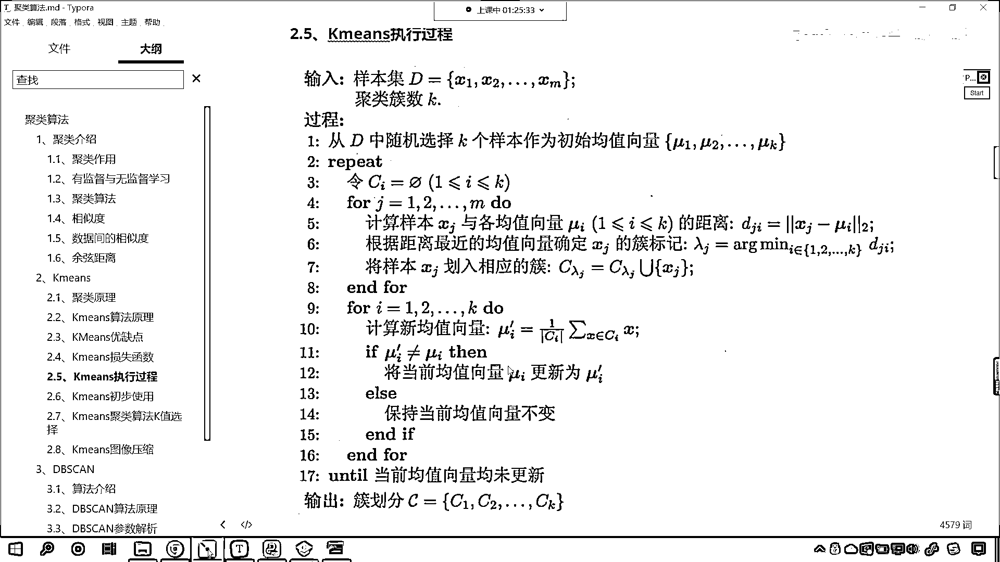

# 7天爆肝整理！AI量化交易-机器学习全套教程，从入门到项目实战保姆级教程！（数据挖掘分析／大数据／可视化／投资／金融／股票／算法） - P142：5-Kmeans算法原理和流程 - Python校长 - BV1KL411z7WA

那么我们接下来继续看啊，咱们这个度量标准它所对应的算法是不是也很简单呀，对吧 这我们之前都学过啊，来接下来我们继续看k-means，我们已经使用了k-means了。

那我们刚才问的问题是它到底是怎样的一个原理是吧，我们先看一下k-means剧烈原理，它呢是将n个样本映射到k个处当中，每个处至少有一个样本，那基本思路呢就是先给定k个划分，迭代样本与处的隶属关系。

就是你到底划分为哪一类呀，第一类第二类还是第三类呀，每次都比前一次要好，迭代若干次我们就能够得到比较好的结果，那我们这里所说的迭代其实就是放循环，那具体咱们看一下啊，这k-means算法它的原理。

选择k个初始的这个促中心，怎么选呢随机选，咱们随机选，然后逐个计算每个样本到促中心的距离，我们将样本归属到距离较小的那个促中心的促中，每个促内咱们计算平均值，更新促中心，然后呢我们就进行迭代。

现在你就能够看到，这儿呢有一个这幅动图，大家看咱们从头看啊，从头看，我们这里边是不是有三个X号呀，你看啊这三个X号你看一开始它是随机选的，现在你看一下是吧，一步二步是吧。

你看你有没有发现咱们这个X号是不是在移动呀，最后的话我们是不是划分成了红色，是不是划分成了蓝色，还划分成了绿色呀，所以说一开始这三个X号它是随机给定，你看它的循环到底是如何操作的，刚好是数据的中心是吧。

为什么可以是数据的中心呢，因为每个促内咱们计算了平均值，咱们计算的这个平均值就可以保证，咱们这个这个X号是吧，它就可以进行相应的移动，所以说你看K-Means这个算法比较简单。

但是呢它对于数据进行划分的时候，这个功能是很强大的啊，好那么剧类的过程呢如下，咱们刚才看这个动图，你得看好几遍才能够找到规律，看到了吗，它一共是12张图片，从0开始看到了吧。

然后一点点是不是移动看到了吗，一点点移动看到了吗，移动移动移动是吧，类别划分开了，那我们看一下它具体的过程如下啊，看A一开始我们就发现你看没有划分，是吧一开始没有划分，那没有划分的话。

我们所有的点都是同一个颜色，接下来呢咱们就选了一个红色的点，选了一个蓝色的点，选了红色蓝色点之后，接下来我们就开始计算距离，上面咱们有一个文字描述看到了吧，叫做逐个计算每个样文点到促中心的距离。

看了一个一个算啊，所以这就是麻烦事看一个一个算，如果距离离它近，咱们呢就划分成红色，如果你这有一些点距离离咱们的黄，这个蓝色的叉号近，那么就把它标成蓝色，你看这个时候是不是第一次划分啊。

这第一次划分我们就怎么样，是不是求所有点的平均距离啊，平均距离这个时候你就会发现这个红色的叉，它是不是就移动到这了，看到了吗，红色的叉它就移动到这个位置了，然后我们重复操作，你，剧类中心发生变化了。

接下来呢咱们重复，看到了吗，重复操作这个时候呢，我们继续找它最近的点，那你就会发现上面这一类是不是就变成蓝色了，大家看啊，仔细观察，你看你原来这个地方这个点是不是红色，到了这儿，它为什么变成蓝色了呀。

因为这些点距离咱们新的蓝色的剧类中心，是不是比它距离红色剧类中心这个叉号要，要近呀，对吧，因为它距离咱们蓝色的这个叉号要近，所以说，所以说呢，根据距离远近，根据距离远近。

咱们是不是就可以进行类别的重新划分呀，是吧，你划分之后，然后再怎么样，再一次去移动它的剧类中心，你看你原来这个剧类中心在这儿，现在怎么样，是不是又向中心进行了移动呀，红色的叉号也是看到了吗。

红色叉号原来在这儿，你看现在是不是移动到这儿了，所以它越来越，它经过这样的这个放循环，一次一次的去移动，一次一次的去重新计算，到最后，看到最后它就计算不动了，到最后呢，咱们这个类别也就刚好划分成功了。

看到图，你是不是就知道它的原理是怎么样了呀，这就叫一图顶千言，来，那么我们接下来继续看啊，咱们呢，看一下咱们这个K-Means它的优缺点，优点呢，简单，效果不错，缺点呢，它对于异常值敏感。

对于初始值敏感，对于某些分布剧类效果不好，你能够发现，咱们刚才在代码当中，执行代码的时候，我们这个地方说再次执行，咱们所执行出来的结果，是不是就和我们第一次执行出来的结果不太一样呀，你想一下为什么。

是不是就因为，咱们在进行剧类的时候，我们是不是给它随机选择了它的剧类中心呀，所以它带有一定的随机性，那带有一定的随机性，就会导致咱们的结果会发生变化，还有呢，它对于异常值比较敏感。

那你看我们K-Means，咱们是进行剧类是吧，那这个时候如果要是有一个异常值，你想一下这个时候如果要是有一个异常值，咱们假设说这个异常值离得老远了，在这呢，你想这个异常值是不是就会影响咱们的平均呀。

那么有可能我们红色的这个叉，看它会跑到哪呀，你看它是不是就可能会跑到这呀，看这个红色叉就有可能跑到这，因为你看你有一个异常值，这个异常值是不是在这个位置，看到了吧，这个异常值它在这个位置。

所以说这个异常值呢，就会影响咱们剧类中心的位置，所以这是它所说的这个对某些分布是吧，剧类效果这个异常值敏感，还有呢，对某些分布它的效果不好，那我们就进入SKlearn的官网，我们现在就能够发现。

它对于这样的分类效果不好，你看啊，它对于这种，如果我们要对于这种数据，咱们进行类别划分的话，你能够看到里边是不是一个活呀，右边这个外边是不是也是一个活，那你看我们划分是不是就是左半部分是一个类别。

右半部分是一个类别，你看咱们的DB-SCAN就可以很好地对这种数据划分，就是外边这一圈是一类，里边这一圈呢是一类，是不是，所以说，咱们课节当中所说到的，它对于某些分布剧类效果不好，好。

那么咱们接下来再看一下咱们K-Means，它的这个损失函数啊，它的损失函数呢，我们就是Xi-μj，这个μj是什么，就是咱们粗的均值向量，我们可以把它叫做质心，就是咱们上面看到的这个图，这个X号的位置。

红色X号的位置，是吧，那这个就是咱们的μ，那咱们怎么才算是把这个类别很好地划分了呢，看怎么才算是把类别很好的划分了，每一个样本减去咱们的这个质心是吧，它的平方这个我们求了绝对值，让它最小。

让它最小就是所有的数据是吧，分完类之后让它最小这个时候呢，这个时候，就说明咱们的效果最好了啊，就是Xi就是你看Xi代表每一个样本，μj呢就代表你的剧类中心，如果你的剧类效果比较好，那你想这个样本。

它是不是距离所有的样本，它是不是正好在中间，是不是就比较均匀，那比较均匀的话，这个时候咱们的分类效果就会好，好，那么接下来咱们继续往下看啊，好，那么这个根据咱们上面所介绍的剧类原理，它的优缺点。

这个算法的原理，那么我们K-means它相应的执行过程呢，大家看就是咱们这张图片所描述的它的执行过程，好，那你比如说我们给定了样本集D，看到了吧，X1，X2，Xm是吧，咱们给定了剧类的这个分类。

要把它分成K类，那是怎样的一个过程呢，从D当中随机选择K个样本作为初始的均值向量，μ1，μ2，μk，然后接下来呢，咱们就进行repeat，这个repeat其实就是放循环是吧，然后呢。

我们你看进行了一个放循环，是吧，1，2一直到m，咱们怎么样，这个时候是不是就开始计算距离了，你看到了吗，这个放循环就怎么样，看到了计算距离，你距离近，咱们就把它划归到相应的粗当中是吧。

其实不就是比大小吗，计算出来的距离比大小，然后呢，看啊，咱们再一次进行放循环，大家注意两次放循环，上面这次放循环，它的作用是什么，上面这次放循环，咱们的是为了划归类别，是不是为了划归类别呀，对吧。

然后接下来又有一个放循环，这个放循环是什么，是不是咱们重新计算它的置心呀，重新计算置心，对吧，也就相当于是这个我们叫做移动咱们的聚类中心，这叫移动聚类中心，是吧，这是移动聚类中心，你看我们这呢。

有一个推出条件，咱们这个推出条件，大家仔细找一下啊，这个推出条件是不是就是EFUI，它不等于，你看EFUI是吧，PIR不等于UI，在我们将当前的均值，是不是更新为咱们的UI，对吧，你看，最后呢。

就是当所有的均值向量均未更新，所有的均值向量均未更新，这个时候就说明，你找到的这个聚类中心就最合适，那我们就可以停下来了，那咱们就可以停下来了，所以说你根据咱们这张图片当中的这个过程是吧。

那你就可以知道咱们聚类算法。

K-means这个聚类算法，它到底是怎样的一个原理了。