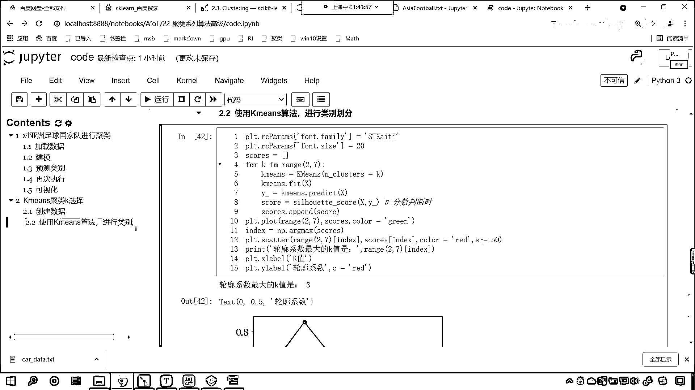

# 7天爆肝整理！AI量化交易-机器学习全套教程，从入门到项目实战保姆级教程！（数据挖掘分析／大数据／可视化／投资／金融／股票／算法） - P144：7-轮廓系数使用 - Python校长 - BV1KL411z7WA

接下来我们就使用代码 来演示一下，回到我们的代码当中 重新刷新一下，这个时候我们的目录就出来了，我们往下滑 在这来一个三级标题，这个就是咱们K-means 剧类 咱们K的选择。

那么我们导一下包 咱们import numpy as np，我们from sklearn 从这个当中咱们import datasets。

然后from sklearn 我们从cluster 从剧类这个子模块下，导入K-means 我们将K-means导进来，那么我们刚才介绍的这个评价指标呢，咱们也把它导进来 那么这个就是matrix。

从这个matrix当中咱们导入叫做silly-outed-score，这个对它进行一个说明 这个就叫做轮廓系数，这个就是咱们的轮廓系数，然后呢咱们再导一个包啊 我们画图。

from import matplotlib。pyplot 起一个别名plt执行一下，好 那么接下来我们就创建数据，咱们来一个四级标题 大家看啊，现在呢我们就创建数据。

那么创建数据呢 咱们就使用data sets，这个里边有一个方法叫make，调用data sets里边的方法叫make，make blobs 那这个方法呢，咱们给它一个center啊。

这个center=3就表示我们要生成三类，那么这个里边呢还有一个random state，因为如果我们要不给random state，那么它每次生成的数据都会不一样，来咱们plt。

scatter 我们把这个数据给它显示一下，好 那么创建了这个数据，我们用变量来接收一下x和y，x表示咱们的数据 y就表示咱们的类别，那么这个数据shift-tab 咱们看一下这个方法。

它会为我们生成100个点，每个点呢两个特征，两个特征是不是就表示咱们x轴和y轴呀，这个刚好可以画出来，那这个centers我们在这里指定了就是3，还有你看centerbox是不是它的范围呀。

cluster std是不是这个数据它的一个标准差呀，我们生成的这个数据是一个正态分布的，好 那么咱们就画一下吧，大家看现在我们给一个x(0)，这就相当于横坐标，x(1)就相当于纵坐标。

给一个颜色 颜色就等于咱们的y，这个时候你看我一执行，大家现在来看这个数据是不是就出来了，你看我们给1024这个效果不好，咱们现在呢把这个随机数给它切换一下，我们给一个256，256这个分的也不太好。

咱们给一个512啊，我们希望这个数据分的比较开一些，你看这个512也不行是吧，咱们来一个996是吧，996呢你看分的也不太好，来咱们再给一个2048，看一定能分开，现在你看这个分的是不是就比较好了呀。

黄色的底儿啊，这个蓝色的底儿还有紫色的底儿是不是，咱们就用这个来举例啊，好 我们知道咱们所生成的数据，它是清清楚楚明明白白是不是分了三类，现在我合起来，计算机知道吗，计算机是不是不知道呀，对不对呀。

你看啊此时咱们的计算机是不知道的啊，那计算机不知道咱们现在呢，就是让计算机帮我们分类，咱们来一个随机标题，咱们呢就，看这个时候呢咱们就使用，K-means算法，我们来进行类别划分，对吧。

你看咱们进行类别划分，那这个时候有一个问题，咱们该分成几类呀，对不对，我也不知道，是吧，那，你看到上面的数据你知道是吧，因为这个数据是我创建的，对不对，我所以我们知道，但是计算机这个时候它不知道，是吧。

那我们就这个让计算机来帮我们选择吧，是吧，咱们来一个4K in range，我们从2一直到7，让计算机帮我们选择，是吧，那我们选择的话，咱们当然选择一个比较好的，是不是，来这个时候呢声明算法。

那就是K-means小括号，里边的第一个参数就是ncluster，cluster等于谁就等于咱们的k，ok，这个时候你看算法是不是就有了，然后呢我们就使用K-means，咱们就进行训练。

我们将数据x放进去咱们fit一下，看这个时候就有了，好，那么，有了之后呢，你的预测值是多少呀，那就是y-ground，咱们调用K-means。predict，我们进行一个预测，那就是predict。

咱们将x放进去，好，那么，咱们刚才呢介绍了轮廓系数，那我们就让轮廓系数来帮我们计算一下，好不好，那咱们就调用clyoutedscore，这里边两个参数，一个呢咱们给一个x，另一个呢咱们给一个label。

一个是给一个x，另一个咱们给一个label，那这个label是什么意思，我们往下滑，看它对于这个参数有说明，看什么是label，predicted labels for each sample。

是不是就是咱们算法预测出来的类别呀，对不对，就是咱们算法预测x就是咱们的原数据，那么我们就将x放到这，咱们就将y-ground放到这，你想它是不是会得到一个分数呀，好那我们就叫score。

六个for循环，咱们是不是会得到，你看咱们是几个啊，你看啊，二三四五六是吧，六个for循环，那我们是不是会得到六个分数呀，那我们就在for循环外面，咱们声明一个列表叫scores。

每一次得到了这个轮廓系数，咱们就将这个分数呢放到咱们，放到咱们score当中，哎你看这个时候是不是就有了呀，然后呢，我们进行画图啊，看此时咱们进行画图，好那么，看咱们进行画图，好那么画图的话咱们就这个。

把它画出来，那就是plt，咱们呢就调用plot方法，我们给的数据啊，咱们给的数据是不是从2到7呀，我们就给一个2到7，那么我们的分数呢，咱们就给一个scores，这个时候呢我们给一个颜色。

咱们让这个color呢等于green，那这个图形画出来了，然后呢咱们给它一些标签，那就是xlabel，这个就表示横坐标轴，横坐标轴呢，这个就是咱们的k值，然后我们再给一个纵坐标轴。

纵坐标轴叫ylabel，那这个ylabel呢，就是我们的轮廓系数，这个就是咱们的轮廓系数，好那么我们的轮廓系数呢，咱们也给一个颜色，这个c呢就让它等于red，那这个里边大家看我们是涉及到了。

这里边是不是也涉及到了咱们的这个字体啊，中文字体，所以咱们就plt。rcparams，我们对它进行一个设定，那这个时候呢咱们就给一个font-family，我喜欢使用凯提，咱们就来一个st，凯提。

然后呢我们统一设置一下它的字体大小，printrcparams中国号，找件font-size，咱们让它等于20，好这个时候你看我一执行，哎现在你就能够看到，看这个轮廓系数，是不是就出来了，那你能够发现。

什么时候，这个轮廓系数它是最高值呀，看什么时候它是最高值，现在那这个很简单啊，咱们的调用np。，里边有一个方法是不是叫做argmax，咱们来一个小括号。

是吧那这个argmax呢咱们就将这个score放进去，这个时候呢我们是不是就会得到一个索引呀，叫index，咱们根据索引，咱们把它的最大值给它画出来，那就是plt。scatter，来一个小括号。

好那么我们呢就从，论址当中，看它不是2到7吗，来一个中国号根据这个index把它取出来，咱们从scores当中也根据这个index把它取出来，我们给一个color，我们让这个color等于red。

咱们给一个s我们让它等于50，这个时候你看我一执行，你就能够发现，看这个最大值点是不是就是这个呀，打印输出一下啊，看咱们就print一下啊，好那么我们将论址小括号2到7，这个不是表示咱们的k值吗。

是吧我们将index放进去，打印输出一下在这给它来一个文本标记，那么我们轮廓系数，看这叫做轮廓系数，最大的这个k值，是你看一执行，你看轮廓系数最大的k值是3，你想一下为什么，你看你想一下为什么。

因为我们所给的数据，因为咱们给的数据是不是就是清清楚楚明明白白分三类呀，现在咱们的算法这个k-means，是吧无论我们给他2也好，还是5也好还是6也好，最后咱们在进行这个分数判断的时候。

是吧看进行分数判断时，咱们就发现是不是当3的时候他最好呀，因为3是标准答案呀，对不对呀我们给的就是三类呀，3是标准答案，所以我们就发现你看，找出来了吧，是不是你看找出来。

也就是说当我们这个k咱们给合适值的时候，那么他所对应的轮廓系数，他的分数一定很高，这个就是咱们的一个判别标准，大家现在明白了吗，好那么对于轮廓系数怎么用，原理明白的。

咱们呢就在讨论区我们就回复一个1。

