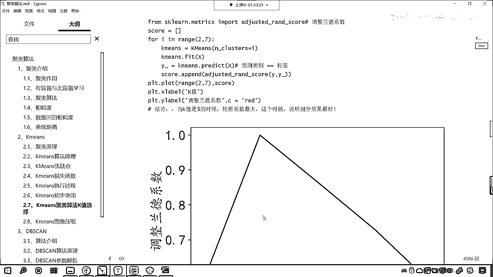

# 7天爆肝整理！AI量化交易-机器学习全套教程，从入门到项目实战保姆级教程！（数据挖掘分析／大数据／可视化／投资／金融／股票／算法） - P145：8-聚类评价指标调整兰德系数 - Python校长 - BV1KL411z7WA

好 各位小夥伴 接下來呢 我們繼續往下看啊，好 那麼還有一個評分標準 這個評分標準呢 叫做蘭德系數，這個應用也是比較常見的，好 那麼這個蘭德系數呢 它有相應的公式 就是ri=a+b。

我們現在就能夠發現 你看到了吧 這個分母上是一個C2n3，這個是不是就是一個分母上是不是就相當於排列組合呀，對吧 你看C就是排列組合 C呢 表示我們實際類別的一個劃分。

這個K呢 表示咱們據類的結果 大家注意啊 這個時候這個K呢，它不是我們據類的個數 它表示據類的結果 你用其他的符號表示也行，那麼我們的a表示什麼呀。

a呢 為在C中被劃分為同一類 在K中也被劃分為同一處實力的對數，簡而言之 也就是說劃分對了 是吧 記錄一下它的個數，那這個b呢 為在C中被劃分為不同類別 在K中被劃分為不同處的實力對數。

這個時候它也是對的 也就是說你在C中，你看啊 什麼時候我們劃分效果最好呢 你想一下，是不是C的情況和K的情況 這兩個一模一樣的時候，是不是就說明你劃分的特別好呀 它倆一模一樣 是吧。

這就說明怎麼樣 你進行據類是不是完全劃分開了呀，如果C和K是吧 完全一樣 你看啊 C如果等等K一模一樣，這是不是就說明完全劃分開了呀，那這個a呢 就表示在C中被劃分為同一類。

在K中呢 也被劃分為同一處實力的這個個數，在K中被劃分為同一類實力的這個個數，那b呢 為在C中被劃分為不同類 在K中呢 被劃分為不同類實力的這個個數，所以說 那a和b就是劃對的一個情況。

咱們的分母呢 是所有的情況 那這個時候呢，咱們此時咱們就可以用這個公式來計算咱們劃分的情況了，好 那麼後面呢 又對於這個公式進行了一個改進，那這個改進呢 就是調整蘭德系數。

它對它進行了一個 它其實也是在蘭德系數的基礎上進行的一個操作和這個改變，這樣的話 我們調整蘭德系數呢 它更具有說服力，好 那麼咱們看一下它的使用啊，那我們調整蘭德系數呢 也很簡單。

現在呢 咱們就回到代碼當中，我們導一下包 在這裡咱們來一個四級標題，這個就叫做調整蘭德系數 它的一個使用，導一下包 from sklearn。

咱們從metrics下面導一下包 import adjusted rand sklearn，執行一下代碼 導包成功了，好 那麼咱們同樣對上面這個數據進行操作啊。

那就是4K in range 咱們給一個2~7，這個時候呢 咱們就聲明k-means就等於k-means，小括號 我們的ncluster就等於k，然後咱們使用k-means對於數據進行訓練。

我們把x放進去，然後咱們使用k-means我們進行預測，predict 我們將x放進去，接收一下這個數據就叫做y-guard，然後呢 調用adjusted rand sklearn調整蘭德系數。

在這裡 你看我們要給的數據是什麼，和剛才是不是就不一樣了呀，第一個參數叫label_true，label_true是不是就是咱們的y，第二個是不是就是叫label_predict。

這個是不是就是咱們預測的呀，你看咱們上面介紹它的原理，定義a為在c中被劃分為同一類，你看我們把c表示什麼，c是不是表示咱們實際的劃分呀，那這個是不是就表示y下滑線true，那k表示據類結果。

這個據類結果它是不是就表示y_predict，對不對 你看它就表示y_predict，你看現在我們在寫的時候呢，它有的時候會有紅色的波浪線，紅色波浪線咱們可以通過文件裡邊，我們看一下編輯裡邊相應的設置。

我們看段落格式主題，我們看一下它有偏好設置，紅色的話它肯定是一個警告，咱們可以讓它不顯示咱們的警告，應該是去語法裡邊，我們看一下語法在哪裡，拼寫檢查 看到了吧，這有一個拼寫檢查，咱們怎麼樣。

不使用拼寫檢查，這個時候就好了，現在的話就不會有波浪線了，這個c就表示y_true，這個k就表示y_predict，回到這兒呢，咱們是不是就可以計算出一個score，上面咱們也接收一下。

叫scores就等於列表，我們每一次for循環計算出來的這個就叫score，那麼我們把每一次計算出來的放到咱們score這個列表當中，for循環結束，咱們現在是不是就可以繪製圖形了，prt。plot。

咱們就調用run值這個方法，依然讓它從2到7，繪製的數據就是咱們的scores，我們給一個顏色，這回呢我們給一個紅色，然後呢我們給它一個水平的標籤，那麼這個就叫做調整，這個坐標就是咱們k值的選擇。

這就是具類咱們k值的選擇，縱坐標呢我們也給一個prt。ylabel，那麼這個呢就是叫做調整蘭德系數，此時你看我一執行，來現在小夥伴就能夠看到，你看是不是同樣也是3的時候，咱們的效果最好呀。

看了吧是不是也是3的時候這個效果最好，看了吧，好那麼你看3的時候我們這個得分是多少呀，來大家看3的時候咱們得分是多少，是1。0啊，看是1對吧，為什麼呀，因為如果我們評價評價的數據是咱們的標籤的話。

你想這個標籤它肯定就能夠，這個完全對上完全相似是不是，所以說它的分數就是1，而上面咱們的這個輪廓系數你看它能到達1嗎，它到不了，你想一下它為什麼到不了1呢，因為我們的底你看到了吧。

咱們的底你就是再是同一類，你的這個底是不是也有一定的距離呀，是吧你的促內是不是有一定的距離，促間是不是距離更大，所以這個時候呢它到不了明白嗎，所以這個時候它到不了，因為我們對應的輪廓系數的公式。

它做了一個減法是不是做了一個b-a呀，看了吧做了個減法做了個b-a，所以說呢它達到不了，好那麼這個呢就是咱們調整蘭德系數。

咱們作為評價指標也可以來篩選合適的k值。

大家現在明白了吧，大家現在明白了吧。。