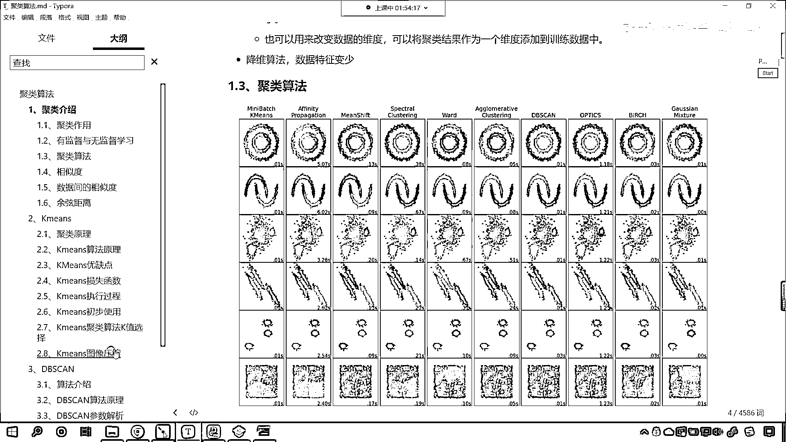
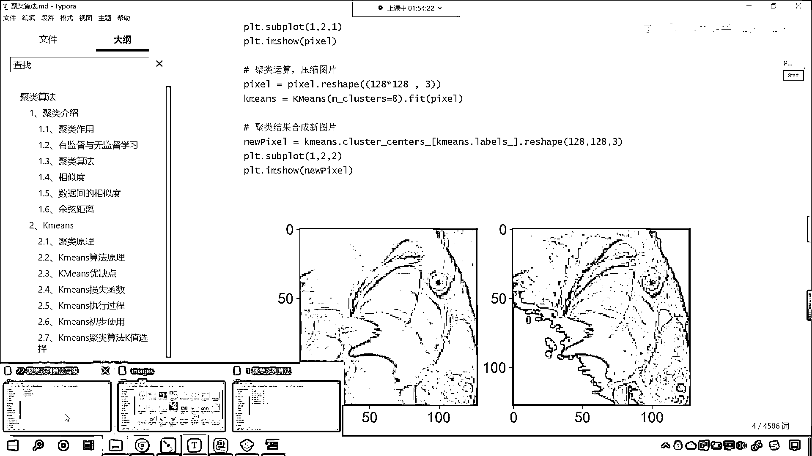
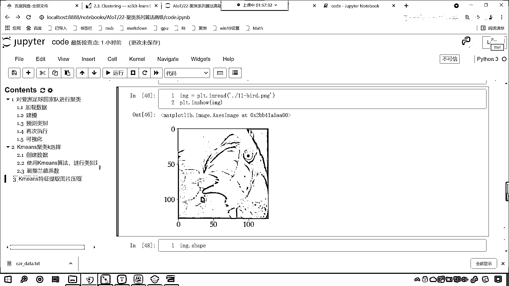

# 7天爆肝整理！AI量化交易-机器学习全套教程，从入门到项目实战保姆级教程！（数据挖掘分析／大数据／可视化／投资／金融／股票／算法） - P146：9-Kmeans聚类提取特征图片压缩 - Python校长 - BV1KL411z7WA

最後我們再看一下K-means對圖像進行壓縮，我們在介紹咱們具類的時候，咱們說具類的作用是什麼，發現事物內部的規律，異常值的檢測，還有一個就是特徵值的提取，特徵值提取我們現在就給一個例子吧。

咱們就給一個圖片壓縮的例子。

圖片的數據呢。

你能夠看到啊咱們回到代碼當中，圖片的數據呢我們也是有的，看叫做11-bird是這張圖片，你看這張圖片它是不是一個，你看是一隻鳥是不是，那麼這隻鳥當中，你能夠發現它不同的地方是不是有不同的顏色呀，對不對。

那麼在這個數據當中，你想它的顏色是不是千變萬化呀，它的特徵就很多，現在呢咱們回到代碼當中，我們來一個三級標題，好那麼這個呢就是咱們K-means，我們叫做特徵提取圖片壓縮，咱們來一個這樣的操作。

好那麼這個時候呢，我們相應的導包咱們import non-py as np，咱們import matplotlib pyplot as prt，然後咱們import pandas as pd。

把這個包導進來，prom sklearn，咱們從cluster當中我們導一個k-means，我們把這個導進來，好那麼導進來之後呢咱們執行一下，接下來呢我們就加載一下這個數據啊，那就是prt。

dialog image read，在我們當前路徑下有一個11-bird，看這就是一隻鳥，咱們prt。image show 一下，image放進去，這個時候你看我一直行，大家看這張圖片是不是就出來了。

這隻鳥很可愛很漂亮是不是，那麼我問你一個問題啊，就這張圖片它的數據是什麼樣的呀，來打印輸出你來告訴我，看數據是不是就有了，看到了吧，那我們這個數據是不是紅綠藍三原色組成的呀，它是一個三維的紅綠藍三顏色。

它有三個中國號，我現在問你一個問題，咱們這個1-means當中我們查看一下它的shape，現在你就能夠發現，咱們的數據是不是128128和3呀。

那麼我們能不能使用k-means對這個數據進行壓縮進行降維呀，聲明一個k-means，我們就讓k-means咱們給一個n cluster，比如說我們現在把它聚類聚成多少類呢。

你想咱們這個聚類我們是不是可以把它聚成，比如說我們把它聚成八類啊，沒問題吧，就是我們從這個顏色當中是吧，因為這個當中顏色很多，我們從這個當中選取八種主要的顏色來表示這張圖片，可以不可以。

看了吧可以啊。

所以說這個八呢，它表示什麼，這個八呢，表示八種主要的顏色，那我們現在就調用咱們的k-means點，咱們就fit一下吧，我把image放進去，你看image是不是就咱們這張圖片呀，看能不能你看我一直行。

來你各位小夥伴你猜想一下我執行會不會報錯，如果你認為正確能夠執行是1，如果你認為報錯，那你就回復一個2啊，你看我一直行，哦大家都很聰明啊，回答的是2是吧，為什麼呢，因為你的數據形狀是128128。

它是三維的，咱們的訓練數據，它呢要求必須是二維的，對不對啊，那這個二維它表示什麼呀，這個行呢，表示咱們的樣本，這個列呢，它表示特征，你現在呢三維，你這個三表示什麼呀，是不是就不能表示了。

那麼我們現在呢將咱們這個數據進行一個形狀改變，咱們來接受一下啊，X呢就等於image點，我們進行reshape，來一個-1逗號3，我們將X的形狀打印輸出一下，看X是16384，最後一個3。

你能告訴我這個3表示什麼嗎，3是不是表示像素呀，對不對，那麼我們16384，這個表示什麼，你看這個是不是表示咱們的像素點呀，我們現在把這張圖片當中的每一個像素點，咱們把它表示樣本，這個就是我們的樣本。

好，那麼現在你看，我如果要再進行X的操作，咱們再fit一下X，現在就沒問題了，你看我一直行，此時是不是就沒問題了呀，那麼到這裡之後，咱們訓練完成了，那麼我們從k-means當中獲取一下它的。

獲取一下它的點，咱們來一個type鍵，這個裡邊就有一個cluster centers，這裡邊就有一個cluster centers，我們剛才在講原理的時候，看看咱們剛才在講原理的時候，咱們說到。

你看它是不是有聚類中心呀，我們黃色的X號，綠色的X號，藍色的X號，這個是不是聚類中心，你想是不是，它是聚類中心，那麼這個聚類中心，有幾個呢，你看我執行一下，你數一下它有幾個，上面你看，我們聚類的時候。

看咱們是不是給了8個呀，對不對，我們說我們要從這16384個像素點，這每一個像素點，它表示樣本，每一個樣本呢，它就表示一種顏色，對不對，那麼我們從這個當中，咱們提取特徵。

咱們是不是提取了8種主要的顏色呀，在這呢，咱們就提取了8種主要的顏色，那這8種主要的顏色是什麼呢，就是咱們下面這種顏色，看到了吧，就是下面這種顏色，好那麼我們接收一下啊。

我們起個名就叫做men colors，這就是我們使用咱們聚類這個算法提到的，提取出來的顏色，好那麼提取出來顏色之後呢，接下來我們再來一步，好那麼我們，咱們將主要的這個顏色，我們呢再把它變成圖片。

將主要的顏色再變成圖片，上面咱們進行的操作，我們也插入一行來一個四級標題，這一步呢，咱們就是使用K-means，我們提取主要顏色，你看這個圖，你想都不用想，這個當中的一個主要顏色，是不是就是這個黑色呀。

還有是不是這種這個黃色呀，還有他的你看嘴唇，這是不是有這個紅色呀，看這個黃的是不是更黃，對不對你看這個上面，是不是這個淺黃色呀，對不對，所以說你看，他的主要顏色當中肯定有一個黑色，肯定有一個淺黃色。

肯定有一個黃色，你說我說的對不對，好那麼具體是哪些呢，是吧對於顏色呢，咱們只能說這個紅色綠色黃色是吧，他可以紅的深一點，他是不是可以黃的淺一點呀，黃的深淺，咱們使用語言描述。

是不是這個時候就捉襟見肘了呀，那我們再把將主要顏色，咱們再把它變成圖片，如何變成圖片呀，K means 他的方法，Predict 他的作用是什麼，我們將X放進去，你能告訴我他的作用是什麼嗎。

看我們來一個Y蓋，你看啊，我們如果要執行這個代碼打印輸出，你能告訴我這個Y蓋，他的數字是怎麼樣的嗎，你思考一下，你看我們的算法，是不是把這個數據分成了八類呀，那麼八類我們如何去表達他的類別呢。

是不是0 1 2 3 一直到7呀，你看我一直行，各位小夥伴睜大眼睛來看一看，看55中間是不是省略號，那省略號裡邊就有很多了，是不是還有633呀，對吧，也就是說我們這第一個點。

也就是說咱們數據X當中的第一個點，我們把它劃歸成了類別5，你知道我說的類別5是什麼意思嗎，看我們就找一下啊，看看咱們用紅色，看這個是類別1，這個是類別2，一般情況下咱們的類別就是從0 1 2 3開始啊。

你看他一共有幾個，一共有八個是吧，如果我們要對他進行編號的話，你想一下這第一個是不是就表示，如果我們要對他進行編號，你看這第一個是不是就是0，對不對，咱們的第二個是不是就是1，然後2 3 4 5。

這個是不是就表示5呀，對不對，然後6這個是不是就是7，對吧，最後一個這個就是7，那我們1 2你看，這個是不是就可以用3來表示呀，對吧，好，現在你能夠發現，你看我們預測出來的5，那這個5對應著哪個顏色呀。

看你這個5對應哪個顏色，是不是就對應他，看到了吧，就對應這個顏色，那這個3對應哪個啊，這個3就對應上面這個顏色，我們把它畫出來啊，用框框框出來，看了就對應他，看了那我們還有這個6，6對應哪個呀。

你看6呢，你也把它畫上，6就對應這個，是不是，所以說你看我們的y-其實它表示的是什麼，是不是我們原數據的一個類別劃分情況呀，看在這，咱們的y-，它表示，咱們原來1638416384個，樣本，它的類別。

劃分情況，好，這個大家明白嗎，來這個大家明白嗎，明白的話，我們就在咱們的討論區回復一個理論啊，好，那麼我們既然有了這個類別劃分情況，那麼我們就可以使用mencolor，咱們就按照這個順序是吧。

來對它進行，你看，咱們的mencolor是不是樹組呀，看了吧，我們這個mencolor中國號咱們來一個y，你看這個就表示什麼，是不是就表示花式索引呀，看了吧，這個就表示花式索引，咱們根據這個順序取出來。

好那麼取出來之後呢，咱們就會得到一個1-2，好，那麼現在呢，咱們就plt。，我們1-show，咱們就將1-2放進去，這個時候你看我一直行，不太行，看到了吧，形狀是不是沒有改變呀。

來咱們進行一個reshape，我們原來的數據，你看是128128是吧，我們經過形狀改變，它是不是就變成16384呀，現在如果我們想要以圖片的形式，把它展示出來，這個時候你想這個1-2。

是不是得reshape成128，逗號128逗號和3呀，這個時候你看我一直行，來各位小夥伴，看我們這個圖片，和原圖片是不是就有一個不同了，那我們把兩張圖片都給它顯示出來啊，plt。subplot。

咱們來一個一行兩列第一個，是吧，然後呢咱們繪製的圖片呢，咱們先繪製plt。image。show，咱們將image放進去，然後再來一個plt。subplot，一行兩列第二個，一行兩列第二個。

然後再繪製image2，這個時候你看我一直行，左邊是原圖，右邊是不是我們經過處理的圖片呀，尺寸稍微放大一點，plt。figure，這個當中給一個figure size，那這個寬度我們來寬一些。

寬度的話咱們就來一個這個8吧，那這個高度呢來一個4，這個時候你看我一直行，來各位小夥伴，你能夠看到左邊這個圖片是不是高清呀，右邊這個圖片是不是模糊呀，那為什麼它給模糊了呢，你看這個是不是就相當於圖片。

顏色的一個壓縮呀，但是它的形狀你看一樣不一樣，形狀是不是類似呀，所以這個時候呢，咱們這個顏色就沒有那麼豐富了，是不是啊，你看這個是不是就有點像素描的那種感覺了呀，對吧。

大家現在就能夠看到我們是怎麼做的呀，我們呢，那我們其實可以將圖片是吧，把它看成數據，這是原圖雙擊合起來，它是什麼樣的一個數據呢，我們進行reshape，它代表16384個像素點。

表示16384種384個這個顏色，這個裡邊顏色可能會有相同的，對吧，有重複的，那我們不管你有有沒有重複，我們使用k-means對它進行據類，據類的意思就是，把八種主要顏色給它提取出來。

你看這不就表示特徵提取嗎，我們把顏色當成特徵，我們把其中八種主要特徵，是不是通過據類算出來提取出來了，那麼k-means有一個特徵，就是k-means有一個屬性，就是調用k-means。cluster。

咱們可以得到據類中心，在這兒進行一個說明，這個就叫據類中心，這個就是咱們的據類中心，據類中心我們可以認為，就是咱們的特徵，就是我們提取的，這就是咱們提取的特徵，然後呢。

我們使用k-means對原數據進行預測，預測其實就是把它劃歸類別，預測其實就是劃歸類別，那麼我們根據這個類別，咱們根據花式索引，重新再組成圖片，左側和右側，你就能夠看到有差距了，這個就是咱們這個據類。

它的特徵提取圖片壓縮的一個操作，這個時候你把圖片縮小之後，發出去，就不會，你看上去就會比較隨和了，這個就是我們k-means特徵提取圖片壓縮的一個。

