# 7天爆肝整理！AI量化交易-机器学习全套教程，从入门到项目实战保姆级教程！（数据挖掘分析／大数据／可视化／投资／金融／股票／算法） - P148：2-DBSCAN算法原理和参数详解 - Python校长 - BV1KL411z7WA

接下來我們一起看一下DB-SCAN的算法原理。

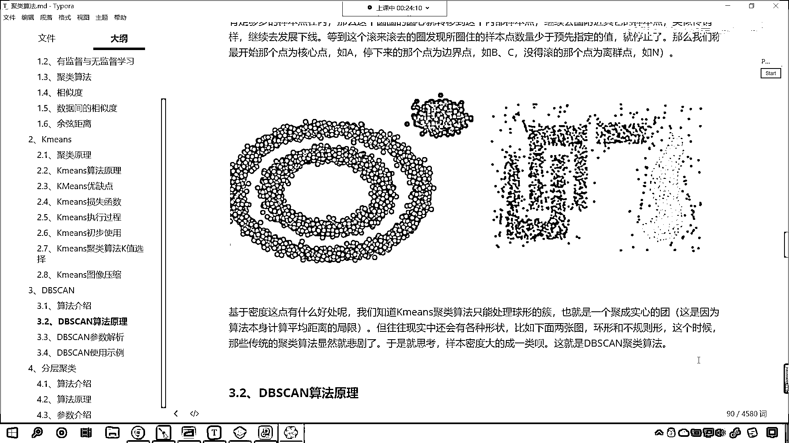

現在各位小夥伴們就能看到我在這給你畫了一個動圖，這個動圖就是老師自己做出來的，你看它是怎麼進行劃分的，你來觀察一下規律，我們就能夠看到，它是根據密度一個一個圈畫，這個時候你會發現。

有一些點它是不是沒有進行分類，有一些點沒有進行分類，看到了吧是哪些點呢，咱們畫一個圖，等會兒我們等著它據類結束，現在你就能夠發現，看哪些點沒有進行據類呢，看到了吧這個點是不是沒有，還有這個點，這個點。

還有咱們這個點，你會發現，那為什麼這些點它沒有被進行類別的劃分，是不是因為它們屬於是離群點，看到了吧，這樣的點我們就把它叫做離群點，那麼離群點，就是咱們的異常值，所以說我們的據類算法，它的一個作用之一。

就是去尋找異常值，看那有了異常值了，那這些異常值就應該被我們清洗掉，看到吧，因為異常值它對於我們數據分析，對於我們進行機器學習，它沒有好處，看到了吧，你看它沒有好處，為啥呀。

因為異常值都屬於是特殊的情況，是吧，你像姚明那麼高是吧，那如果說他要打籃球打得不好是吧，那可能買衣服是吧，買車都沒有合適他的，是吧，好，那麼所以說異常值對於我們機器學習，其實咱們你看機器學習。

它是一個普世的，你看機器學習，我們其實是不是就是在找規律呀，使用算法使用數學是不是在找規律呀，那這個規律呢，它一定是一般的規律，這個規律它一定是一個一般的規律，哎，有各位小夥伴發現了。

咱們這個其實就是一張笑臉。

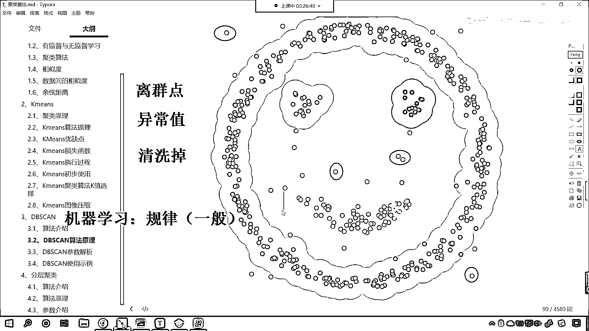

是不是啊，確實是一張笑臉啊，好，那麼這個呢，就是咱們，DB scan這個算法的解析，現在呢，咱們回到代碼當中，來此時呢，咱們回到代碼當中，我們創建一個，python 文件，選中它，咱們給它改個名，好。

那麼此時呢，我們就導一下包，咱們的import numpy as np，然後呢，咱們import matplotlib，pyplot as prt，算法我們導進來，from sklearn。

cluster，咱們從cluster當中，咱們import k-means，然後來一個逗號，這個時候呢，咱們來一個DB scan，咱們將這個呢，也給它導進來，那麼我們再導一個包。

from sklearn，咱們從sklearn下邊，我們導一個包，叫做data sets，這個呢，可以幫助我們生成數據，執行一下這個代碼，那麼我們剛才呢，對於db scan這個算法原理，進行了介紹。

接下來呢，我們對於這個算法當中的參數，進行一個詳細的說明，好，大家看啊，那這個db scan，它的參數詳解，好，那麼，我們就在代碼當中，對於這個算法，咱們進行一個聲明，那就是db scan。

就等於db scan小括號，想要查看它的參數，咱們shift tab，好，在這呢，我們就能夠看到，你看這個參數，它是不是有一個EPS呀，還有一個mean samples，還有一個參數叫matrix。

那這個裡邊這個參數呢，前三個是很重要的，咱們呢，就對於前三個參數，我們進行一個詳細的解釋和說明，好，那麼那這個EPS，它表示什麼呢，這個EPS呢，它呢，表示的是我們半徑的距離。

這個EPS表示咱們半徑的大小，咱們在課節當中呢，都進行了具體的說明，咱們的EPS領域的這個距離的域值，就是和樣本距離超過EPS的這個樣本點呢，它就不在這個EPS的這個域值內，那你想這個是不是就是表示。

咱們上面是吧，我們在進行這個以某一個點為原心的時候，咱們是不是就畫了一個圈呀，對不對，是不是就畫了一個圈呀，所以說這個EPS，所以咱們這個EPS呢，它就表示咱們以某一個點為原心，咱們半徑的大小。

如果我們其他點在這個圓內，那麼呢，咱們就聚類聚過來，那這個值呢，默認是0。5，一般呢，咱們需要通過這個調整，選擇一個合適的域值，那如果這個EPS過大，你看如果這個半徑過大，你想一下。

會產生什麼樣的一種效果呢，是不是更多的點會落在核心對象的EPS域內呀，那你更多的點被囊括進來了，是吧，你無所不包，這個時候呢，我們的類別可能就會減少，那麼因為你過大，那麼類別就會減少。

本來不應該是一類的樣本點，也會被劃歸到一類，是吧，反之如果你要過小，那麼類別數可能會增大，是吧，本來是一類的。

它就被劃分開了。

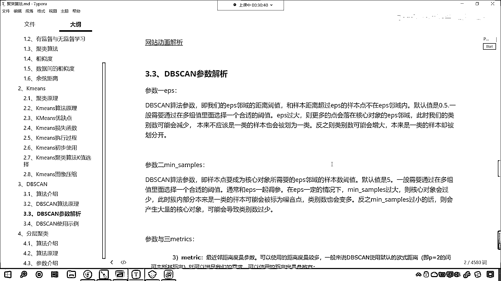

那大家現在就能夠看到，你看這個上面這個動圖呢，我們有相應的一個網站可以很好的展示，這個是咱們網站動畫解析，咱們的右肌，你看我們打開鏈接，我把這個鏈接呢，複製，也給各位小夥伴發過去，你看這個呢。

是一個很好的網站，它叫viralization db scan clustering，它呢，其實就是對於db scan這個算法，它進行了一個可視化，好，那你看這個它可以對於不同的數據進行可視化。

這個叫現在你就能夠看到，看這個是smile face，是吧，pipe smile，example a是吧，還有db scan rig，我們隨便選一個，smile face，你看這個是不是就是。

我們客界當中提供的，那現在你就能夠看到，你看這有一個什麼，看到了吧，你看我們的這個eps這個參數，看到了吧，這個eps這個參數，你看如果我要把它調大，你是不是就發現，看到了吧，我把它我現在先讓它默認。

默認是1。0，咱們來一個go，看我來一個go，現在你看它是怎麼進行類別劃分的，看到了吧，它是這種形式進行類別劃分的，它就是根據密度，一個圈一個圈在進行繪製，待會呢，我們將這個eps咱們給它調大。

看到了吧，我們把它調大，各位小夥伴看一下它是怎樣的一個效果，那麼現在呢，它是1。0，大家注意觀察，我們這些點在進行劃分之後，是吧，這些點在進行劃分之後，看一下它會形成幾類，是吧，那當然很妙了。

這就是可視化它的一個強大的好處，知道吧，以後你看咱們現在呢，這個國家禁止是不是k12的這個，禁止向新東方呀，禁止向這個圓福島呀，是不是禁止他們上課了，對吧，那以後你可以借助計算機，是吧。

把這些高中的初中的題目進行相應的，相應的講解，特別是物理，是吧，可視化就會有一個非常好的效果，那這個時候呢，咱們來一個restart，我們依然選擇這個simple face，咱們這個時候呢。

我們把半徑給它增大，現在你看它就變成1。98了，這個時候你看這個半徑是不是就大多了，此時我一執行，你來看一下它會怎麼樣啊，我們看看啊，這個時候因為我們這個，因為咱們這個數據呢，大家看啊，咱們這個數據。

它這個還是比較規範的，是不是啊，這個時候呢，我們可能應該是應該是不會變是吧，因為我們這個點離的是不是都比較遠啊，來，那咱們換一個好不好，咱們換一個啊，看啊。

比如說我們返回一下。

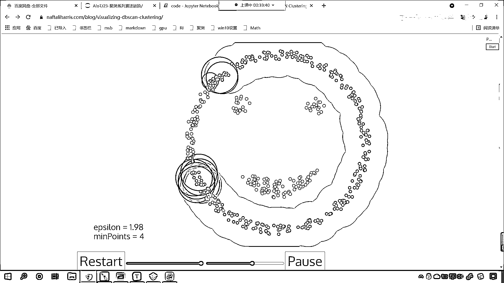

咱們刷新啊，重新刷新，咱們找一個這個其他的數據，這個時候呢，比如說我們選這個看到了，咱們選這個這個這個時候就有就有影響了，是吧，你看現在是不是就有噪聲了，看到了嗎，這個就有噪聲了，哎，我們滑動是吧，嗯。

現在呢，你就能夠看到看到了嗎，咱們有一個點是不是在在這個地方呀，對吧，那這個地方，你想他是不是肯定劃歸不到一個類別當中呀，對不對，你看他肯定劃歸不到，現在呢，我們的一波C龍啊，大家看咱們的一波C龍。

它是1。0，這個就相當於是半徑，嗯，大家看確實如此是吧，這個點是不是就劃歸不到了，你再來仔細觀察啊，你看這個點也沒有劃歸看到了嗎，這個點還有這個點，為什麼呀，到了這個點和這個點，他是不是這個密度不夠呀。

對吧，所以說他就沒有劃歸，哎，大家看現在我們是不是劃歸成了幾類，咱們是不是劃歸成了這個四類點呀，看有一些異常之點。

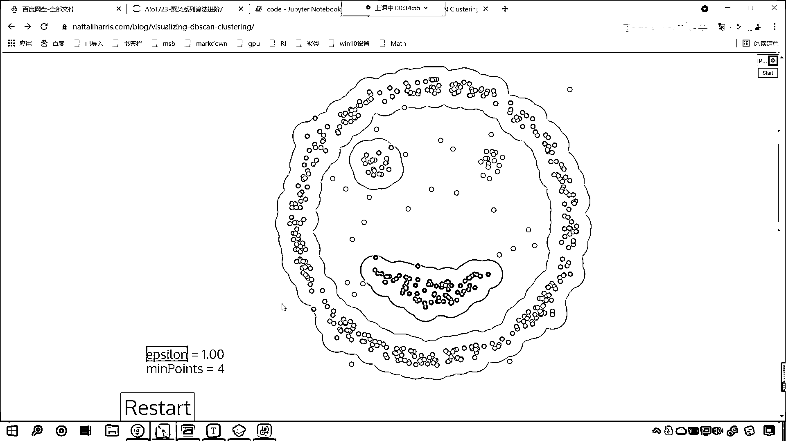

現在呢，我們來一個res，現在呢，咱們來一個reset，我們將這個半徑呢，咱們給他增大啊，這個時候大家看效果，看這個時候你來看效果，哎，我們就會發現這回呢，哎，現在你來看看看看，出現一個什麼樣的情況呀。

看到了嗎，出現一個什麼樣的情況，我們這幾個點是不是也歸到一類了，看到了嗎，你看這幾個點也歸到一類了，最後呢，我們就會發現如果這個一波C龍是吧，如果這個值要變大，咱們的劃歸的類別肯定就少了，看現在。

你看哎，最後是不是就把他也包起來了，看到了吧，也把他給包起來了。

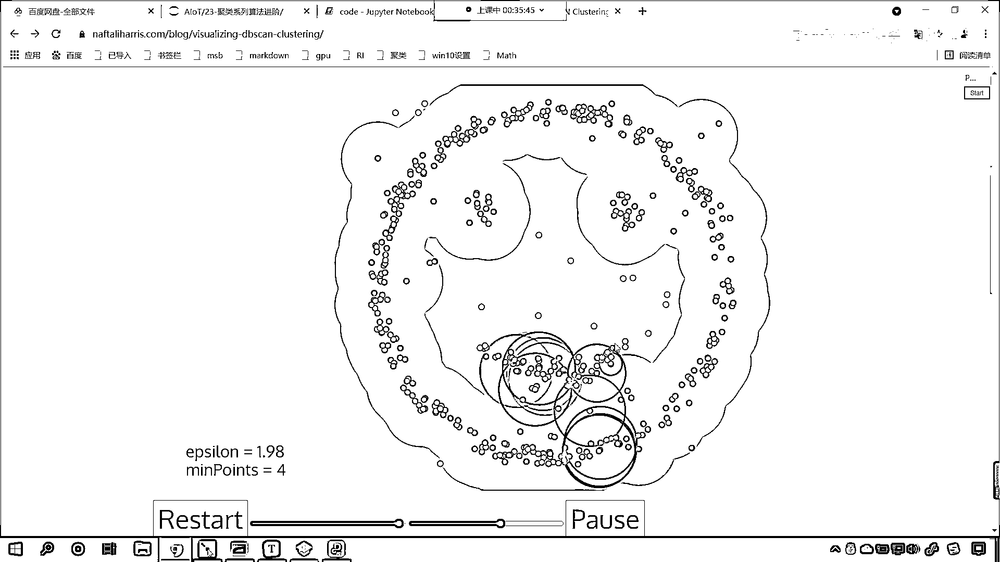

是不是哎，現在大家明白是怎麼回事了吧，哎，所以說呢，這個就是咱們這個參數，如果這個eps過大，那麼我們的類別呢，就會減少，咱們接下來看一下第二個參數啊，第二個參數叫mean sample。

那麼這個參數呢，就是他對於我們這個密度進行一定的限制，進到我們樣本底要成為核心對象所需要的這個eps，這個半徑這個圓圈內咱們的樣本的預值，那默認情況下是5，也就是說你得大於等於5。

那麼才才會把你歸到這一類，如果你要小於5，那麼你就不是這個類別，那你想在一個圈內數量越多，是不是密度越大，在一個圈內數量越少，這個密度是不是就越小呀，對吧，所以你看我們db scan這個算法。

他呢就是基於密度而來的嘛，對不對，那我們就可以控制這個數據是吧，來進行密度的控制，好，那麼一般呢，咱們需要通過多組值當中選一個合適的預值，是吧，通常和eps一起調參，在eps一定的情況下，大家注意啊。

在半徑一定的情況下，咱們這個mean sample過大，會怎麼樣，你想一下，你看如果這個值要過大，這個值過大，你想那我們的條件要求是不是就更加苛刻呀，比如說我們給個100。

那也就意味著你在進行密度控制的時候，你是不是必須得有100個點，我才能夠把你劃歸到這個類別呀，對吧，那則核心對象就會少，看到了嗎，核心對象，咱們的核心對象會過少，此時處內本來是一類的樣本點，可能呢。

被標記為噪聲點是吧，類別也會咱們的類別呢，也會變多。

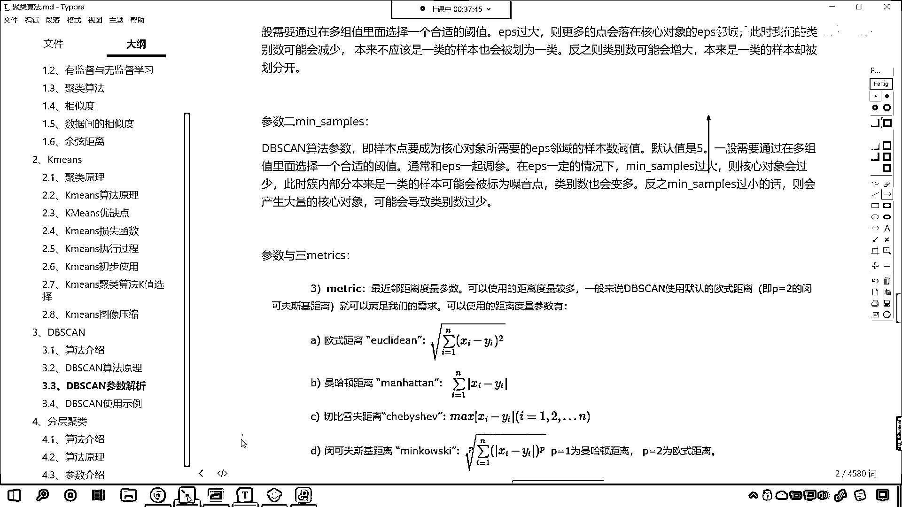

那我們回到，咱們回到網頁上，我們進行相應的展示啊，咱們來一個這個restart，這個時候呢，我們就把這個數量給它增大啊，大家現在看啊，你看我們數量減小吧，我們先減小。

你看咱們這個mean point是1，你看會怎麼樣啊，也就是說我們的epsylon是吧，這個不變是吧，半徑不變，你現在就能夠看到，你看他到這個的位置是不是給停了呀，看到了嗎，到這個位置停了。

我們現在看到的這個數量是1，我們現在看到的這個數量是1，我們現在看到的這個數量是1，我們現在看到的這個數量是1，我們現在看到的這個數量是1，我們現在看到的這個數量是1，我們現在看到的這個數量是1。

我們現在看到的這個數量是1，我們現在看到的這個數量是1，我們現在看到的這個數量是1，我們現在看到的這個數量是1，我們現在看到的這個數量是1，我們現在看到的這個數量是1，我們現在看到的這個數量是1。

我們現在看到的這個數量是1，我們現在看到的這個數量是1。

我們現在看到的這個數量是1，我們現在看到的這個數量是1，我們現在看到的這個數量是1，我們現在看到的這個數量是1。

我們現在看到的這個數量是1。

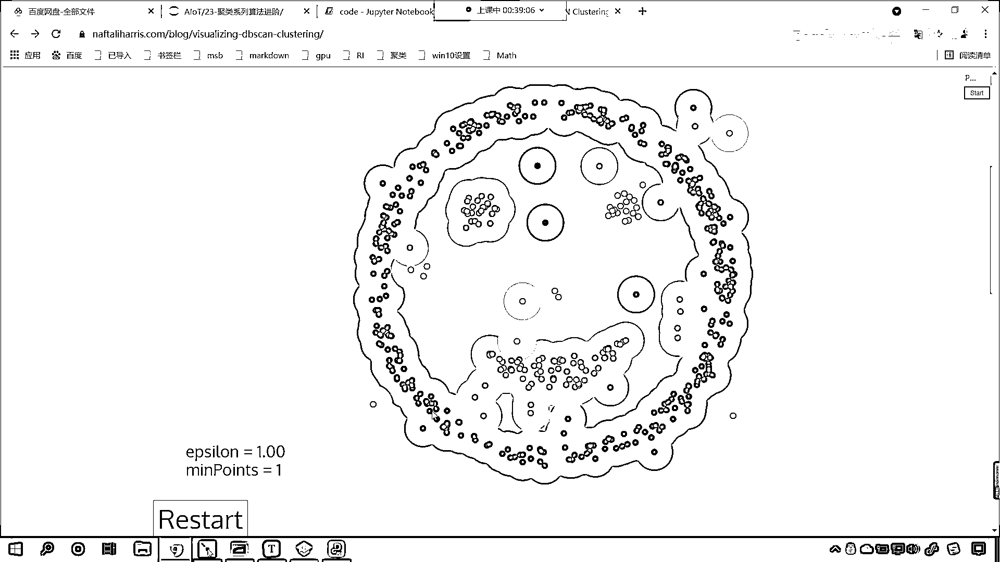

我們現在看到的這個數量是1，我們現在看到的這個數量是1。

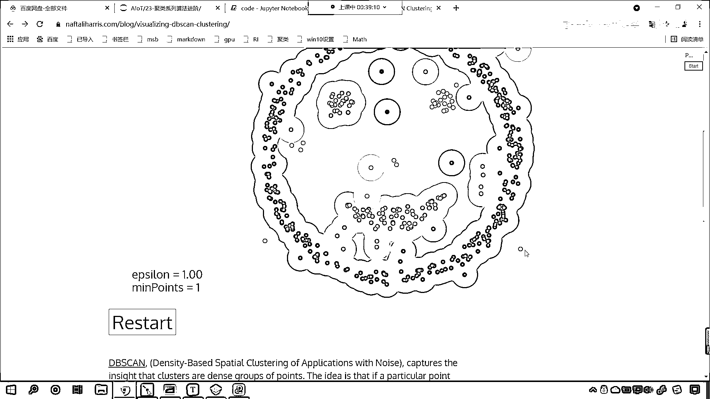

我們現在看到的這個數量是1，我們現在看到的這個數量是1，我們現在看到的這個數量是1，我們現在看到的這個數量是1。

我們現在看到的這個數量是1。

我們現在看到的這個數量是1，我們現在看到的這個數量是1，我們現在看到的這個數量是1，我們現在看到的這個數量是1，我們現在看到的這個數量是1，我們現在看到的這個數量是1，我們現在看到的這個數量是1。

我們現在看到的這個數量是1，我們現在看到的這個數量是1，我們現在看到的這個數量是1。

我們現在看到的這個數量是1，我們現在看到的這個數量是1，我們現在看到的這個數量是1，我們現在看到的這個數量是1，我們現在看到的這個數量是1，我們現在看到的這個數量是1，我們現在看到的這個數量是1。

我們現在看到的這個數量是1，我們現在看到的這個數量是1，我們現在看到的這個數量是1，我們現在看到的這個數量是1，我們現在看到的這個數量是1，我們現在看到的這個數量是1，我們現在看到的這個數量是1。

我們現在看到的這個數量是1，我們現在看到的這個數量是1，我們現在看到的這個數量是1，我們現在看到的這個數量是1，我們現在看到的這個數量是1，我們現在看到的這個數量是1，我們現在看到的這個數量是1。

我們現在看到的這個數量是1，我們現在看到的這個數量是1，我們現在看到的這個數量是1，我們現在看到的這個數量是1，我們現在看到的這個數量是1，我們現在看到的這個數量是1，我們現在看到的這個數量是1。

我們現在看到的這個數量是1，我們現在看到的這個數量是1，我們現在看到的這個數量是1，我們現在看到的這個數量是1，我們現在看到的這個數量是1，我們現在看到的這個數量是1，我們現在看到的這個數量是1。

我們現在看到的這個數量是1，我們現在看到的這個數量是1，我們現在看到的這個數量是1，我們現在看到的這個數量是1，我們現在看到的這個數量是1，我們現在看到的這個數量是1，我們現在看到的這個數量是1。

我們現在看到的這個數量是1，我們現在看到的這個數量是1，我們現在看到的這個數量是1，我們現在看到的這個數量是1，我們現在看到的這個數量是1。

我們現在看到的這個數量是1。

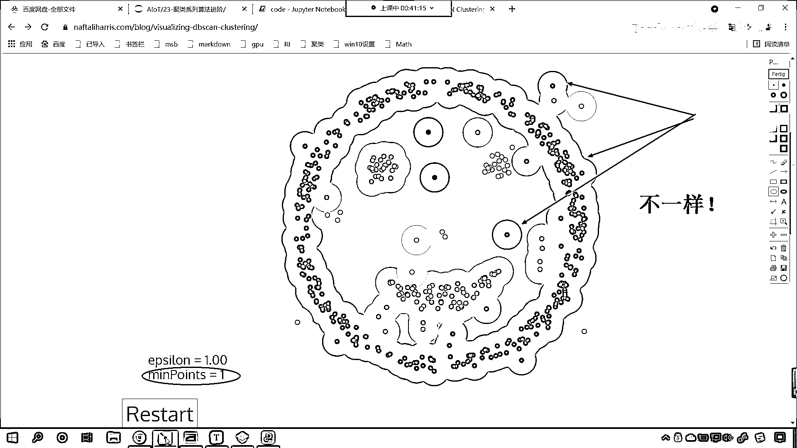

我們現在看到的這個數量是1，我們現在看到的這個數量是1，我們現在看到的這個數量是1，我們現在看到的這個數量是1，我們現在看到的這個數量是1，我們現在看到的這個數量是1，我們現在看到的這個數量是1。

我們現在看到的這個數量是1，我們現在看到的這個數量是1，我們現在看到的這個數量是1，我們現在看到的這個數量是1，我們現在看到的這個數量是1，我們現在看到的這個數量是1，我們現在看到的這個數量是1。

我們現在看到的這個數量是1，我們現在看到的這個數量是1，我們現在看到的這個數量是1，我們現在看到的這個數量是1，我們現在看到的這個數量是1，我們現在看到的這個數量是1，我們現在看到的這個數量是1。

我們現在看到的這個數量是1，我們現在看到的這個數量是1，我們現在看到的這個數量是1，我們現在看到的這個數量是1，我們現在看到的這個數量是1，我們現在看到的這個數量是1，我們現在看到的這個數量是1。

我們現在看到的這個數量是1，我們現在看到的這個數量是1，我們現在看到的這個數量是1，我們現在看到的這個數量是1，我們現在看到的這個數量是1，我們現在看到的這個數量是1，我們現在看到的這個數量是1。

我們現在看到的這個數量是1，我們現在看到的這個數量是1，我們現在看到的這個數量是1，我們現在看到的這個數量是1，我們現在看到的這個數量是1，我們現在看到的這個數量是1，我們現在看到的這個數量是1。

我們現在看到的這個數量是1，我們現在看到的這個數量是1，我們現在看到的這個數量是1，我們現在看到的這個數量是1，我們現在看到的這個數量是1，我們現在看到的這個數量是1，我們現在看到的這個數量是1。

我們現在看到的這個數量是1，我們現在看到的這個數量是1，我們現在看到的這個數量是1，我們現在看到的這個數量是1，我們現在看到的這個數量是1，我們現在看到的這個數量是1，我們現在看到的這個數量是1。

我們現在看到的這個數量是1，我們現在看到的這個數量是1，我們現在看到的這個數量是1，我們現在看到的這個數量是1。

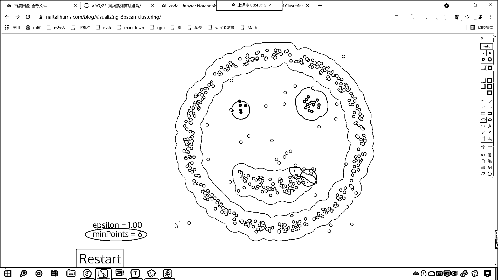

我們現在看到的這個數量是1，我們現在看到的這個數量是1，我們現在看到的這個數量是1，我們現在看到的這個數量是1，我們現在看到的這個數量是1，我們現在看到的這個數量是1，我們現在看到的這個數量是1。

我們現在看到的這個數量是1，我們現在看到的這個數量是1，我們現在看到的這個數量是1，我們現在看到的這個數量是1，我們現在看到的這個數量是1，我們現在看到的這個數量是1，我們現在看到的這個數量是1。

我們現在看到的這個數量是1，我們現在看到的這個數量是1，我們現在看到的這個數量是1。

我們現在看到的這個數量是1，我們現在看到的這個數量是1，我們現在看到的這個數量是1。

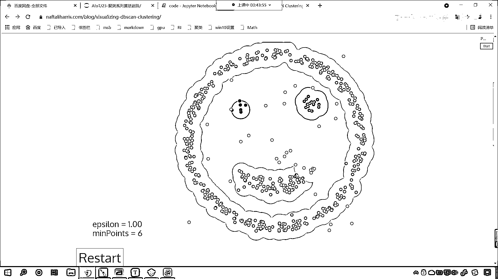

我們現在看到的這個數量是1，我們現在看到的這個數量是1，我們現在看到的這個數量是1，我們現在看到的這個數量是1，我們現在看到的這個數量是1，我們現在看到的這個數量是1。

我們現在看到的這個數量是1。

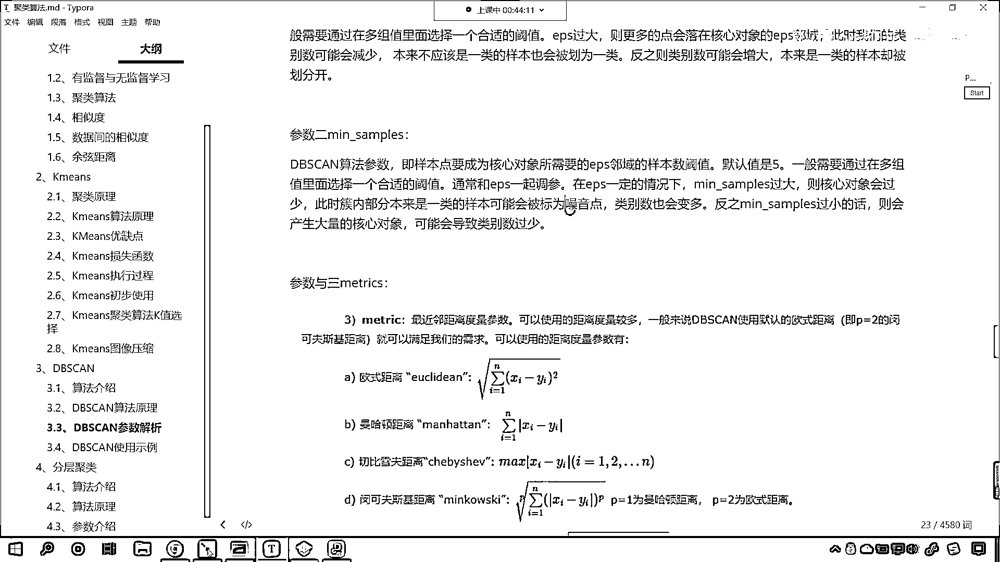

我們現在看到的這個數量是1，我們現在看到的這個數量是1，我們現在看到的這個數量是1，我們現在看到的這個數量是1，我們現在看到的這個數量是1，我們現在看到的這個數量是1，我們現在看到的這個數量是1。

我們現在看到的這個數量是1，我們現在看到的這個數量是1，我們現在看到的這個數量是1，我們現在看到的這個數量是1，我們現在看到的這個數量是1，我們現在看到的這個數量是1，我們現在看到的這個數量是1。

我們現在看到的這個數量是1，我們現在看到的這個數量是1，我們現在看到的這個數量是1，我們現在看到的這個數量是1，我們現在看到的這個數量是1，我們現在看到的這個數量是1，我們現在看到的這個數量是1。

我們現在看到的這個數量是1，我們現在看到的這個數量是1，我們現在看到的這個數量是1，我們現在看到的這個數量是1，我們現在看到的這個數量是1，我們現在看到的這個數量是1，我們現在看到的這個數量是1。

我們現在看到的這個數量是1，我們現在看到的這個數量是1，我們現在看到的這個數量是1，我們現在看到的這個數量是1，我們現在看到的這個數量是1，我們現在看到的這個數量是1，我們現在看到的這個數量是1。

我們現在看到的這個數量是1，我們現在看到的這個數量是1，我們現在看到的這個數量是1，我們現在看到的這個數量是1，我們現在看到的這個數量是1，我們現在看到的這個數量是1，我們現在看到的這個數量是1。

我們現在看到的這個數量是1。

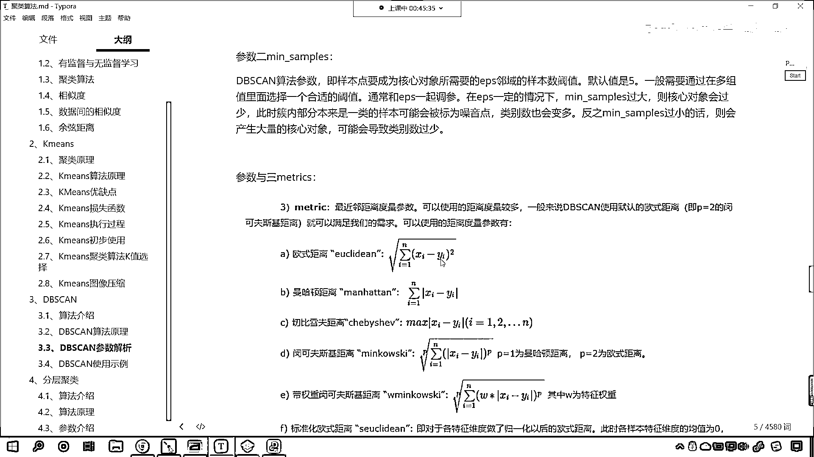

我們現在看到的這個數量是1，我們現在看到的這個數量是1，我們現在看到的這個數量是1，我們現在看到的這個數量是1，我們現在看到的這個數量是1，我們現在看到的這個數量是1。

我們現在看到的這個數量是1。

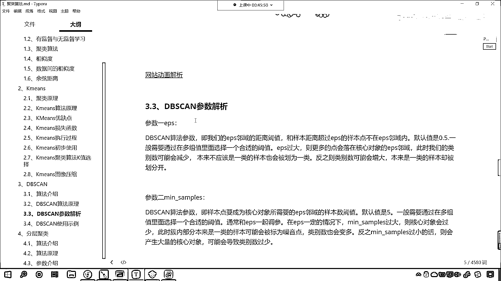

我們現在看到的這個數量是1，咱们进行了详细的一个解释。