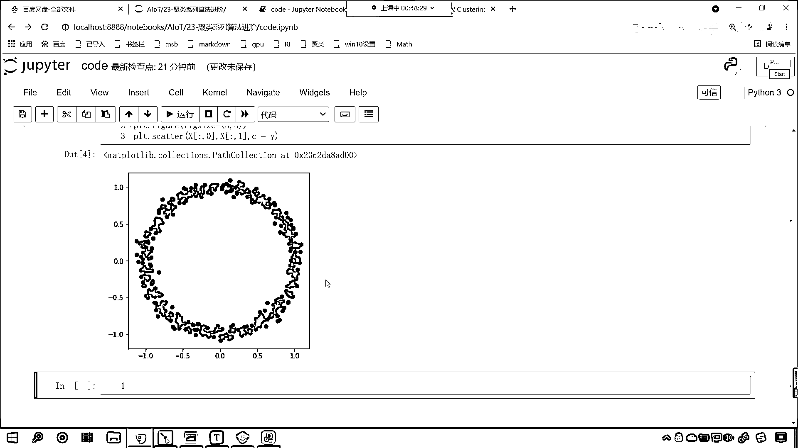
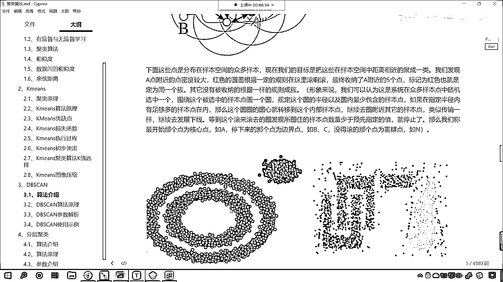
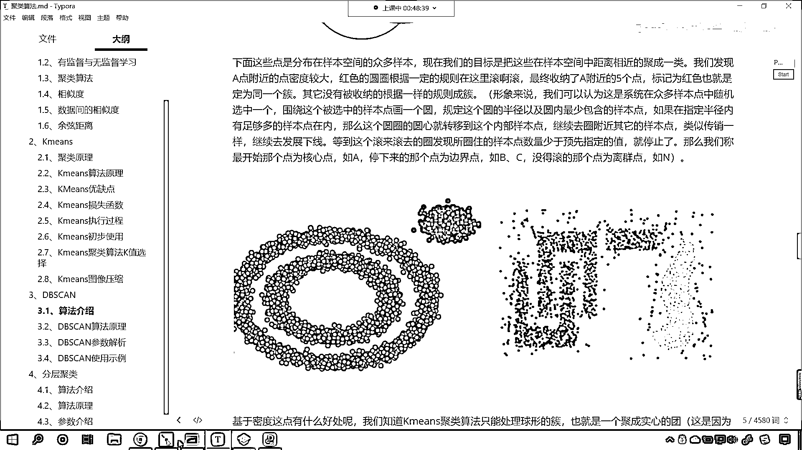
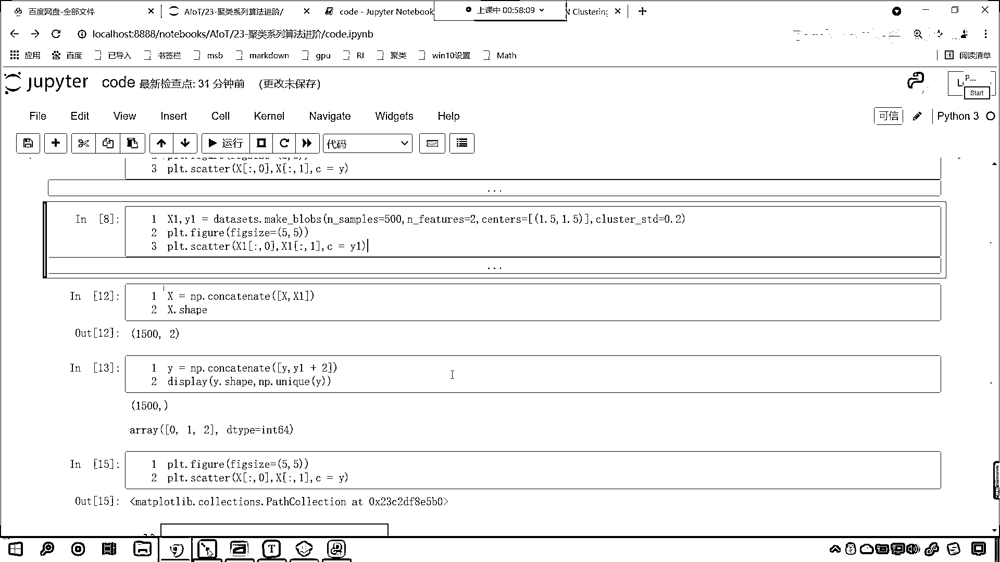

# 7天爆肝整理！AI量化交易-机器学习全套教程，从入门到项目实战保姆级教程！（数据挖掘分析／大数据／可视化／投资／金融／股票／算法） - P149：3-DBSCAN聚类案例数据创建 - Python校长 - BV1KL411z7WA

好，那么我们知道了算法是怎样的一个原理，那接下来呢，我们就对于这个算法咱们进行使用啊，来，回到代码当中，好，那么回到代码当中呢，我们首先呢去创建一下数据，那在这个地方咱们来一个3G标题。

这个呢就是咱们创建数据，那我们导包，咱们导了一个DataSets，咱们就使用它来创建数据，那这个时候呢，咱们调用一个方法叫做Make，大家看，这有一个方法叫MakeCircle。

那我们的MakeCircle它的作用是什么呀，看这个MakeCircle，MakeCircle它的作用是不是就是画圆圈呀，好，那么我们给它一个样本量Nsample，咱们现在呢给1000个。

然后呢我们给点噪声，Noise呢咱们让它是0。05，然后呢我们给一个Factor，这个Factor呢就是内圈和外圈它的一个比例，好，那么现在呢我们接收一下，叫X和Y，有了X和Y呢，我画图给你显示一下。

Prot咱们调用Scatter，S-C-A-T-T-E-R小括号，X中国二冒号0放进去，X中国二冒号1，这是它的横纵坐标，然后呢我们给一个颜色，颜色呢就是咱们的类别Y，好，那么大家看啊。

我刚才不小心是不是多写了个等号呀，删除其中一个，再来执行，现在小伙伴，你就能够看到咱们的数据，我们是不是就创造出来了呀，对不对，好，那么这个数据创造出来之后呢，咱们再给它增加一个数据啊。

那我们在画图的时候咱们调整它的尺寸，那就是Prot。Figure，咱们呢给一个FigureSize，咱们让它是5和5，这个时候看起来它就是一个圆圈了，你现在能够发现，观察一下咱们这个数据。

我们的原心是在哪里呀，你看，横坐标和纵坐标，你能够发现，你看，这个数据它是不是在0和0的位置呀，对不对，在0和0的位置，那接下来呢。

我们再生成一类点啊。

咱们生成这类点，我们希望它的数据效果是咱们这个图当中的左边这个形式和样式。

好，那么这个时候呢，咱们再调用咱们的DataSize，我们再调用一个方法叫MakeBlob，那这个方法呢，就是帮助我们生成这个一类点，好，那么此时呢，咱们给它传入相应的参数，我们给它500个点。

然后逗号，咱们给一个Nfeatures，那Nfeatures就表示两个特征，那就是横纵坐标，然后呢，我们给一个Centers，这个Centers就是它的中心，咱们呢，给1。5和1。5，你看。

如果我要给1。5，1。5，那你想一下，咱们这类点的生成，它是不是会在这个右上角呀，看到了吧，这类点，因为你这个地方是1，对不对呀，你这儿呢，也是1，如果我们要给1。5的话。

那么它大概会在右上角生成一簇点，好，那么，然后呢，我们再给一个约数啊，叫做ClusterStd，这个呢，就是咱们的标准差，这个标准差数据越大，那么它的波动情况就越大，现在呢，咱们接收一下这个数据。

这个是500个数据，我们把这个数据呢，给它变成x1和y1，我们画图展示一下这个数据，让各位小伙伴看一下它长什么样，那咱们横纵坐标取出来，那就是x1，中规划20，这个就相当于咱们的横坐标，然后x。

给它个1，这个就相当于纵坐标，然后呢，我们把y1放进去，那么咱们的画图呢，同样横纵坐标有一个比例，它不是1:1的，咱们把它调整成1:1的，给它一个FigureSize，咱们让它是5和5。

这个时候你执行一下代码，看一下咱们某一个地方给错了，是不是啊，except 2d，咱们got是1为的，是不是啊，那是不是就说明我们传入的这个数据不太对啊，那咱们大家看一下咱们如何调bug。

我们看一下它的Shape，x1 is not defined，咱们明白了，也就是说明咱们x1和y1这个数据是不是没有创建啊，那没有创建呢，你看，这个，来，shift+tab，咱们看一下这个参数，你看。

nSample是100，是不是啊，我们现在调成了500，nFeatures是不是2，咱们是不是给了个2，好，那么接下来还有一个参数，大家看咱们这个参数是不是Centers。

我们看一下这个Centers它需要什么样的啊，你看这个Centers，各位小伙伴你能够看到，咱们这个Centers，你看，我们给的这个数据，是吧，我们能够发现，你看，它要的是一个什么样的啊。

看它要的是不是一个元组呀，它要的是一个元组，对不对啊，我们现在给成什么了，咱们现在是不是给成列表了，我们把它调一下啊，列表呢就表示有多个，那列表当中咱们将1。5和1。5给它扩起来。

这个是不是就相当于一个整体啊，此时你看我再来执行，我们再来看一下啊，此时再来执行的时候，咱发现x和y must be the same size，现在报的错和刚才就不一样了，是不是啊，好，我明白了啊。

你看啊，我们想要画的是x1，但是我在写代码的时候是不是漏了一个1啊，此时咱们再来执行啊，此时再来执行，现在你就发现，看，这些点是不是就出来了，看到了吧，这些点就出来了，大家注意啊，这些都是细节。

咱们在给Centers的时候，我们可以给int，这个int呢就表示我们生成几类点，Centers这个参数，你把这个参数翻译一下，它是不是就有中心的意思啊，我们既然使用，咱们既然使用MakeBlobs。

让它帮助我们生成数据，那么它所生成的数据就是几类点，咱们给的这个Centers就是告诉这个方法，生成几类点，那这个参数呢，你可以直接给个int，就是说你给3，OK，那么它生成三类点，给个4。

那么它生成四类点，上一节课咱们是不是就用到了这个方法，那么，它还可以是什么呀，它还可以是Shape，NCenters，NFeatures，它是不是还可以是这种形状呀，对不对，好，那么。

所以我们在这儿呢就给它一个列表，列表当中就是咱们的中心，现在你看咱们生成的这一处点，它的中心是不是在1。5，水平1。5，数值1。5呀，对不对，好，那么，现在呢，我们就将上面这个图和下面这个图。

这一共是1500个点，咱们呢将它合并，是吧，那我们合并需要注意什么呢，咱们合并需要注意什么呢，咱们看一下咱们的Y，你想这个Y是不是表示类别呀，看咱们上面这个Y是不是0和1，看到了吧，上面这个Y是0和1。

下面这个Y呢，下面这个Y是Y1，你现在就能够看到，它里面是不是全是0呀，对不对，它里面全是0，那么各位小伙伴，你能知道，我们上面所生成的这1000个点，它是不是分两类呀，下面我们生成的这500个点。

它是不是是一类的点呀，那我们上面这1000个点和下面这500个点，它如果要合到一起的话，大家想它是不是就是1500个点是不是分三类呀，对不对，你看咱们总结一下，如果我们要合并的话。

那么他们就是1500个点，是不是应该分三类呀，对不对，但是呢，我们刚才打印输出了，各位小伙伴就能够看到，在我们所生成的Y当中，看在咱们所生成的Y当中，它的类别表示是0和1，而在咱们的Y1当中。

咱们的类别表示是不是都是0呀，那这个可怎么办呢，这个其实也简单啊，你看，如果我要将Y1统一都加上2会怎么样，它是不是就变成2了，那我们就是用数字的差异来表示类别的不同，所以说，咱们在进行数据合并的时候。

我们呢，就让Y1都统一加上2，现在呢，咱们就使用咱们的数据来对它进行一个合并，那么就是，咱们就调用np。concatenate来一个小括号，中国号，咱们将X和咱们的X1进行一个数据的合并，合并完之后呢。

新的数据咱们就叫X，我们查看一下X它的形状，现在你就能够发现是1500和2，形状正确，那我们的Y呢，咱们调用np。concatenate来一个中国号，咱们将Y和Y1放进去，那么这个时候咱们说。

这个Y1我们需要进行让它统一都加2的一个操作，是不是啊，咱们也给一个Y啊，这个时候咱们display一下，我们查看一下咱们Y的形状，同时呢，调用np。unique这个方法。

我们查看一下咱们新生成的这个Y当中，它的唯一值有哪些，现在你能够看到结果，1500个点，咱们的array是不是012啊，那正好符合咱们的要求，那数据合并了，此时呢，我对于这个数据进行一个展示。

咱们将新合成的X，冒号取它的横坐标，取它的纵坐标，颜色就是新生成的C，此时你看我一执行，来，现在小伙伴，你能够看到咱们所显示的这个结果是什么样的呀，看到了吧，咱们plt。figure调整一下它的尺寸。

现在咱们所生成的数据它是不是就是三类啊，看到了吧，是三类吧，看到了吧，右上角是黄色的，然后呢，这个圈呢，外圈呢是紫色的，里圈是不是咱们这个蓝绿色呀，对不对，好，那么看到这个结果。

看到咱们所生成的这个数据，那我们就知道，如果要把它分成三类的话，你想一下，如果要把它分成三类，你怎么分呢，想要把咱们这个数据分成三类，你怎么分，很显然咱们画出来图这个颜色，它分的类别是不是没毛病呀。

对不对，好，那么咱们刚才这个视频呢，咱们刚才这一段内容，我们呢，其实就讲了一下数据的创建，好，那么各位小伙伴，咱们在讨论区里边问各位小伙伴一个问题啊，你明白我这一部分代码数据是怎么操作。

数据是怎么生成的了吧，理解的小伙伴呢，咱们在讨论区里边回复一个1024啊。

