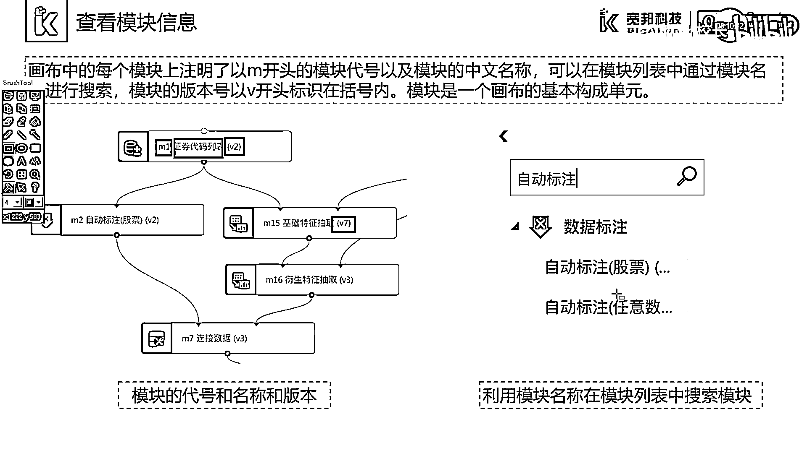
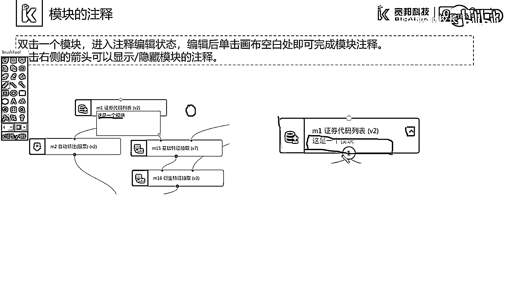

# 7天爆肝整理！AI量化交易-机器学习全套教程，从入门到项目实战保姆级教程！（数据挖掘分析／大数据／可视化／投资／金融／股票／算法） - P14：2.3.1-可视化模块 - Python校长 - BV1KL411z7WA

这一部分我们介绍一下"可视化模块"。。

首先我们介绍一下什么是"模块"。，模块可以理解为"函数"，主要实现了数据的获取以及数据处理等功能。，模块按照是否有输入数据，可以进行分类。，对于有输入参数以及输出数据的模块。

通常我们是实现数据处理的功能。，而对于没有输入数据，只有输入参数和输出数据的模块，通常是实现数据源功能。，在画布中，每一个模块都注明了一个以M开头的模块代号。，例如M1，来表示模块在画布中的唯一代码。。

模块上还显示了模块的名称，例如证券代码列表。，模块是画布的基本构成单元，我们可以通过模块的名称在模块列表中进行搜索，找到这个模块。，我们还可以发现模块的名称后面有一个以V开头的标识，被标记在括号内。。

这个标识表示了该模块的版本。，每一个模块拥有不同的版本号，通常情况来说，我们的模块列表中显示的是最新版的模块。

。

每一个模块是一个矩形的框。，矩形框的上边界和下边界有实心空心的小圆圈，这些小圆圈称为节点。，模块的连接就是通过小圆点之间的连线完成。，其中，上边界的小圆圈连接的是输入，下边界的小圆圈连接的是输出。。

空心的圆圈表示是这个模块必须的输入或者输出节点，而矩形的表示的是可选的输入或输出节点。，可以看到模块的右侧有一个红色的感叹号，这个感叹号表示没有连接输入数据或者模块参数的配置。。

我们需要在模块的属性栏中添入指定需要输入的参数。，我们通过左键单击一个模块，可以将模块设置为选中状态。，通过左键进行拖拽来改变模块在画布中的位置。，我们通过右键单击一个模块，可以显示模块的相关方法。。

例如图中的右键证券代码列表模块，我们可以通过选择对应的选项来实现模块的复制、剪切、粘切与删除操作。，此外我们还可以对模块进行注视。，我们双击一个模块，就可以进入注视编辑状态。。

我们在空白处输入该模块的注视信息。，编辑后我们点击画布的空白处即可以完成画布的注视。，可以看到这个模块多了一个我们输入的注视信息。，我们通过点击右侧的箭头，可以显示或隐藏模块的注视。

。

