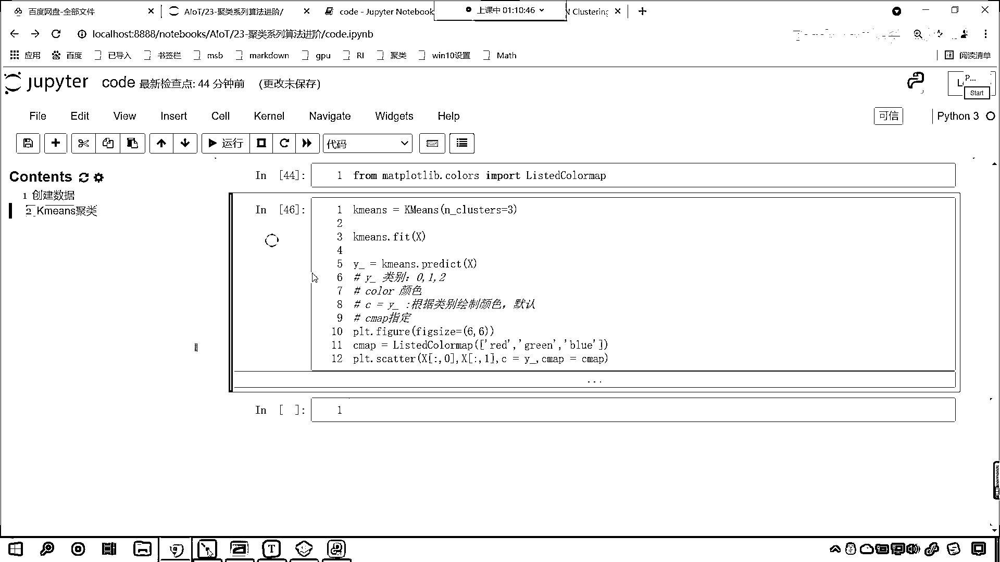

# 7天爆肝整理！AI量化交易-机器学习全套教程，从入门到项目实战保姆级教程！（数据挖掘分析／大数据／可视化／投资／金融／股票／算法） - P150：4-DBSCAN聚类案例Kmeans算法聚类效果 - Python校长 - BV1KL411z7WA

接下来我们就使用算法进行分类，数据已经创建了，接下来我们就进行剧类划分，昨天学了k-means，那我们就先使用k-means来试一把，那么k-means我们就让它等于k-means，我们来一个小括号。

那我们把它分成三类好不好，我们就看一下k-means它的分类效果怎么样，在这儿呢咱们就调用fit，我们将数据x放进去，然后训练完之后，咱们就使用k-means对它进行一个类别划分。

调用predict将x放进去，它得到的结果就叫y-，那怎么样呢，咱们plt把结果画出来好不好，那原数据x横坐标放进去，纵坐标放进去，c就表示颜色，颜色呢我们就给一个y-，咱们就给一个类别，大家注意啊。

咱们的c呢指的是color，c指的是颜色，那因为我们计算出来的，咱们计算出来的这个y-，你看它表示什么呀，它是不是表示类别呀，那么它的类别是什么样的呀，它的类别是0，1，2，那当我们在画图的时候。

咱们给了一个参数c=y-，这个表示什么意思呀，这个表示呢，咱们在进行绘制这些伞底图的时候，我们呢根据类别是不是给它绘制颜色呀，它的意思呢就是根据类别咱们来绘制颜色，那这个颜色呢，这个颜色是默认的。

这个颜色呢它通过cmap来指定，之前咱们在讲画图的时候我们都说过，那如果说我们想要给它一个颜色，那其实这个y呢它指的是yellow，你看y确实指的是yellow，但是你想要给y你得这样给，知道吗。

你得单引号给一个y，这个时候你看我一执行，怎么样，是不是就全变成yellow了，看到了吗，全变成yellow了，是不是，但是我如果要给y-这个就表示类别，你分三类那是不是就代表三个颜色呀，看到了吧。

那我们怎么去给它指定不同的颜色呢，可以通过cmap，cmap里边你看它有很多颜色，我给一个ocean，你看到了吧，现在这就是海洋的颜色，这个右上角这个颜色呢它就没看见，知道吧，并不是它没有啊。

是它没有看见，咱们调整一下尺寸啊，figure，咱们给一个figure size，我们给一个6和6，这个时候你看我一执行，你看到了吧，现在看这半部分是不是就没了，那我们还可以给它一个颜色叫autumn。

你看一执行，看这个是不是就是春天的颜色呀，那这个cmap一共有多少种类别呢，你看我往上滑，咱们就plt点，我们就调用这个color maps，你看我一执行呢，这个里边有很多啊，你看我一执行，看到了吧。

里边是不是有很多，看到了吧，任意一个都可以选，咱们选这个啊，看，control c，看到了吧，然后在这来一个粘贴，你看，control v一执行，看到了吧，这就是这种颜色，你可以选其他的，看到了吧。

我们选一个，来，咱们选一个cool，warm，看一下这种是什么样的一个色调，是不是啊，双击合起来，看，control v一执行，你看到了吧，它就是这种颜色，当然咱们说这个颜色是不是也可以自己定呀。

看到了吧，这个颜色能不能自己定，当然能，这个时候得需要导报啊，我们from matplotlib，从这个当中的colors下边，color，从这个当中呢，咱们import。

这个import叫list_color_map，执行，把它导进来，看到了吧，把它导进来，然后我在这给一个cmap，我们创建一下，就等于咱们的list_color_map，在这个当中呢。

咱们就可以给颜色了，我给一个red，红，我给一个绿，我给一个蓝，叫做green，蓝呢就是blue，然后呢，cmap我就用我自己生成的，来给它操作，这个时候你看我一执行，看啊，咱们这个肯定给写错了是吧。

看，cmap写成了CAMP，调整一下位置，来，执行，你现在能够看到，红，绿，蓝是不是就指定了，大家现在看，咱们这个类别划分，你看出来了，但是你感觉合适吗，看，类别划分，K-means它做出来的效果。

是不是就是这种形式呀，看，是不是啊，看，是不是啊，所以说呢，咱们K-means，它在对于这类数据进行划分的时候。

效果是不是就不好呀。

