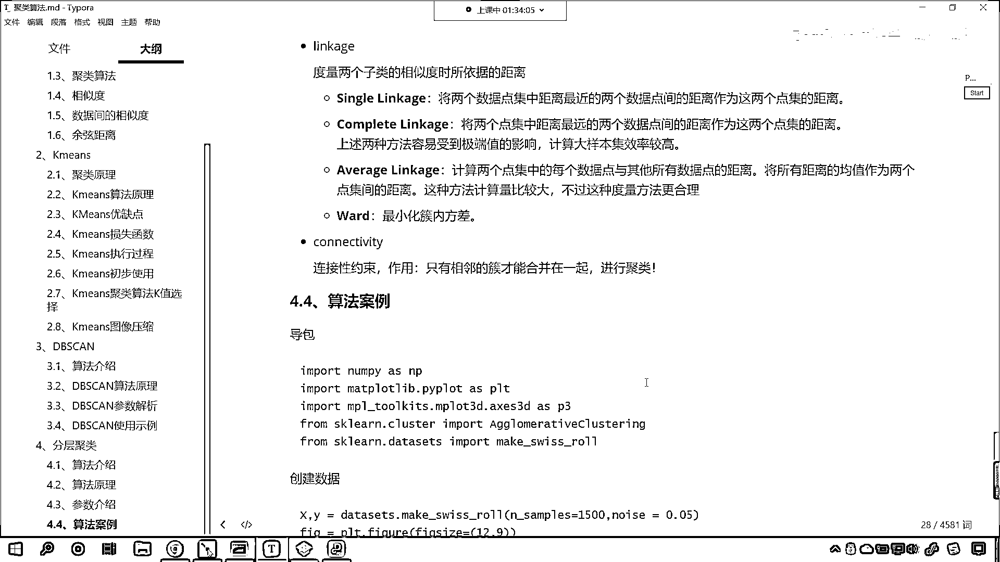

# 7天爆肝整理！AI量化交易-机器学习全套教程，从入门到项目实战保姆级教程！（数据挖掘分析／大数据／可视化／投资／金融／股票／算法） - P152：6-分层聚类概念原理参数介绍 - Python校长 - BV1KL411z7WA

接下來呢 我們繼續啊，咱們的離群點呢 它一定是-1啊，你看 因為這個-1 你看它是不是表示負數啊，你也能發現 咱們畫圖畫出來，這個紫色的點 你看它是不是就相當於是離群點啊，因為它離的比較遠啊 對不對。

還有 咱們通過這個異常值 你看咱們通過這個異常值，咱們呢 也能夠看到 是吧 那個異常值點 它就沒了，通過這個 通過咱們這個條件過濾 是吧，這兩個點也就沒了。

這就更能說明 咱們這個-1 是吧 它呢 是異常值點，好 那麼 接下來呢 我們繼續看啊，咱們看另一種算法 這另一種算法叫分層聚類，那我們先看一下分層聚類的概念，這個分層聚類呢 它是層次化輸出它的結構。

這種結構呢 比我們平面聚類返回的非結構化聚類，它更具有信息性，你看 這裡邊就說到了一個這個專業化的詞，叫做信息性 啥叫信息性呢，我們往下看啊 這個分層聚類呢 又譯為系統聚類法。

這個聚類分 它是聚類分析的一種方法，其做法呢 就是開始把每個樣本點作為一類，然後呢 把最靠近的樣本點 首先聚為小類，再將已聚合的小類 按照其間距，再進行合併 不斷的繼續下去。

最後呢 把一切子類都聚成一個大類，咱們在講這段話的時候，它裡邊的這個專業術語比較多，那我們舉了個例子，你看咱們的白性和紅性 是不是都是性，黃元帥 紅富士 蛇果 是不是都是蘋果。

那這個蘋果和性 是不是都是水果，那這個就像咱們在進行聚類的時候，咱們讓兩個挨得近的進行合併，你這兩個不是挨得近嗎，你看白性和紅性 是吧 它兩個挨得近，那怎麼樣 合到一起。

黃元帥 紅富士 蛇果 它們三個挨得近 合到一起，合到一起之後 這個就是性 這個就是蘋果，那這個性和蘋果有沒有相似性呢，如果要有相似性 那麼就繼續合併，如果沒有相似性 那它倆就是兩類了 明白嗎。

所以說這就是咱們分層聚類，你看我們看完這個圖片之後呢，咱們再來看一下上面這句話，它的做法就是開始把每個樣本作為，開始把每個樣本作為一類，然後把最靠近的，這個地方所描述的最靠近。

我們是不是就可以理解距離呀，對吧 你離得近 ok 聚到一類，你聚到一小類之後呢，然後就是小類和小類再進行合併，是吧 這就像我們下雨一樣，天上有很多雲 是吧，快下雨的時候是不是就是水蒸氣黏到一起。

然後就變成小雨滴，小雨滴是不是再黏到一起變成大雨滴了 是吧，一般來說呢 咱們當考慮聚類效率的時候，考慮聚類效率的時候 咱們選擇平面聚類，這啥是平面聚類呀，就是咱們的K-means。

咱們一開始學到的K-means，它呢就是平面聚類，K-means就是平面聚類，那我們的DB-SCAN它屬於是平面聚類嗎，看咱們的DB-SCAN屬於不屬於平面聚類呀。

看咱們的DB-SCAN呢 它也屬於是平面聚類，這個平面聚類呢，它往往是根據距離來進行這個操作的，一般情況下說到平面聚類，我們往往指的就是K-means，當咱們平面聚類存在潛在的問題，比如說不夠結構化。

預定數量的預定數量的聚類，非確定性的時候，那麼我們選擇層次聚類，有很多研究員呢，他認為層次聚類比咱們的平面聚類效果更好，因為咱們的平面聚類，也就是說咱們現在所介紹到的這個，這個分層聚類。

那麼它呢對於數據的劃分，是吧 它可以結構化，這是現在我們說到的結構化，我們不舉例子，各位小夥伴你感受不到啊，好 那麼大家呢，先對於咱們的分層聚類，有一定的了解就好，你看啊，你看咱們這個圖是吧。

咱們分層聚類是吧，這個就是它是從哪到哪呀，咱們這個呢，它呢就是從下往上，它就是從下往上，我們首先呢把紅色的點分到一類，藍色的點分到一類，那咱們再根據性質，這個紅色的點和藍色的點是否可以分到一類呢。

哎 分到一類了，分到一類之後，那麼這一圈我們就把它當成一個整體，大家注意啊分層聚類呢，咱們呢可以認為是由少到多，看到了吧，由少到多，由下到上，看咱們是由下到上，我們是這種方式，這種這個邏輯在進行。

凡是它把它劃歸到一個圈當中了，看你現在能夠看到，這個是不是劃歸到一個圈當中了呀，要是把它劃歸到一個圈當中了，我們要把它當成一個整體，你看這個呢，就是一個整體，那一開始的時候我們會有多個點。

經過咱們這個劃分，是吧，它就這個相近的這個點都變成一個整體了，然後我們再次進行劃分的時候，咱們其實就是對於這個整體在進行劃分，你看所以說這叫什麼，所以說咱們這個算法，是不是才叫做分層舉類，看到了吧。

一層一層的，是吧，然後這下面這個是不是屬於一層，再往上又屬於一層，再往上這個是不是就屬於是高層了，這個是咱們這個分層舉類，算法的概念介紹，接下來我們看一下它的原理，好，那麼咱們的層次舉類呢。

它其實也是舉類的一種，那咱們通過計算不同類別數據點間的相似度，來構建一顆有層次的千套舉類樹，那在舉類樹當中呢，不同類別的原始點數據，不同類別的原始數據點是樹的最底層，那這個樹的最底層呢，就是咱們這兒了。

看到了嗎，這兒就是樹的最底層，樹的頂層呢，是一個據類的根結點，你看這就是樹的頂層，咱們在創建據類樹，有自下而上合併，還有自上而下分裂，一般情況下，看一般情況下，常用的都是自底向上的合併。

一開始的時候你看有一群底兒，是不是，那然後怎麼進行合併呢，你看這兩個點離得比較近，合到一起了，這兩個點離得比較近，合到一起了，大家注意，有可能，看不是兩個點，有可能是不是多個點，對不對。

你看有可能是多個點，就是你這合併不一定是兩個點，我們畫圖舉例是吧，它是兩個點，然後繼續向前再進一步，咱們就發現，這兩類點看到了吧，就是這兩處，它離得比較近，是不是就可以劃歸到一類了，對吧。

然後下面這四個點，是不是劃歸到一類了，好，那麼到這就停了，你想到這咱們的數據被分成了幾類，看到這，這個數據是不是就被分成了兩類，對不對，因為到這停了，沒有再向下一步，它是不是就分成兩類，上面四個點一類。

下面四個點一類，對不對，好，那麼，我們這個算法，無論是k means，還是db scan，還是咱們的分層舉類，還是咱們的分層舉類，我們都能夠看到，你看，這有一個詞叫什麼，相似度。

當我們在提到相似度的時候，我們是不是指的就是距離，對不對，你看，咱們，兩個組合數據點間的距離，它有哪幾種方式，有single link，complete link，average link。

看有這幾種方式，single，link，single linkage，是吧，這種表示什麼，是將兩個組合中，兩個組合數據點中，距離最近的兩個數據點的距離，作為它的距離，看也就是說，最近距離是不是。

這種方式容易受到極端值的影響，是吧，你看，它就是距離最近，它complete和咱們的single相反，這將兩個組合數據點中，距離最遠的兩個數據點間的距離，作為這兩個組合數據點的距離，啥意思，看，咱們。

上面你看它是不是就是一個，組合，看到了吧，我們這兩個點，是不是屬於一個組合，下面這兩個點，是不是也是一個組合，看咱們畫圖畫出來，看畫圖畫出來，上面是不是一個組合，下面是不是一個組合，它倆的距離該怎麼算。

如果要是single link，距離就是兩個近的距離，如果要是complete，就是誰，用這兩個比較遠的點作為距離，明白了嗎，看到了嗎，一個近一個遠，是不是，還有下面叫average。

average是什麼，你看average，就是計算所有點的距離，求平均值，很顯然咱們average，是不是考慮的，它是不是考慮全部點，看到了average，計算兩個組合數據點中，每個數據點。

與其他所有數據點的距離，看到了嗎，計算所有的距離，然後怎麼樣，求平均值，用公式來表示，就是d就等於4分之a到b的距離，a到c的距離，f到b的距離，f到c的距離，看就是這樣，是吧，所以說現在你就知道。

咱們兩個組合數據點的距離，它的度量標準評價指標，是怎麼大了，是怎麼一回事的，這個計算量大是吧，這個你不用擔心，知道嗎，這個不用擔心，因為計算機就是做這件事的，現代計算機的計算性能，是越來越強悍了，好。

那麼接下來我們看一下，咱們的參數介紹，參數介紹，第一個是n cluster，就是劃分的數目，這個和我們k means一樣，linkage，看linkage，咱們度量兩個子類的相似度時，所依賴的距離。

就是說你到底用哪個距離，是不是，好，那麼，它有這幾種single complete average，還有一個叫word，word就是最小化促內方差，你知道什麼是方差，這什麼是方差。

是不是就是咱們數據的波動程度，對吧，你一促內的點，是吧，你看你一促內的點，如果每個點和每個點差距很大，那麼這個方差就會很大，好比咱們舉一個例子，你們班參加數學考試，是吧，班裡邊50個人，每一個人。

都考了150分，這個時候我們在計算方差的時候，你告訴我方差是多少，方差是不是就是零，對吧，為啥，因為所有的人都一樣，都是150分，沒有變化，是吧，沒有波動，是吧，所以說方差就是零，這個班肯定作弊了。

是吧，要么作弊，要么都是清華北大的，那麼如果說方差大，是吧，你看有的人考零分，有的人考150分，是吧，這個時候，就說明是吧，老師教的不好，是吧，教出來的學生，有的人考的高分，有的人考的低分，好。

這是咱們，linkage它的作用，就是咱們度量相似度的方式，這叫相似度，相似度一般都是具體，我們計算具體，計算相似度，又有不同的方式，是吧，這裡邊分別進行了介紹，還有還有一個參數。

叫connectivity，這個叫做連接性約束，只有相鄰的促，才能夠合併在一起，進行聚類，那麼我們分層聚類，它對於數據，有一定的結構化的一個影響，好，那麼到這裡。

我們就對於分層聚類算法。

咱們進行了一個介紹。