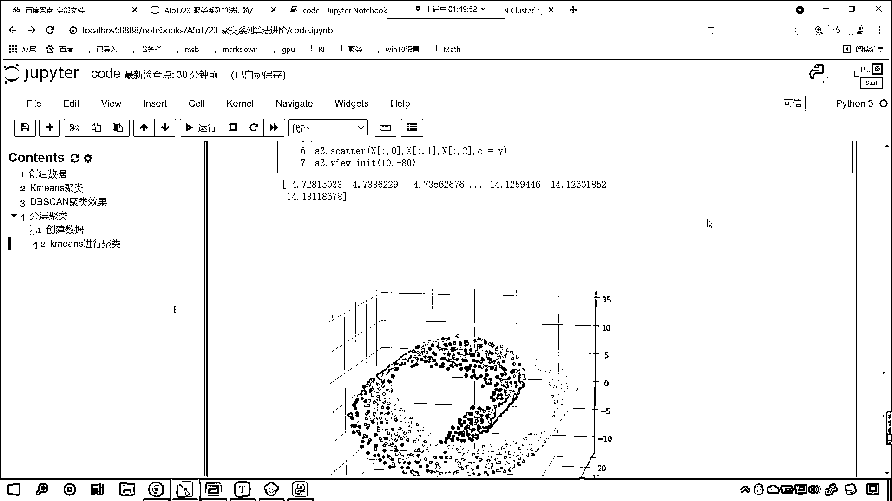

# 7天爆肝整理！AI量化交易-机器学习全套教程，从入门到项目实战保姆级教程！（数据挖掘分析／大数据／可视化／投资／金融／股票／算法） - P153：7-Kmeans聚类瑞士卷数据效果 - Python校长 - BV1KL411z7WA

来来来，各位小伙伴，接下来我们就实际的操作一下咱们的分层剧类，我们看一下这个分层剧类和咱们的K-means它到底有什么样的区别，咱们上面介绍到了分层剧类它的实现方式还有原理。

以及呢我们对于它的参数进行了介绍，那么我们就通过代码来进行验证一下，咱们回到代码当中，咱们在这来一个三级标题，那么我们这个三级标题就是分层剧类，那么对于分层剧类呢，我们首先来一个四级标题。

咱们首先给它创建一个数据，创建数据这儿呢，咱们先进行相应的导包好不好，那我们import numpy as np，然后呢咱们import matplotlib。pyplot as prot。

然后呢from sklearn咱们从clusterring咱们导一个包，那我们这个分层剧类呢就叫做，大家看叫这个叫做agglomerator clustering，这个呢它呢是自底向上的剧类。

这叫做自底向上的剧类方式，导完包之后呢我们再将数据导进来，from sklearn data sets我们从这个当中导入一个方法，叫做make，它有一个叫make下滑嵌 switch row。

那这个叫什么呀叫瑞士卷，你有没有吃过瑞士卷呀，有没有吃过瑞士卷，那我们这个数据呢它是一个三维的数据，想要把它绘制出来，咱们呢把3D引擎给它导进来，这个呢叫做import mtoolkit。

mplot3d。axis，咱们从这个当中呢，然后再来一个点叫axis，这样啊我们直接将，叫from，从axis3d当中咱们import axis3d，这个必须得导进来，你可以不创建它。

但是呢我们必须导进来执行一下，然后呢咱们就make，使用咱们的switch row，我们呢创建一个数据，咱们呢多给点给它1500个点，然后呢我们给一个noise，这个noise就是噪声0。05。

这个就相当于这个数据的一个波动程度，用xy来接收一下它，打印输出一下print np。unique，我们看一下它为我们生成了几类啊，调用unique将y放进去，然后呢咱们就创建一个三维的视图。

我们给它一个尺寸吧，那咱们就plt。，咱们就调用figure，在这个当中呢给一个figure，咱们给一个figure size，我们这个figure size呢，我们让它是12和9，然后呢。

此时呢咱们就调用，plt。subplot，我们给它一个一行一列第一个，然后里边呢给一个projection，给它是3D的视图，这个时候你看就有了，好那么我们起个名就叫A3，有了这个A3。

咱们现在呢就可以向A3当中绘制散点图了，scattr，咱们将x中光号的这个第一个维度，横坐标取出来，然后纵坐标取出来，然后呢它的z轴就对应2，然后我们给一个颜色c就等于y，这个时候你看我一执行。

现在你就能够看到，一个锐视角就出来了，是不是，我们看一下咱们是这个，我们看一下咱们的y，我们就能够发现，你看这个y的类别是不是有很多呀，看到了吗，unique y这个y的类别有很多啊，好那么，接下来呢。

看接下来咱们进行什么样的操作呀，你看这个视图角度不太好，咱们调整一下它的角度就可以了，那就是A3。view init，咱们把它调整成10和-80，这个时候你看我再来看，现在你来看。

咱们是不是就从这个角度去看它了呀，现在你发现，看此时你再来看，咱们这个数据，看到了吗，这个视角是不是就好一点了呀，你看我们这个底它分成了几类呀，你看黄色的是不是一类，然后再往下是不是就变绿了，然后变蓝。

然后变成这个紫蓝色，最后是不是就变成紫色了，也就是说咱们的数据是不是分成好几，好几类呀，对不对，你看这个数据呢，它就分成好几个类别，是吧，可不仅仅是八类呀，那这就得看我们，你看这个4。71是吧，4。

74是吧，它这个就是我们在打印输出的时候，np。unique我们得看一下它有多少个数据，我们来一个length，打印一下它的长度，看这个时候一执行，大家看咱们就知道它有1500个，看到了吗，1500个。

也就是说它其实呢是1500类，但是为什么咱们画出来图，我们能够看到它的类别是不多的，对吧，为啥呀，你来看啊，你看这个4。728和这个4。73，他们是不是很像呀，对不对，你看到它很像，最后一直到多少。

是不是一直到这个14。13呀，对不对，你看一直到14。13，所以说我们可以把这个黄色的是吧，把它当成一类，是吧，然后这个颜料呢是一点一点增加的，对我们这个呢，其实每一个颜色和每一个颜色都是不一样的。

但是呢它接近是吧，那我们能不能使用咱们讲的剧类算法，咱把这些底是吧，就是相近的底，我们给它聚到一起呢，来那么咱们就使用咱们的k-means，我们看一下效果怎么样啊，咱们来一个四级标题。

我们用k-means，我们进行剧类，那当然这个k-means就是作为咱们的一个对比了，是吧，那我们就声明k-means，就等于k-means，我们把它分成几类呢，咱们给一个n-cluster。

咱们把它分成六类，当然分成八类也是可以的，然后调用k-means我们的fit方法，咱们将数据x放进去，然后调用k-means的这个predict方法，你看我们可以调用它的predict方法。

也可以调用它的labels，这个labels就是它的目标值，咱们起个名叫y-，然后呢我们就开始画图啊，那此时咱们画图呢，我们可以声明一个这个子室图，那就是figure就等于plot点啊。

调用figure这个方法，然后呢给它一个figure size12和9，然后调用figure这个图片，此时呢我们可以调用，它里边有一个方法，大家看它里边有一个方法叫做add subplot。

add下滑线su subplot，小括号，咱们直接给一个projection，我们让它等于3D，你看上面咱们创建子室图，是不是调用的subplot，那我们可以调用它的add subplot。

这个函数也是可以的啊，那么添加了之后呢，咱们接受一下，你既然添加了一个子室图，咱们依然起个名叫A3吧，然后呢咱们像A3里边，绘制散点图scatter，那就是X(0)，X(1)，X(2)。

颜色类别呢咱们就给Y杠，这个Y杠就是咱们这个K-means，它呢预测出来的类别，那视角呢咱们也调整一下，view init，我们给10给一个-80，这个时候这个角度刚刚好，看一下咱们某一个地方给报错了。

是吧，figure。add subplot，咱们看一下啊，has no projection，我们给写错了，咱们少一个C，看到了吧projection，这个时候我们再来执行，大家看是不是就没问题了呀。

看到了吧我们调用projection，你看是不是就没问题了，大家看咱们这个效果啊，你看这个效果它是怎么进行分类的呀，看到了它是怎么进行分类的，你看我们这个瑞士卷，看咱们这个瑞士卷你就能够发现啊。

它是不是有分层的这种效果和感觉呀，现在你就能够发现，你看黄色的这一类点和咱们下面这个黄色的，它是不是给，这个就相当于是给跨层了，对不对啊，看到了它给怎么样叫跨层了啊，看到了咱们你看，我们画图来说明啊。

看就是这部分点儿，你看这是不是在瑞士卷这个最上面这一层呀，因为你瑞士卷都是一层一层剥开吃是不是啊，还有你看，这是不是它这个里边这层呀，那这个是不是它被划归成黄色了呀，我们希望划分的时候怎么划分呀。

咱们希望划分的时候它不要跨越它这一层，看我们希望呢，划划归的时候是吧，它这样来划分，是吧，你看它把这一个怎么样划归成一层，然后呢，这儿划归成一层，然后呢，这儿划归成一层，就像，看就像咱们上面创建了数据。

你看我们创建了数据，你看咱们所创建的数据，你能够看到，它是什么样的特征呀，这儿是不是紫色的是不是是一层，上面这个是黄色的是不是一层呀，然后呢，这儿是不是又是一层，对不对。

然后这个紫色的是不是属于是这个这个青色的是不是属于是一层呀，对不对，也就是说你看这既然是瑞士卷，它是不是就沿着瑞士卷的这个方向在进行划层呀，你看这是不是瑞士卷的方向，看到了吗，这是瑞士卷的方向，对不对。

它就沿着这个方向是吧，哎一段一段给它解开，解开是吧，解开，解开给它分类，那我们刚才使用K-means，咱们的K-means有没有实现这种效果呀。

很显然K-means是没有实现这种效果。

对不对，好。