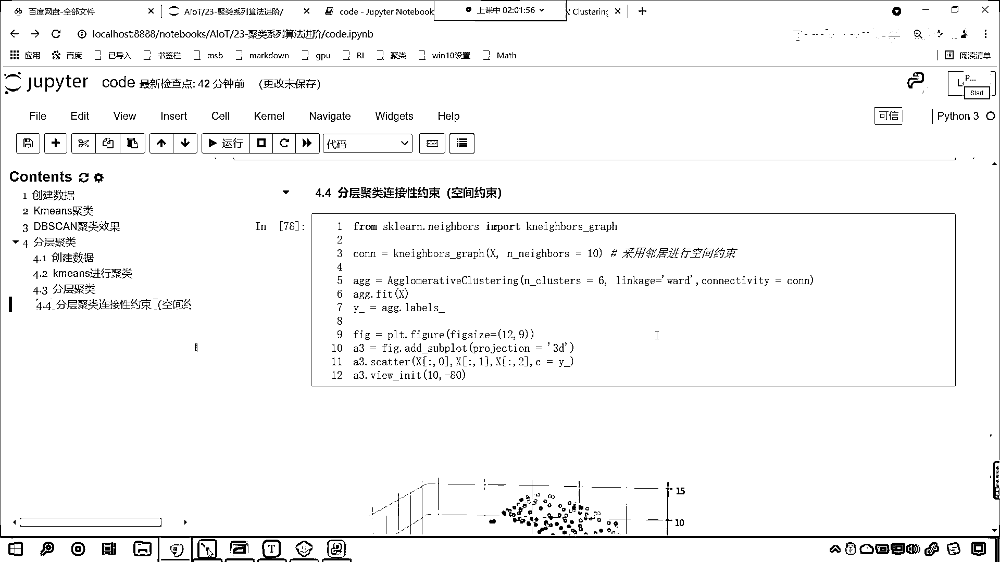

# 7天爆肝整理！AI量化交易-机器学习全套教程，从入门到项目实战保姆级教程！（数据挖掘分析／大数据／可视化／投资／金融／股票／算法） - P154：8-分层聚类瑞士卷数据效果 - Python校长 - BV1KL411z7WA

那我们就使用咱们的分层剧类，咱们来一个4级标题，这儿呢就叫做分层剧类，那我们看一下分层剧类能不能去解决这个问题，好，那么咱们就声明agg=，使用咱们这个算法，然后呢咱们给一个ncluster。

那这个ncluster同样咱们也把它分成这个6份，然后呢我们给一个linkage，咱们这个linkage呢，你看咱们可以选择好几个啊，这回我们使用word，这个word表示什么。

看到这个linkage是不是表示word呀，这个word是不是就是最小化它的方叉呀，当然你其他的都可以选啊，你看啊我们往下滑，它有对这个参数进行说明，看到了吧这个linkage。

是不是就是从咱们这几个当中进行选择呀，对吧，参数的调节，我们可以一点一点调，选择最合适的一个是不是，咱们现在先选择这个word，这个word呢就表示最小化它的方叉，也就是说我们把它分成一组了。

你这一组里边的方叉要怎么样，要最小，方叉最小说明你挨的比较近，对不对，好那么咱们就使用这个算法啊，我们将咱们的瑞士卷数据进行训练，然后呢，agg。得到它的labels，就相当于是得到它的预测值标签。

是吧，然后呢我们就开始画图啊，画图咱们就不重复了，直接复制一下上面，咱们在这来一个粘贴好不好，因为你都是画这个3D图形，是不是，我们预测得到的目标，得到的这个标签咱们都叫y-，所以咱们在这呢。

这个下面画图的，咱们直接就拿过来了，看此时我一执行，哎来各位来看一下，哎你发现，这个和刚才使用k-means，效果是不是差不多呀，看是不是差不多，哎，差不多是吧，你看它有没有跨越咱们的瑞士卷的层层呀。

有看到了吗，你这个颜色，和上面这个颜色，是不是就重了呀，是不是就这个同一个颜色，那哎这说明它也不行是吧，也给跨层了，那怎么办呢，上面咱们刚才在课程当中，我们介绍了一个叫做连接性约束。

是不是讲了这样的一个参数呀，你看这叫connectivity，它叫连接性约束，它的作用呢是，只有相邻的簇才能够合到一起进行聚类，相邻的簇才能够合并连到一起，连到一起，那我们的代码当中。

咱们使用分层聚类化，这个聚类的效果，它也进行了跨层是吧，这一层和下面这一层进行了，进行了这个聚类，那我们调一下咱们的参数啊，比如说我们调一下Everridge，我们看一下这种效果怎么样，你看一直行。

大家看这个Everridge，是不是也跨层了，看到了吧，紫色的和下面这个是不是一样的，那我们再调啊，咱们再调一个叫complete，complete，这个就是两处点内离得远才算是吧。

结果是不是也不如意啊，咱们使用一个single呢，执行一下，大家看啊，你看如果我要使用single会怎么样，这所有的是不是都变成一类了，是吧，这说明咱们这四个参数都调了，也不行对不对啊，好。

那么接下来呢，咱们就使用一下连接性约束，好，那么连接性约束，它的作用是什么呢，看咱们往下看看一下它的作用啊，对于咱们这种非欧基几何的数据，你看为什么说它是非欧基几何呢，你能够发现这个瑞士卷。

它是不是有卷的这种形式呀，对吧，这就像这个科幻小说里边说的，我们的时空如果要弯曲的话，咱们是不是就可以实现这个穿越呀，时空穿越，是不是啊，回到我们小时候，是吧，好。

那么对于这种非欧基何的非欧基几何的数据，是吧，如果要是没有咱们连接性约束，那么咱们在进行剧累的时候，将会忽略数据本身的结构，那么我们就会在欧式空间距离下，咱们进行剧累，于是呢。

就容易形成上图这种跨越流行的不同褶皱，你看就容易形成上图这种跨越流行，就是就相当于是跨层了，对不对，你看就相当于跨层了，我们的瑞士卷，你是不是可以把它理解成，它是一个流行的呀，看了吧，它是这样的。

是不是，看了它是这样的一个结构，很显然，看咱们刚一开始的时候和这儿是吧，它其实离得不远，但是呢，它是不同的层，是吧，那我们通过什么来限制呢，哎，咱们就通过咱们的就通过这个连接性约束，来回到咱们代码当中。

咱们操作一下啊，来一个四级标题，这个呢，就是咱们分层聚类，连接性约束，它的作用呢，哎，我们就可以实现，是吧，这个，咱们就可以这个对它进行一个空间的约束，好，那么咱们导一下包啊，from sklearn。

点儿，我们从neighbors下边，neighbors翻译成中文是什么意思，是不是有邻居的意思呀，然后咱们来一个k neighbor graph，好，那么它的作用呢。

它的作用就是根据邻居的这个远近来对它进行约束，然后呢，我们创建一个连接层con就等于k neighbor graph，那我们根据这个数据来进行，然后呢，咱们给他一个n neighbors，这个邻居呢。

必须得是几个呀，我们可以给他十个，这个数据都是可以调的啊，在这的话，我们就采用邻居，咱们呢来进行约束，咱们进行了这个空间的约束，然后呢，我们声明算法，agg就等于agg，multiclustering。

同样呢，我们把它的类别，我们让它分成六个，然后呢，咱们的linkage，我们让它是word，依然呢，是让它的方差最小，我们的connectivity连接性约束呢，咱们给一个啊，就是咱们生成的这个con。

然后咱们agg。fit一下，训练一下咱们的数据，我们的y->呢，依然等于咱们agg下边得到的这个labels，得到的这个标签，好，那么你看有了这个约束，咱们看一下有什么不一样的地方啊。

接下来是不是就是画图了，画图咱们依然把上面的代码复制一下，control c，在这来一个粘贴，来此时咱们拭目以待啊，你看我运行，哎，大家现在再来看，那现在你再来看，还有跨越流层，还有没有跨越流层。

这个这个情况出现，还有没有，你看是不是就没有了呀，对吧，那我们将邻居的数量调整一下啊，我们调整成5，哎，大家现在来看，是不是就没有，好多了，是不是啊，你看这回就好多了，是吧，那我们就能够发现啊，你看。

其实咱们肉眼看到的是吧，我们这一层，看咱们这个瑞士卷啊，看就在在这一层，这是吧，这个是一个绿色的，对吧，看这是一个绿色的，我们发现它里边是不是还有一个颜色呀，就是他这个在同一层内是吧，进行了一个分开啊。

那说明他们俩之间的距离肯定是有一定的距离，只不过呢，我们调整了视图的角度，是吧，我们把80调整成20，给各位看一下，看你80要调成20，你看是不是就从另一个方向去看它了，另一个方向你去看的时候。

你就能够发现是吧，这个这个瑞士卷的这个数据是吧，它确实有一定的确实有一定的间隔啊，所以我们使用分层剧类，它才会剧成这种效果，好那比如说我将这个邻居数量是吧，咱们再调调成15个啊，我们看一下它会怎么样。

嗯，嗯，我们再调大一些，比如说我们调整成30个，执行，哎，大家看我们调整成30个，现在你就发现是不是又有跨层的这种情况了，看了吧，调整成30个，是不是上面和下面是不是又连到一起了。

是不是又有跨层的情况了，你想这个我们给的这个邻居数量多了，你看我们给的这个邻居数量多了，我们给了30个，那你想咱们在找邻居的时候，它是不是就会把下面这一层也给你包括进去啊，所以说我们调小一点啊。

咱们调整成10，哎，这个时候，咱们在进行，对于这种空间数据进行剧类的时候，那么我们就可以很好的对它有一个约束，那这个约束呢，咱们就起到了这样的一个作用，是吧，在这一层内，你看这一部分就全是紫色的。

这部分就全是绿色的，底是吧，上面部分就是全是咱们，所以说，咱们有了这个约束，是吧，那么我们就实现了这种，有了这个约束呢，咱们就实现了这种空间数据，是吧，这种非欧积几何数据下的这种剧类效果，是吧。

那他就进行了一个很好的一个改善。

感謝。