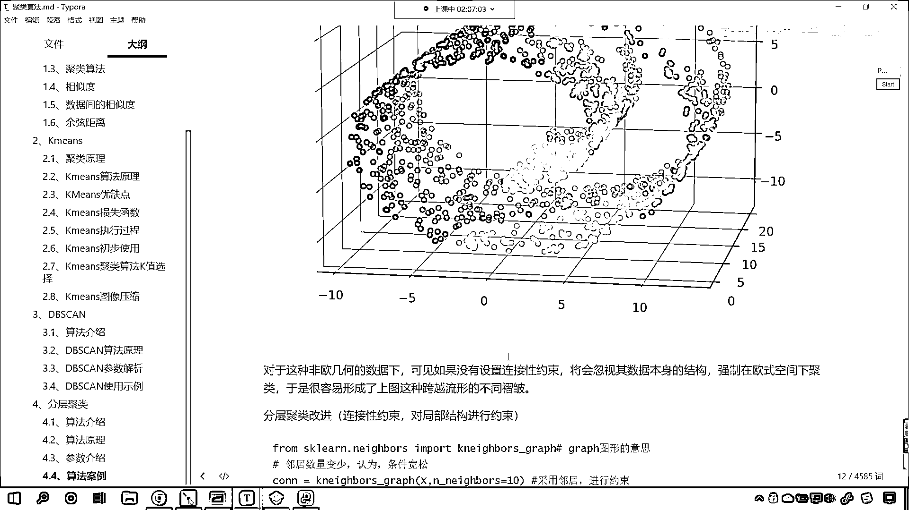

# 7天爆肝整理！AI量化交易-机器学习全套教程，从入门到项目实战保姆级教程！（数据挖掘分析／大数据／可视化／投资／金融／股票／算法） - P155：9-作业介绍和知识点总结 - Python校长 - BV1KL411z7WA

接下来呢 我们看一下咱们的作业啊，好 那么大家看啊，咱们对于汽车是否值得购买，我们进行剧类是吧，那昨天咱们留的上一节课咱们留的作业呢，我们使用K-means对它进行剧类，今天呢 咱们学了DB-SCAN。

我们又学了分层剧类，大家呢，使用DB-SCAN和分层剧类，再次对我们上面的数据进行剧类是吧，我们寻找最佳的这个剧类效果，那我们就根据咱们的评价指标，轮廓系数的大小，来对它进行判定，那么这样的话我们就。

综合对比了K-means，DB-SCAN和咱们分层剧类，它们哪一个效果好，因为我们的数据是没有目标值的，所以说咱们在进行，在进行这个评价的时候，咱们只能使用轮廓系数，咱们的这个调整兰德系数呢。

它必须得有目标值，那昨天的作业呢，咱们其实已经上传了啊，昨天的作业，作业的答案呢，大家看我们已经传到这了是吧，你参考咱们的答案，嗯就可以了，今天新的作业呢，得需要大家使用咱们的DB-SCAN。

需要使用咱们的分层剧类来完成，好那么最后呢，我们再，回顾一下咱们今天晚上所讲的内容，嗯今天晚上呢，我们讲了一个基于密度的剧类方法，是吧那这个基于密度的剧类方法呢，其实就是你看，就是这样的这个画圈圈是吧。

根据这个圈的大小，然后来完成好，那么大家要注意，每一个方法里边，它每一个参数代表什么，我们就根据这个，它的这个含义来来对这个参数调整，从而呢，咱们就可以达到一个比较好的一个，剧类效果。

嗯然后呢分层剧类呢，嗯分层剧类这个地方呢，咱们介绍了它相应的，算法的这个介绍，嗯算法的原理，还有呢两个数据，呃两个结合数据点的距离如何计算，为什么会有两个组合数据呢，因为你看分层剧类呢，它自己向上。

它自己向上合并呢，它就是越合并越多，合并着合并着，我们就把这两个点当成一个整体，和其他的点来进行合并，嗯，我们刚才讨论区里边有一个小伙伴问了，如果特征超过三个，咱们的剧类效果怎么体现，没有办法画出来。

知道吗没有办法画出来，你只能查看它的轮廓系数，看一下这个轮廓系数它的值越大越好，因为你超过三类，你想咱们现在，任何计算机是不是都无法刻画出来呀，这个之前有一部电影叫星际穿越，嗯是吧。

然后之前有一部电影叫做叫什么呀，就是这个也是跟太空相关的，穿越相关的啊，那里边讲到了五维空间，是吧其实它也是，模拟出来给你的一种感觉，是吧计算机，或者说咱们现在，我们没有办法，没有办法去。

这个描述更高维的，所以三维超过三维的，咱们就只能通过评价指标，来判断它的好和坏，好那么，呃我们在使用分层取类的时候呢，咱们给各位介绍了一个，嗯呃介绍了一个连接性约束，那有这个连接性约束呢，咱们呢就。

不会忽略数据本身的结构，然后我们就不会忽略，数据本身的结构，因为它的作用呢就是，告诉了我们，这个数据的形状长什么样，我们在进行剧类的时候，咱们就优先根据数据的形状来进行剧类，这样的话就可以防止。

咱们剧类的时候，跨层跨越它的这个流行的这个层的结构，好那么这个呢就是咱们今天晚上。

所有的知识点了啊。