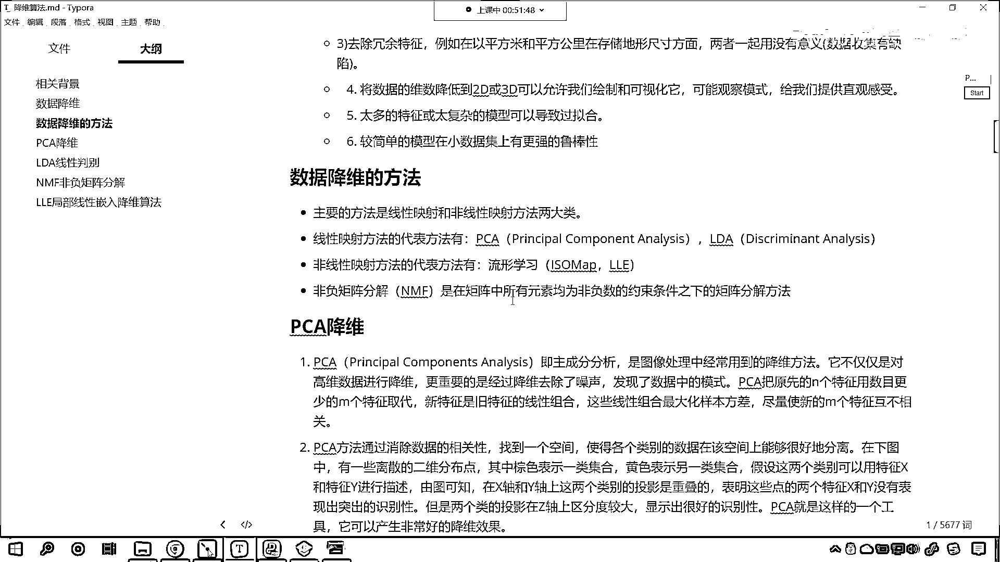

# 7天爆肝整理！AI量化交易-机器学习全套教程，从入门到项目实战保姆级教程！（数据挖掘分析／大数据／可视化／投资／金融／股票／算法） - P158：3-数据降维方法介绍 - Python校长 - BV1KL411z7WA

接下來我們繼續看，我們看一下數據降維的方法有哪些，數據降維的方法主要分為線性和非線性兩大類方法，線性我們知道，之前咱們學過線性回歸，直來直去的一條線，什麼是非線性啊？，就是我們學的拋物線。

是不是拐彎了啊，如果要用方程來表示，非線性我們是不是可以理解為一元二次方程，對吧，你看它拐彎了，對不對，好，那麼我們的線性呢，有PCA，有LDA，這個PCA咱們之前用過，這個PCA三個字母都是大寫。

它叫什麼，Principal Component Analysis，翻譯成中文叫主成分分析，LDA叫線性判別，叫Discriminant Analysis，我們的非線性方法呢，有流行學習，LLE。

啥是流行呢？，後面我們在具體講到這個算法的時候，咱們再做詳細的解釋，那麼還有一種叫做非負矩陣分解，這個就涉及到一些矩陣的特征和應用，是在矩陣中所有元素均為非負的約束條件下，咱們進行的矩陣分解。

那你有沒有學過音式音數分解啊，6等於多少，是不是2乘以3啊，對不對，你看6等於2乘以3，這是不是一種音式分解啊，那我們的NMF，咱們的數據也可以採用2乘以3，是吧，拼成6這種形式來進行操作。

我們也可以通過這種方式來提取它的特征。

好，那麼咱們的數據降為呢。