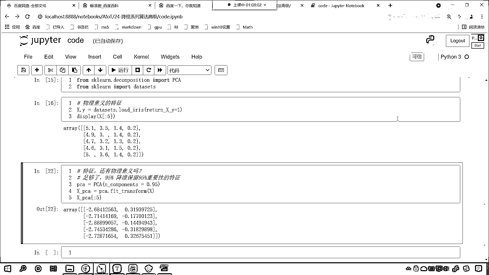

# 7天爆肝整理！AI量化交易-机器学习全套教程，从入门到项目实战保姆级教程！（数据挖掘分析／大数据／可视化／投资／金融／股票／算法） - P159：4-PCA算法介绍和使用 - Python校长 - BV1KL411z7WA

咱們就具體看一下PCA降維 它到底是怎麼回事，這個叫主成分分析 是吧 這就是射人先射馬 擒賊先擒王，是圖像處理當中經常用到的降維方法，不知道你是否還記得 咱們之前在講支持向量機的時候。

我們講了一個案例 就是人臉識別的案例，那個裡邊有布什總統 是吧 有小布什 我們是不是對那個數據進行了數據降維啊，對不對 不降維你會發現 它所花費的時間特別長，它不僅僅是對高維數據進行降維 更重要的是。

經過降維我們去除了噪聲 發現了數據當中的模式，你看什麼是模式呢 在念研究生的時候 有一個專業叫做模式識別，你看模式識別是機器學習當中的一個方向。

你看這裡所說到的模式 是吧 就相當於它的公式 它的規律是怎麼樣的，人家更高端的叫法就叫做模式識別，所以說你見到這個 你就知道它是什麼意思就行了，發現數據當中的模式 是不是就是發現數據當中的規律啊。

你看我們在讀歷史的時候 咱們經常聽到歷史學家這樣說，叫做讀史是不是明智呀 對吧 你讀歷史你是不是可以得到很多智慧呀，因為歷史都是相似的 是吧 我們現在發生的事情在歷史上是吧。

一定也發生過類似的 當你遇到問題的時候 你不知道怎麼解決了，怎麼辦 那就讀歷史 毛爺爺是吧 毛爺爺讀這個資治通鑒，他讀了23遍 是吧 熟讀中國歷史 所以說毛爺爺才是這麼偉大的一個開國元帥。

是吧 這個都跟歷史有很大的關系啊 偉大的思想家 是吧，那都得讀書呀 PCA呢 把原先的N個特徵用數目更少的M個特徵來取代，新特徵是舊特徵的線性組合 那這些線性組合它是最大化。

樣本方差儘量是新的M個特徵互不相關 一說到這兒 是吧，咱們就有點暈 來 回到代碼當中 我們操作一下好不好，好 那麼在這兒呢 咱們來一個三級標題 這個呢就是咱們PCA。

這叫做PCA降維 那麼我們就導一下包 咱們就from sklearn。decomposition，從這個當中咱們導入一個PCA 然後呢from sklearn咱們import一個data sets。

執行一下這個代碼 我們呢 data sets。 我們隨便加載一個數據，這個數據就叫原微花 咱們只讓它返回這個return xy，我們給個1 1就表示true啊 那我們接收一下叫xy。

現在呢 我給你展示一下咱們的數據 x的前5個數據長什麼樣呢，你看我去執行 這個是它前5個數據 這個就是它花落的長度寬度，花瓣的長度寬度 那麼這個數據是有物理意義的。

在這兒進行一個說明 這個呢是有物理意義的特徵，那麼我們如果要經過PCA降維之後會怎麼樣呢，PCA就等於PCA小括號 裡邊有一個ncomponents shift tab。

點開這個加號 我告訴你它該怎麼用，往下滑你看ncomponents可以表示什麼呀 int，也就是你給我個數 是吧 那比如說這個時候我們給個2。

2呢告訴它保留兩個最重要的特徵 那咱們就PCA fit transform，我們將x放進去 轉換一下x下滑線PCA，輸出一下x下滑線PCA 中國號冒號來個5。

也查看它的前5個數據 你有沒有發現咱們這個數據是多少，-2。6 0。3 你現在知道這個2它表示什麼了吧，2是不是就表示為我保留兩個數據呀，對不對 你看到了吧 這個2呢就表示保留。

你看一個特徵 兩個特徵 這個就是2，那我們ncomponents這個參數它還可以是什麼，往下滑看到了吧 還可以是float float是不是就是小數呀，如果我要給一個0。9呢 你看一執行。

看到了吧 咱們給個0。9這個時候怎麼就變成一列了，0。9就表示90%重要的特徵 所以說它就是一列，也就是說你這個數據當中有一列 是吧 它的重要性是90%，那你看我給一個95%呢 執行一下。

這個時候怎麼樣 是不是就成兩列了，我如果要給1。0呢 1。0表示什麼，是不是所有的信息都要保留下來呀 執行，你看這個時候是吧 人家說了是吧，這個ncomponents是吧 不能是1。0是吧。

你必須得是int是吧 或者是說float，那咱們給個0。99你看0。999 四個9，這個時候你會發現我們是幾列數據，這個時候咱們就會發現咱們得到的就是四列數據，所有的它都保留了 所以說呢一般情況下。

我們在進行計算的時候，我們把重要性90%的數據給它保留，這個是不是就足夠了呀 看到了吧，這個就足夠了 你知道嗎 這個就足夠了，這個0。95就表示咱們進行降維，咱們保留95%重要性的特徵。

也就是這兩列它的重要性加起來就超過了95%，所以說呢這個就是咱們的這個降維，你看數據變少了 變少之後你會發現，我們得到的這個數據 你看原來都是正的有物理意義，現在你會發現是不是就有正有負呀。

原來這個iris它呢是一種花，那麼我們經過這個降維之後，咱們就發現降維之後咱們的這些特徵還有物理意義嗎，是不是就沒有物理意義了呀，對吧 那我們xpca完全可以替代上面的這個x。

看到了吧 xpca降維之後它就可以表示上面的x，我們進行模型建模得到的結果不會有特別大的差異，再回來你看這個就是數據由多變少，這個叫什麼 這個叫降維，我不知道你是否還記得。

咱們之前講線性回歸的時候我們講過升維，是不是數據少怎麼辦咱們給它增加，數據多怎麼辦咱們給它降維，那麼這個pca方法呢通過消除數據的相關性，找到一個空間使各個類別的數據在該空間上能夠很好的分佈。

你看下面這個圖，我們就能夠發現咱們這個底呢它是分兩部分，這一部分是黃色的底，上一部分底是什麼是棕色的，看到了吧上一部分是棕上一類是棕色的，那麼我們現在呢是以底的形式在這放著，那如果它要是底你想一下。

咱們是不是既有橫坐標也有縱坐標呀，那既然有橫坐標又有縱坐標，那這就說明它是不是有兩個特征呀，看到了吧它有兩個特征，那咱們的pca降維呢咱們就是找到一個軸，找到一個方向用一束光給它照過來，看到了吧。

誇照過來誇一束光照過來，照過來之後會怎麼樣呀，它是不是就會形成一個陰影呀，形成一個陰影你現在就能夠看到，這個是不是就是一個z軸，這個z軸我們就發現你看各自是不是有各自的高度呀。

那這個高度是不是就一個數呀，大家看咱們這個高度它呢就是一個數，咱們在z軸上的高度它呢是一個數，那這一個數呢就是一個特征，那這個時候你會發現經過咱們pca的轉換，我們是不是就有兩個特征。

看到了吧你原來是幾個特征兩個特征，現在是不是就變成一個特征了呀，這叫降維這叫由多變少，還記得咱們剛才說，你站在陽光下是不是會有一個影子呀，對吧你看像不像，看到了吧這個光線從這照過來。

是不是咱們的這個數據就變少了呀，pca呢它就是類似這樣的一個工具，它可以產生非常好的降維效果，好那麼咱們繼續往下看啊，咱們的pca呢就是咱們的主成分分析，是一種使用廣泛的數據降維算法。

大家注意啊它應用非常廣泛，pca的主要思想是將n維特征映射到k維上，這k維是全新的證交特征，大家注意它是證交特征，也就是說經過矩陣運算得到的數據，那麼它呢就是主成分，你在大學的時候有沒有念過。

有沒有上過這個線性代數這一門課呀，上過的小夥伴在討論區裡邊扣個1啊線性代數，好那麼這個pca呢是在原有n維特征的基礎上，重新構造出來的k維特征。

pca的特征就是從原始的空間當中順序的找到一組相互證交的這個座標軸，然後呢它有一個這個照射，最終的話我們就有了這個映射，大家看咱們這個圖片啊，看咱們這個圖片左邊這個圖，咱們是不是三維的呀。

你看這是三維立體的，經過咱們pca的降維，得到的數據你看，是不是就是一個二維平面上的數據啊，數據是不是由多變少，由多變少數據咱們在進行分類的時候就更加清晰，所以你看我現在就在思考一個問題。

我說我當時在念大學的時候，我學高等數學，學這個線性代數都是為了分數，是吧，都是為了拿獎學金，現在一想是吧，自己的這個格局還真是太小，你想設計大學這些課程的人是不是都是特別厲害的教授院士呀，對吧。

人為什麼要設計這些呀，一定是人家工作當中用到了，我們之所以能夠將神舟系列的火箭送上太空，為什麼呀，線性代數高等數學呀，沒有這些是吧，楊立偉就上不了天，是吧，沒有這些。

咱們中國的三民航天員現在就不可能在國際空間，國際空間站上去執行任務，所以，等我從事機器學習這份工作之後，我重新對於線性代數高等數學又產生了濃厚的興趣，現在我終於明白了，是吧，為什麼當時學大學的時候。

讓我們學習這麼枯燥乏味的這個知識，就在這裡，明白了嗎，你看我們現在所學到的具類算法啊，線性回歸，線性分類，都源自於數學，都源自於咱們的線性代數高等數學，你看一個也跑不了，這些就是你的底蘊。

只要你念過大學，這些就是你的底蘊，那麼你再學起這些知識來，那就輕鬆很多了，好，咱們現在呢思考一個問題啊，我們如何得到這些包含最大差異性的主成分呢，看咱們如何得到這些包含最大差異性的這個主成分呢。

那咱們就通過，計算矩陣的斜方差矩陣，然後得到斜方差矩陣的特征值特征向量，咱們將特征值最大，即方差最大的k個特征，所對應的特征向量組成的矩陣，這樣咱們就可以將數據矩陣，轉換到新的空間當中，實現數據的降維。

你看綠色的就是回答上面的這個答案，那有可能你看到這句話是吧，依然是懵逼狀態，沒關係，後面的代碼，咱們會具體展示，剛才我在代碼當中，看到了吧，我聲明pca，pca。fit transform。

咱們展示它的前5個數據，我們是不是就得到了從原數據到降維數據的一個轉變，你看，從上面5。14。9到-2。68-2。71，這個地方你學會了嗎，因為是不是就兩三行代碼，是不是非常簡單。

但是這個pca它到底是怎麼回事，原理是什麼呢，對不對，這節課我告訴你答案，咱們自己寫代碼，我們來實現pca，到底是如何完成的，是吧，讓你看一下之前，咱們所學的線性代數。

它的威力到底有多麼的強大。

