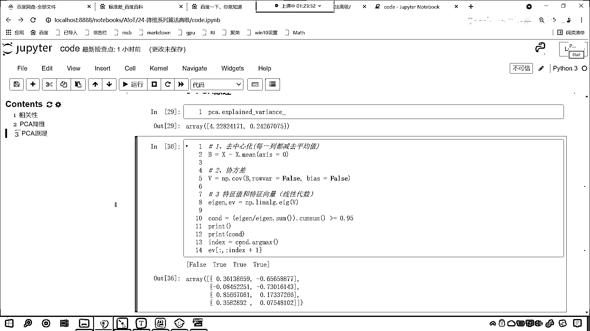
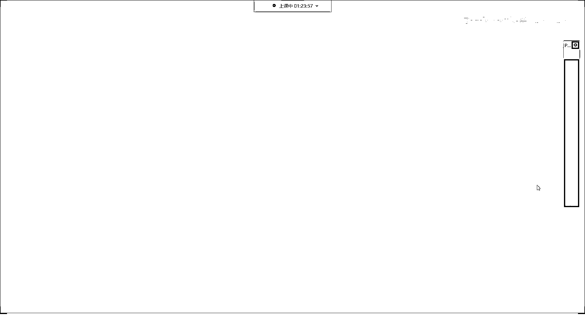
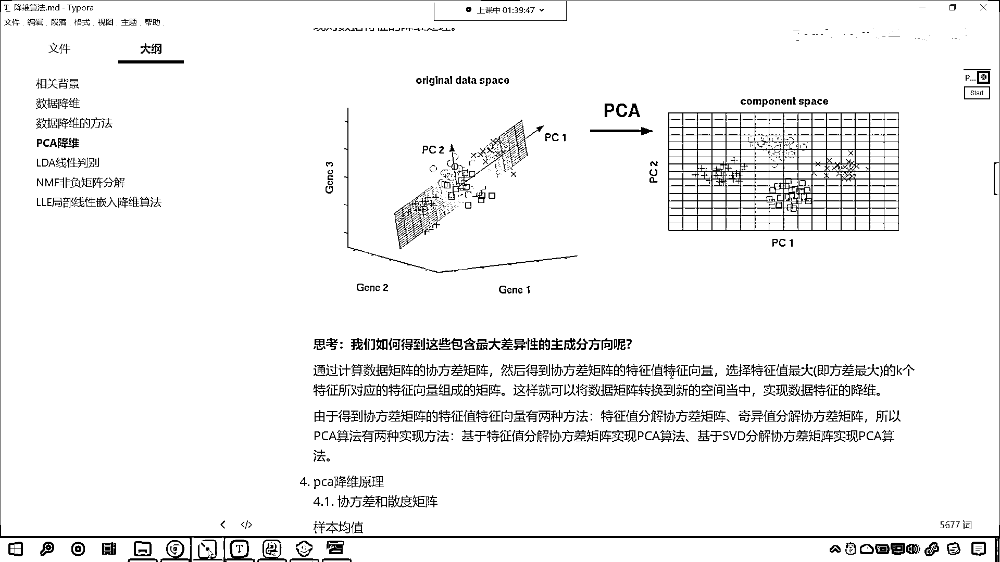

# 7天爆肝整理！AI量化交易-机器学习全套教程，从入门到项目实战保姆级教程！（数据挖掘分析／大数据／可视化／投资／金融／股票／算法） - P160：5-PCA降维算法特征值分解代码实现 - Python校长 - BV1KL411z7WA

接下来咱们就看原理了，咱们就看原理，在这个地方咱们来一个三级标题，在这个地方我们重新刷新一下，这个时候就有目录了，是吧，相关性，这个是PCA降维，接下来咱们这个3呢，我们在下面插入一行。

那这个3呢就是咱们PCA它的原理，你只要知道它怎么进行计算了，你是不是就知道它具体是怎么回事了，来回到咱们这啊，那我们PCA降维的原理呢，这个里边会有一些概念，叫做样本的均值，样本的方差，样本的斜方差。

好，那么这些呢，我们先过，咱们先过一下代码的引，比如说咱们PCA算法呢，我们有两种实现方式，那么这两种实现方式呢，咱们可以使用这个特征值特征向量，我们来进行操作啊。

那这个特征值特征向量是不是是咱们特征值分解当中，我们就可以求解出来特征值和特征向量啊，那这个特征值和特征向量是不是咱们线性代数当中非常核心的一块知识点啊，现在有可能你是不是都给忘记了呀。

这个特征值特征向量你还记得吗，有没有印象呀，有印象的小伙伴，咱们呢，在我们的讨论区回复一个1024啊，你只要有印象就行，有印象是吧，但是你已经忘了这个特征值特征向量是什么了，对不对，来，没关系啊。

咱们先操作好不好，好，那么我们就可以通过这一步两步三步四步五步六步，咱们呢就把PCA降为它的过程，我们呢就给它计算出来，来，咱们就回到代码当中，那我们呢先来第一步，咱们的第一步呢就叫做去中心化。

啥是去中心化呢，其实呢就是x-x。me，me是不是就是它的平均值呀，对不对，咱们指定一个轴啊，因为这个数据是二维的，那么简单不，第一步呢就是去中心化，你看一下这个币长什么样，你看，一执行之后。

这个就是每一列都减去它的平均值，在这我们进行一个说明，这叫做每一列都减去平均值，这是去中心化，因为你只有减去了平均值，是吧，那我们得到的这个数据，它呢才会像一个这个，才会像一个这个正态分布的数据。

因为减去平均值之后，我们得到的这个数据是不是就有正有负了，因为你的特征一定有一些特征比平均值大，一定有一些特征比平均值小，好，这是第一步，大家理解吗，简单不简单，操作是不是特别简单，接下来呢。

我们计算一下斜方差，你看，这个啥是斜方差呢，你知道什么是方差吗，方差是不是数据内部它们的一个这个稳定性呀，那什么是斜方差呢，是属性和属性之间的关系，我在这给你举一个例子啊，在这咱们给你举一个例子。

比如说，现在呢，我给一个b，咱们的b，咱们给一个这个，随便给一个数据啊，我们给一个c，就等于np。random，咱们来一个randint，我们从0到100，我们给一个size，我们让它是20。

这个时候你看，c是不是就有了呀，那么c的方差是多少，咱们点np。var，这个是不是就是它的方差，我们将c放进去，你看，我计算出来的是多少，是不是703。1275呀，那这个方差是如何计算的，那就是c-c。

me，是吧，咱们来一个小括号，给它扩起来，然后呢，给它来一个这个星号星号平方，你看，执行一下，得到这个结果之后，再来一个小括号，去求一下它的什么平均值，。me，你看，这个时候我一执行，看。

结果是不是就有了，这个叫什么呀，这个就叫做方差，那什么是斜方差呢，你看，方差是自己和自己比，这叫做方差，什么是斜方差呢，是自己和别人比，这就叫斜方差，我在这给你举一个例子，比如说，我们高中时代。

初中时代，是吧，一个男生受女生的欢迎程度，是吧，一个男生受女生的欢迎程度，这个是不是一个属性，一个特征呀，跟这名男生的猥琐程度，有什么样的关系呢，我们要是把这两个属性给它度量一下，那么。

我们就叫这个叫做斜方差，是吧，就是两个属性之间的关系，他们的计算公式也很类似，你往上滑，我们对斜方差如何计算都有公式，你看，我们样本的方差是xi-x的上面有一个杠，这个代表平均值，平方。

那样本x和样本y的斜方差呢，看到了吧，就是x-ex，y-ey，怎么样，相乘，看到了吧，相乘，所以说公式是不是差不多呀，x和y你可以理解为两个特征，这不就相当于我刚才举的例子吗，一个男生他的受欢迎程度。

是吧，这是一个特征，把它当成x，和这个男生的猥琐程度，这个是不是就相当于y，是什么样的关系，那么我们就可以使用斜方差来进行计算，好，那么第二步呢，咱们就计算一下去中心化之后，这个数据。

它们的斜方差是怎样的，现在的话，咱们就计算一下斜方差，v=np，咱们直接调用它的方法，那就是cov，小括号，咱们将b放进去，然后呢，我们给一个row，这个时候呢，默认情况下它是计算行，是计算行的斜方差。

我们不要计算行的斜方差，要计算行的斜方差吗，false，就是不要，你如果不计算行，是不是就表示计算列呀，因为咱们的数据当中，列和列是不是表示属性呀，所以说这个参数是false，然后呢。

给它来一个bias，我们让它等于true，如果这个bias=true，表示一个什么呀，这个bias=true就表示在计算的过程当中，我们给它加上1，计算的过程当中给它加上1。

这个就像咱们线性方程的结据一样，这就像线性方程的结据，因为PCA的原码当中，它的bias=true，所以说我们这个地方为了保证和它的结果一样，我们让它等于true，大家看这个就是第二步。

我给你打印输出一下看结果，看到了吧，这个就是咱们的斜方差，好，那么接下来呢，咱们往上插入一行，我们看一下PCA，它都有哪些属性和特征啊，咱们往下滑啊，看，往下滑，在这里呢，我们能够得到一个什么啊。

大家看我们能够得到一个叫explained variance，我们执行一下，咱们得到这两个数据是4。22，0点多少，是不是0。24呀，那我们得到了这个explained variance。

但是我们到斜方差这儿还没有是吧，那我们继续往下算啊，接下来呢咱们就第三步，第三步呢，咱们就计算斜方差的特征值和特征向量，大家看这个就是特征值和特征向量，那特征值和特征向量，这个是线性代数当中的知识。

那咱们就alg，这就是linear，algebra，algebra就是代数的意思，当中呢有一个这个调用咱们的ag这个方法，它计算的是什么。

你看communicate the agent values at right agent vectors of a square，你看是不是特征值，这个是不是特征向量呀，叫agent vector。

所以说我们计算特征值和特征向量，咱们将v放进去，那它既然计算特征值和特征向量，咱们就接受一下agent是特征值，这个e(v)呢就是咱们的特征向量，在这个地方我给你展示一下咱们的agent长什么样。

e(v)长什么样，这个时候你看我一执行，哎呦呦，这个时候各位小伙伴，这个时候各位小伙伴你来看一下，看咱们此时计算出来的结果，看到了吧，我们的4。2和上面这个4。22，大家现在就能够看到。

咱们是不是有一定的这个差距呀，对吧，那和这个0。24呢，你看这个就很像是吧，咱们现在呢调整一下咱们的参数啊，我们将bios调整成false，这个时候我们再来执行一下，现在你来看。

这个bios如果要调整成false，是不是和上面的就完全一样了呀，来各位小伙伴，你看到这里，看到这里，你是不是就能够到咱们第三步这儿是吧，这个是线性代数的特征值和特征向量，看这个就是线性代数。

咱们相关的知识点了，好，那么我们就发现咱们计算出来这个和上面就是不是就非常吻合了呀，0。24267075保留8位完全一样，那么接下来该怎么办呢，就是你PC你这个算法当中到底是怎么封装的。

咱们到这儿已经揭开一半了，那我们接下来呢，咱们继续往下进行操作啊，好，那么你看咱们上面PCA咱们是不是保留了95%的重要性呀，对不对，你看我保留了95%的重要性，那这个重要性到底是怎么算的呀。

EV是什么，EV是不是咱们的Agent是什么，是不是特征值呀，这个特征值越大说明什么，它就越明显，越明显是不是说明它越重要呀，对不对，你看特征值越大说明它越重要，那么它的所占的这四个当中的百分比。

就是咱们的这个百分比，那咱们现在呢对它进行一个计算啊，Agent，我们除以这个时候，你看我们来一个除法，叫做Agent。SUM，Agent。SUM，因为我们那个数据是从小到大的，现在你看我一执行。

你看这第一个特征它占的比例是多少，是不是0。92啊，第二个特征占的重要性是多少，0。05，是不是，那有了这个之后呢，我们再来一个小括号把它括起来，咱们小括号括起来把它当成一个整体。

咱们调用一个方法叫CUM。SUM，还记得这个方法吗，这个就叫做累加和，累加和长什么样，就是你第一个数加第二个数，第二个数就显示第一个数加第二个数，第三个数呢就是前三个数的和。

最后一个数呢就是前四个数的和，你看我一执行看结果，哎，现在有没有发现，第一个数的重要性0。92，然后前两个数的重要性是多少，0。97，前三个数是多少，0。9947，第四前四个数呢1。0。

因为你就四个特征，前四个那当然是1。0了，对不对，所以，那么有了这个CUM。SUM累加和，咱们怎么样，我们让它大于，0。95，看我们让它大于等于0。95，那这个时候它就是一个条件，CUMD。

看那这个条件是什么样呢，你看我一执行，大家看，你看我们如果要让它大于等于，0。95，咱们会得到什么，咱们会，是不是会得到这个，false，处和处呀，对不对，好那么，看这个时候咱们就得到了这样的一个结果。

对不对，那也就是说，你第二个数是不是就达到0。95了，对吧，第一个数达到了吗，没有，那这个时候呢，咱们再调用一个方法，叫做ARGMACS，看这个ARGMACS，我们会得到一个索引，这个索引等于多少。

一执行，是不是就等于第一个呀，对吧，那咱们此时呢，看咱们此时就根据这个索引，我们从eva当中来进行切片，冒号，我们让index加上1，看这个为啥要加上1呢，你看你知道为什么要加上1吗。

print输出一下啊，看print输出一下咱们的COND，看了吗，这个是false，处，那同时呢，我再来给你输出一下print，咱们将这个。

计算出来的它的重要性。

打印输出一下，现在你能够看到，如果我要从特征值当中。

筛选，筛选重要性超过0。95的，我该怎么筛选呀，你看我选第一个，我只选第一个够不够，它达到0。95了吗，是不是没有达到呀，你看我如果只筛选，因为我的要求呢，咱们上面PCA这个算法，我给了0。95对不对。

什么意思，就是降为咱们保留95%的重要性的特征，没错吧，那到这了，咱们手动计算这，我要保留95%的重要性的特征，你看我只保留第一个够不够，来各位小伙伴在讨论区里边回复一下，不够对不对，那怎么办。

我是不是还得取第二个呀，我取了第二个，你看它超过0。95了吗，超过了是吧，所以说我们取前两个，是不是就可以了呀，对吧，你看咱们取前两个就可以了，那有小伙伴就说，你看你第三个不是0。9947吗。

对那你最后一个还是1呢，咱们降为降为是吧，就是在满足条件的情况下，是不是取第一个是处的这个数值呀，对吧，因为你后面的特征，如果要都加上，那他肯定远远满足，但是咱们降为呢，就是把那些不重要的删掉。

重要的保留，所以说我们取前两个，看到了吗，取前两个，所以我们这个地方调用ArgMax，我们还得怎么样呢，咱们的ArgMax是吧，这还没完，还得让它加上1，加上1就是第一个满足的，也就是说。

你如果你要取了前两个，前两个的重要性，它达到0。97了，满足不满足，我们所给的这个条件0。95呢，刚好满足，见好就收，知道吗，这叫来总结一下，这叫什么，刚好满足，见好就收，看到了吗，这叫刚好满足。

咱们呢，这叫见好，刚好满足，见好就收，是吧，哎，恰到好处，如果前两个不够呢，是不是继续向后呀，对不对，你看前两个不够，咱们就前两个不够是吧，就继续向后，如果这个时候你的条件苛刻了，比如说你给一个0。

98，那会怎么样，你看如果你要给一个0。98，你见前两个够吗，前两个你加起来，是不是才是0。97啊，不够这个时候怎么办，取前三个，明白吗，哎，取前三个，依此类推啊，好，这个时候。

那在这个就是咱们的第四步，看咱们的第四步，我们进行了，特征值，和咱们的特征，向量，它的一个计算，好，那么现在呢，咱们的条件也进行了筛选，那我们继续来进行，咱们继续进行第五步，看来一个第五步，第五步呢。

咱们就进行，矩阵运算，咱们进行矩阵的一个乘法，好，那么第四步这呢，咱们让eV等于咱们切片保留下来的数据，你看这个时候叫什么，看这个时候就叫切片，咱们呢就保留，特征值，它对应的，特征，向量。

这叫保留特征值，对应的特征向量，好，那么我们就进行矩阵乘法，咱们起个名字就叫做PCA result，就等于咱们的B。，到咱们的eV，那输出一下咱们的PCA result，你看我一执行，哎，现在你发现。

结果看到了吧，是负的，看这个结果是不是就有了，负的2。68，我们查看它的前5个，冒号咱们来一个5，查看它的前5个，负的2。68，负的2。71，我们看一下和上面的一样不一样，好不好，看负的2。

684125563，是不是，看，2563，这个是多少，看负的2。71，4。1，是吧，最后是169，看一下和上面一样不一样，169，看一下咱们第二个，这个是0。319，这个是多少，负的0。117，是吧。

0。319，那咱们的这个第二维，它进行了一个怎样的操作，我们就发现这个第二维，这个正和负，是不是进行了一个取反，对吧，这个没有关系，你看咱们的第5个，负的2。72871654，看了吧，负的2。

72871654，怎么样，是不是完全一样，看了吧，这个就是完全一样，看了完全一样，好，那么，这个就是PCA降维，它的一个数学过程，你现在知道，是怎么计算的了吧，看它就是这样计算的，好，那么我们最后一步。

咱们进行，最后一步，咱们进行这个标准化，我们看一下这个标准化，那就是PCA result，标准化呢，咱们使用这个zscore标准化，那就是PCA，我们让它减去PCA result。me，给一个轴。

我们让轴等于0，然后分母上除以PCA result。std，这个时候呢，咱们给axis，我们也让它等于0，这个时候咱们执行一下这个结果，PCA result，中国号冒号，我们查看它的。

咱们查看它的这个前5个，这是PCA result，咱们现在发现，你看这个是不是负的1。309，这个是不是负的0。65，那这个是怎么回事啊，来咱往上看，咱们的PCA当中，还有一个重要的参数。

叫做whiten，这个什么是whiten呢，whiten就是白话，我们给一个处，默认情况下，这个参数等于false，看啊，你看这个参数是不是等于false，我们往下滑，看一下这个参数的说明，看啊。

这个whiten呢，问处是吧，这个如果是处的话，它会进行归一化处理，现在你看啊，我给一个处啊，这叫whiten是不是就有白色的意思啊，执行这个代码，哎现在你发现，这是多少，负的1。3053，这个是多少。

0。648，这个是负的1。319，看和咱们下面这个一样不一样，看到了吗，负的1。3097，1087，负的0。6505，稍微有一点不一样，看到了吧，稍微，这个是多少，0。6483，对不对，看那我们说。

它的几数列和偶数列是吧，它会进行一个，它会进行一个这个正负的颠倒，这个呢，这个都是小事啊，因为正数和负数，在你表示某些意义的时候，是类似的，但是我们现在差一点点，我们求解出来的是负1。30971087。

上面计算出来是多少，负的1。30533786，这个whiten等于处，和咱们下面计算出来的，稍微有点差异，现在我就把这个问题是吧，这个，悬赏悬出来，你在百度上，你在谷歌上去搜索，都找不到正确的答案。

那百度上你可以搜到这种写法，就是六最后进行标准化，得到的结果和我这个一模一样，但是呢，和PCA和我们使用PCA计算出来的，稍微有一点差异，那这是怎么回事呢，百思不得其解，现在，我告诉你怎么回事啊。

看一下咱们里边有没有一个参数啊，你看啊，这里边有一个参数，叫什么呢，叫做DDOF，你知道这个参数是干嘛的吗，DDOF，默认情况下，他是他是多少，是1是0，我们现在把它调整成1，大家拭目以待啊。

你看我一执行，你看我一执行，我们所求解出来的结果，和上面所求解出来的结果，大家现在再来比对一下，为了大家比对方便，我把它写到这儿，你现在再来比对，后八位数和这个是不是完全一样呀，看到了吧。

是不是完全一样，现在是不是完全一样了，你知道这个参数是什么吗，你知道这个参数是什么吗，好，我们一会儿再来讲解啊，那么，现在咱们总结一下，这个代码是不是都是咱们一行一行码出来的，看到了这都是我。

这都是咱们一行一行写出来的啊，那么我们微微调整一下，咱们将这个0。95改成0。98会怎么样，看到了吧，现在是不是有三列特征呀，它有三列特征，咱们也把它改成0。98，执行一下这个代码。

你看我们也是有三列特征，你看这三列特征和它是不是一样，看到了吧，一样不一样，所以说你调整这和上面这个调整是不是同步的，一致的对不对，看一下咱们到底是怎么操作的啊，第一步去中心化。

是不是就是减去了每一列减去每一列的平均值，第二个斜方叉对不对，第三个是特征值特征向量，咱们是不是使用了咱们的这个线性代数当中的EAJ，这个就是特征值特征向量，然后呢，我们对特征向量咱们对特征值进行运算。

这个数学运算你要明白是怎么回事，我是一步一步给你展示的，是吧，特征值咱们咱们就说了，表示咱们特征的重要性，它越大，这个特征就越重要，是吧，所以这就像你的价值一样，你越有价值，那么你挣的钱就越多，对不对。

你看这个科学家是吧，他们从来就不关心钱，是吧，因为呢，钱对他们来说是吧，没用了，对吧，因为这个够用是吧，完全够是吧，好，然后呢我们进行切片，咱们就是把我们筛选出来的特征值，对应的特征向量给它切出来。

然后呢，矩阵乘法，然后呢，标准化，得到的结果和咱们使用PCA一模一样，那说明了什么，我们所写的这二三十行代码，其实PCA是不是进行了封装呀，现在我们是不是终于揭开了PCA这个算法，它的神秘面纱呀。

就是人家到底是怎么做到的是吧，一封装我们一用感觉特别高大上，其实就是这些代码，其实就是这些代码，如果以后你面试是吧，别人问到了，说这个PCA到底是怎么回事是吧，你就这样跟他讲就可以了。

再回到咱们的课节当中，你看咱们刚才问到的这个问题是吧，我们如何得到这些包含最大差异性的主成分呢，就是这个PCA到底是怎么来的，是不是这个问题啊，看咱们怎么通过计算，几矩阵的斜方差矩阵。

然后得到斜方差矩阵的特征值特征项量，选取特征值最大的K个特征，所对应的什么，看所对应的这个，看选取你看啊，咱们再对于这句话是吧，进行一个解读是吧，看到了吧，选取特征值最大的K个特征，所对应的特征项量。

看到了吧，这样我这样就可以将数据矩阵映射到新的空间当中了，你看这个地方用了一个什么，转换到新的空间当中实现数据的降维，那回到咱们代码当中，看咱们是怎么做的啊，看到了吧，去中心化，然后求斜方差。

然后特征值特征项量，筛选特征项量，是不是，然后呢，这一步是不是就相当于咱们所说的空间转换呀，看到了吗，这个就是空间转换，那这个空间转换用的是什么方式，矩阵乘法，牛不牛，看到了吧，牛不牛，现在。

你明白矩阵乘法它的真实含义是什么了吧，如果我们非要把每个数学公式都用咱们的这个物理化的形式来表示，这个就是将数据矩阵转换到新的空间当中，看进行了一个映射，这就是这个矩阵乘法，就相当于这句话，看啊。

你要多理解啊，你看这个数数据矩阵，不就是咱们的原数据吗，这里的转化是咋回事，乘法矩阵乘法，所以说呢，你看我们转换到这个空间当中，咱们实现了一个什么，实现了一个什么，这个差异性最大。

怎么才能实现差异性最大呀，你的特征值特征项量越明显，那么这个差异性就越大，明白了吗，这就是咱们PCA降维。

咱们这个算法咱们的实现。