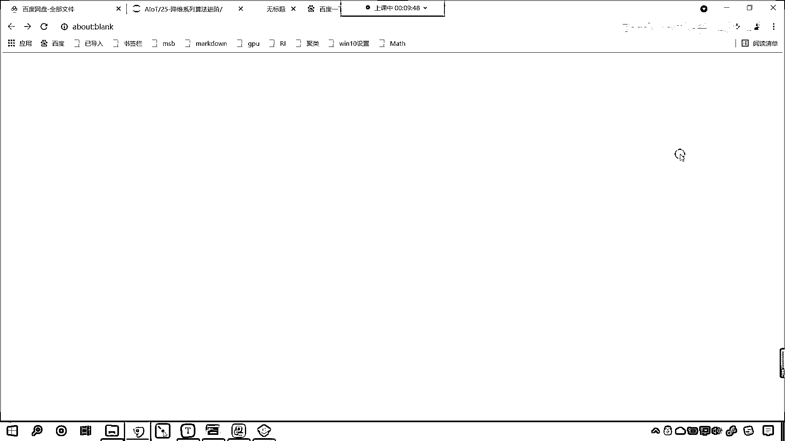
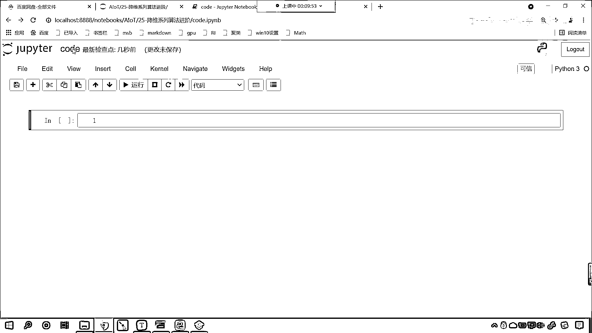
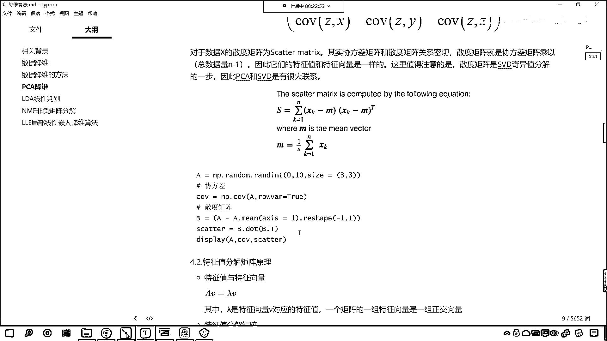
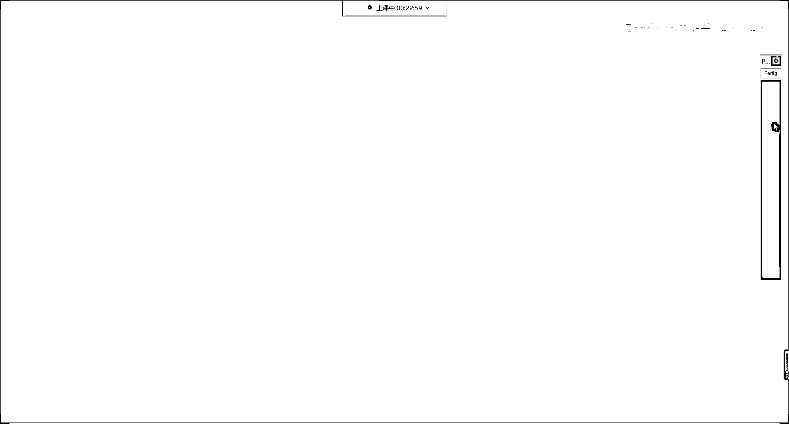
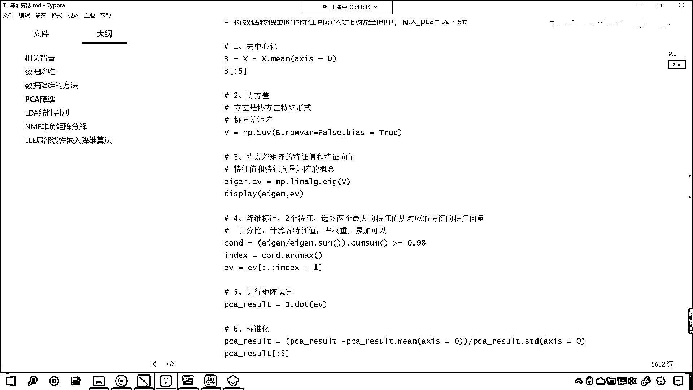

# 7天爆肝整理！AI量化交易-机器学习全套教程，从入门到项目实战保姆级教程！（数据挖掘分析／大数据／可视化／投资／金融／股票／算法） - P162：1-协方差和散度矩阵 - Python校长 - BV1KL411z7WA

比如说PCA降维这个地方，我们介绍到了均值方差，这个都比较简单，我们还介绍到了斜方差，这个斜方差呢，我们有相应的公式可以计算，那么这个里边呢，还为我们介绍到了一个概念叫做散度矩阵，那么呢。

咱们回到代码当中，我们呢来进行一个计算啊，来，回到代码当中，咱们呢找件file，今天呢是第25讲，这是降维系列算法的进阶，在这里呢。

我们创建一个代码。

选中它，咱们给它改个名，叫做code，然后呢，我们导一下包。

咱们import numpy as np，执行一下，我们在上面插入一行，咱们呢，首先来一个三级标题，那这个三级标题呢，就是咱们的斜方差和咱们的散度矩阵，散呢，就有散点的意思啊，叫散度矩阵。

斜方差咱们知道是怎么回事，对不对，咱们给一个x，x np。random，randint，咱们呢，就从0，我们让它到100，我们给一个size，小括号，咱们让它是5行5列，这个时候呢，一执行。

各位小伙伴你就能够看到，x这个数据是不是就有了呀，有了之后呢，咱们调用np。cuv，这个方法就是去计算咱们的斜方差，m呢，就是我们要计算的数据，那这个row，var，默认情况下它是计算行的斜方差矩阵。

现在呢，咱们按照列来进行计算，当然你也可以计算行啊，这个都是无所谓的啊，x放进去，里边有一个参数叫row，var，如果我要给一个false，那这个就意味着咱们再去计算斜方差时，计算斜方差时呢，我们呢。

是根据列来进行计算，那啥是列呢，各位小伙伴看到咱们这个数据你就能够发现，你看这是不是一列，这是不是一列，对吧，这是一列，它是按照列来进行计算的，我为你执行一下，你看我一运行。

咱们现在是不是就出现一个结果呀，你知道，这计算出来的，这个叫什么呀，这叫斜方差矩阵，我们计算出来的呢，叫做斜方差矩阵，那第一个数，它为什么是536。7呢，那大家看咱们这个图啊，你看。

咱们如果想要计算covxyz，你现在能够看到，咱们左上角第一个计算出来的，是不是covx和x它的计算结果呀，那如果说自己和自己去计算斜方差，这个时候它返回的结果是不是就是方差呀，你看。

你这个是自己和自己进行计算，那自己和自己计算，它是不是就是方差呀，对不对，你看，它就是方差啊，我们自己和其他的特征进行计算，这个时候呢，它才是斜方差，这个时候它叫方差，那么这个呢。

是自己和其他在进行计算，这个时候呢，它就是斜方差，斜方差呢，是两个属性之间它们的运算，所以说现在你能够明白，这到底是怎样的一个关系了吧，那方差和斜方差是什么样的关系呢，方差和斜方差，它俩呢。

咱们的这个方差是斜方差的一种特殊形式，看到了吗，方差是斜方差的一种特殊形式，就像咱们所说的，椭圆和圆的关系，我们的圆是不是椭圆的一种特殊形式呀，这个大家能够理解吗，你看到了吧，那我们在这儿呢。

把这个叫做椭圆，那我们圆是椭圆的一种特殊形式，所以说它们之间的关系呢，大概就是这个样子，好，那么现在呢，咱们自己来计算一下好不好，为了让大家能够明白，那我们说，这536。7，它呢，就属于是第一列的。

那咱们现在呢，就可以计算一下，那我们就调用np。var，大家看啊，咱们计算一个var，那我们在计算var的时候呢，x，中国号，冒号，咱们给一个0，这个时候你看我一执行，咱们现在得到的结果是不是429。

36呀，那逗号啊，咱们给一个ddof，我们把它变成1，这个时候你来看，咱们计算出来的结果，是不是就是536。7，和上面这个是不是就一模一样了呀，咱们说这个ddof，它代表什么意思呀。

它是不是代表咱们的样本，咱们的样本方差呀，来，回到咱们代码当中啊，回到咱们这个课件当中，我往下滑，下面有一个地方，专门就介绍了，这个是总体样本标准差，这个是样本的标准差，现在你就能够看到。

一个是总体标准差，一个是样本标准差，这俩有什么不一样的地方呢，你能够发现，如果要是总体样本的话，分母上用的是不是n，如果要是样本的话，咱们分母上用的是不是n-1呀，有看到这一点点区别吗，那这个1呢。

它所对应的，我们减去的这个参数，所对应的就是咱们的ddof这个参数，如果它要等于1，那就表示咱们分母上所减去的这个1，看到了吧，默认情况下它是0，你如果要是0的话，是不是就表示总体的标准差呀。

减去1就表示样本的标准差，而我们代码当中，上面咱们在进行计算斜方差的时候，咱们用的是样本的，这个地方呢咱们用的是样本的，所以说它的分母上，它的计算公式呢就是n-1，那我们如果要自己去计算。

咱们ddof让它等于1，那么还有一种方式，咱们也可以自己去计算，那这个方差它呢都是有数学公式的，你看啊，开根号里边的，开根号里边的就是方差公式，是xi-mu，是不是来一个平方呀，然后来一个累加和。

是不是除以n分之1呀，那其实这个是不是就相当于是求了一个这个平均呀，而样本的话，它是分母上减了个1，这个呢就叫做无偏差估计，咱们的分母上减去1，我们把这种形式叫做无偏差估计。

它呢是故意把这个值给你调的稍微大一点，因为你样本的话，它呢是总体的一部分，如果要是总体的一部分，我们随机抽样得到的结果，那么咱们这个和求解出来的，它相对于总体而言，它就会稍微小一点。

那为了让我们样本计算出来的标准差和总体的标准差更加接近，所以咱们就调小了咱们分母上的这个数据，你看这个时候，我分母上减去了一个1，那么我们整体的效果是不是就是增大呀，那这个增大的这个趋势。

咱们就是为了尽量和总体的标准差一致，那咱们就根据这个公式，我们来计算一下好不好，让大家开开眼，让大家知道是吧，这些公式，这些调用的方法，咱们其实也可以自己进行计算，那这个时候就是x中国号冒号。

咱们来一个0，然后呢我们减去x中国号冒号来一个0，我们求一下它的平均值，小括号把它括起来，把这一堆括起来，然后怎么样是不是给它来一个平方呀，那就是星号星号2，平方完之后咱们整体括起来。

然后呢是不是对它求一个和呀，累加和，累加和之后咱们再整体括起来，然后呢它是不是还得除以一个分母呀，除以小括号，分母就是等于多少，分母是不是就等于咱们的n-1呀，那这个n呢就是咱们的样本量。

我们就看一下咱们的第一列当中，它一共有几个样本，我们一起来数一数，各位小伙伴就能够清楚的发现，这第一列当中是不是有五个呀，因为我们的数据是5行乘以5列，那这个时候呢，咱们呢就除以5-1。

这个时候你看我一执行，我自己计算出来的结果和上面是不是一模一样呀，你现在明白这个数536是怎么计算出来了吧，那还有第二个数是-184。5，那这个是怎么计算出来的呀，对不对那这个是怎么计算出来的。

来咱们现在呢也来进行一个计算啊，我们看一下np。cov，咱们把X中国号冒号0放进去，X中国号冒号1放进去，我们看一下能不能计算出来一个结果，这个时候各位小伙伴就能够看到，你看我们计算出来的结果啊。

是不是就是-184。5呀，对吧你看这就是斜方叉，那斜方叉的公式是什么样的呀，看斜方叉的公式是什么样的，咱往上滑斜方叉呢也有它自己的公式，你在这里能够看到covxy，它呢就等于你看。

特征X-X的平均值乘以特征Y-Y的平均值，然后呢是不是对它求了一个和，然后除了个n-1呀，咱们回到代码当中，我们也这样进行操作一下啊，那这个时候呢就是X中国号冒号0，我们让它减去X中国号冒号0。

求一下它的平均值，然后乘以小括号，小括号里边呢是咱们另一个特征，X冒号1，然后减去X中国号冒号1，求一下这一列的平均值，求完之后咱们把它们当成一个整体，用小括号扩起来。

你看这里边我写的小括号是不是比较多呀，如果这个代码让你自己去写，你要搞清楚它们的关系啊，然后我们点求一下SUM，求完和之后呢，咱们再来一个除法，除以多少分母上也来一个小括号，小括号扩起来就表示呢。

它要优先计算，我们是不是也是5-1呀，这个时候你看我一执行，各位小伙伴来睁大眼睛看一看，我们求解出来的结果是多少呀，看到了吧，咱们现在求解得到的结果是-184。5，后面是不是有很多零呀。

那我们四捨五入的话，后面这些零是不是就可以去掉呀，对不对，这个时候你看，这就是咱们计算斜方差的公式，看到了吧，这就是斜方差公式，好，现在我为各位进行了展示，好，那么到这里啊，各位小伙伴，你是不是就明白。

什么是斜方差，什么是方差，什么是样本的方差，什么是总体的方差，它们呢是有一点，是有一点点区别的啊，那么接下来呢，咱们再介绍一个，叫做数据X的散度矩阵，数据X的散度矩阵，那这个散度矩阵呢，和咱们的斜方差。

它呢是有一定关系的，你看散度矩阵是如何计算的。

我们上面呢有一个定义，各位小伙伴你就能够看到。

你看这个就是散度矩阵，是XK-M，乘以XK-M，然后上面是不是有一个转制呀，看到了吗，上面这个T就表示转制，M是什么呀，M是不是求了一下，它的平均值呀，对不对，那我们就计算一下散度矩阵吧，来现在呢。

咱们就回到代码当中，好，那么我们在上面插入一行，咱们来一个四级标题，在这呢，我们叫做斜方差，咱们把斜方差进行了介绍，在它的下面呢，咱们再来一个四级标题，这个呢就叫做散度矩阵，好那么散度矩阵。

根据咱们刚才那个公式，咱们呢对于X，我们先求一下它的平均值，那就是X点，咱们计算一下mean，这个时候大家要注意，咱们X呢是二维矩阵，咱们在计算平均值的时候，咱们呢需要给它指定轴，这个轴如果要等于零。

你看这个轴如果要等于零，咱们计算的是每一，咱们计算的是每一列的这个平均值，这个时候你看我一执行，咱们得到的这个结果呢，我们接收一下，咱们就叫m啊，接收一下这个结果就叫m，在我们执行平均值之前。

咱们呢先把数据X，我们打印输出一下，那么我们就求一下，轴x=0这个方向，它的平均值，那这个平均值呢就是33。2，有了这个数据之后，咱们接下来呢，我们就可以做减法了啊，那就是x减去咱们的m。

看我们让x减去m，这个时候你看我执行一下，咱们的代码，此时各位小伙伴你就能够看到，咱们的结果是不是就出来了呀，看到了吧，结果就出来了，是不是那这个结果出来之后呢，我们把它接收一下，咱们给它起个名叫B。

我们给它起个名叫B，好那么有了这个B之后，咱们根据这个公式，你看矩阵减去它的平均值，然后再进行矩阵乘法，那是不是它自己的这个转制呀，对不对，上面右上角是一个t，那我们就回到代码当中。

来咱们在这呢进行一个操作，那就是B。dot B。t，你看这个时候我们是不是就得到一个结果呀，咱们得到的这个散度矩阵，结果就有了，这个呢就是散度矩阵，那这个散度矩阵，好那你看啊咱们这个散度矩阵。

它和咱们上面所介绍到的斜方差，它有什么样的关系呢，我们上面的斜方差，咱们计算出来是不是536。7-184呀，对吧，它们有关系吗，我们复制一下，咱们在最下面这一行代码，执行一下，让他们俩进行一个对比。

我们让他进行一个对比，那他们到底有没有关系呢，大家看啊他们呢是有关系的啊，这个呢是有关系的，那他们之间是，怎样的一个关系呢，好那么来回到这啊，他们之间是怎样的一个关系呢，他们之间的关系呢，哎大家看啊。

他们之间的关系呢，我们在进行这个散度矩阵的时候，那么他们之间的倍数呢是n-1倍，看他们之间的倍数关系是n-1倍，咱们在进行这个散度矩阵计算的时候，我们去减平均值的时候，咱们这个轴是吧。

哎我们得需要去调整一下啊，来那刚才的话，我们减成什么了，刚才咱们这个，再去进行x。mean的时候，你看我是不是给成零了呀，那这个零大家观察一下，他计算的是，你看他计算的是不是咱们每一列的这个。

看他计算的是不是咱们每一列的这个平均值呀，你比如说啊咱们看一下啊，33。2或者说我们看倒数第二列，你看咱们的倒数第二列，89 60 18 79和4是吧，那这个数你看求出来的平均值是正好是50。

4+9这个个位数是3，3加上咱们的8，个位数是1，1加上9是不是正好是零呀，所以说求解出来的这个是50，那根据咱们相应的公式，咱们在计算的时候呢，我们给他指定轴让他是1，如果指定轴是1的话。

这个时候各位小伙伴就能够看到，看咱们47 41，那我们计算的结果，咱们是不是根据行进行计算的，根据行计算了平均值呀，对不对，好那么这个时候呢，根据行计算了平均值，然后呢咱们再去计算b啊。

根据行计算咱们呢再去计算b，这个时候呢咱们b和咱们的这个m，在进行减法的时候，大家现在就能够看到，其实呢我们你看这个3减去咱们的47，我们得到的结果是不是-44呀，12减去咱们的41。

咱们得到的结果是不是-29呀，那我们的89减去咱们的20。2，咱们得到的结果是68。8，这样我们可以实现一个什么样的效果呢，也就是说咱们每一行，每一行，每一行，它是不是都减去了它各自的这个平均值呀。

每一行都减去了它各自的这个平均值，好那么我们在进行减法的时候，咱们呢其实是进行了一个广播机制，我们呢进行了一个广播机制，好那么有了这个结果之后，咱们呢得到了B，我们再去计算咱们的散度矩阵。

这个时候呢我看一下咱们的结果，B。dotBt咱们得到的结果还是不太对是不是，大家看一下啊得到结果还是不太对，和咱们NP。CUNVX，RAW=FALSE，我看一下因为这第二个数呢，大家看它是负的是不是。

我们的第二个数是负的，这个时候呢它就有一定的这个差距，来咱们现在呢检查一下啊，看看是哪个地方它没有对应上，回到咱们的科技当中，在这个地方呢咱们是进行了一个，咱们是进行了一个这个receive是吧。

我明白了，明白是怎么回事了，咱们这个协方差我们在进行计算的时候，咱们这个RAW是不是等于TRUE啊，对不对而我们这个代码咱们在进行计算的时候，你看咱们这个RAW等于多少。

看咱们这个RAW是不是等于FALSE啊，那么此时呢我把它变成TRUE，好那么这个时候呢咱们在计算的时候，其实呢我们就是行的计算了，此时咱们就是计算行的这个协方差。

那这个时候你看我计算出来的结果和上面是什么样的一个关系呢，上面的结果我进行一个除法，咱们除以多少，n-1这个n就是5-1，这个时候你看我一执行，这个时候呢大家看啊，看咱们执行的这个执行的这个结果。

我看一下啊咱们除以5啊执行一下，还是有点不一样是不是执行，这个是1600差一点点，咱们来一个BIAS啊，我们让这个BIAS等于1执行一下，这是1300多，然后减去1执行一下，这个就是2000多。

是哪个地方差了一点点啊，执行一下，X1600多，这是2284，我们给他除以一个5，咱们执行一下1622，还是某一个地方有一个相差对不对，来咱们回到我们的课节当中啊，回到咱们的课节当中。

那么咱们上面说到的这个结论呢，我们说到了这个散度矩阵和斜方差矩阵，他们的这个关系呢是这个n-1的关系，这个n呢其实就是咱们的这个数量的个数，那在我们的代码当中，咱们的这个数据呢，X大家看啊咱们的数据X。

他呢是五行五列对不对，这个数据是五行五列，那我们再去进行这个平均值计算的时候，咱们呢让他减去咱们的让让这个X点mean，我们呢做了一个这个减法，做了一个求平均值，这个时候呢就是4741。

20点20点26650点6，这个肯定是咱们每一行的平均值，那么我们有了这每一行的平均值，然后呢咱们就做减法，在做减法这个地方呢，咱们在这来一个reshape-1和1，这个时候你看我执行。

咱们就会得到一个新的b，那我们这个地方进行了数据重塑，那原来的时候咱们的这个数据m呢，他是一行，经过这个数据重塑，大家想一下他是不是就有行，是不是就变成列了呀，你看原来是一行对不对啊。

那现在这个数据变成什么了，这个数据是不是就变成一列了，那此时我们在进行做减法的时候，此时咱们在进行做减法的时候，是怎样的一种方式进行了减法呀，那其实呢就是这一行数据。

那就是3 12 89 89 42都减去了谁呀，都减去了我们的47，你看这第一行减去了47，咱们将这个规律呢在这进行一个说明，也就是说第一行咱们都减去47，第二行呢你看一下第二行都减去了谁。

第二行咱们是不是都减去了41呀，第二行所有的数据都减去了41，所以你看60减去咱们的41，得到的是19 7减去咱们的41，我们得到的结果是不是-34呀，47减去41得到的结果你看是不是6呀。

好那么我们呢在对应的方向上，做了这个减法，然后呢我们再进行一个散度矩阵的计算，好那么到了B点Bt之后呢，此时呢咱们再来操作一下，此时咱们再来操作一下，我们看一下此时能不能对上，来我们做一个除法。

咱们呢就除以5-1，我们一运行大家现在就能够发现，你看此时咱们计算出来的散度矩阵，和咱们的结果是不是就完全一样了呀，大家现在再来看咱们这个结果，你看这是我们散度矩阵得到的结果。

这个呢是咱们斜方叉得到的结果，你看363。5 1678。5-194。5-194。5，此时是不是就完全一样了呀，你看此时就完全一样了，那大家发现啊，你看我们在进行这个斜方叉计算的时候。

我们是不是可以根据肉来进行计算呀，看到了吧，我这给了个true，那如果我要给个false呢，如果我要给个false呢，是不是也是一样的呀，对吧来咱们现在呢再来演示一下啊，你看此时我们给一个false。

那就是np。cov咱们来一个小括号x放进去，我们让这个肉呢等于false，此时你看咱们计算出来的结果和刚才是不是就不太一样了呀，看到了吧上面咱们是怎样的一个计算呢，在这我们进行一个说明啊。

上面呢咱们是根据行来进行计算，那如果要是根据行来进行计算，什么意思呢，数据x咱们在这给各位显示了，你看以行为单位，就是这个312898942，把他们当成一个整体，咱们对这五个数计算它的斜方叉。

然后呢计算第一行和第二行，他俩的斜方叉，然后依次进行计算，那么如果我们要把这个参数肉VAR等于false，那这个表示什么呢，反正我们的数据是二维的，要么是行要么是列，如果肉VAR等于false。

那么就表示咱们在进行计算的时候，我们呢根据列来进行计算，第一列去计算它的方叉，第一列和第二列去计算它的斜方叉，一般情况下，大家要注意啊，一般情况下，咱们都会去使用这种方式肉VAR等于false。

你看一般情况下，咱们都会使用这种方式，因为行和列，大家想一下，它其实是不是就是一个转制啊，对不对，咱们现在也来操作一下，你看我怎么操作啊，那就是x。t，咱们怎么样，减去x。t，点儿，你看我们上面。

咱们在进行这个xmin的时候，你看这个地方，我是不是给的xmin。axis等于1啊，来那我们也复制一下啊，咱们直接算啊，x。t，点儿，咱们来一个min，我们让它axis等于1，然后呢。

我们对它进行一个reshape，-1和1，计算完之后，咱们来一个b，你看这个地方，我是不是x。t啊，大家知道x。t是不是就表示转制啊，那转制的话，它就变成什么样了呀，你看我们如果要进行了转制。

那它是不是就是行变列列变行呀，对吧，你看它就行变列，对不对，你看它是行变列，然后列是不是就变成了行呀，对不对，那我这个时候呢，因为你这个row vr等于什么，等于false，那其实就是计算的时候。

原来是计算行，现在是不是就变成计算列了，那如果说我将你行和列转制，是不是就和原来的一样了呀，对吧，那所以说咱们就转制一下，那就是x。t-x。t。mean，axis=1，reshape，-1和1。

那我们执行一下咱们的b，好，那么有了b之后呢，咱们b还根据刚才的公式，b。dot，b。t，这个时候你看我一直行，大家看咱们得到的结果，是不是200，看是214。6，是吧，我们用一个除法啊，那就是5-1。

这个时候你看我运行得到的结果，和咱们上面np。cov，false，得到的结果，你来看，是不是完全一样，看到了吧，这两个计算出来的结果，是不是也完全一样，看到了吧，就是说无论，我们计算的是np。cov。

这个row_var=false也好，还是咱们给一个row_var=true也好，无论是true还是false，我们呢都可以根据咱们这个公式，是吧，我们把它计算出来，那这个时候呢，咱们也就观察到规律了。

散度矩阵和咱们的斜方差，它们之间的关系呢就是n-1倍，是吧，它们之间的关系呢就是n-1倍啊，好，那么到这里呢，咱们对于我们上一节课所讲的内容，比如说PCA降维当中，看咱们PCA降维当中。

我们就会用到特征值特征向量，是吧，就会用到斜方差。

那么我们对于这个知识点呢，比較深的認識了。