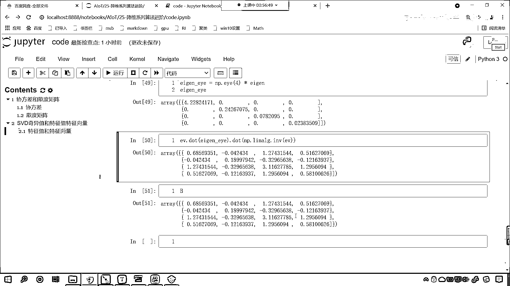

# 7天爆肝整理！AI量化交易-机器学习全套教程，从入门到项目实战保姆级教程！（数据挖掘分析／大数据／可视化／投资／金融／股票／算法） - P163：2-线性代数之特征值特征向量分解 - Python校长 - BV1KL411z7WA

接下來呢，我們繼續往下看啊，回到咱們的課程當中，接下來呢咱們繼續往下看，好，那麼往下滑，滑動到最後，咱們在這兒呢，再來一個三級標題，接下來呢，我們看一下，咱們看一下這個，起義值，叫做SVD，起義值和。

咱們的特徵值，特徵向量，我們看一下它們之間是怎樣的一個數學關係，好，那在這兒呢，咱們給一個數據好不好，在這兒呢咱們就給一個具體的數據啊，比如說呢，我們給原文花的數據，from sklearn。

咱們import data sets，執行一下，然後呢咱們就使用data sets去加載一下原文花的數據，return x y，我們給一個true，這個時候呢我們就會得到數據x和y，有了x和y之後呢。

咱們x-x。me，我們給一個軸，讓它等於零，那這個時候呢，咱們就會得到去中心化的數據，這個去中心化的數據呢，我們就叫做a了，執行一下，有了這個a，咱們呢去求一下它的斜方差，np。cov，我們把a放進去。

然後呢給它一個row vr，我們讓它等於false，那這個表示什麼意思呢，表示我們計算力，為什麼要計算力呢，因為咱們的力是屬性，我們計算斜方差，咱們呢其實是計算屬性和屬性之間的相關性。

所以說之前咱們也介紹了，一般情況下，咱們的row vr，它呢應該是等於false，這個呢就表示咱們去計算力，力呢是屬性，一般情況下這個r呢表示什麼呀，r呢它表示樣本，好，那麼我們進行了這個計算之後呢。

咱們接受一下，我們就叫b，給各位展示一下咱們的b長什麼樣，大家看，這個就是咱們的b，好，那麼有了b之後，咱們現在呢來一個四級標題，我們先計算特征值和特征向量，那特征值和特征向量，咱們就可以調用np。

linealg。eg，我們將b放進去，我們得到的結果就是特征值和特征向量，那我們就接收一下，特征值呢咱們起個名叫agent，特征向量呢咱們起個名就叫ev，Display一下，agent放進去。

ev放進去，你看，特征值特征向量是不是就有了，那麼特征值和特征向量，它是什麼樣的一個關系呢，我們往上滑動啊，咱們的特征值和特征向量，你看是什麼樣的關系呢，這個av就等於λv，看到了吧，av就等於λv。

也就是說我們，如果說咱們的a和我們的特征向量進行矩陣乘法，它呢其實就等於咱們的λv，那我們看一下，是不是這樣的一個關系啊，來，咱們呢回到代碼當中啊，大家注意啊，你看這個λ，是特征向量v所對應的特征值。

一個矩陣的e為特征向量，v是一組正交向量，那什麼是正交呢，其實就是垂直，那v呢，v呢是特征向量，λ是特征值，對不對啊，那a乘以v表示什麼，看，在我們這個代碼當中。

其實你看我們是不是對b求了它的特征值和特征向量呀，對吧，咱們讓b點我們來一個dot啊，咱們dot一個e為，你看這個時候我一執行，大家看咱們就會得到什麼樣的一個結果呀，你看我們是不是會得到，看到了吧，1。

52，對不對，你看1。528，第二個變成多少了，第二個是不是就變成了-0。35呀，那麼這一列是怎麼而來的呢，看到了吧，這一列是怎麼而來的呢，咱們呢來算一下啊，你看啊，這個是什麼，這個是不是特征值呀。

那我們把它取出來，那就是agent中國號0，我們讓特征值乘以誰，乘以e為中國號，冒號，咱們給一個0，這個時候你看我一執行，誒，來，各位小夥伴，現在你看，我相乘得到的結果等於多少，1。528-0。357。

3。622，看到了吧，和它一樣不一樣，然後呢咱們再來啊，agent中國號，咱們來一個1，我們讓它乘以e為中國號冒號，1，你看我一執行，得到的結果是多少，-0。1593，第二個是-0。177。

是不是一模一樣，那回到我們科技當中，咱們的公式是怎麼說的，看到了吧，公式是不是就是這樣說的呀，就是說某一個某一個矩陣，它的特征向量和它相乘，就等於特征值和這個相量，和這個對應的特征向量相乘，是不是呢。

看到了吧，av就等於λv，現在你看到，你看這個呢，也是咱們特征值和特征向量，它的定義，也就是說你去線性代數，這本書裡邊去找，那麼它就對應著什麼呀，它就對應著一個這樣的一個關係，我們把存在這樣的一個公式。

所得到的，所得到的這個v，我們就叫做特征向量，這個v呢，咱們叫做特征向量，那麼這個λ呢，我們把λ叫什麼，看那這個λ，咱們呢就把它叫做特征值，這個λ就叫做特征值，剛才我在代碼當中，是不是給各位小夥伴。

演示了一下他們的關係呀，對不對，好那麼，其實呢，我們的特征值和特征向量，他們呢還可以用下面這個公式來表示，看到了吧，a就等於誰呢，就等於p，這有一個向上的小魚號，然後呢p右上角帶著一個-1。

這個-1是不是就代表著咱們的逆矩陣呀，那這個地方咱們用了個p是吧，這個p和上面的v表示相同的含義啊，你看這個p是矩陣a的特征向量組成的矩陣，看到了吧，你看它是特征向量，是吧，所組成的矩陣。

在這個地方我們把它叫做p，也就是說你上面這個v是吧，可以有多個，就像我們代碼當中，咱們是不是把第一列取出來，這個是不是第一個特征值，所對應的特征向量呀，我們在代碼當中，是不是也可以把第二個取出來。

那它就表示第二個特征值，所對應的特征向量，如果要不取出來，把它看成一個整體，那你想這個是不是就是一個矩陣呀，所以說這個p呢是矩陣a，所對應的特征向量，那這個向上的這個小魚號，這個符號呢，它是對角。

它是對角矩陣，對角線上的元素就是咱們的特征值，啥意思呢，斜對角線上有值，除了斜對角線上，其他的值都是零，那回到代碼當中，給大家呢對一對啊，咱們要對上，那我們這個裡邊的b，咱們這個裡邊的b。

是不是就相當於咱們科技當中，所說的這個a呀，對不對，你看b是不是就相當於咱們所說的v，那這個ev，是不是就表示咱們的特征向量呀，對不對，這個ev就表示特征向量，在這呢，咱們也進行一個備註啊，這個b呢。

它呢就表示矩陣，咱們的ev呢，就表示矩陣的特征向量，好那麼，我們這個地方做了一個乘法，那這個呢就是第一個，大家看是第一個特征值，和咱們第一個特征向量，是不是進行乘法呀，得到的結果，我們發現和第一列。

是不是一模一樣，對不對，那第二個，大家可以把這個叫做λ，它對應咱們課程當中的這個λ，那麼還有一個公式呢，a呢就等於p，向上的小於號，乘以p的逆矩陣，那咱們也把這個表示一下好不好。

好那麼它一定存在這樣的一個關係，那我們的p，是不是就相當於咱們的ev呀，對不對，特征向量，那這個時候呢就是ev，咱們來一個dot小括號，我們dot一下誰呢，這個時候呢就是咱們的這個，特征值所組成的。

它是一個對角陣，對角線上的元素就是特征值，那我們的數據是4x4的，那你可以在這觀察一下，咱們所求得的這個特征向量，看到了吧，它是不是四行四列呀，那所以我們如果要想給它構建一個，這個對角矩陣的話。

咱們給個4，這個時候你看我一執行，此時咱們斜對角線上，結果都是多少呀，斜對角線上是不是全是1，其他的位置是不是全是0，那有了這個之後呢，咱們呢再來一個乘法，我們乘以它的特征值，看啊a陣。

這個時候你看我一執行，斜對角線上是有值的，除了斜對角線上是不是都沒有，斜對角線上的值，這個時候變成什麼了，4。2282，看到了吧，4。2282，是不是就變成咱們的特征向量了，你觀察一下，看到了吧，4。

2282，0。2426，看到了吧，斜對角線0。2426，是不是就發生了變化呀，對不對，所以說有了這個數據之後呢，我們把它就叫做咱們的這個，你看這個符號叫什麼，你看這個符號還。

咱們在代碼當中還不能夠去很好的表示，是吧，這個叫做這個外值，是吧，那我們在代碼當中，回到這兒啊，咱們給它接受一下，叫eijn-eye，好不好就讓它叫這個，計算出來了，它咱們就可以進行矩陣運算了，現在呢。

咱們就根據這個公式，我們就根據這個公式，咱們計算一下，好不好，我們看一下，我們所求解出來的特征值，特征向量，能不能再反推求解出來，咱們的矩陣a，因為特征值也好，特征向量也好，它呢都是來自於咱們的遠矩陣。

那這個p是特征向量，這個向上的小餘號，它呢是特征值，這個p呢是逆矩陣，也就是說，我們有特征值和特征向量，一定可以反推出來咱們的矩陣a，是不是呢，根據這個公式，咱們來算一下啊，這個時候呢。

咱們把這個agent e y e放進去，然後再來一個dot，np。調用這個線性回歸，然後。nv求一下逆矩陣，求誰的逆矩陣呢，求e v的逆矩陣，執行各位小夥伴，你就能夠看到，此時我是不是就得到一個結果呀。

那麼我們的e v，咱們的agent e y e，都是根據誰計算出來的呀，我們往上滑啊，各位小夥伴你能夠看到，咱們是不是根據矩陣b，計算出來了agent和e v呀，那這個b長什麼樣呀，來咱們在最後。

把b輸出一下，你來看結果，你就發現一樣不一樣，看到了吧，b是0。6859，0。68569351，這上面是不是絲毫不差呀，保留到精確到小數點後八位，完全一樣，那你看咱們寫的這個公式。

是不是就是我們科技的當中，所說的這個公式呀，看到了吧，就是咱們所說的這個公式啊，好那麼到這裡呢，咱們就將特徵值分解矩陣的原理，我們是不是進行了一個介紹呀，你看到這呢，你就應該明白。

咱們的特徵值特徵項量是吧，它是如何分解的，分解之後，咱們得到的這個特徵值特徵項量，和原矩陣之間，是怎樣的一個關系，在這呢，咱們都咱們呢都通過計算。

為各位小夥伴進行了詳細的一個展示。

