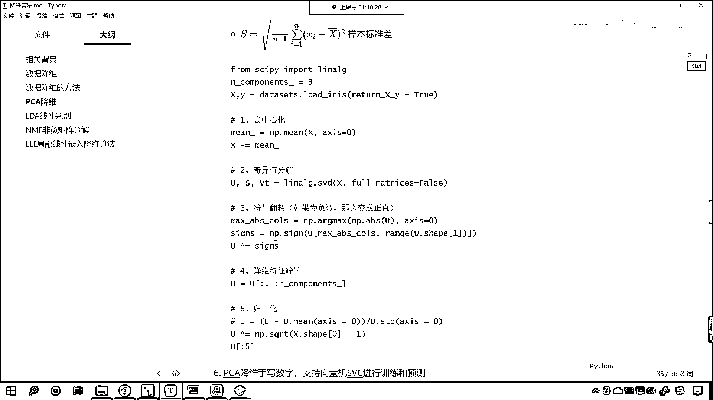

# 7天爆肝整理！AI量化交易-机器学习全套教程，从入门到项目实战保姆级教程！（数据挖掘分析／大数据／可视化／投资／金融／股票／算法） - P164：3-线性代数之SVD奇异值分解 - Python校长 - BV1KL411z7WA

接下來呢 我們繼續往下看，咱們呢 再來一個四級標題，你看 上面是什麼 是特征值和特征向量，接下來呢 我們再介紹一下SVD，這個叫做奇異值分解，那這個奇異值分解呢 它呢 也是矩陣。

也是呢 一種這個因子分解運算，它呢 把這個矩陣分解成三個，你現在能夠看到 你看這個叫左奇異右奇異 是不是，U Sigma和V 左奇異右奇異，中間的這個Sigma為奇異值，你現在有沒有發現。

我們SVD奇異值分解，其實和咱們上面的特征值特征向量分解，是不是結構是類似的呀，你看到了吧 結構呢 是類似的，為什麼這樣說呢，我們上面其實進行特征值特征向量分解，你看這個地方是不是有個P。

這個地方是不是有P的逆矩陣呀，那你想 它和咱們下面奇異值分解，是不是也是對應的呀，這個U對應著咱們上面的P，這個VT對應著上面咱們的P的逆矩陣，我們中間這個Sigma 咱們給它換一個顏色。

是不是對應著咱們上面特征值所對應的斜對角矩陣呀，對不對 你看 公式是不是完全一樣，只不過我們進行特征 咱們在進行奇異值分解的時候，你能夠發現 你看 這個地方是約等於，看到了吧 這個地方是約等於。

那為什麼要約等於呢，特征值特征向量 它是比較圓滿的，在這兒呢 我們進行一個說明，咱們的特征值特征向量 它是有解 它是比較圓滿的，我們方程最好有解 是不是，那這個時候一解就解出來了。

它比較圓滿 是吧 皆大歡喜，那我們當遇到奇異值的時候，它其實是無解的，你知道有一些方程是不是就是無解呀，這個是無解的 它是不圓滿，因為不可能所有的方程都能夠進行特征值特征向量分解。

並不是所有的方程都能夠進行特征值特征向量分解，大家要注意啊，那我來為各位演示一下，來 回到咱們代碼當中，好 現在呢 咱們重新生成一個X，我們讓它是np。random，咱們來一個randint。

我們從0到10，然後呢 我們給一個size，咱們呢 給它這個三行五列 好不好，這個時候你看我們的X，大家看它是不是就是三行五列的一個數據呀，有了這個數據 此時呢，我們進行一個特征值特征向量分解 好不好。

那我們將X放進去，這個時候你看我一執行，你看 我們在進行特征值特征向量操作的時候，你看 能解嗎，此時是不是就不能解了，看到了吧 無解 是不是啊，為什麼呀 大家思考一下咱們的這個數據。

你能夠發現我們這個數據，它是幾行的，一行 兩行 是不是相當於是三行呀，你看一下它是幾列，它是不是有五列呀 對不對，那我們可以認為它呢是三行五列，那這個三行五列，它表示什麼呢，它表示三個方程 五個未知數。

你想這個方程是不是沒有唯一解呀，對不對 方程組的數量不夠，所以說 咱們在使用特征值的時候，這個時候我們在使用特征值去分解的時候，這個時候呢它就行不通了，你看到了吧，我們剛才一執行大家也看到了。

直接就報錯了 是不是啊，它就行不通了，所以說才有奇異值分解，你看 你知道在生物學上，生物學家最討厭的是什麼嗎，最討厭的就是基因突變，我們把基因突變是不是就叫做變異呀，你看為啥叫變異呢。

為什麼我們對一些非常特殊的東西，我們把它叫做異類呢，異類也就意味著不好，基因突變99%都是不好的，你知道嗎，你比如說你突變了 是吧，很多人一突變 是吧，就變成了癌症，很少有人突變之後 是吧。

變成了像博爾特那樣跑步特別快的，那是萬里挑一的，所以說在生物學上，我們是厭惡突變的 是吧，因為只要一突變往往都是不好的，那當然你不能碰概率 是不是啊，那你不能這個抬槓，說肯定有好的 是不是啊，好的很少。

只要是基因突變 是吧，所以說你看生物學家把這個叫什麼，叫做變異 是吧，變異呢往往就這個很害怕，在咱們數學上，數學家也討厭什麼呢，討厭這種方程，你看你三行五列有解嗎，你最偉大的數學家高斯。

也解不出這個方程吧 是不是啊，因為你三行五列三個方程五個未知數，這個是不是沒有唯一解啊，對不對，那這個時候呢，就有了咱們的奇異值分解，此時呢就有了奇異值分解，現在呢咱們就使用奇異值分解。

我們呢來操作一下啊，看一下這個奇異值分解，它呢到底是怎麼一回事啊，好那麼現在呢回到這個代碼這兒，咱們調用，看我們from，咱們導一個包我們from scipy，scipy咱們import。

把線性代數給它導進來，我們說這個scipy呢它更加高級，然後呢咱們就使用，linlang。svd小括號，咱們將數據x放進去，然後呢我們給它一個full matrix，我們讓它等於。

咱們讓它等於false，這個時候呢我們就會得到什麼呢，咱們就會得到一組解，現在你看是不是能夠得到一組解啊，看了吧，那得到的這組解相當於什麼呢，咱們得到的這一組解，大家看它就相當於這個u，sigma和v。

那我們就接受一下，在這兒呢就是u，豆號，sigma，然後v，然後display顯示一下，u，sigma和v，我們的sigma是什麼，你在這兒能夠看到，中間的這個sigma呢，就是我們的特徵值。

所以和咱們上面特徵值特徵向量分解，進行對比，我們就能夠發現，你看，它是不是類似的呀，對不對，它是類似的，只不過咱們，其一值分解，我們把這個叫做左其一值，然後呢，右邊這個，右邊這個，v呢。

我們就叫做右其一值，中間這個，中間這個呢，是咱們的這個，其一值，其實這個其一值呢，就是咱們的，這個特徵值，好那麼，你看它有一個約等於的關系，是吧，來咱們乘一乘，回到咱們的這個代碼當中。

咱們也進行一個矩陣的乘法，上面我們在進行矩陣乘法的時候，你看就是這一行，乘出來的結果，和原來這個b是一模一樣的，看到了吧，一模一樣，那在這兒呢，咱們也進行一個計算，那就是左其一點，dot。

讓左其一乘一下咱們的其一值，如果我們要將其一值直接放進去，這個時候你看，求解出來的值，這個時候就不對啊，為什麼呀，因為你中間這個是一個向量，而左邊這個是不是一個，這個矩陣呀。

那向量和矩陣其實也能夠進行乘法，但是呢，咱們得調用，把它轉換一下，np。eye，它是三行三立，所以我們給個3，這個時候你看，斜對角線上全是1，然後我們讓它乘以咱們的σ，這個時候你看一執行。

斜對角線上是20。479，看20。479，第二個是7。7913，看7。7913，得到這個結果之後呢，咱們就叫σ-eye，好，那麼σ-eye就有了，我們呢，讓咱們的u去乘以一下咱們的σ-eye。

這個時候一執行，你看乘完這之後呢，然後呢咱們再來一個dot，把咱們的v放進去執行，看把咱們的v放進去，這個時候呢，我們就會得到一個結果，咱們得到這個結果之後呢，看咱們得到這個結果之後。

和咱們上面這個數據，我們進行一個對比，看到了嗎，83327，是不是，看到了吧，你看只不過下面咱們用了什麼，是不是用了科學技術法來表示呀，看到了嗎，第一個是多少，是不是8，第二個是不是3。

這個是不是也是3，你e的0次幂是不是就表示3呀，約等於，為啥有約等於，你看這個地方有一個，-7。484，這是e的多少次幂，是不是-16次幂呀，看到了吧，這個是e的-16次幂，那e的-16次幂。

這個是不是就約等於0呀，而咱們上面，我們隨機創建的這個x，這個數是不是0，看到了吧，這個數是0，所以說，無論是特征值特征限量分解，還是咱們的奇異值分解，那我們是不是都可以根據它的求解出來的奇異值特征值。

是不是再把原數據再表示出來呀，對不對，看到了吧，它都是這樣的啊，現在各位小夥伴明確了吧，明白了吧，那我們看到咱們這個求解出來這個結果是吧，那還是相當精確的啊，因為我們上面所造的這個數字x，這個矩陣x。

我們給了一個randint，它呢是一個整數，如果要是小數的話，它就不是那麼特別的精確了啊，最起碼你比如說零這個地方，看到了吧，它就稍微有一點點差異，看到了吧，你看你這個是-7。484e的-16次幂。

是不是啊，好那麼到這裡，各位小夥伴應該對我們的奇異值分解，有概念上的一個認知了，是吧，到現在你就明白這個奇異值分解是怎麼回事了吧，這PCA不是有兩種實現方式嗎，我們上一節課，講到了這個奇異值分解是吧。

直接用，那麼這個當中的這個第三步符號翻轉，你要好好研究，今天我們所留的一個作業，當中呢就涉及到了符號翻轉，好那麼到這裡呢。

我們就介紹了一下咱們的奇異值分解。

