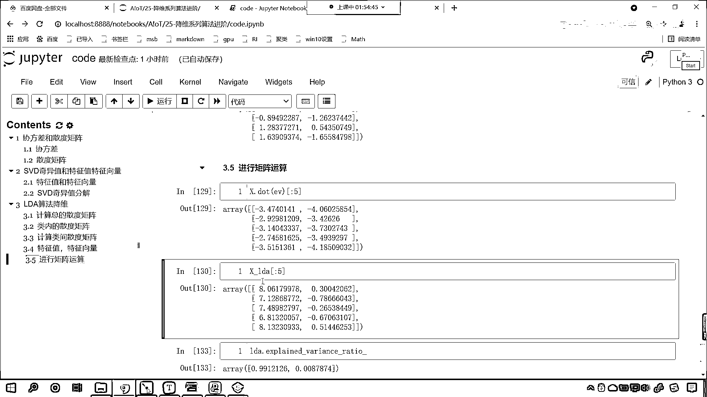

# 7天爆肝整理！AI量化交易-机器学习全套教程，从入门到项目实战保姆级教程！（数据挖掘分析／大数据／可视化／投资／金融／股票／算法） - P166：5-LDA算法流程 - Python校长 - BV1KL411z7WA

接下来我们在代码当中进行操作一下，那么LDA算法的实现呢，我们要计算数据总的散度矩阵，计算数据类内的散度矩阵，计算类间的散度矩阵，找到特征值特征向量，筛选特征向量，然后进行矩阵运算。

返回咱们的一个输出结果，那咱们现在呢，我们回到代码当中，咱们使用LDA先进行特征的降维好不好，来回到咱们的代码当中，咱们在这呢来一个三级标题，这个呢就叫做LDA算法的降维，在这大家要注意几点。

我们的LDA呢，它是不是有监督的一种降维算法呀，对吧，那我们就从线性判别当中，我们叫做Discriminant Analysis，从这个当中呢。

咱们就把Linear Discriminant Analysis，我们给它导进来，然后from sklearn咱们import data sets，然后呢，我们import numpy as np。

然后呢，我们from scipy，我们从这个当中，咱们import线性代数的这个模块，执行一下代码，首先呢，咱们加载一下数据，那就是原维花数据，这个里边既有X又有Y，return咱们给一个1。

1呢就表示true，X和Y咱们接收一下，这个时候呢，咱们Display一下，X点我们查看它的前五个冒号，这个时候冒号来一个5，然后呢，把Y也输出一下，现在你看数据是不是就得到了。

你看Y当中是不是确实有类别，000000，1111，2222，是不是，这不就像咱们刚才在课节当中介绍的，你看，减号是一类，加号是一类，是不是，那咱们就首先声明一下这个LDA吧。

LDA呢就等于Linear Discriminant，咱们呢就声明一下这个算法，Shift Tab，大家看啊，你看，在这个地方，咱们的Solver，我们用的是什么，是不是就用的SVD，看到了吧。

这个Solver咱们用的就是这个SVD，那我们看一下啊，咱们这个Solver，你看可以是什么，咱们是不是可以是SVD，咱们是不是可以是Agent，这个都是可以的啊，你看你这个Solver可以调。

这个Agent是不是就是特征值特征向量呀，对不对，你看这个Agent就是咱们的特征值特征向量，那么在这呢，我们可以给它调一下啊，来一个单引号，Solver，Solver就等于Agent，EIgen。

那表示呢，我们在进行音式分解的时候，咱们呢使用特征值，特征向量来进行，来进行矩阵分解，好，那么，执行一下，这个LDA就有了，然后呢，咱们就调用LDA，我们点儿，大家看这个里边有一个什么方法。

是不是叫做fit transform呀，对不对，好，那么我们先调用fit啊，大家看咱们fit里边有什么，是不是就有X和Y呀，对不对，你看就有X和Y，那大家还记得咱PCA降维吗。

PCA降维是不是只传X就行了，这个地方呢，必须得传X和Y，那我们将X和Y放进去，那XY放进去之后，然后呢，咱们LDA点儿调用它的transform方法，将X放进去，得到的这个结果接收一下，叫XLDA。

我们展示输出一下咱们的前五个数据，X下滑线，LDA，中国号，贸号，咱们查看它的前五个数据，现在你能够发现，我们是不是就得到两列比较重要的数据呀，我们在声明线性判别的时候，哎，大家看啊。

声明这个线性判别的时候，咱们sour呢，我们是可以进行这个筛选的，那这个里边有一个参数，是不是叫的Ncomponents呀，这个Ncomponents，咱们也可以进行选择，那PCA呢，上面呢。

咱们再将PCA导进来，from sklearn decomposition，import PCA，大家看啊，把PCA导进来，我们在这呢，使用一下PCA，声明PCA就等于PCA。

里边有一个参数叫Ncomponents，那我们给他一个3，那咱们就PCA。fit，X放进去，然后PCA。transform，将X放进去，然后中国号贸号，咱们查看他的前五个，你看，PCA是不是就降维了。

如果这个Ncomponents，我们给个2，你看是不是就是两个，那咱们线性判别呢，你看是不是也是一个意思呀，Ncomponents，如果我要给个2呢，你看他就是2，如果我要给个3呢，你看我一执行。

大家看啊，咱们Ncomponents呢，有一个要求，是不是，Count be larger than mean，看到了吗，在mean nfeature，nclass-1，从这两个数当中。

是不是他得选一个呀，看到了吗，nfeature，我们原文花这个特征数据呢，他是4个，大家注意啊，你看nfeature，他是4，咱们的nclass-1，我们分几类呀，咱们分三类，那如果要分三类的话。

3-1是不是就是2啊，那现在你就能够看到，他对于这个是有要求的，也就是说呢，我们从4和2当中，选那个小选那个什么呢，选那个小的me，也就是说你ncomponents count be larger。

是不是就是不能比4和2当中，这个小的大呀，看到了吗，count be larger，我们给了个3，咱们的3，咱们的3是不是大于2呀，可以吗，count不可以，所以说你看这个时候，我给3是不是就不行了。

能不能给1呢，没问题，你看给1的话是不是可以，能不能给2呢，也可以，看到了吧，一直行，好，那么你看PCA，你看你给几是不是都无所谓呀，我们给3是不是无所谓，给2是不是无所谓，对吧。

因为计算方式是不一样的，上一讲呢，我们介绍了PCA计算是怎么回事，那这一讲呢，咱们就看一下，这LDA，他到底是怎么把6。017，5。07计算出来的，那咱们就算一算，在这呢，我们就进行代码具体的演示，好。

那么在这呢，咱们首先呢，我们去计算一下总的散度矩阵，在这，大家看啊，咱们来一个四级标题，叫一杠，是吧，咱们首先呢去计算，咱们总的，散度矩阵，好，那么我们，刚才呢介绍了这个散度矩阵。

其实和咱们的斜方差是不是有关系，对不对，好，那其实呢，我们就可以用斜方差来表示咱们总的散度矩阵，那声明一下就叫ST就等于NP。COV，来一个小括号，我们将X咱们呢就将X放进去，然后呢给他一个BIAS。

这个时候呢，这个ROW，VAR咱们呢让他等于FALSE，然后呢BIAS我们让他等于1，那等于1呢就表示咱们在进行计算的时候，他呢其实是有一个偏差的，这个偏差呢我们给他加了1，那为什么这个地方加1呢。

其实你加1和不加1是吧，都能计算，那我们一会呢，再来详细解释这个BIAS，这个时候这个总的散度矩阵，咱们呢就计算出来了，这个就是计算总的散度矩阵，然后呢我们再计算类内的散度矩阵，接下来呢计算类内部。

类内的散度矩阵，那你看我们在进行训练的时候，我们为什么FIT的时候给了个X给了个Y，不给Y行不行你看我一直行，是不是就报错了，上面这个PCA只给X是不是就可以，下面这个不给Y是不是不行，是吧必须得给Y。

因为这个PCA因为这个LDA它是什么，它呢是有监督的降维算法，对不对你看必须得给Y，好那么接下来呢我们就计算类内的散度矩阵，那么类内的散度矩阵呢，咱们先声明一个叫SW。

看这个为什么叫做上面为什么声明ST呢，叫做SCATER，叫SCATER TOTAL，那我们这个SW呢，它呢其实也是一个缩写SCATER，叫SCATER WITHIN，WITHIN这个英语单词就表示内。

那我们首先呢给它声明一个矩阵，我们就让它让它等于NP。 -FULL，这个里边给它一个SHAP，你看上面咱们所求得的总的散度矩阵，它是不是四行四列呀，对不对你看为啥它是四行四列呀。

因为我们的原数据是不是四个特征，是不是四个属性呀，所以说求解出来就是四行四列，那这个地方呢也给它一个四和四，然后呢这个FU VALUE给它个零，这个时候你能够看到这个SW它的结果其实就全是零。

也就是说我还没算呢对不对，接下来咱们就开始具体的计算，咱们呢就来一个FULL循环，FULL_IN_RANGE我给个3，为什么给个3呢，你看咱们上面的Y它是分几类的，是不是012它分三类呀，对不对。

好所以咱们FULL_IN_RANGE，我们呢是RANGE_3，那得到的结果其实呢就是012，然后呢我们得到类内的点，那就是X，咱们根据Y等等I来进行筛选，你看Y等等I是不是筛选条件。

根据这个条件是不是从X当中取数据呀，那取出来这个数据是不是就是这个类内的点呀，我们起个名就叫做XW，在这呢咱们对它进行一个说明，那这就是一类点，这就是一类点，有了这一类点，这一类点呢也叫做类内。

有了这一类点，咱们接下来呢我们进行一个计算，那继续去计算它的散度矩阵，散度矩阵我们又可以使用咱们的CUV协方差，这个时候呢咱们就将XW放进去，ROW_VAR我们给它设置一个FALSE。

然后呢这个BIAS偏差咱们也给它个1，这个时候你看是不是就计算出来了，那么计算出来之后这个就是类内的散度矩阵，那你看上面咱们是不是用SW来接收了一下呀，对吧SW一开始全是零对不对。

那我们给它进行一个加法，那就是SW我们让它加等，把每一类的类内的散度矩阵，都给它记录到咱们的SW当中，这个时候你看我一执行，我们看一下啊，咱们这个时候报了一个错是吧，咱们的这个数据是不是形状不太对呀。

ROW_VAR=FALSE BIAS=1，我看一下啊，看一下咱们是哪个地方给报错了，4和4，FU_VALUE=0，SW加等，NP。CUV是吧，我们不能使用，这个时候你看报了个什么错。

是不是报了咱们数据类型不太一样呀，那这个没关系啊，来咱们在创建散度矩阵的时候，类内散度矩阵的时候，咱们给它声明一下数据类型，那我们这个DATA_TYPE呢，咱们就让它等于NP。FLOAT。

让它是float64位，现在再来执行，现在各位小伙伴你就能够看到，此时咱们是不是就计算出来了，类内的散度矩阵，好那么有了类内的散度矩阵，咱们接下来呢计算类间的散度矩阵，你看在这呢，我们再多说一嘴啊。

为什么我们要计算类间的呢，你看科技的当中说了，我们希望怎么样，类内的尽可能近，类间的是不是尽可能远呀，所以这个时候咱们要计算什么，咱们要计算，类间的，散度矩阵，好那么我们就计算一下吧。

那这个就叫SB就等于ST，我们让它减去SW，那这个时候呢我们把SB输出一下啊，好那你看这个SB它是哪个英语单词的缩写呢，SCANTER，BETWEEN是吧，BET就是之间，执行一下这个代码。

你看计算出来了，好那么计算出来之后呢，接下来我们再来一个四级标题，咱们呢就去计算特征值和特征向量，此时呢咱们就计算特征值和特征向量，那我们就使用咱们从SciP当中导包导进来的这个线性代数模块。

叫LinALG，调用它里边的方法叫AGENTH，这个AGENTH呢会为我们进行排序，那咱们就将类间的散度矩阵放进去，然后类内的散度矩阵放进去，那这个时候呢我们就会得到，大家看就会得到一个AGENT。

AGENT是特征值，得到一个EV，EV是特征向量，在这呢给大家DISPLAY一下啊，咱们来一个DISPLAY，咱们将AGENT放进去，EV放进去，这个时候你看我一执行。

我们是不是就会得到相应的这个数据呀，是不是有了这个相应的数据，咱们接下来呢，我们对它进行一个，咱们对它进行一个操作，你看咱们这个数据是不是从小到大呀，看到了负的0。66，负的0。66，然后负的0。5。

最后这个是不是10。063呀，看它是从小到大，如果我们要把这个H去掉呢，你看我一执行，咱们如果要把H去掉，大家看这个是不是，看10。063，负的0。57，你看它是不是就是一个颠倒呀，对吧。

所以说你用哪个方法都行啊，我们如果说咱们要用H让它从小到大，那么它就没有这个0G了，那这个0G表示什么，它表示虚数，什么是虚数呀，那虚数和实数是相对的，那我们2的平方等于4，是吧，那我们4一开平方。

是不是就是正负2呀，那如果说我们给一个负4，那如果想要把负4进行开平方，得到的这个结果是多少，是不是没有一个实数和它对应呀，这个时候就用虚数来表示，好那么咱们用这个EJH。

这个时候呢从小到大进行了一个排序，然后呢我们对于EV咱们进行一个操作啊，咱们对它进行一个排序，好那么我们对特征向量进行排序，那就是EV咱们呢就来一个中国号，冒号冒号呢就表示它所有的行。

接下来呢我们对它的力来进行排序，那这个时候就是NP点，咱们就调用ARG，SORT，我们就调用ARG SORT，咱们呢就对于咱们的这个，Agent特征值来进行一个这个操作，你看这个时候你看我一执行。

大家看咱们得到的结果是不是还是，还是它呀，对吧，不变是吧，所以说这个排序呢没有必要了啊，因为我们上面得到的数据是从小到大，呃现在呢咱们，冒号冒号我们来一个-1，哎这个时候你看，此时咱们你看得到的结果。

大家看它是大家看它是什么样的，你看此时咱们得到的结果，原来第一行是不是这个0。3，现在咱们的，现在咱们的第一行是不是变成-2。24了，我们是不是把它的力进行了一个颠倒呀，对吧。

这个时候呢咱们就对于咱们就对于行进行了一个颠倒，对于行进行颠倒之后呢，然后中关号，冒号，冒号，咱们切片到2，当此时咱们呢就切片到2，那么我切片到2之后，表示是不是切取它的前两列呀，对不对。

你看此时是不是就表示切它的前两列，看这个时候没问题吧，那我为什么要切它的前两列呢，因为上面咱们使用，上面咱们使用LDA进行计算的时候，你看我们返回的结果是不是只有两列呀，对不对，你看它也只有两列。

我们为了告诉各位小伙伴这个6。0171是怎么算的，7。0325是怎么算的，所以呢，我们在进行切片的时候，咱们呢也切它的也切它的前两列，那么接收一下，咱们呢就用EV来表示输出一下咱们的EV。

这个数据就有了，有了这个数据之后呢，咱们再来一个四级标题，那么我们对于特征向量进行了筛选，上面呢警号注视一下，这个呢就是筛选特征向量，有了特征向量，咱们接下来呢就可以进行矩阵运算了，那我们就用原数据X。

咱们呢进行一个乘法，那就是X。dot，咱们将EV放进去，就是筛选之后的特征向量，冒号查看它的前五个，此时呢咱们就会得到一个结果，此时咱们就会得到一个结果，咱们得到的这个结果呢，各位小伙伴就能够看到。

我们得到的这个结果是不是这个不太对呀，大家看啊得到这个结果不太对呀，和咱们原来的数据叫X下方线LDA，我们查看它的前五个啊，看这个前五个是不是6。017呀，是不是7。032呀。

那我们按说计算出来的结果也应该是6。017，那但是现在咱们求解出来的结果不太对是吧，那一定是咱们在进行特征向量筛选的时候，我们呢出了一点问题，那这个时候呢咱们就排查一下啊，来各位小伙伴。

咱们呢一起进行一个排查，咱们呢对它进行一个操作和转变啊，那么我们筛选特征向量的时候，我们是不是咱们将它的这个行进行了一个操作呀，大家看啊这个时候呢，我们对它进行一个这个转变，好。

那么大家看后两个是不是最大的，看到了吧，后两个是最大的，所以说呢，我们就筛选哪里呀，咱们就筛选后两个特征向量，特征值所对应的特征向量，那么后两个特征值所对应的特征向量，是不是就是它呢。

那这个时候咱们切片，我们是不是就不能从2不能切到2了，咱们从2是不是开始切，对不对，是不是啊，两个，我们先来操作啊，上面333-4特征值特征向量，我们再次执行执行之后呢，咱们进行筛选筛选之后呢。

我们进行运算，大家看啊，咱们运算得到的结果依然是不太对，是不是依然不太对，那是因为，那是因为咱们这个求解得到的这个EV呢，我们的特征向量呢，需要进行一个转化，那我们根据它的特征值的这个顺序，咱们呢。

对它进行一个转换啊，咱们来一个来一个中国号，这个时候呢，我们先看转化的这个效果，那冒号这个时候呢，就表示好像不动，我们对它所有的力来进行一个操作，咱们调用Argsot这个函数，咱们将咱们的Agen。

这个就是咱们的特征值进行一个排序，排完序之后呢，冒号冒号咱们来一个-1，那我们一排序，其实是从小到大，排序是从小到大，来一个-1的话，那么他就是从大到小，这个时候给各位看一下，大家现在就能够看到。

你看咱们的结果是不是就变成了-0。48，-0。01，你能够发现规律是什么样的，你看也就是说最后一列，现在是不是就变成第一列了，看到了最后一列就变成第一列了，倒数第二列是不是就变成咱们的第二列了。

因为我们进行了一个怎样的操作，在这个地方，咱们是不是进行了冒号冒号-1，冒号冒号-1是不是就进行颠倒，对不对，然后呢，咱们再次进行特征向量的筛选，冒号，还是不动，冒号，切到2，这个时候你看我一执行。

其实是不是就是前两列，对吧，那我们接收一下，咱们这个就叫EV，好，那么得到了EV之后，咱们紧接着就进行咱们的这个，进行矩阵运算，这个时候你看我一直行，大家看咱们得到的结果是不是依然不对，看到了吧。

得到的结果依然不对，那么此时我们就进行一个去中心化，此时我们进行一个去中心化的操作，是吧，因为我们没有对数据X是不是进行去中心化的操作，对不对，所以说这个时候咱们对数据X，我们也进行一个操作。

因为这个时候，大家看咱们进行的斜方叉操作，我们求的是ST，咱们的ROW大家看它是FALSE，这个时候我把它变成，我把它变成TRUE，变成TRUE之后，这个地方变成XT，是吧。

大家看得到的结果和原来是不是一样，因为大家对比一下，Ctrl+C，我们在下面插入一行，Ctrl+V，如果要是没有T，咱们把它变成FALSE，执行0。68-0。4，你看上面是TRUE，TRUE的话。

我们这个地方，如果要是TRUE的话，咱们这个地方是不是就变成了，X。T，如果要是FALSE，咱们是不是直接传到X，得到的散度矩阵是不是一模一样，对不对，得到的散度矩阵，它是一模一样的。

然后我们进行类内的散度矩阵，咱们现在看一下，咱们这个数据，和LDA求解得到的结果，稍微有点不一样是吧，咱们再来执行一下，然后计算咱们类间的散度矩阵，把三都我们叫散度矩阵，我们执行一下。

这个是求解出来的一个结果，此时我们就进行特征值，和特征向量的计算，咱们将SB放进去，SW放进去，进行相应的一个求解，求解完之后，我们再进行特征值，特征向量的一个筛选，执行一下，然后再进行矩阵的运算，好。

那么进行矩阵的运算，得到的结果是-3。47，是吧，这个是4。06，和咱们计算LDA得到的结果，确实不一样，是不是，没关系，LDA点，咱们获取它的，咱们获取它的covariance，大家看这个得到的结果。

是不是0。259708，和咱们上面计算出来的，大家看是不是不太一样，我们对比一下，这个是不一样的，然后我们再从LDA算法当中，咱们再得到它的一些，再得到它的一些参数，咱们对比一下，transform。

看一下它的xplane，大家看，我们，LDA xplane variance ratio，是不是0。99，这个是不是0。0087，那这个xplane variance ratio。

而我们计算出来的是多少，我们计算出来的是不是，10。063，-0。57，这就是我们和它的差距，现在我们将数据调整一下，咱们在计算总的散度矩阵之前，插入一行，我们首先进行一个去中心化，在这。

咱们来一个去中心化，好，那么，x就等咱们去中心化，x-x。me，给它一个轴，我们让它等于0，那么去中心化之后，得到的数据咱们就叫b，你看去中心化之后，我们看一下这个b长什么样，一直行。

这个就是去中心化之后的数据，然后我们去计算它的散度矩阵，那么这个时候，咱们就不用原始数据x了，咱把b放进去，来这个时候你看我一直行，这个数据就有了，好，那么有了这个数据之后，咱们紧急着再继续往下算。

我们在计算咱们，类内的散度矩阵，类内的散度矩阵，咱们这个地方也用b，执行一下，这个时候大家看，我们都换成了，咱们都换成了b，然后接下来我们进行一个减法，大家我看一下，st和sw，咱们看一下咱们。

没有对应上，couldn't，broadcast的150，我们看一下咱们的st是多少，这个时候，covx，我们给了b之后，咱们这个b依然是150和4，肯定是咱们这个地方，是吧，这个参数给错了。

如果要是true的话，是不是就表示计算，这个b你想在这块，是不是应该给一个转制，执行一下，这个时候大家看，你看它是不是就变换过来了，好，那么变换过来之后，我们再进行，类间的散度矩阵，这个时候就没问题了。

然后咱们计算特征值和特征向量，计算特征值特征向量，这个时候依然没变，是吧，然后进行特征值特征向量的筛选，然后咱们再进行计算，我们把b，放进去执行一下，大家看，这个时候，咱们依然没有计算出来一个。

对应的结果，我们再回到咱们的课节当中，咱们看一下，LDA算法的实现过程，它首先是计算总的散度矩阵，然后计算，数据，数据类内的散度矩阵，然后计算类间的散度矩阵，最后是特征值特征向量的计算，最后是。

筛选咱们的特征向量，并进行矩阵运算，返回咱们的数据，对不对，好，那么我们，肯定是某一个地方，咱们在进行操作的时候，是吧，肯定是不太对，来咱们再回到代码当中，我们再进行一个调整，咱往上走。

咱们找到咱们LDA降维这个地方，你看我们在这是不是给了一个solver，现在我们将solver先去掉，我们使用默认的，咱们算一下，看咱们得到的结果是多少，这个时候如果说我们使用默认的。

咱们得到的结果是不是8。06，对不对，然后我们去中心化，是吧，去中心化之后，咱们去计算它的，总的散度矩阵，我们无论是上边这种方法计算，还是下边这种方法计算，结果都是一样的，大家看0。68，-0。04。

1。26是吧，然后咱们再计算，类内的散度矩阵，这个地方我们都已经换成B了，执行一下，好，那么这个结果也出来了，那么有了这个结果之后，咱们继续往下看，然后再计算类间的，那就是总的减去类内的，执行一下。

这个是咱们得到的结果，最后我们计算特征值和特征向量，特征的特征向量，我们发现，这个没有变化，是不是，我们我看一下，是不是这个顺序，给调错了，SW，然后咱们来一个SB，这个时候还不行，是吧。

Ctrl+Z一下，回退一下，执行一下，然后我们再去，根据咱们的特征向量，咱们进行一个筛选，筛选出来之后，这个就是咱们的特征向量，有了特征向量之后，然后我们去进行计算，不太对，是不是。

我们把这个B给它换成X，执行一下，原始数据，大家看它是8点多，是吧，好，那么咱们这个，就稍微有一个疑问，大家看我们这就稍微有一个疑问，咱们看一下咱们LDA是吧，这个线性判别，咱们去获得它的。

看看咱们去获得LDA的，ExpLane，我按retio，它是0。99，第二个是0。087，在这咱们解释一下，这两个参数，其实这两个参数就对应着，咱们所计算出来的特征值，我们发现咱们所计算出来特征值。

和它所计算出来特征值，是不是有一定的偏差，我们整体的计算顺序，没有变，肯定是这个顺序，但是现在我发现代码，在计算的过程当中，某一个地方是吧，出现了小小的问题，咱们先遗留一下，整个过程的顺序是这样的。

我们会在作业当中，会把这个疑问给大家解决掉，好，那么我们LDA算法的降维，咱们就先讲到这，那么它的整个顺序，我们总结一下，就是计算总的散度矩阵，计算类内的散度矩阵，计算类间的散度矩阵。

然后根据上面计算的散度矩阵，我们求特征值特征向量，求完特征值特征向量之后，接下来就进行矩阵运算，我们就可以得到答案了，但是我们计算出来的答案，是不是和使用LDA得到的答案，是不是稍微有点不一样，对吧。

这个疑问，咱们会在作业当中。

给各位揭示一下，拜拜！。