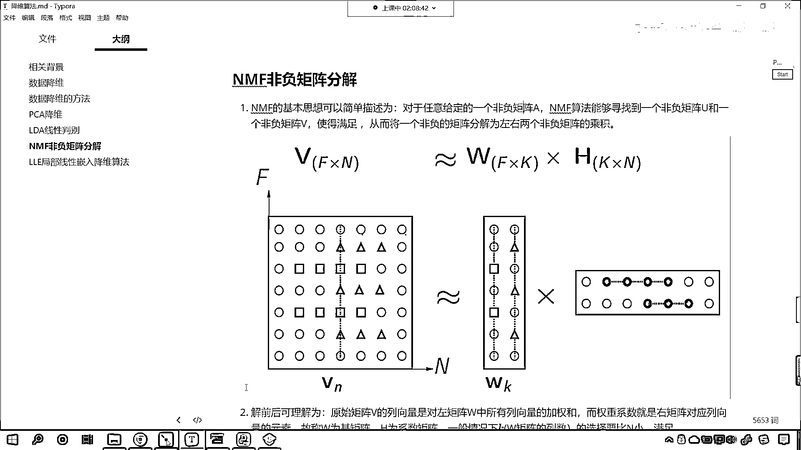

# 7天爆肝整理！AI量化交易-机器学习全套教程，从入门到项目实战保姆级教程！（数据挖掘分析／大数据／可视化／投资／金融／股票／算法） - P167：6-NMF非负矩阵分解 - Python校长 - BV1KL411z7WA

接下來我們繼續再往下看，再介紹一個算法，接下來的算法就是NMF非負矩陣分解，NMF三個英語單詞，N是negative，M是matrix，F是分解，非負矩陣分解的基本思想也很簡單。

對於任意給定的非負矩陣A，這個裡邊強調了數據必須是非負的，為什麼他會強調非負呢？因為我們實際的工作當中，我們所收集的數據，一般都是正的，一般都是正數，比如說身高體重，這些都是正的量，很多數據都是正的。

所以才會冒出這樣一個算法，非負矩陣，NMF算法其實就是找到一個非負矩陣U和一個非負矩陣V，使咱們這個公式滿足，也就是V就約等於W*H，那麼你看，PCA是不是矩陣乘法，LDA是不是也是矩陣乘法。

NMF也是，只不過他這裡強調了一個非負，也就是我們分解完之後，我們用W和H來表示V，W和H是非負的，你這個V也得是非負的，那麼現在你就能夠看，我們知道咱們的數據是不是矩陣乘法，這個時候你看。

你看咱們這個公式，第一行乘以這一例，為什麼咱們第一行當中，為什麼這個V當中第一行全是000，如果是一個圓圈就表示它是空數據，為什麼它全是0呢，因為你看，你這兩個數據是不是全是圈啊，你只要全是圈。

你無論和這個乘也好，還是這個乘也好，它是不是都是圈，而咱們第二個數據，你就能夠發現它是一個0，是不是一個紅色的三角啊，現在你能夠發現，咱們的第二行是不是這個位置，這個位置，它是不是有三個圈啊，看到了吧。

有三個三角，為什麼呀，為什麼它有三個三角呢，我告訴你啊，現在咱們換一個別的字體，換一個別的字體，你看，就是這一行在進行矩陣乘法的時候，你看，它和這個地方進行矩陣乘法，和這個地方進行矩陣乘法。

然後再和這個位置進行矩陣乘法，你看，是行乘以列，對不對，行在乘以列的時候，因為你第一個是圓圈，是不是啊，所以它就怎麼樣，上面這個是不是就不做數啊，因為0是不是乘以任何數都得0啊。

我們這個地方是不是有個三角，你看，這個三角和咱們下面這三行進行相乘的時候，圓圈就代表有數，有數的話你就可以把它當成1，所以說你看，這個地方是不是就是三個三角，其他的行也都一樣啊，其他的行也都一樣。

也都是這麼個規律，所以說呢，咱們明白了這個圖，是吧，你就知道非負矩陣分解是怎麼一回事了，其實就是找到這個特征，找到這個數據，好，那麼咱們接下來呢，我們就看一下咱們非負矩陣，咱們具體的一個案例啊，來。

現在呢咱們就回到咱們的代碼當中，在這呢，咱們來一個三級標題，這個就是nmf，這個呢就叫做非負矩陣，所以它必須強調咱們的數據呢，必須得是非負的，我們導一下包，咱們import numpy as np。

然後呢from sklearn，咱們import datasets from sklearn，現在呢，我們將非負矩陣咱們給它導進來，那麼非負矩陣來自於哪個包呢，decomposition。

decomposition這個英語單詞是不是有降維的意思呀，從這個當中呢，咱們導入nmf，那麼我們哪個數據是非負的呀，這個時候呢咱們就datasets，我們漏的一個原文花，給它一個return x，y。

我們給它個2，x和y，你看這個return x，y一般情況下我們給true是不是，這個時候你給2也好，給3也好，你給-1，-2都能夠返回具體的數據，因為在咱們的數字當中是吧，它只要不是0。

那麼它都表示true，Display一下咱們的x和y，x咱們查看它的前5條數據，這個時候你看數據是不是就得到了，因為我們原文花這個數據呢，它呢是有物理意義的對不對，那這個是不是表示咱們花瓣的長度。

這個是不是表示花瓣的寬度，這個是不是表示花萼的長度，這個是不是表示花萼的寬度，你看這些都有物理含義，那只要它有物理含義，一般情況下它呢都是正數，那有同學就說咱們的溫度不是有-10度-20度嗎。

零下20度對不對呀，那是為了我們人去感受這個溫度的時候方便一些，其實呢對於物理學家而言，你看是不是有絕對零度呀，是不是273。15呀，對吧零下273。15，啥是絕對零度呀。

絕對零度就是溫度最低的那個地方，從溫度最低的那個地方往上是不是都是正數呀，如果說我們現在要表示溫度的話，咱們就表示現在的溫度是這個293度，那你想大家用起來是不是不太方便呀，對於我們人而言。

所以說呢我們才會用36度，才會用零下5度來表示溫度，所以說呢物理含義一般都是正數，那麼你看我們使用PCA降為，咱們使用PCA降為你能夠發現，咱們得到的數據看是不是就有負數了，你觀察一下-2。68-2。

71-2。88是不是就有負數了，那你看如果有負數的話，我們怎麼用物理含義跟它進行對應呢，是不是就很難對應了，雖然這個PCA很有用，但是咱們降為之後得到了負數，這個時候是不是就不好解釋呀。

所以說非負矩陣就登場了，它對於有物理含義的這些數據進行分解，分解完之後呢它依然是正數，這個時候呢咱們就好解釋一些，nmf就等於nmf，在這兒呢咱們就給它一個ncomponents，咱們給它一個2。

也就是說我們告訴它最後呢保留兩位小數，那nmf呢它呢也是一次一次放循環，去尋找咱們這兩個矩陣，你看到了吧，這兒是不是也是約等於呀，你比如說你給了我一個矩陣，我一定能夠找到這個矩陣w和矩陣h。

讓它倆進行矩陣乘法的時候，剛好等於咱們左邊這個矩陣v嗎，是不是不一定，我們希望它越接近越好是不是，那越接近越好，這個時候其實就有一個循環的這個次數了，那現在呢咱們給它1000次，這個都是可以調的。

然後呢nmf咱們呢就fit一下咱們的數據，將咱們的數據x放進去，你看我一執行，大家看現在是不是就有了呀，那現在我們發現，你看是不是有一個粉紅色的提示呀，那這個粉紅色提示是不是告訴我們。

這個參數init呀，說這個參數呢以後會怎麼樣，這個參數是不是以後會，你看future warning是吧，那這個參數呢它會，你看它will be changed from ns to nndsw。

那我們現在給它指定一下，ctrl c，其實呢你不管它也沒事，咱們給一個init ctrl v，是不是，好那麼此時你看我在執行，它是不是就有沒有這個粉紅色的提示了。

然後呢nmf點咱們transform一下，這個時候呢咱們就將數據x放進去，transform之後呢，大家看transform之後，咱們就會得到一個w，看一下咱們w數據長什麼樣，查看它的前五個。

來各位小夥伴你就能夠看到，咱們的數據是不是就降為成功了，原來我們的數據是幾維的，咱們現在呢進行一個對比，這個display一下，x是原數據查看一下它的形狀，w呢是咱們的新數據，也查看一下它的形狀。

現在你來看，原始數據是不是100和4，現在的新數據是不是100和150和2，那這個就叫什麼，這個不就是咱們所說的降維嗎，對吧你看這個就是降維，降維我們有四個特徵，是不是就變成了兩個特徵呀。

那你看數據是不是就變少了，變少了咱們計算速度是不是就會快一些，對不對那下面你看我展示了前五個，那麼這些數據呢，大家看它依然是不是正的，看到了嗎你去找它沒有負數啊，它全部是正的。

這個時候呢和它的物理意義還能對應上，好那麼這個時候就是咱們得到了w，那根據咱們剛才在，根據咱們剛才這個圖形的說明，得到了w是不是一定有一個h呀，那我們現在獲取它的h啊，現在咱們獲取h。

好那麼h呢咱們就等於nmf，點components，你看一下咱們的h長什麼樣，看到了吧這就是咱們的h，好那麼有了咱們的h之後，那hw和咱們上面的x是什麼樣的關係呢，咱把它變成markdown。

來一個$$是吧，x->approx，這個就表示約等於誰呢，w->c。h，你看我執行一下，你看是不是就是w點成咱們的h呀，這個時候我們發現你看，w和h是不是都是斜體呀，來回到代碼當中啊。

咱們在這反斜概rm，這個就表示羅馬體，這個時候你看是不是就正了，好那麼這個有點小，咱們來一個genquote font size，我們給它一個6，讓它是6號字體，反斜蓋font，你看我一執行。

是不是就變得稍微大一點了，w和h是這樣的一個關係，是不是呢，w點咱們來一個dot，把h放進去，查看它的前5個執行，看5。093。5，x長什麼樣呢，x中括號前5個，你看我一執行，5。1 3。5 1。

4 0。2，大家現在看一下，是不是約等於，看到了嗎是不是約等於，你看5。09和這個5。1，是不是約等於，對吧3。5和咱們這個3。5，是不是約等於1。4018，和這個是不是約等於，對不對看到了嗎。

那這個後面這個0。2014，和這個0。2是不是約等於，所以說這個就是咱們的，非負矩陣分解，大家現在明白它是怎麼一回事了吧，它是通過咱們這個圖的形式，進行的一種數據降維，看到了嗎，進行的一種數據降維。

在這兒咱們就進行了一個演示，好那麼這個非負矩陣，主要強調它是非負，如果裡邊有負數，它馬上就報錯了，知道嗎馬上就報錯了。

