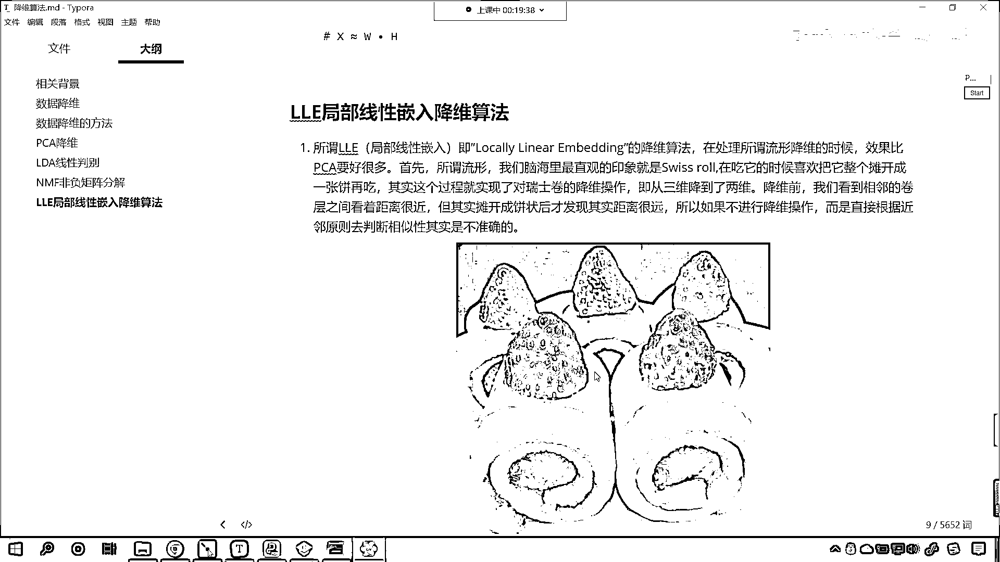
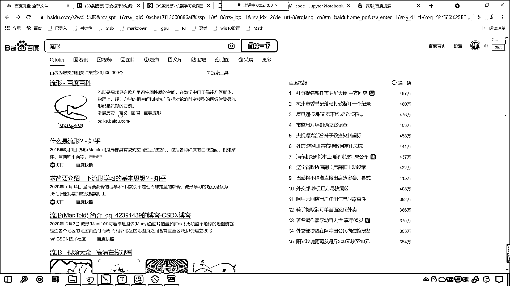
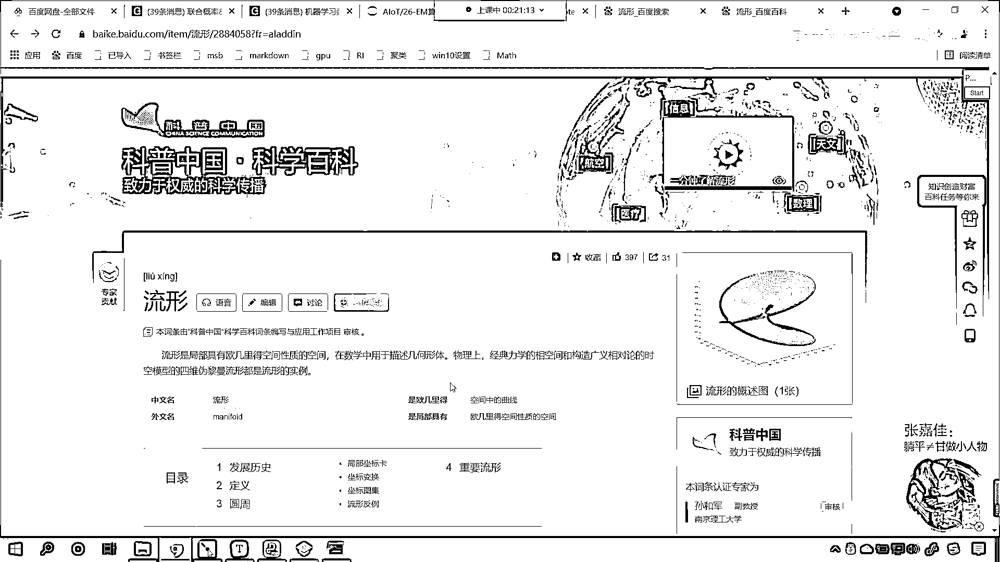
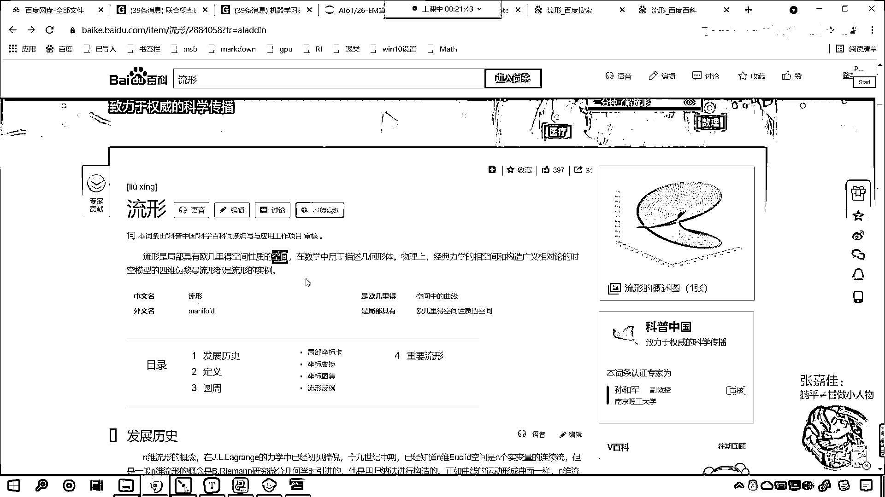
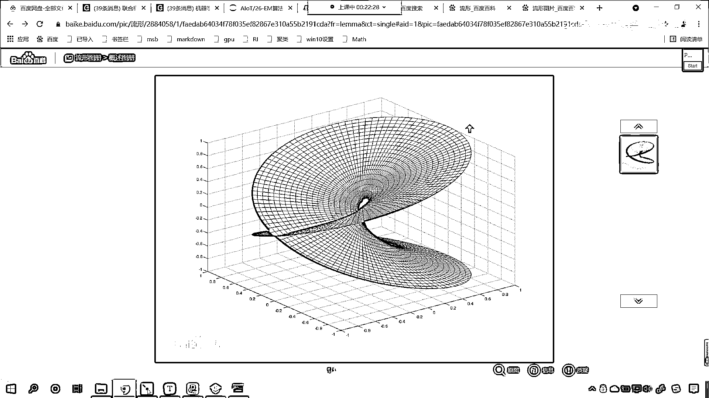
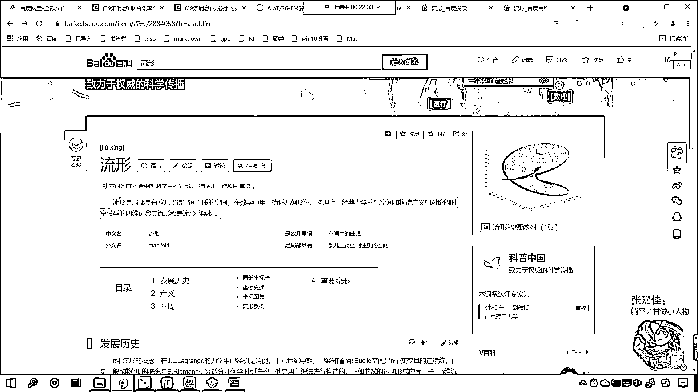
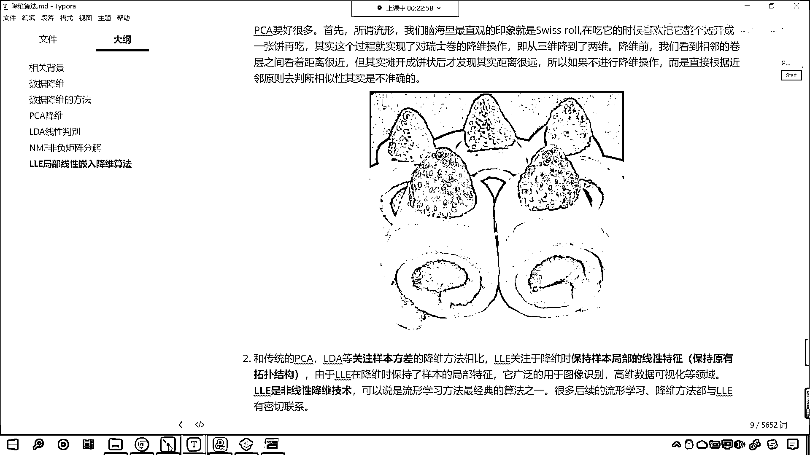
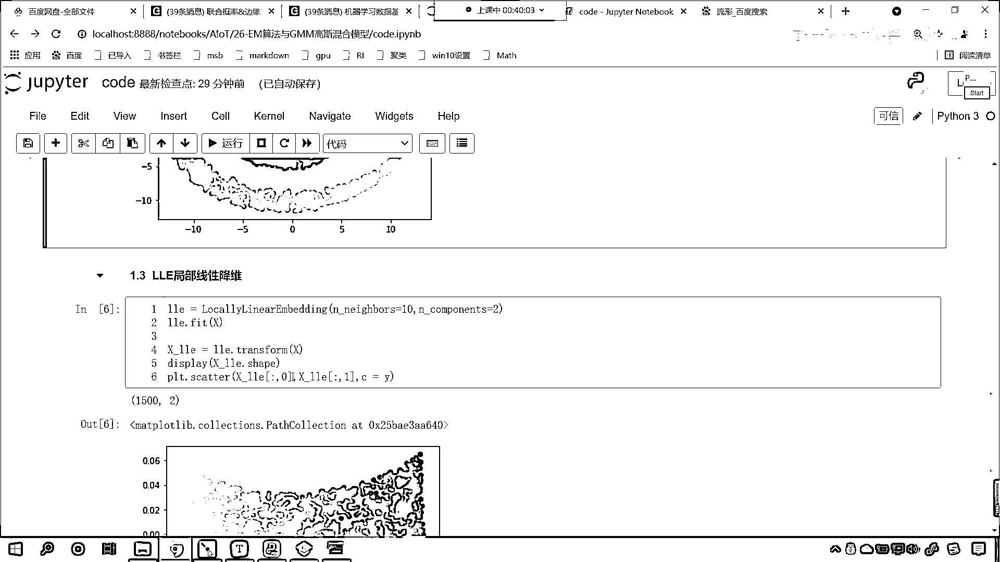

# 7天爆肝整理！AI量化交易-机器学习全套教程，从入门到项目实战保姆级教程！（数据挖掘分析／大数据／可视化／投资／金融／股票／算法） - P169：2-LLE算法使用代码举例 - Python校长 - BV1KL411z7WA

接下来咱们就回到代码当中。

咱们首先呢在这来一个三级标题，叫做LLE，局部，线性，嵌入，降维算法，那么首先呢我们导一下包，首先咱们导一下包，那这个时候呢咱们就from，sklearn。，叫做，man，我们从manifold当中。

咱们导一个包，这个时候咱们就import，locally linear embedding，那这个manifold，这个英语单词它的意思呢，大家看啊这个manifold，它呢就是流行的意思。

这个就是流行，那么，啥是流行呢，什么是流行呀，你看这个流行可不是说我们流行歌曲流行天网啊，你看我们搜流行，叫搜流行数学，这个时候咱们发现是吧，我们搜流行的时候，这个行的话是形状的行，我们搜这个啊。

这个行写错了啊，流行形状的行，是吧应该是这个行，好现在各位小伙伴你就能够看到。

是不是啊，那流行这是不是就有一个百度百科呀。

流行是什么呀，是局部具有欧极理的空间性质的这个空间，大家注意啊它是一种空间，在数学当中呢我们用于描述几何形体，物理上呢经典力学的，经典力学的这个像空间和构造广义相对论的时空模型的四维，伟离面。

伟离慢流行都是流行的实例，那么到这里我们可能就不太懂了。

是不是啊，没关系啊，你看这个图形，看到了吧，你看这个图形，哎你看到了吧，这个图形是吧，你就可以把它当成一个流行，是吧，也就是说我们的空间是吧，它不仅仅是它不仅仅像咱们肉眼或者说我们所感受到的直来直去的。

有可能是弯的，你就像这个科幻小说里边讲到的，科幻小说里边是不是讲到了虫洞呀，对吧，这叫时空弯曲，我们是不是可以从某一个地方，从某一个时空是不是穿越到另一个时空呀。

对不对。

所以说看这是流行的一种形状，好，那么咱们代码当中。

我们讲到的这个流行就比较简单了，那我们看到的这个流行，你看就是甜甜圈，这个大家并不陌生，是吧，那这个流行呢，就是咱们的瑞士卷，是吧，哎说错了瑞士卷，这个我们都吃过，是吧，这个就是一种流行，那它的局部。

你就能够发现局部是不是咱们的欧式呀，但是整体来说，它就不是咱们的欧式空间了。

好，那么回到咱们的代码当中，现在的话，咱们呢，把这个导包给它导进来啊，然后呢，我们import numpy，as np，然后呢，我们from sklearn，咱们导一下data sets，这个呢。

用于生成数据，然后呢，我们import matplotlib，咱们将呢，pi plot，我们给它导进来，然后呢，from sklearn，咱们从decomposition当中，咱们导一个算法。

我们将pca导进来，那这个pca是不是咱们之前学习的降维算法呀，今天咱们新学的降维算法，和之前学的降维算法，我们进行一个比较，看看这两者有什么样不一样的地方，好不好，好，那么然后呢。

为了绘制咱们的三维形状，咱们呢，得导一下咱们三维的绘制引擎，from npl to kits，我们从当中的mplot3d，咱们从当中的axis3d，从当中咱们import axis3d，把它导进来。

这个时候执行一下，然后呢，我们就生成数据啊，那咱们就使用data sets点，咱们make一下，make叫make switch，这个switch row，它可以帮助我们生成一个瑞士卷的。

这样的一个数据，那我们给它生成多少个数据呢，nsample咱们让它生成1500个，然后呢，我们给它加点噪声，这个噪声呢，来个0。05，然后呢，我们给它一个random state，我们让它等于1024。

大家要注意，如果要是没有这个random state，那么我们每次生成的数据，它都会有所不同，那在这里，咱们之所以给它固定一个random state，咱们是为了演示的时候，每次和每次执行的结果。

它都是一样的，然后呢我们给一个x，然后呢我们给一个t啊，那这个数据呢，它会返回两个数据，一个是数据x，另一个就相当于是它的类别，就相当于是它的标记一样，好那么，现在呢，咱们画图给它画出来啊。

咱们创建一个子室图，那就是plt，我们调用figure，f i g u r e，在这个当中设置一下它的尺寸，figure size，咱们给一个12和9，然后呢，调用咱们这个视图，调用咱们这个形状。

我们调用它的add方法，那就是add subplot，subplot是不是就有子室图的意思呀，那这个子室图，它是什么样的一个形状呢，咱们给一个projection，这个projection就是它的类别。

咱们给一个3D，这个时候呢，我们就是一个3D的这个形状了啊，然后呢，有了这个3D的形状，我们接受一下，咱们就叫做axis3，现在呢，我们向axis a x e s 3当中，咱们绘制它的散点图。

scatter，x 中国号冒号，咱们给一个0，这个就相当于是它的横坐标，然后x 中国号冒号1，这个是纵坐标，x 中国号冒号2，这个就相当于是它的z轴，然后呢我们给一个c，c就相当于咱们的t，这个t呢。

大家可以认为它是target，那现在这样啊，咱把它变成y，其实无论你用t表示也好，还是使用这个y表示也好，它是不是都表示类别呀，对不对，那我们使用y来表示，使用t来表示，这又有什么区别呢。

此时你看我执行一下这个代码，来大家现在就能够看到，你看咱们一个形状是不是就出来了呀，那这个时候咱们的视图效果不太好，我们给它调整一下方向啊，咱们现在呢就调用axis3，它里边有一个方法。

叫做这个调用它的方法，叫做view，view呢就有视图，init呢就是初始化一下它的角度，咱们给一个7给一个-80，这个数据都是可以调的，这个时候你看我一执行，咱们现在看视图的这个角度。

是不是就不一样了，此时我们就发现，咱们所看到的这个图形，是不是就特别像一个瑞士卷呀，看到了吗，像不像一个瑞士卷，很像对不对呀，好，那么这个就是咱们的原始数据，我们在上面插入一行，咱们呢来一个四级标题。

这个呢就是创建数据，创建数据，咱们这个数据呢就是瑞士卷，那这个数据就有了，你要知道这个y表示什么啊，你看我们在绘制这个散点图的时候，我们c=y，c是不是表示颜色呀，没错吧，c表示颜色。

那这个y呢它有不同的值，所以说咱们画出来这个，它是有不同颜色的，对不对呀，之前咱们在讲，之前咱们在讲这个剧类的时候，我们之前讲剧类的时候，咱们是不是也使用瑞士卷这个数据进行过创建呀，对不对，好。

那么到咱们降维这里，咱们呢依然使用这个数据啊，你看依然使用这个数据，你这个时候你就要注意这个数据呢，你看它是不是就有一个空间结构呀，看到了吗，它呢就有一个空间结构的，这样的一个性质，那我们可以认为是吧。

这个是流行的，这个是流行，你要注意啊，什么是流行呢，这个流行是吧，它有空间的一个概念，它有空间的一个概念，你比如说我从紫色的这个底儿，我如果想要到达咱们黄色的这个底儿，那咱们得怎么走呢，得沿着这个圈走。

沿着我画的这个红色的线走，才能走到这里，明白吗，你就像咱们地球一样，看到了吗，咱们地球它是不是一个球形呀，对吧，我们如果想要从中国跑到美国，咱们是不是得，是不是得需要走一个弧线才可以啊，对不对啊。

但是我们在地面上走的时候，咱们人感觉到的是不是我们走的是直线呀，其实咱们走的是直线吗，我们走的是弧线对不对，因为地球它是球形的吗，好，那么现在这个数据创建好了，那我们此时呢，咱们就使用PCA。

我们对这个数据进行降维好不好，你知道咱们的数据X它是几维的吗，我们既然可以在空间当中把它画出来，那么这个数据它是不是就是三维的呀，来现在的话咱们来一个四级标题，咱们使用之前的PCA。

我们对于这个流行结构的数据，咱们进行降维，我们看一下它降维的效果好不好，那我们就声明PCA就等于PCA小括号，在这儿呢，我们给一个n components，此时呢，我们给一个2。

2呢就表示我们将最重要的两个特征给它保留下来，那这个n components，咱们可以给小数也可以给整数，整数就代表留几个，小数的话就表示留重要性的百分之多少，好，那这个PCA有了，然后呢。

咱们就使用PCA，此时呢，我们就进行训练一下，调用feat，然后PCA点调用它的transform方法，我们将数据X咱们进行一个转换，接收一下，那就是X下滑线PCA，此时这个数据它一定是二维的。

咱们来一个Display，查看一下咱们转换之后，这个数据的形状，那就是XPCA，那么查看了形状，同时呢，咱们也将这个点给它画出来吧，因为此时这个数据是二维了，所以说我们是不是直接调用伞底图就可以了呀。

那就是X下滑线PCA，中国号冒号0，这个就是咱们降维之后的横坐标，然后呢，X下滑线PCA，中国号冒号，我们给个1，这个就是我们降维之后的纵坐标，那颜色呢，咱们依然给个C，C依然等于上面咱们得到的Y。

你想我对这个数据进行降维了，那么它的类别变吗，类别是不是不变呀，此时你看我一执行，大家现在就能够看到，这个就是我们降维之后得到的二维，你看啊，此时你看，得到这个二维的数据之后。

你是不是依然感觉这个特别像三维呀，看了吧，你是不是看上去它依然像三维，但是呢，你仔细看啊，仔细想啊，咱们画图的时候，我们是不是调用Prot。scanter呀，所以说这个呢，它是一个二维的。

这个呢是一个二维的图形，只不过咱们PCA在进行降维的时候，它是不是选择了某一个方向进行照射呀，对不对，选择了某一个方向，选择了某一个方向进行投影，所以说原来三维的这个数据，看了吧。

原来三维这个数据经过投影之后，咱们就发现，你看它得到的是这样的一种这个情况，得到的是这样的一种数据，好那么很显然，咱们PCA进行降维，看PCA进行降维，它得到的这个数据是吧。

你看它是不是依然是一个螺旋的一个这样的结构呀，你看了吧，它依然是一个螺旋的这样的结构，对不对，好那么接下来呢，咱们使用LLE我们来进行降维，那就是PCA降完维之后，这个数据好还是不好呢，是吧。

就是它堪用不堪用呀，对吧，那咱们现在先留一个悬念，是吧，等我们使用了LLE进行降维之后，咱们进行一个对比好不好，这个呢就是局部线性降维，好那么此时呢，咱们就使用一下我们这个算法，咱们对它呢进行一个声明。

那就是LLE就等于local linear embedding，里边呢我们就传一个参数，Enablers咱们给个10，那这个Enablers表示什么，表示邻居，为什么要使用邻居呀。

这个算法它在进行迭代的时候，它是不是寻找每个样本点的K个近邻点，所以说这第一个参数就是找几个邻居，咱们给个10，第二个参数呢，咱们给一个n components，我们给一个2。

那这个意思就是我们呢进行降维的时候，咱们保留两个特征，然后调用LLE咱们呢来进行训练，同样fit一下，LLE点调用transform，我们对数据进行一个转化，转换之后得到的数据呢，就是X下滑线LLE。

现在呢咱们将这个数据也进行一个可视化，你现在来看一下它的形状，咱们调用它的Shape，那它肯定也是二维的啊，没跑，现在呢咱们Prot，我们把这个数据也画图给它画出来吧，咱们就调用scatter。

XLLE，中国号冒号，我们给一个零，这个就表示横坐标，X中国号冒号给个1，这个就是纵坐标，颜色C呢，咱们依然使用它的目标之外来进行表示，此时你看我一执行，大家现在就能够看到，你看此时咱们降维。

我们得到的这个数据，你看它长什么样啊，看到了吗，你看这个数据是不是就被我们撑开了呀，看看有没有被我们撑开，看到了吧，撑开了吧，平铺了，对不对啊，平铺了，展开了，是不是，你看和咱们PCA降维。

你看这个PCA降维是吧，它其实是这个一些点是不是给堆积到一块了，比如说这个地方啊，为什么我们看到的这个，为什么咱们看到的这个地方是吧，你看感觉它好像被拧了一下，是不是就像一个绳子一样是吧。

或者说一个衣服，咱们两头拽住它是吧，给它拧一下，你看这个地方，还有这个地方，这个是不是都给堆叠到一起了呀，对吧，所以我们上面画的这个也是一个二维图形，但是我们肉眼视觉看到这个图形之后。

咱们感觉它好像是三维的一样，就是因为这个地方进行了怎么，是不是进行了一个堆叠呀，是吧，很多点都堆到一起，它变细了是吧，那我们使用LLE，咱们使用这个算法，大家看啊，这个效果啊，让你来评判一下。

你说哪个效果更加，更加好呢，很显然，你看这个LLE，是不是就将咱们的数据进行了，平铺呀，对不对啊，它就进行了平铺，这样的话，咱们降维得到的这个数据呢，看降维得到的这个，错了啊，错了，LLE是吧。

大家看啊，咱们在进行绘制图形的时候，肯定是XLLE它的第一维，还有咱们XLLE它的第二维，刚才呢咱们少写了一个LLE，此时我们再执行这个代码啊，来各位现在各位小伙伴，你现在来看咱们这个数据，是吧，哎。

刚才我们少写了一个LLE，我们出现了刚才那种效果，是不是，现在的话咱们把这个XLLE，是吧，把它写对了啊，这个是我们使用局部线性，嵌入降维算法，得到的降维之后的结果，哎，现在各位就能够看到这个数据。

你看啊，这个数据，是吧，它就比咱们刚才使用PCA降维，这个效果就要好一点，这个效果因为它给平铺开了，是吧，那为啥平铺的这个效果就要好，好一点呢，因为你发现啊，你看啊，你发现咱们最右边是不是紫色的呀。

咱们最左边，它是不是黄色的呀，对不对，那一个是紫色，一个是黄色，其实呢，在我们的原始数据当中，看在咱们的原始数据当中，我们往上滑，原始数据当中，其实，你想一下，紫色的这部分数据和咱们黄色的这部分数据。

我们从流行，咱们从空间上来说，他俩是不是距离的最远呀，对不对，他俩肯定是离的最远，是不是，因为你的流行呢，是这样的一个形状，对不对，你看他俩是不是离的最远，那我们LLE这个算法，它就可以看展开之后。

这个数据是不是紫色的在最右边，对吧，黄色的在最左边，是不是分的特别开呀，PCA降维也可以对这个数据进行展开，但是呢，展开之后呢，它有相应的局限性，好，那么通过咱们这个代码，各位就知道我们LLE降维算法。

它如何使用了，以及呢，和之前咱们学到的PCA降维算法，他们呢是截然不同的啊，好，那么我们这一部分呢，咱们就介绍了咱们LLE局部线性降维。

非常适合算法的使用。

