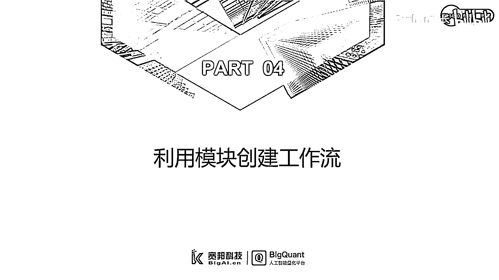
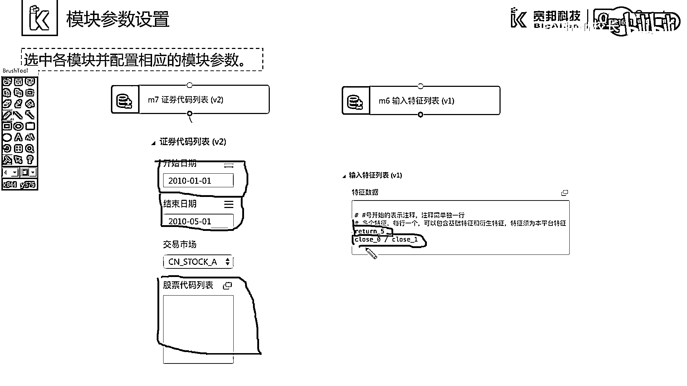
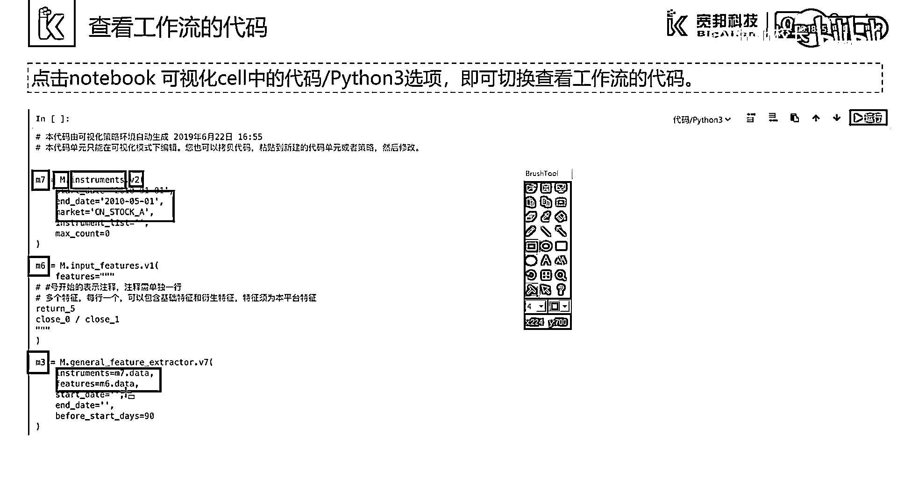

# 7天爆肝整理！AI量化交易-机器学习全套教程，从入门到项目实战保姆级教程！（数据挖掘分析／大数据／可视化／投资／金融／股票／算法） - P16：2.4-模块化工作流创建 - Python校长 - BV1KL411z7WA

这一部分我们讲解一下如何利用模块创建工作流。

Vega Studio内置了很多的功能模块，可以在模块导航栏中通过输入模块名称进行搜索，或通过下拉列表进行浏览，例如我们通过数据输入输出这样一个下拉列表中，找到证件代码列表，我们左键选中证件代码列表。

并拖入到画布中，就实现了模块的创建，我们用同样的方法拖动更多的模块进入画布，并按合理的流程顺序放置模块，我们将鼠标移动到模块的输入，此时屏幕会显示该输入节点需要连接的上游模块。

例如我们将鼠标移动到M3基础特征抽取模块的右侧输入节点，此时显示了此节点需要输入的上游模块为特征列表模块，我们通过选取节点并拖动连接到另一个节点，就可以实现模块的连接。

模块连接后我们可以通过各模块的属性菜单进行，相应的模块参数配置，例如在证件代码列表模块中，我们需要设置股票池的起始时间和结束时间，以及我们选取的股票池范围，如果不填写任何内容。

这里表示选取全部的A股市场股票，例如在输入特征列表中，我们可以输入我们需要抽取的特征因子表达式，例如5日的收益率或1日收益率。

拖入模块并连接后。

我们就构建了一个工作流，我们通过点击最后一个模块，选择运行选中模块，或将鼠标移动到运行选中，运行全部模块或运行按钮，可以实现工作流的执行，在工作流的运行过程中。

Notebook文档的左上方会出现一个旋转的圆圈，并提示正在运行或处理，同时下方会显示模块的运行日志，我们可以通过点击Notebook可视化Cell中的代码Python3选项。

切换到代码模式来查看工作流的代码，例如该画布中有三个模块分别为M7，M6和M3，我们通过点击代码Python3按键，切换进入到代码模式，可以看到，在代码中，对应的模块代码分别为M7，M6和M3。

M代表了模块的意思，后面的英文名称代表了该模块的英文代码代号，VR表示了该模块的版本，而StartDate，EndDate以及Market等参数表示了该模块的属性参数，对于M3模块而言。

这里的Instruments作为该模块的输入，连接了M7模块的输出数据M7。Data，而M3的另一个输入Features，该节点连接了M6模块的输出数据M6。

Data。

