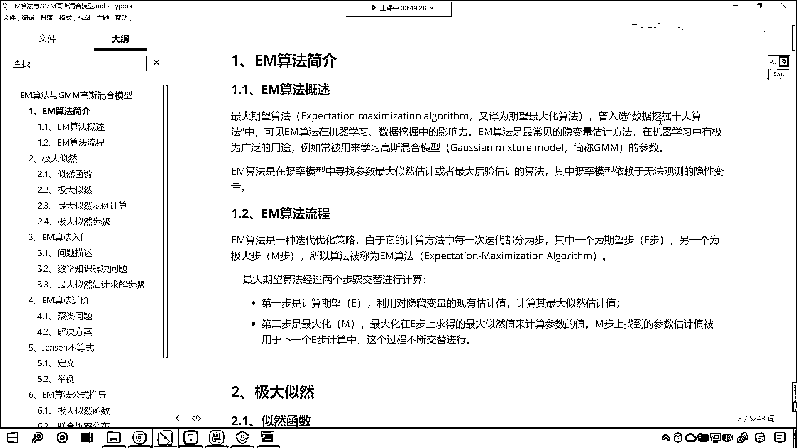

# 7天爆肝整理！AI量化交易-机器学习全套教程，从入门到项目实战保姆级教程！（数据挖掘分析／大数据／可视化／投资／金融／股票／算法） - P170：3-EM算法思想与步骤 - Python校长 - BV1KL411z7WA

各位小夥伴，接下來呢，我們繼續往下看啊，好，那麼接下來呢，咱們就看一下EM算法與GMM高斯混合模型，那這個是什麼呢？，我們就發現，你看高斯呢，無處不在，是不是啊？，高斯又來了，對吧？

所以你看為什麼這個高斯呢，他是非常偉大的數學家呢，對吧？，那因為他的這個發明的這個理論，發現的這個理論，過了這麼多年，是吧？依然閃閃發光，好，那麼我們看一下這個EM算法是什麼啊？，你看EM。

它是不是兩個英語啊，兩個英語，這兩個英語字母都是大寫，那麼我們就發現，如果它要是大寫的話，那麼它一定是某兩個英語單詞的這個，某兩個英語單詞的縮寫，對不對啊？，這叫什麼呢？叫做最大期望算法。

它是一種很好的思想，叫什麼呢？Expection Maximization Algorithm，我們把它翻譯過來，就叫做期望最大化算法，這個算法呢，曾入選數據挖掘十大算法之一。

所以說這個算法在咱們機器學習數據挖掘當中，那是非常有影響力的啊，那這個EM算法最常見的，它呢，是隱變量估計法，在這呢，有一個隱變量，那你現在在內心，在心裡邊，先留這樣的一個疑問，這什麼是隱變量呢？

一會兒我們會講到，在我們機器學習當中呢，咱們EM算法，它有廣泛的一個用途，比如說，咱們一會兒要講到的，叫做高斯混合模型，那咱們就使用EM這個算法呢，來挖掘我們的參數，那EM算法呢，在咱們概率模型當中。

我們尋找參數最大自然估計，或者說最大厚焰估計算法，那之前咱們是不是介紹過最大自然估計啊？，我們是在哪裏，哪個知識段講到的這個最大自然估計呢？，哪一個章節呀？你回想一下，咱們之前是不是講邏輯回歸的時候。

裏面是不是有最大自然估計啊？，我們之前在講線性回歸的時候，裏面呢也有最大自然估計，很多地方都有這個最大自然估計，好，那麼接下來呢，我們看一下咱們EM這個算法，它的流程是怎樣的啊？，這個也很簡單。

這EM算法是一種迭代優化策略，大家要注意啊，你看它是一種迭代優化策略，那我們之前學過的算法，還有哪些是通過迭代來尋找答案的呀？，我們之前講過的算法，哪些是通過迭代進行求解的呀？，你想一想。

咱們線性回歸當中的梯度下降，它是不是就是一種迭代呀？，咱們支持限量機當中的SMO算法，是不是也是這種迭代呀？，就是我循環多次，然後找它最佳的答案，其實呢，我們機器學習當中的算法。

大部分都是迭代優化這種方式，那因為我們機器學習要解決的問題呢，它都是現實當中的問題，現實生活當中的問題，工業生產當中的問題，它不像咱們這個小學初中高中所學習到的數學問題。

我們在這個上學階段所學習到的數學問題，其實都是解方程，你想，我們課堂上課本上所給的方程，那是不是都是有限格呀？，對吧，那方程都很少，是吧，它都有確定的唯一解，但是真實的這個環境當中。

真實工作當中的這些數據，那它的數據量就有可能很多，你想是不是啊？，那如果說我們要根據解方程來去求解，那你有可能就解不出來，有可能就無解，所以說呢，這個迭代優化策略，是吧，它是非常好的一種策略。

就是一點一點逼近，我追求的不是最優解，我追求的不是標準答案，咱們之前在念書的時候，我們做題，高考，那都有標準答案，等你工作了，你就發現，沒有標準答案，你就像我們說的，人無完人，有完美的人嗎？。

是不是沒有完美的人呀？那答案也一樣，也沒有完美的答案，你就像我們面試一樣，是吧，咱們在面試的時候，我們老想著，是吧，回答出來這個答案，是吧，它是完美的，有完美的答案嗎？沒有，面試其實就是聊天。

你和面試官聊天，聊開心了，面試官就想招你進來，是吧，就這麼簡單，其實你想，人和人之間的差距有特別大嗎？沒有特別大，是吧，所以說，你看，這個你聊天，是吧，你把自己的經歷，是吧，或者說把自己做過的一些事情。

以聊天的形式，是吧，聊得特別開心，那你自然就能夠拿到offer，但是現在呢，這個市場競爭激烈，所以說就會去以學歷呀，是吧，以你的這個是不是碩士呀，來進行卡你，其實你想，如果你要是老闆。

你最終想招聘的這個人，是不是能幹好本職工作就可以了呀，對吧，你上沒有上過學，有所謂嗎？是吧，無所謂，好，那麼，咱們EM算法分兩步，其中一步呢，我們稱為期望步，咱們就叫做E步，另一步呢，我們稱為極大步。

叫做M步，這個M呢，就是Maximumization，好，那麼，咱們最大期望值算法經過兩個步驟，它是交替進行的，最終呢，我們計算出一個結果，那咱們看一下，這第一步呢，就是計算期望。

利用隱藏變量的現有估計，咱們計算其最大自然估計值，因為只要一個數據，咱們這個數據當中，是吧，我們去計算期望，那你比如說這是一個概率問題啊，或者說它是一個正態分佈問題。

咱們在根據它的這個分佈數據求解的時候，你想，我們是不是就可以去計算它的極大自然估計啊，那麼，求得了極大自然估計之後，第二步呢，咱們去最優化M，最大化在E步上求得的最大自然估計，來計算咱們的參數值。

計算咱們的參數值，剛才的時候，咱們讓大家留了一個疑問，說，什麼是隱變量呢？什麼是隱變量呢？，隱變量就是我們要求解的未知數，隱變量就是我們要求解的未知數，這裡所說的這個參數，就對應著咱們上面所說的隱變量。

那M步上找到的參數估計，被用於下一個E步的計算當中，這個過程不斷地交替進行，什麼意思呢？第一步咱們計算期望，求它的最大自然估計，那這個時候呢，這個最大自然估計其實就是概率和概率的相乘，然後呢。

我們可以求導數，令導數為零，咱們就可以計算出參數，有了這個參數之後，我們再將參數再帶到第一步當中，循環往復地去執行，直到最後這個最大自然估計值不變了為止，好，那麼這個就是咱們EM算法的簡介。

以及它的實際性。

